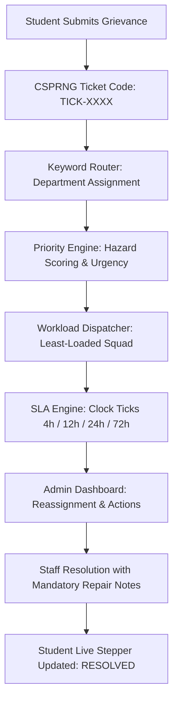

# Automated Smart Complaint Routing & Workflow Automation Platform
### `SmartComplaintHandler` — Production Full-Stack Engineering Platform

[](https://www.python.org/)
[](https://fastapi.tiangolo.com/)
[](https://www.sqlite.org/)
[](https://react.dev/)
[](https://vitejs.dev/)
[](https://tailwindcss.com/)
[](docs/developer_guide/README.md)
[](backend/tests/test_closed_loop.py)

---

## ⚡ Quick Navigation Index

| Section | Description | Quick Link |
| :--- | :--- | :--- |
| **1. System Overview** | What this project does & the closed-loop automation flow | [Go to Section ↓](#1-system-overview--closed-loop-architecture) |
| **2. 30-Second Quick Start** | Fast launch with 1-click batch scripts or terminal commands | [Go to Section ↓](#2-30-second-quick-start-how-to-run-everything) |
| **3. First-Time Setup (Clone to Folder)** | **Step-by-step installation: How to clone & setup in your local folder** | [Go to Section ↓](#3-first-time-setup-how-to-install--setup-in-your-folder) |
| **4. Daily Git Workflow (Push & Pull)** | **How to pull teammates' work, save your work, and push to develop** | [Go to Section ↓](#4-daily-git-workflow-how-to-save-push--pull-work-safely) |
| **5. Teammate Onboarding Checklist** | What to do first as a developer joining the repository | [Go to Section ↓](#5-teammate-onboarding-checklist-what-do-i-do-first) |
| **6. 5-Student Ownership Matrix** | Exact team breakdown: who writes which files & blueprints | [Go to Section ↓](#6-5-student-team-ownership--module-matrix) |
| **7. Module Blueprints (M1–M5)** | Detailed directory of all 5 operational modules | [Go to Section ↓](#7-version-10-module-architecture-m1m5) |
| **8. 34-Guide Curriculum** | Complete zero-prerequisite developer engineering handbook | [Go to Section ↓](#8-master-developer-guide-curriculum-34-manuals) |
| **9. Testing & Quality Gates** | How to run tests and verify your code before pushing | [Go to Section ↓](#9-testing-verification--quality-gates) |
| **10. Directory Architecture** | 72-file inventory, design decisions & roadmap | [Go to Section ↓](#10-directory-architecture--references) |

---

## 1. System Overview & Closed-Loop Architecture

### The Problem
Campus facility grievances (water leaks, power cuts, hazardous exposed wiring, broken laboratory equipment) frequently get trapped in bureaucratic bottlenecks, lost in email threads, or neglected due to lack of transparent accountability.

### The Solution
`SmartComplaintHandler` is an **automated, deterministic, closed-loop grievance routing platform**:
1. **Intake & Code Generation:** Generates a collision-resistant tracking code (`TICK-XXXX`) using cryptographically secure operating system entropy.
2. **Deterministic Keyword Routing:** Scans complaint narratives to assign the responsible campus department (Electrical, Plumbing, IT, Sanitation, Civil, General).
3. **Priority & Hazard Classification:** Identifies safety emergencies (`CRITICAL`, `HIGH`, `MEDIUM`, `LOW`) with short-circuit rules for hazards (e.g. fire, flooding near outlets).
4. **Load-Balanced Squad Dispatch:** Dispatches complaints to the least-loaded maintenance squad based on real-time active ticket counts.
5. **SLA Countdown & Dual-Sided Resolution:** Ticks live countdown clocks (4h, 12h, 24h, 72h), alerts staff to impending breaches, and requires mandatory repair documentation before ticket closure.



---

## 2. 30-Second Quick Start (How to Run Everything)

### Option A: Windows 1-Click Launch (Recommended)
Double-click the automated launcher in the project root:
* **`run_all.bat`** (or **`start_dev.bat`**)  
  * Automatically sets up Python virtual environments and installs dependencies.
  * Launches the FastAPI backend server on `http://localhost:8000`.
  * Launches the React Vite frontend dev server on `http://localhost:5173`.
  * Automatically opens both browser tabs.
* **To stop all servers:** Double-click **`stop_all.bat`** (cleanly terminates both background processes and frees ports `8000` and `5173`).

---

### Option B: Manual CLI Setup (Any OS)

#### Terminal 1 — Backend (FastAPI + SQLite WAL):
```bash
cd backend
python -m venv venv

# Windows:
.\venv\Scripts\activate
# macOS/Linux:
source venv/bin/activate

pip install -r requirements.txt
uvicorn app.main:app --reload --port 8000
```
* **Interactive Swagger UI:** [http://localhost:8000/docs](http://localhost:8000/docs)
* **Backend Health Probe:** [http://localhost:8000/health](http://localhost:8000/health)

#### Terminal 2 — Frontend (React 18 + Vite + Tailwind):
```bash
cd frontend
npm install
npm run dev
```
* **React Web Application:** [http://localhost:5173](http://localhost:5173) (Vite proxies `/api` requests to `:8000`).

---

## 3. First-Time Setup: How to Install & Setup in Your Folder

Follow these exact steps to clone the repository to your own computer and get everything running inside your preferred folder.

### Step 1: Open Terminal in Your Chosen Directory
Create or navigate to the folder on your computer where you want to keep your college projects:
* **Windows (PowerShell or CMD):**
  ```powershell
  cd "C:\College\IT Workshop"
  ```
* **macOS / Linux:**
  ```bash
  cd ~/Documents/College/IT_Workshop
  ```

---

### Step 2: Clone the Git Repository
Run `git clone` to download the entire project into your folder:
```bash
git clone https://github.com/Headhunte-121/SmartComplaintHandler.git
cd SmartComplaintHandler
```

---

### Step 3: Switch to the Active Development Branch (`develop`)
> [!IMPORTANT]
> The `main` branch is reserved for final releases. **All active team development, feature coding, and collaboration happen on the `develop` branch.**

Make sure you switch to `develop` before doing anything else:
```bash
git checkout develop
```
Verify that your terminal confirms: `Switched to branch 'develop'` (or `Already on 'develop'`).

---

### Step 4: Install Backend Dependencies
Set up an isolated Python virtual environment and install all packages:
```bash
# Navigate into backend directory
cd backend

# Create virtual environment (named venv)
python -m venv venv

# Activate virtual environment:
# On Windows (PowerShell):
.\venv\Scripts\Activate.ps1
# On Windows (CMD):
.\venv\Scripts\activate.bat
# On macOS / Linux:
source venv/bin/activate

# Install all required Python packages (FastAPI, SQLAlchemy, Pydantic, etc.)
pip install -r requirements.txt

# Return back to root directory
cd ..
```

---

### Step 5: Install Frontend Dependencies
Install the Node.js packages for the React 18 / Vite / Tailwind client:
```bash
# Navigate into frontend directory
cd frontend

# Install all npm dependencies
npm install

# Return back to root directory
cd ..
```

---

### Step 6: Test That Everything Runs
You can now start both servers with the 1-click launcher or terminal commands:
* On Windows, simply double-click **`run_all.bat`**.
* Open your browser to [http://localhost:5173](http://localhost:5173) and [http://localhost:8000/docs](http://localhost:8000/docs). Both should load smoothly!

---

## 4. Daily Git Workflow: How to Save, Push & Pull Work Safely

When 5 students are collaborating on the same project, following this **daily 3-part routine** ensures nobody overwrites each other's code and eliminates merge conflicts.

```
┌────────────────────────────────────────────────────────────────────────────────────────┐
│                                DAILY GIT COLLABORATION CYCLE                           │
├────────────────────────────────────────────────────────────────────────────────────────┤
│  1. START OF SESSION:  Always PULL latest changes pushed by teammates:                 │
│                        git checkout develop                                            │
│                        git pull origin develop                                         │
│                                                                                        │
│  2. DURING CODING:     Write your code in your assigned module files.                  │
│                        Check your status frequently: git status                        │
│                                                                                        │
│  3. END OF SESSION:    Stage, Commit, Pull again, and PUSH your work:                  │
│                        git add .                                                       │
│                        git commit -m "feat(M2): implement keyword router"             │
│                        git pull origin develop                                         │
│                        git push origin develop                                         │
└────────────────────────────────────────────────────────────────────────────────────────┘
```

---

### Part A: How to PULL from the Development Branch (Start of Work)
**Rule #1 of Team Git:** Always pull before you start typing new code. If a teammate pushed a new model or API endpoint while you were asleep, pulling ensures you have it locally.

```bash
# 1. Make sure you are on develop:
git checkout develop

# 2. Pull all new commits from GitHub:
git pull origin develop
```

#### What if you already made some edits and Git warns: *"Your local changes would be overwritten"*?
Don't panic! Use **`git stash`** to safely shelter your work:
```bash
git stash               # Temporarily shelves your edits in a safe vault
git pull origin develop # Downloads your teammates' updates cleanly
git stash pop           # Restores your edits on top of the latest code
```

---

### Part B: How to SAVE & PUSH to the Development Branch (Saving Work)
Whenever you complete a task or reach a working milestone, save your work to GitHub following these 4 steps:

#### Step 1: Check what files you changed
```bash
git status
```
*Modified files will be shown in red.*

#### Step 2: Stage the files you want to save
You can stage specific files:
```bash
git add backend/app/services/keyword_router.py
```
Or stage all modified files at once:
```bash
git add .
```

#### Step 3: Commit with a descriptive message
Write a short message explaining what you built:
```bash
git commit -m "feat(M2): implement keyword router for department routing"
```

#### Step 4: Pull first, then Push!
Always run `git pull` right before `git push` so Git integrates any simultaneous updates before pushing:
```bash
# Pull any simultaneous updates:
git pull origin develop

# Push your commit to GitHub:
git push origin develop
```
Your work is now safely backed up on GitHub and immediately available to your teammates!

---

### Part C: How to Handle a Merge Conflict (No-Panic 3-Step Guide)
A merge conflict only happens if you and a teammate edited the **exact same line in the same file** at the same time. Git will pause and tell you: `CONFLICT (content): Merge conflict in <file>`.

1. **Open the conflicted file in VS Code.**  
   You will see highlighted conflict markers:
   ```python
   <<<<<<< HEAD (Your local code)
   assigned_department = "Plumbing"
   =======
   assigned_department = "Sanitation"
   >>>>>>> origin/develop (Teammate's code pushed to GitHub)
   ```
2. **Choose which code to keep:**  
   In VS Code, click **"Accept Current Change"**, **"Accept Incoming Change"**, or simply delete the markers (`<<<<<<<`, `=======`, `>>>>>>>`) and manually combine the lines.
3. **Stage, commit, and push:**
   ```bash
   git add <conflicted-file>
   git commit -m "merge: resolve conflict in keyword router"
   git push origin develop
   ```

> 📖 *For a complete reference of 15 essential Git commands with low-level internal mechanics, see the [**`TEAM_WORKFLOW_AND_GIT_GUIDE.md`**](docs/V1/TEAM_WORKFLOW_AND_GIT_GUIDE.md).*

---

## 5. Teammate Onboarding Checklist: What Do I Do First?

If you are a student or teammate who just joined this project, follow this **exact 6-step checklist**:

```
┌────────────────────────────────────────────────────────────────────────────────────────┐
│                              NEW TEAMMATE 6-STEP ONBOARDING                            │
├────────────────────────────────────────────────────────────────────────────────────────┤
│  STEP 1: Clone the repository and switch to the develop branch:                        │
│          git checkout develop                                                          │
│                                                                                        │
│  STEP 2: Understand the code state:                                                    │
│          - All source files in backend/app/ and frontend/src/ are CLEAN STARTER         │
│            TEMPLATES. Each file has a header pointing directly to its blueprint.       │
│          - A complete reference implementation is saved at tag: v1.0-reference-impl     │
│                                                                                        │
│  STEP 3: Check the Ownership Matrix (Section 6 below) to find your assigned module:    │
│          Dev A (M1 Backend), Dev B (M2 Backend), Dev C (M1/M2 Frontend),               │
│          Dev D (M3/M4 Backend), or Dev E (M5 Backend + Admin Frontend).                │
│                                                                                        │
│  STEP 4: Open your module's blueprint in docs/V1/ (e.g. docs/V1/M1/):                  │
│          Follow Section 1 (Purpose), Section 2 (Required Items), and                   │
│          Section 3 (Implementation Details) to write your file.                        │
│                                                                                        │
│  STEP 5: If you don't understand a concept (e.g. WAL mode, Pydantic, Hooks, CORS),    │
│          click the links in Section 5 of your blueprint to read the corresponding      │
│          manual in docs/developer_guide/.                                              │
│                                                                                        │
│  STEP 6: Verify your work before committing:                                           │
│          pytest backend/tests/test_closed_loop.py -v                                   │
│          npm run build                                                                 │
└────────────────────────────────────────────────────────────────────────────────────────┘
```

---

## 6. 5-Student Team Ownership & Module Matrix

To ensure zero merge conflicts and completely independent parallel progress, work is divided across **5 teammates**:

| Role / Student | Assigned Module | Key Source Files to Implement | Governing Blueprints in `docs/V1/` |
| :--- | :--- | :--- | :--- |
| **Dev A**<br>*(Database & Storage)* | **Module M1 (Backend)** | `backend/app/core/config.py`<br>`backend/app/core/database.py`<br>`backend/app/models/*.py`<br>`backend/app/db/seed.py`<br>`backend/app/api/deps.py` | [**`docs/V1/M1/00_M1_CENTRAL_OVERVIEW.md`**](docs/V1/M1/00_M1_CENTRAL_OVERVIEW.md)<br>Follows blueprints `01` through `10` |
| **Dev B**<br>*(Ingestion & Router)* | **Module M2 (Backend)** | `backend/app/utils/code_generator.py`<br>`backend/app/services/keyword_router.py`<br>`backend/app/schemas/complaint.py`<br>`backend/app/services/ticket_service.py`<br>`backend/app/api/v1/endpoints/complaints.py` | [**`docs/V1/M2/00_M2_CENTRAL_OVERVIEW.md`**](docs/V1/M2/00_M2_CENTRAL_OVERVIEW.md)<br>Follows blueprints `01` through `08` |
| **Dev C**<br>*(Frontend Architecture)* | **Module M1 & M2 (Frontend)** | `frontend/src/api/client.js`<br>`frontend/src/components/Layout.jsx`<br>`frontend/src/router/AppRouter.jsx`<br>`frontend/src/pages/SubmitComplaint.jsx`<br>`frontend/src/pages/TrackTicket.jsx` | [**`docs/V1/M1/`**](docs/V1/M1/00_M1_CENTRAL_OVERVIEW.md#frontend-subsystem-frontend) & [**`docs/V1/M2/`**](docs/V1/M2/00_M2_CENTRAL_OVERVIEW.md#frontend-subsystem-frontend)<br>Follows M1/M2 Frontend blueprints `01`–`05` |
| **Dev D**<br>*(Triage & Dispatch)* | **Module M3 & M4 (Backend)** | `backend/app/services/priority_engine.py`<br>`backend/app/services/classifier.py`<br>`backend/app/services/dispatch_engine.py`<br>`backend/app/services/team_service.py`<br>`backend/app/api/v1/endpoints/priority.py` | [**`docs/V1/M3/00_M3_CENTRAL_OVERVIEW.md`**](docs/V1/M3/00_M3_CENTRAL_OVERVIEW.md)<br>[**`docs/V1/M4/00_M4_CENTRAL_OVERVIEW.md`**](docs/V1/M4/00_M4_CENTRAL_OVERVIEW.md)<br>Follows M3 & M4 Backend suites |
| **Dev E**<br>*(SLA & Admin Console)* | **Module M5 (Backend) + Admin UI** | `backend/app/services/sla_engine.py`<br>`backend/app/services/lifecycle.py`<br>`backend/app/api/v1/endpoints/sla.py`<br>`frontend/src/pages/AdminDashboard.jsx`<br>`frontend/src/components/SLABreachTable.jsx` | [**`docs/V1/M5/00_M5_CENTRAL_OVERVIEW.md`**](docs/V1/M5/00_M5_CENTRAL_OVERVIEW.md)<br>Follows M5 Backend & Frontend blueprints |

> 💡 **Need mock data while backend endpoints are being built?**  
> Frontend developers should use the **Zero-Blocking Mock Contracts** in [**`docs/V1/TEAM_WORKFLOW_AND_GIT_GUIDE.md`**](docs/V1/TEAM_WORKFLOW_AND_GIT_GUIDE.md#3-zero-blocking-mock-data-contracts).

---

## 7. Version 1.0 Module Architecture (M1–M5)

Click into any module to open its central overview, DAG, and blueprints:

```
docs/V1/
├── V1_CENTRAL_BLUEPRINT.md    # Master architecture charter across all modules
├── V1_BLUEPRINT.md            # Full operational lifecycle trace
├── TEAM_WORKFLOW_AND_GIT_GUIDE.md # 5-student operational manual & Git guide
├── M1/                        # Data Storage Engine, Models & Shell
│   ├── 00_M1_CENTRAL_OVERVIEW.md
│   ├── backend/ (10 blueprints)
│   └── frontend/ (5 blueprints)
├── M2/                        # Intake, Code Generator & Keyword Router
│   ├── 00_M2_CENTRAL_OVERVIEW.md
│   ├── backend/ (8 blueprints)
│   └── frontend/ (5 blueprints)
├── M3/                        # Priority Engine & Live Triage Card
│   ├── 00_M3_CENTRAL_OVERVIEW.md
│   ├── backend/ (7 blueprints)
│   └── frontend/ (5 blueprints)
├── M4/                        # Squad Dispatch & Admin Operations Desk
│   ├── 00_M4_CENTRAL_OVERVIEW.md
│   ├── backend/ (7 blueprints)
│   └── frontend/ (5 blueprints)
└── M5/                        # SLA Clocks & Lifecycle State Machine
    ├── 00_M5_CENTRAL_OVERVIEW.md
    ├── backend/ (7 blueprints)
    └── frontend/ (5 blueprints)
```

> 👉 **For the complete module matrix and directory guide, see [docs/V1/README.md](docs/V1/README.md).**

---

## 8. Master Developer Guide Curriculum (34 Manuals)

If you are unfamiliar with any language, framework, or concept, read our authoritative **Developer Guide Suite (`docs/developer_guide/`)**. Every guide is written from the ground up with zero prerequisites:

* 📖 [**`docs/developer_guide/README.md`**](docs/developer_guide/README.md) — Master Handbook & Full-Stack Mental Model.

### Curriculum Overview:
* **Part I: Computer Science, OS & Network Foundations**
  * [`Unit 00A`](docs/developer_guide/00A_DATA_STRUCTURES_ALGORITHMS_AND_COMPLEXITY.md): Data Structures, Algorithms & Complexity
  * [`Unit 00B`](docs/developer_guide/00B_OPERATING_SYSTEMS_PROCESSES_AND_CONCURRENCY_MECHANICS.md): OS Internals, Processes, Threads & Concurrency
  * [`Unit 01A`](docs/developer_guide/01A_COMPUTER_NETWORKING_OSI_DNS_AND_IP_ROUTING.md): Computer Networking, OSI Model, DNS & Routing
  * [`Unit 01B`](docs/developer_guide/01B_HTTP_NETWORK_PROTOCOLS_AND_WIRE_FRAMING.md): HTTP Protocols, TCP Sockets & Wire Framing
* **Part II: Backend Engineering & Databases**
  * [`Guide 01`](docs/developer_guide/01_PYTHON_LANGUAGE_AND_RUNTIME_MECHANICS.md): Python 3.10+ Language & CPython Runtime Mechanics
  * [`Guide 02`](docs/developer_guide/02_FASTAPI_ASGI_WEB_ARCHITECTURE.md): FastAPI & Modern ASGI Web Architecture
  * [`Guide 03`](docs/developer_guide/03_PYDANTIC_V2_DATA_VALIDATION_AND_SCHEMAS.md): Pydantic v2 & Data Contract Engineering
  * [`Unit 03B`](docs/developer_guide/03B_SQL_RELATIONAL_LANGUAGE_AND_QUERY_MECHANICS.md): SQL Relational Language, Queries & Transactions
  * [`Unit 03C`](docs/developer_guide/03C_REGULAR_EXPRESSIONS_AND_AUTOMATA_THEORY.md): Regular Expressions & Automata Theory
  * [`Guide 04`](docs/developer_guide/04_SQLITE_STORAGE_MECHANICS_AND_WAL_MODE.md): SQLite 3 Engine Storage & WAL Mode
  * [`Guide 05`](docs/developer_guide/05_SQLALCHEMY_ORM_AND_DATA_LAYER.md): SQLAlchemy 2.0 ORM & Relational Architecture
* **Part III: Frontend Engineering & UI**
  * [`Unit 05B`](docs/developer_guide/05B_JAVASCRIPT_CORE_LANGUAGE_AND_SYNTAX_PRIMITIVES.md): JavaScript Core Language & Syntax Primitives
  * [`Unit 05C`](docs/developer_guide/05C_TYPESCRIPT_CORE_TYPE_SYSTEM_AND_STATIC_ANALYSIS.md): TypeScript Core Type System & Static Analysis
  * [`Guide 06`](docs/developer_guide/06_JAVASCRIPT_RUNTIME_AND_V8_MECHANICS.md): Modern JavaScript (ES2022+) & V8 Mechanics
  * [`Unit 06B`](docs/developer_guide/06B_HTML5_SEMANTICS_AND_CSS3_FOUNDATIONS.md): HTML5 Semantics, DOM Tree & CSS3 Box Model
  * [`Guide 07`](docs/developer_guide/07_REACT_18_AND_VIRTUAL_DOM_ARCHITECTURE.md): React 18 & Virtual DOM Fiber Architecture
  * [`Guide 08`](docs/developer_guide/08_TAILWIND_CSS_AND_POSTCSS_ENGINEERING.md): Tailwind CSS & PostCSS Engineering
  * [`Guide 09`](docs/developer_guide/09_AXIOS_FETCH_AND_REST_PROTOCOLS.md): Axios & REST Wire Protocols
  * [`Unit 09B`](docs/developer_guide/09B_PACKAGE_MANAGEMENT_DEPENDENCY_GRAPHS_AND_SEMVER.md): Package Management (NPM), Dependency Graphs & SemVer
  * [`Guide 10`](docs/developer_guide/10_VITE_AND_MODERN_BUILD_TOOLCHAINS.md): Vite Build Engine & Module Bundling
* **Part IV: Concurrency, Testing, Release & Browser Security**
  * [`Guides 11–13`](docs/developer_guide/README.md#part-iv-concurrency-testing-release--browser-security): APScheduler, Pytest, Git Internals
  * [`Guide 14 & 14B`](docs/developer_guide/14B_WEB_BROWSER_SECURITY_AND_ORIGIN_POLICIES.md): Multipart Uploads & Browser Security (SOP, CORS, CSP)
  * [`Guides 15–21`](docs/developer_guide/README.md#part-iv-concurrency-testing-release--browser-security): Storage, Alembic, Lucide Icons, WebSockets, Middlewares, Form State Machines, HTTP Caching
  * [`Unit 21B & Guide 22`](docs/developer_guide/21B_CRYPTOGRAPHIC_MATHEMATICS_ENCODING_AND_HASHING.md): Cryptographic Mathematics, Encodings, Hashing & JWT Authentication

---

## 9. Testing, Verification & Quality Gates

### Automated Quality Gates
Before creating a pull request or merging to `develop`, verify your implementation against the test suite:

```bash
# 1. Verify backend closed-loop lifecycle (Intake -> Routing -> Triage -> Dispatch -> SLA -> Resolution)
pytest backend/tests/test_closed_loop.py -v

# 2. Verify frontend production compilation & bundle assets
cd frontend
npm run build
```

### Reference Implementation Fallback
If any teammate gets stuck and wants to see how a complete, working version of all 64 files was implemented:
```bash
# Checkout the working reference implementation tag:
git checkout v1.0-reference-impl

# Return to active development branch:
git checkout develop
```

---

## 10. Directory Architecture & References

* 🗺️ [**`docs/FILE_ARCHITECTURE_GUIDE.md`**](docs/FILE_ARCHITECTURE_GUIDE.md) — Complete 72-file directory anatomy.
* 💡 [**`docs/FUNDAMENTALS_OF_FULL_STACK.md`**](docs/FUNDAMENTALS_OF_FULL_STACK.md) — Full-stack architecture fundamentals.
* ⚖️ [**`docs/TECH_STACK_DECISION.md`**](docs/TECH_STACK_DECISION.md) — Tech stack rationale.
* 🚀 [**`docs/VERSION_BLUEPRINT_ROADMAP.md`**](docs/VERSION_BLUEPRINT_ROADMAP.md) — Roadmap from V1.0 to V2.0 (AI/NLP) and V3.0 (IoT).
