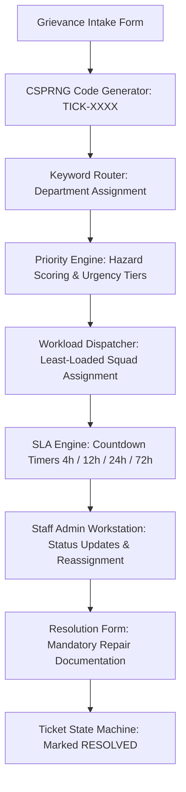

# Smart Complaint Handler (`SmartComplaintHandler`)

> Automated grievance intake, deterministic department routing, workload-balanced squad dispatch, and SLA lifecycle management for institutional campus facilities.

[](https://www.python.org/)
[](https://fastapi.tiangolo.com/)
[](https://www.sqlite.org/)
[](https://react.dev/)
[](https://vitejs.dev/)
[](https://tailwindcss.com/)
[](docs/developer_guide/README.md)
[](backend/tests/test_closed_loop.py)

---

## Table of Contents

- [Overview](#overview)
- [Architecture & Workflow](#architecture--workflow)
- [Quick Start](#quick-start)
- [Installation & Local Setup](#installation--local-setup)
- [Git & Development Workflow](#git--development-workflow)
  - [Branch Strategy](#branch-strategy)
  - [Pulling Upstream Updates](#pulling-upstream-updates)
  - [Saving & Pushing Changes](#saving--pushing-changes)
  - [Resolving Merge Conflicts](#resolving-merge-conflicts)
- [Modules & Subsystems (M1–M5)](#modules--subsystems-m1m5)
- [Developer Guide Curriculum (34 Manuals)](#developer-guide-curriculum-34-manuals)
- [Testing & Quality Verification](#testing--quality-verification)
- [Documentation Index](#documentation-index)

---

## Overview

`SmartComplaintHandler` provides closed-loop automation for facility complaint resolution. It replaces manual, error-prone email chains and paper slips with deterministic software pipelines:

* **Collision-Resistant Tracking Codes:** Generates unique tracking IDs (`TICK-XXXX`) using CSPRNG operating system entropy, excluding visually ambiguous characters (`0`, `1`, `O`, `I`).
* **Deterministic Keyword Routing:** Scans complaint narratives against domain dictionaries to route grievances to the responsible campus department (Electrical, Plumbing, IT, Sanitation, Civil, or General Administration).
* **Urgency & Hazard Classification:** Scores complaint urgency (`CRITICAL`, `HIGH`, `MEDIUM`, `LOW`) with immediate short-circuit escalation for life-safety hazards (e.g., exposed high-voltage wiring, flooding near electrical panels).
* **Workload-Balanced Squad Dispatch:** Evaluates real-time active queues across maintenance teams to assign incoming tickets to the least-loaded qualified squad.
* **SLA Countdown & Escalation:** Calculates priority-based resolution deadlines (4h, 12h, 24h, 72h), tracks countdown timers, and flags overdue tickets for administrative intervention.
* **Dual-Sided Resolution Tracking:** Enforces a finite-state lifecycle machine (`SUBMITTED` $\to$ `IN_PROGRESS` $\to$ `RESOLVED`), requiring verified staff repair documentation before closure.

---

## Architecture & Workflow

The platform links the React 18 client, FastAPI REST controllers, and SQLite storage engine across 5 operational phases:



---

## Quick Start

### Windows (Automated Launcher)
Launch both backend and frontend services using the project scripts:
* **Start:** Run `run_all.bat` (or `start_dev.bat`). Automatically initializes environments, installs missing packages, and opens both browser interfaces.
* **Stop:** Run `stop_all.bat`. Cleanly terminates background processes on ports `8000` and `5173`.

### Manual Service Execution
If running services individually across terminals:

```bash
# Terminal 1 — Backend API (FastAPI)
cd backend
.\venv\Scripts\activate   # macOS/Linux: source venv/bin/activate
uvicorn app.main:app --reload --port 8000

# Terminal 2 — Frontend UI (Vite)
cd frontend
npm run dev
```

### Access URLs
| Service | URL | Description |
| :--- | :--- | :--- |
| **Web Client** | [http://localhost:5173](http://localhost:5173) | Single-page application (reverse-proxies `/api` to `:8000`) |
| **API Documentation** | [http://localhost:8000/docs](http://localhost:8000/docs) | Interactive Swagger UI with OpenAPI 3.0 schema |
| **Health Probe** | [http://localhost:8000/health](http://localhost:8000/health) | System health check and database ping endpoint |

---

## Installation & Local Setup

### Prerequisites
* **Python:** 3.10 or higher
* **Node.js:** 18.0 or higher (with npm)
* **Git:** 2.30 or higher

### Step 1: Clone the Repository
Clone the codebase into your local workspace and navigate into the root directory:
```bash
git clone https://github.com/Headhunte-121/SmartComplaintHandler.git
cd SmartComplaintHandler
```

### Step 2: Checkout the Development Branch
All active development, feature implementations, and team contributions take place on the `develop` branch:
```bash
git checkout develop
```

### Step 3: Backend Setup
Create an isolated Python virtual environment and install project dependencies:
```bash
cd backend
python -m venv venv

# Windows (PowerShell):
.\venv\Scripts\Activate.ps1
# Windows (CMD):
.\venv\Scripts\activate.bat
# macOS / Linux:
source venv/bin/activate

pip install -r requirements.txt
cd ..
```

### Step 4: Frontend Setup
Install frontend npm packages:
```bash
cd frontend
npm install
cd ..
```

### Step 5: Verify Environment
Start the development servers via `run_all.bat` or the CLI commands above, and verify that both [http://localhost:5173](http://localhost:5173) and [http://localhost:8000/docs](http://localhost:8000/docs) load without errors.

---

## Git & Development Workflow

### Branch Strategy
* **`main`:** Production-ready release branch. Only merged via tested pull requests.
* **`develop`:** Primary integration branch. All daily development, module implementation, and team contributions target this branch.

---

### Pulling Upstream Updates
Before starting any coding session, always pull the latest commits from the remote repository to ensure your local branch is synchronized:

```bash
git checkout develop
git pull origin develop
```

If you have local modifications you want to temporarily preserve before pulling:
```bash
git stash
git pull origin develop
git stash pop
```

---

### Saving & Pushing Changes
When you complete a task or reach an implementation milestone, commit and push your work using standard Git conventions:

```bash
# 1. Review modified files:
git status

# 2. Stage your changes:
git add backend/app/services/keyword_router.py
# (or stage all tracked modifications: git add .)

# 3. Create a descriptive commit:
git commit -m "feat(M2): implement keyword router service"

# 4. Pull upstream updates to integrate any concurrent commits:
git pull origin develop

# 5. Push to the development branch:
git push origin develop
```

---

### Resolving Merge Conflicts
If Git reports a merge conflict due to simultaneous edits on the same lines:
1. Open the conflicted file in your editor (e.g. VS Code).
2. Locate the conflict markers (`<<<<<<< HEAD`, `=======`, `>>>>>>> origin/develop`).
3. Select the desired changes, remove the conflict markers, and save the file.
4. Stage the resolved file and commit:
   ```bash
   git add <resolved-file>
   git commit -m "merge: resolve conflicts with develop"
   git push origin develop
   ```

> 📖 For an in-depth reference on Git commands, internal object graphs, and team collaboration conventions, see [**`docs/V1/TEAM_WORKFLOW_AND_GIT_GUIDE.md`**](docs/V1/TEAM_WORKFLOW_AND_GIT_GUIDE.md).

---

## Modules & Subsystems (M1–M5)

The platform is structured into **5 modular subsystems**. The source files in `backend/app/` and `frontend/src/` provide clean starter templates, each containing header references to their governing blueprints in `docs/V1/`:

| Module | Subsystem Focus | Key Components | Implementation Blueprints |
| :--- | :--- | :--- | :--- |
| **M1** | **Data Layer & Application Shell** | SQLite WAL engine, ORM models (`Department`, `MaintenanceTeam`, `Ticket`), seed data, base Axios client, Layout shell, AppRouter | [**`M1 Central Overview`**](docs/V1/M1/00_M1_CENTRAL_OVERVIEW.md) (15 blueprints) |
| **M2** | **Ingestion & Keyword Routing** | CSPRNG ticket code generator, keyword routing service, Pydantic schemas, complaint intake page, status lookup stepper | [**`M2 Central Overview`**](docs/V1/M2/00_M2_CENTRAL_OVERVIEW.md) (13 blueprints) |
| **M3** | **Priority & Triage Engine** | Urgency scoring, hazard detection rules, domain classifier, `PriorityBadge`, debounced `LiveTriageCard`, supervisor override modal | [**`M3 Central Overview`**](docs/V1/M3/00_M3_CENTRAL_OVERVIEW.md) (12 blueprints) |
| **M4** | **Workload Dispatch & Operations Desk** | Least-loaded dispatch algorithm, squad workload query service, `AdminDashboard` page, `TeamWorkloadView`, reassignment modal | [**`M4 Central Overview`**](docs/V1/M4/00_M4_CENTRAL_OVERVIEW.md) (12 blueprints) |
| **M5** | **SLA Timers & Lifecycle Automata** | Priority-to-hours SLA calculator, finite-state machine, countdown timer pill, breach table, staff resolution dialog | [**`M5 Central Overview`**](docs/V1/M5/00_M5_CENTRAL_OVERVIEW.md) (12 blueprints) |

> 💡 **Reference Implementation:** A verified, complete working reference implementation of all 64 files is permanently preserved at the Git tag **`v1.0-reference-impl`**. You can inspect it at any time with:  
> `git checkout v1.0-reference-impl` (return to development with `git checkout develop`).

---

## Developer Guide Curriculum (34 Manuals)

For complete technical deep-dives into the languages, runtimes, protocols, and architectural patterns used across the codebase, consult the **Developer Guide Suite (`docs/developer_guide/`)**:

* 📖 [**`docs/developer_guide/README.md`**](docs/developer_guide/README.md) — Master Curriculum Handbook & Full-Stack Mental Model.

### Curriculum Structure
* **Part I: Computer Science, OS & Network Foundations**
  * [`Unit 00A`](docs/developer_guide/00A_DATA_STRUCTURES_ALGORITHMS_AND_COMPLEXITY.md): Data Structures, Algorithms & Complexity
  * [`Unit 00B`](docs/developer_guide/00B_OPERATING_SYSTEMS_PROCESSES_AND_CONCURRENCY_MECHANICS.md): OS Processes, Threads & Concurrency
  * [`Unit 01A`](docs/developer_guide/01A_COMPUTER_NETWORKING_OSI_DNS_AND_IP_ROUTING.md): Computer Networking, OSI, DNS & Routing
  * [`Unit 01B`](docs/developer_guide/01B_HTTP_NETWORK_PROTOCOLS_AND_WIRE_FRAMING.md): HTTP Protocols, TCP Sockets & Wire Framing
* **Part II: Backend Engineering, Relational Data & Schemas**
  * [`Guide 01`](docs/developer_guide/01_PYTHON_LANGUAGE_AND_RUNTIME_MECHANICS.md): Python 3.10+ Language & CPython Runtime Mechanics
  * [`Guide 02`](docs/developer_guide/02_FASTAPI_ASGI_WEB_ARCHITECTURE.md): FastAPI & Modern ASGI Web Architecture
  * [`Guide 03`](docs/developer_guide/03_PYDANTIC_V2_DATA_VALIDATION_AND_SCHEMAS.md): Pydantic v2 & Data Contract Engineering
  * [`Unit 03B`](docs/developer_guide/03B_SQL_RELATIONAL_LANGUAGE_AND_QUERY_MECHANICS.md): SQL Relational Language, Queries & Transactions
  * [`Unit 03C`](docs/developer_guide/03C_REGULAR_EXPRESSIONS_AND_AUTOMATA_THEORY.md): Regular Expressions & Automata Theory
  * [`Guide 04`](docs/developer_guide/04_SQLITE_STORAGE_MECHANICS_AND_WAL_MODE.md): SQLite 3 Engine Storage & WAL Mode
  * [`Guide 05`](docs/developer_guide/05_SQLALCHEMY_ORM_AND_DATA_LAYER.md): SQLAlchemy 2.0 ORM & Relational Architecture
* **Part III: Frontend Engineering, DOM & Reactive UI**
  * [`Unit 05B`](docs/developer_guide/05B_JAVASCRIPT_CORE_LANGUAGE_AND_SYNTAX_PRIMITIVES.md): JavaScript Core Language & Syntax Primitives
  * [`Unit 05C`](docs/developer_guide/05C_TYPESCRIPT_CORE_TYPE_SYSTEM_AND_STATIC_ANALYSIS.md): TypeScript Core Type System & Static Analysis
  * [`Guide 06`](docs/developer_guide/06_JAVASCRIPT_RUNTIME_AND_V8_MECHANICS.md): Modern JavaScript (ES2022+) & V8 Mechanics
  * [`Unit 06B`](docs/developer_guide/06B_HTML5_SEMANTICS_AND_CSS3_FOUNDATIONS.md): HTML5 Semantics, DOM Tree & CSS3 Box Model
  * [`Guide 07`](docs/developer_guide/07_REACT_18_AND_VIRTUAL_DOM_ARCHITECTURE.md): React 18 & Virtual DOM Fiber Architecture
  * [`Guide 08`](docs/developer_guide/08_TAILWIND_CSS_AND_POSTCSS_ENGINEERING.md): Tailwind CSS & PostCSS Engineering
  * [`Guide 09`](docs/developer_guide/09_AXIOS_FETCH_AND_REST_PROTOCOLS.md): Axios & REST Wire Protocols
  * [`Unit 09B`](docs/developer_guide/09B_PACKAGE_MANAGEMENT_DEPENDENCY_GRAPHS_AND_SEMVER.md): Package Management (NPM), Dependency Graphs & SemVer
  * [`Guide 10`](docs/developer_guide/10_VITE_AND_MODERN_BUILD_TOOLCHAINS.md): Vite Build Engine & Module Bundling
* **Part IV: Concurrency, Testing, Release & Browser Security**
  * [`Guides 11–13`](docs/developer_guide/README.md#part-iv-concurrency-testing-release--browser-security): APScheduler, Pytest, Git Internals
  * [`Guide 14 & 14B`](docs/developer_guide/14B_WEB_BROWSER_SECURITY_AND_ORIGIN_POLICIES.md): Multipart Uploads & Browser Security (SOP, CORS, CSP)
  * [`Guides 15–21`](docs/developer_guide/README.md#part-iv-concurrency-testing-release--browser-security): Storage, Alembic, Lucide Icons, WebSockets, Middlewares, Form State Machines, HTTP Caching
  * [`Unit 21B & Guide 22`](docs/developer_guide/21B_CRYPTOGRAPHIC_MATHEMATICS_ENCODING_AND_HASHING.md): Cryptographic Mathematics, Encodings, Hashing & JWT Authentication

---

## Testing & Quality Verification

Run the automated quality gates to verify code changes before pushing:

```bash
# 1. Backend closed-loop integration test (Intake -> Routing -> Triage -> Dispatch -> SLA -> Resolution)
pytest backend/tests/test_closed_loop.py -v

# 2. Frontend production build verification
cd frontend
npm run build
```

---

## Documentation Index

* 🧭 [**`docs/README.md`**](docs/README.md) — Master documentation portal.
* 📐 [**`docs/V1/README.md`**](docs/V1/README.md) — Version 1.0 module hub and blueprint index.
* 🗺️ [**`docs/FILE_ARCHITECTURE_GUIDE.md`**](docs/FILE_ARCHITECTURE_GUIDE.md) — Comprehensive 72-file repository inventory.
* 👥 [**`docs/V1/TEAM_WORKFLOW_AND_GIT_GUIDE.md`**](docs/V1/TEAM_WORKFLOW_AND_GIT_GUIDE.md) — Team collaboration manual, zero-blocking mock contracts, and concurrency DAG.
* ⚖️ [**`docs/TECH_STACK_DECISION.md`**](docs/TECH_STACK_DECISION.md) — Technical decision rationales (FastAPI, SQLite WAL, React Vite, Tailwind).
* 🚀 [**`docs/VERSION_BLUEPRINT_ROADMAP.md`**](docs/VERSION_BLUEPRINT_ROADMAP.md) — Long-term roadmap from V1.0 to V2.0 (AI/NLP) and V3.0 (IoT).
