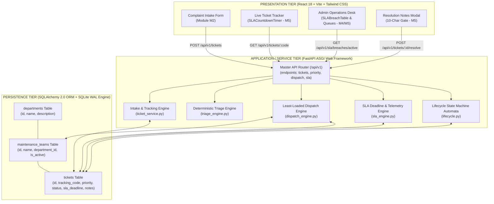
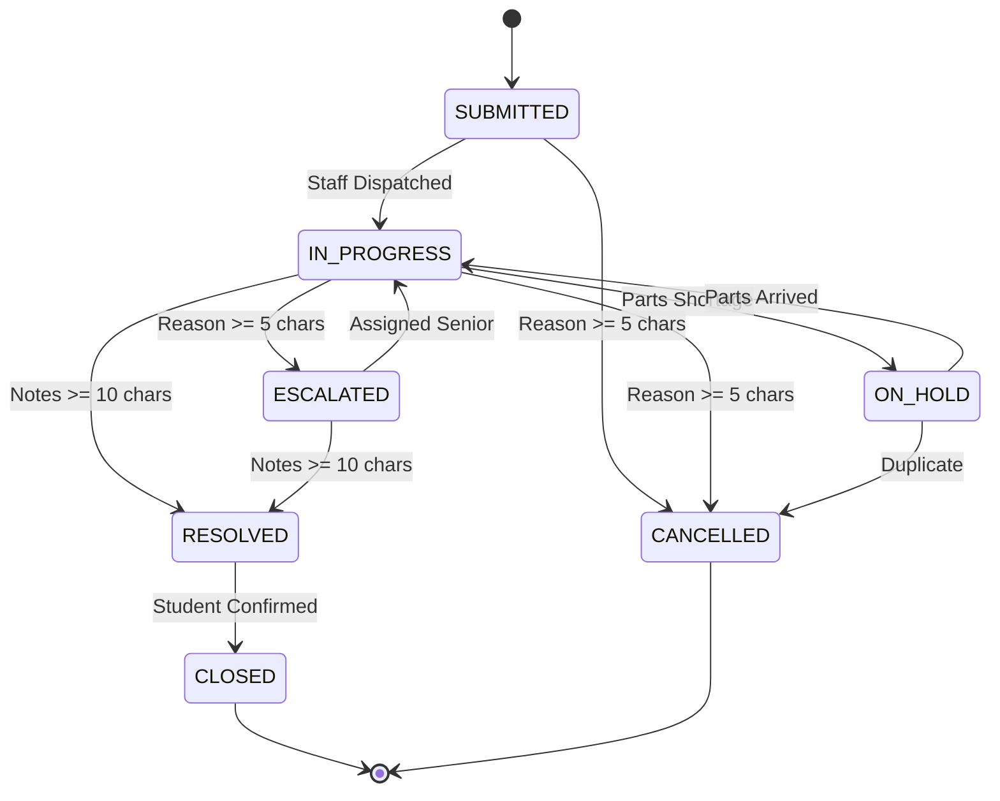
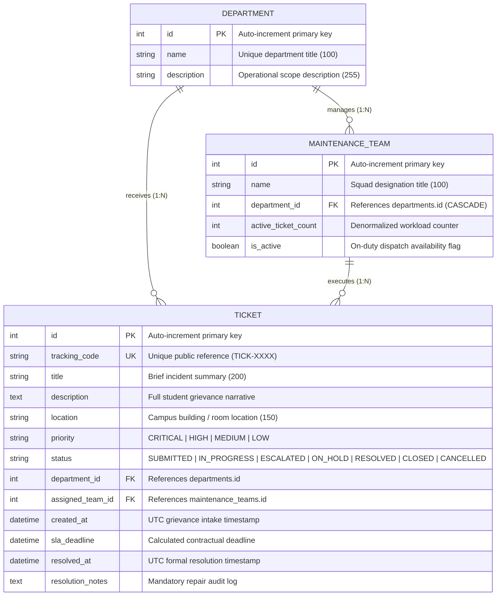

# Product Design Report (PDR) & Comprehensive Product Requirements Document (PRD)

## Project: Smart Complaint Handler (`SmartComplaintHandler`)
### System: Automated Closed-Loop Campus Grievance Routing, Triage & Workflow Automation Platform
**Document Version:** 1.0.0 &nbsp;|&nbsp; **Document Classification:** Master Engineering Specification (PDR / PRD)  
**Academic Context:** IT Workshop / Advanced Software Engineering Capstone &nbsp;|&nbsp; **Date:** September 2026  
**Target Audience:** University Evaluators, Project Review Committee, 5-Student Engineering Team, Technical Leads  

---

## Executive Summary & Document Control

| Metadata Field | Specification / Value |
| :--- | :--- |
| **System Title** | Smart Complaint Handler (Automated Closed-Loop Campus Complaint Routing Platform) |
| **Document Purpose** | Formal Product Design Report (PDR) and Product Requirements Document (PRD) defining product vision, user personas, functional specifications, system architecture, data models, non-functional constraints, and team work breakdown structure. |
| **Core Paradigm** | **Closed-Loop Incident Automation:** Intake $\to$ Classification $\to$ Priority Triage $\to$ Workforce Dispatch $\to$ SLA Tracking $\to$ Verified Resolution. |
| **Technology Stack** | **Frontend:** React 18, Vite 5, Tailwind CSS, Axios, Lucide/Heroicons<br>**Backend:** Python 3.11+, FastAPI (ASGI), SQLAlchemy 2.0 (ORM), Pydantic V2<br>**Database:** SQLite 3 with Write-Ahead Logging (WAL Mode) |
| **Architecture Model** | Decoupled Multi-Tier Architecture (Client-Side SPA + RESTful ASGI API + Relational Data Engine) |
| **Team Size** | 5 Undergraduate Student Engineers (Ownership distributed across Modules M1 through M5) |
| **Document Status** | **Approved — Authoritative Implementation Baseline** |

---

## Table of Contents

1. [Executive Summary & Document Control](#executive-summary--document-control)
2. [Problem Statement & Market Opportunity](#1-problem-statement--market-opportunity)
3. [Product Vision, Goals & Key Performance Indicators (KPIs)](#2-product-vision-goals--key-performance-indicators-kpis)
4. [User Personas & Stakeholder Analysis](#3-user-personas--stakeholder-analysis)
5. [System Architecture & Design Philosophy](#4-system-architecture--design-philosophy)
6. [Detailed Functional Requirements (Modules M1 – M5)](#5-detailed-functional-requirements-modules-m1--m5)
   - [Module M1: Foundation, Relational Data Engine & Application Shell](#module-m1-foundation-relational-data-engine--application-shell)
   - [Module M2: Student Grievance Intake, Tracking Engine & Keyword Routing](#module-m2-student-grievance-intake-tracking-engine--keyword-routing)
   - [Module M3: Automated Severity Triage & Priority Classification](#module-m3-automated-severity-triage--priority-classification)
   - [Module M4: Workload-Balanced Workforce Dispatch & Operations Workstation](#module-m4-workload-balanced-workforce-dispatch--operations-workstation)
   - [Module M5: Central SLA Tracking, Escalation Automata & Resolution Gateways](#module-m5-central-sla-tracking-escalation-automata--resolution-gateways)
7. [Non-Functional Requirements (NFRs) & Engineering Constraints](#6-non-functional-requirements-nfrs--engineering-constraints)
8. [Data Dictionary & Entity-Relationship Specifications](#7-data-dictionary--entity-relationship-specifications)
9. [Team Ownership & Work Breakdown Structure (5-Student Matrix)](#8-team-ownership--work-breakdown-structure-5-student-matrix)
10. [Verification, Quality Assurance & Acceptance Criteria](#9-verification-quality-assurance--acceptance-criteria)
11. [Risk Management & Mitigation Matrix](#10-risk-management--mitigation-matrix)
12. [Product Evolution & Future Roadmap (V2 & Beyond)](#11-product-evolution--future-roadmap-v2--beyond)

---

# 1. Problem Statement & Market Opportunity

### 1.1 The Current Campus Grievance Reality
In higher education institutions, residential universities, and municipal campuses, physical infrastructure maintenance is standardly managed through fragmented, legacy methodologies:
* **Manual Paper Registers & Physical Complaint Boxes:** Students record complaints in hostel security registers, where handwriting is frequently illegible and logs are reviewed days later.
* **Informal Messaging Groups (WhatsApp/Telegram):** Facility managers are bombarded with unorganized messages that lack priority labels, exact room locations, or historical context.
* **Bureaucratic Phone Trees:** Reporting an urgent utility failure (e.g., an overflowing sewage line or an arcing electrical junction) requires navigating multiple levels of campus administration.

### 1.2 Core Bottlenecks of Existing Systems

```
Traditional Flow:
Complaint Filed ──> Sits in Register (2-5 Days) ──> Clerk Sorts (Manual) ──> Tech Dispatched (Random) ──> Lost / Forgotten (No SLA)
```

1. **Intake Latency & Routing Misdirection:** Complaints sit in generic administrative queues for 24 to 72 hours before a clerk reviews the text and determines whether it belongs to Electrical, Plumbing, Civil, or IT Infrastructure.
2. **Lack of Severity Triage:** A catastrophic water pipe burst threatening lab equipment is queued in the exact same FIFO (First-In, First-Out) line as a squeaking bedroom door latch.
3. **Severe Workforce Imbalance:** Work orders are distributed based on informal familiarity rather than actual queue capacity. Certain technicians are overwhelmed with 25 active tasks while others remain idle.
4. **Zero SLA Visibility & Contractual Drift:** There is no mechanism to track whether an issue is overdue. Complaints languish for weeks without alerts or supervisor escalations.
5. **Phantom / Unverified Resolutions:** Technicians mark tickets as "Done" without documenting physical repairs completed, parts consumed, or verification steps.

### 1.3 The Solution: Automated Closed-Loop Smart Complaint Routing
`SmartComplaintHandler` transforms campus maintenance into a deterministic, automated, and explainable **Closed-Loop Workflow Platform**:

```
Smart Complaint Handler Flow:
Complaint Ingestion ──> Deterministic Classification ──> Priority Triage ──> Least-Loaded Dispatch ──> Real-Time SLA Clock ──> Verified Resolution
     (< 100ms)                (4 Departments)             (4 Urgency Tiers)      (12 Campus Squads)         (4h / 12h / 24h / 72h)     (Mandatory Notes Gate)
```

---

# 2. Product Vision, Goals & Key Performance Indicators (KPIs)

### 2.1 Product Vision Statement
> *"To provide university campuses with a zero-friction, fully automated infrastructure management platform that guarantees every student grievance is categorized in milliseconds, dispatched to the least-loaded technician with zero human bias, continuously monitored against strict SLA countdown timers, and closed through verifiable physical repair gateways."*

### 2.2 Strategic Product Goals
1. **Frictionless Accessibility:** Enable students and campus residents to file grievances in under 30 seconds from any desktop or mobile browser without mandatory password account setup.
2. **Algorithmic Fairness:** Eliminate technician burnout and favoritism by balancing workloads across all 12 operational squads based on real-time database queue depths.
3. **Safety-First Short-Circuiting:** Instantly identify life-safety hazards (`CRITICAL` priority) and short-circuit them directly to high-voltage or emergency plumbing crews within milliseconds.
4. **Institutional Transparency:** Provide students with live public tracking codes and real-time ticking countdown timers showing exact contractual resolution deadlines.
5. **Auditability & Operational Integrity:** Enforce strict Finite State Automata (FSA) state transitions, rejecting fake status skips and requiring minimum 10-character substantive repair documentation upon closure.

### 2.3 Measurable Key Performance Indicators (KPIs)

| Metric | Traditional Baseline | Smart Complaint Handler Target | Verification Method |
| :--- | :--- | :--- | :--- |
| **Intake-to-Dispatch Latency** | 24 to 72 Hours | **< 1.0 Second** (Instantaneous) | Server-side execution benchmarks |
| **Department Routing Accuracy** | 70% (Manual misdirection) | **100% Deterministic** | Automated keyword classification test suite |
| **Workload Variance Across Squads** | $\sigma^2 > 15.0$ (High skew) | **$\sigma^2 < 2.0$** (Balanced) | Dispatch engine least-loaded assertions |
| **SLA Breach Visibility** | 0% (Silent failures) | **100% Real-Time Visibility** | Live countdown pills & supervisory breach table |
| **Unverified Ticket Closures** | > 40% (Unverified checkmarks) | **0%** (10-char repair note gate) | State machine pre-commit transition validation |

---

# 3. User Personas & Stakeholder Analysis

```
                                  CAMPUS STAKEHOLDER ECOSYSTEM
                                  
   ┌───────────────────────┐                        ┌───────────────────────┐
   │     THE COMPLAINANT   │                        │  THE SQUAD TECHNICIAN │
   │ (Student / Resident)  │                        │ (Field Repair Worker) │
   │ • Fast intake (< 30s) │                        │ • Clear work orders   │
   │ • Zero login fatigue  │                        │ • Location & priority │
   │ • Live countdown ETA  │                        │ • Structured closure  │
   └───────────┬───────────┘                        └───────────▲───────────┘
               │                                                │
               ▼                                                │
   ┌────────────────────────────────────────────────────────────┴───────────┐
   │                 SMART COMPLAINT HANDLER CORE ENGINE                    │
   │      (Ingestion ──> Triage ──> Dispatch ──> SLA Clock ──> Resolution)  │
   └───────────────────────────┬────────────────────────────────▲───────────┘
                               │                                │
                               ▼                                │
   ┌───────────────────────────────┐                ┌───────────┴───────────┐
   │    THE FACILITY SUPERVISOR    │                │  CAMPUS ADMINISTRATOR │
   │   (Department Coordinator)    │                │  (Dean / Directorate) │
   │ • Active breach radar         │                │ • Institutional audits│
   │ • Workload rebalancing        │                │ • SLA compliance rate │
   │ • Single-click escalation     │                │ • Capacity planning   │
   └───────────────────────────────┘                └───────────────────────┘
```

### 3.1 Persona 1: The Complainant (Student / Hostel Resident)
* **Demographics:** Undergraduate student residing in campus dormitories or attending lectures in academic complexes.
* **Pain Points:** Frustrated by broken bathroom fittings, dead electrical outlets, or flickering lights that take weeks to resolve; hates having to create complex user accounts just to report a leak; constantly wonders if anyone is working on the issue.
* **Needs in System:**
  - Fast, responsive intake form accessible from mobile or desktop.
  - An instant tracking code (`TICK-XXXX`) saved to local history.
  - A real-time ticking countdown timer showing exactly how much time remains on the university's service commitment.

### 3.2 Persona 2: The Maintenance Field Technician (Squad Worker)
* **Demographics:** Campus staff member specialized in electrical wiring, plumbing, civil carpentry, or network maintenance.
* **Pain Points:** Overwhelmed by disorganized verbal requests; receives work orders without clear building locations; unfairly receives twice as many tickets as colleagues; accused of skipping repairs without a chance to explain parts shortages.
* **Needs in System:**
  - Fair, balanced work distribution that accounts for current queue backlog.
  - Clear priority chips (`CRITICAL`, `HIGH`, `MEDIUM`, `LOW`) indicating urgency.
  - Simple modal interface to record replacement parts consumed and work performed.

### 3.3 Persona 3: The Facility Supervisor (Department Coordinator)
* **Demographics:** Senior engineer overseeing campus physical plant operations (e.g., Chief Electrical Inspector or Hostel Estate Officer).
* **Pain Points:** Blind to tickets until angry students escalate to university deans; cannot identify which squads are chronically falling behind; lacks tools to reassign tickets from overloaded teams to free teams.
* **Needs in System:**
  - Dedicated Supervisory Breach Workstation surfacing overdue tickets in pulsing red severity.
  - Instant manual reassignment controls to rebalance stagnant queues.
  - Documented audit trail recording who touched each ticket and why.

### 3.4 Persona 4: The Campus Administrator / University Leadership
* **Demographics:** Dean of Student Affairs, Registrar, or Campus Infrastructure Director.
* **Pain Points:** Receives student council complaints regarding campus infrastructure failures; lacks objective data to evaluate department performance or justify staffing budgets.
* **Needs in System:**
  - High-level compliance statistics (SLA turnaround percentages by department).
  - Verifiable historical records proving institutional accountability.

---

# 4. System Architecture & Design Philosophy

### 4.1 Architectural Philosophy: "Deterministic Core, Zero Latency, Immutable Audit"
1. **Rule-Based Determinism Over Opaque AI:** While modern systems benefit from AI, critical incident routing, safety triage, and workforce allocation cannot rely on stochastic language model hallucinations. V1 executes deterministic, mathematically provable keyword and queue-balancing algorithms with sub-millisecond execution times.
2. **Closed-Loop Workflow Automata:** A complaint cannot simply exist in an arbitrary state. It moves through a strict 7-state Finite State Automata where illegal status jumps are rejected at the data layer.
3. **Zero-Orphan Referential Integrity:** Relational foreign keys (`ForeignKey(..., ondelete='CASCADE')`) ensure no ticket exists without a department or squad, and no team exists without an administrative parent.
4. **In-Memory & Storage Optimization:** Database queries utilize database-level aggregations (`func.count()`) and index scans ($O(\log N)$ or $O(1)$) rather than unconstrained in-memory loops.

### 4.2 Multi-Tier System Topology



---

# 5. Detailed Functional Requirements (Modules M1 – M5)

The platform is decomposed into five self-contained operational modules. Each module fulfills a specific responsibility in the closed-loop lifecycle:

```
┌──────────────────────────────────────────────────────────────────────────────────────────┐
│                             MODULE EXECUTION TOPOLOGY                                    │
│                                                                                          │
│  [ M1: Foundation & Data Layer ] ──> Stores Departments, Teams, Tickets & DB Sessions    │
│                 │                                                                        │
│                 ▼                                                                        │
│  [ M2: Intake & Tracking Portal ] ──> Captures Grievance & Generates Tracking Code       │
│                 │                                                                        │
│                 ▼                                                                        │
│  [ M3: Automated Triage Engine  ] ──> Classifies Department & Assigns Priority (4 Tiers) │
│                 │                                                                        │
│                 ▼                                                                        │
│  [ M4: Workforce Dispatch Engine] ──> Balances Queue Load Across 12 Maintenance Squads   │
│                 │                                                                        │
│                 ▼                                                                        │
│  [ M5: SLA & Lifecycle Automata ] ──> Computes Deadlines, Ticks Timers & Enforces Closure│
└──────────────────────────────────────────────────────────────────────────────────────────┘
```

---

### Module M1: Foundation, Relational Data Engine & Application Shell
* **Primary Objective:** Provide the foundational persistence layer, database session lifecycle management, ASGI application shell, and global styling tokens.
* **Functional Requirements:**
  1. **Relational Database Engine:** Initialize an ACID-compliant SQLite 3 engine configured with Write-Ahead Logging (`PRAGMA journal_mode=WAL`) and `PRAGMA synchronous=NORMAL` to support concurrent read operations while writes are committed.
  2. **Thread-Safe Session Injection:** Implement `get_db()` generator yielding independent SQLAlchemy 2.0 transactions per HTTP request with guaranteed `finally: db.close()` session destruction.
  3. **Data Model Entities:**
     - `Department`: Unique administrative domain (`id`, `name`, `description`).
     - `MaintenanceTeam`: Field squad linked via foreign key (`id`, `name`, `department_id`, `is_active`, `active_ticket_count`).
     - `Ticket`: Central grievance record (`id`, `tracking_code`, `title`, `description`, `location`, `priority`, `status`, `sla_deadline`, `resolved_at`, `resolution_notes`).
  4. **CORS & Middleware Shell:** Configure FastAPI ASGI middleware supporting unrestricted development cross-origin requests from the Vite frontend server on port 5173 to port 8000.
  5. **Health Probe:** Expose `GET /health` returning `{"status": "healthy", "database": "connected"}` for uptime monitoring.

---

### Module M2: Student Grievance Intake, Tracking Engine & Keyword Routing
* **Primary Objective:** Deliver a frictionless, mobile-responsive complaint filing portal and instant tracking code generation without mandatory student authentication.
* **Functional Requirements:**
  1. **Frictionless Form Intake:** Capture `title` (min 5 chars), `description` (min 10 chars), and physical campus `location` (min 3 chars).
  2. **Collision-Resistant Tracking Generator:** Generate high-entropy, human-friendly public tracking codes formatted as `TICK-XXXX` (where `XXXX` is a 4-to-6 alphanumeric uppercase string generated via cryptographically secure randomness).
  3. **Deterministic Department Routing:** Analyze complaint title and description against pre-compiled regular expressions and keyword dictionaries:
     - Keywords matching `water`, `pipe`, `tap`, `flush`, `drainage`, `sewage` $\to$ Route to **Plumbing & Water**.
     - Keywords matching `spark`, `switch`, `fan`, `light`, `wiring`, `power`, `mccb` $\to$ Route to **Electrical Services**.
     - Keywords matching `door`, `window`, `desk`, `ceiling`, `tile`, `wall` $\to$ Route to **Civil & Carpentry**.
     - Keywords matching `wifi`, `internet`, `lan`, `router`, `ethernet`, `portal` $\to$ Route to **IT Infrastructure**.
  4. **Public Status Tracking (`GET /api/v1/tickets/{tracking_code}`):** Return sanitized ticket overview, department name, assigned squad, priority chip, and current lifecycle state.

---

### Module M3: Automated Severity Triage & Priority Classification
* **Primary Objective:** Analyze grievance risk indicators and assign contractual priority levels to govern operational urgency.
* **Functional Requirements:**
  1. **4-Tier Priority Classification Policy:**
     - **`CRITICAL`:** Imminent life-safety threat, fire hazard, sparking high-voltage lines, or major building flooding.
     - **`HIGH`:** Significant utility outage, entire room power failure, or broken plumbing line preventing occupancy.
     - **`MEDIUM`:** Standard operational repair, single non-functional light fixture, leaking tap, or squeaking chair.
     - **`LOW`:** Minor cosmetic imperfection, chipped paint, or loose non-essential cabinet handle.
  2. **Emergency Short-Circuit Keyword Heuristics:**
     - Immediate promotion to `CRITICAL` if text contains: `fire`, `spark`, `smoke`, `shock`, `explosion`, `flood`, `collapse`, `gas leak`.
  3. **Live Triage Preview Component (`TriagePreviewCard.jsx`):**
     - Client-side debounced text analysis displaying real-time priority badge updates and predicted SLA commitments as the student types.

---

### Module M4: Workload-Balanced Workforce Dispatch & Operations Workstation
* **Primary Objective:** Eliminate technician queue skew by algorithmically allocating incoming complaints to the least-loaded qualified squad across 12 campus maintenance teams.
* **Functional Requirements:**
  1. **Active Squad Filtering:** Filter eligible squads where `department_id == target_department` and `is_active == True`. Exclude all off-duty or deactivated squads.
  2. **Least-Loaded Queue Balancing Algorithm:**
     - Calculate active ticket backlog: Query `db.query(func.count(Ticket.id))` for each squad where status is in `["SUBMITTED", "ASSIGNED", "IN_PROGRESS", "ESCALATED", "ON_HOLD"]`.
     - Assign new complaints to the squad with the lowest active count.
  3. **Emergency Critical Short-Circuit Bypass:**
     - If priority is `CRITICAL`, immediately bypass queue balancing and dispatch directly to designated emergency response squads:
       - Electrical `CRITICAL` $\to$ `"Substation High-Voltage Team"`
       - Plumbing `CRITICAL` $\to$ `"Water Supply Emergency Team"`
  4. **Campus Zone Affinity Bonus:**
     - Analyze location strings: If complaint specifies residential dormitories (`"Hostel"`, `"Mess"`, `"Room"`), apply a 1-ticket preference bonus to hostel-specialized squads.
  5. **Deterministic Tie-Breaking:** If two squads tie on effective queue depth, break ties deterministically using lowest `Team.id`.
  6. **Supervisory Administrative Dashboard (`AdminDashboard.jsx`):**
     - Tabular view of all campus work orders, squad capacity meters, and single-click manual reassignment dialogs (`ReassignTeamModal.jsx`).

---

### Module M5: Central SLA Tracking, Escalation Automata & Resolution Gateways
* **Primary Objective:** Provide automated temporal monitoring, color-shifting countdown timers, finite state machine transition enforcement, and verified repair documentation gates.
* **Functional Requirements:**
  1. **Contractual SLA Duration Engine:**
     - `CRITICAL`: **4 Hours** max turnaround
     - `HIGH`: **12 Hours** max turnaround
     - `MEDIUM`: **24 Hours** max turnaround
     - `LOW`: **72 Hours** max turnaround
     - Fallback default: **24 Hours**
  2. **UTC Timestamp Arithmetic:**
     - On ingestion, calculate: `sla_deadline = created_at + timedelta(hours=SLA_HOURS)`.
     - Compute real-time signed remaining seconds: positive if active, negative if overdue.
  3. **7-State Finite State Automata (`lifecycle.py`):**



  4. **Transition Quality Guards:**
     - Transition to `RESOLVED` strictly requires `resolution_notes` $\ge 10$ non-whitespace characters describing physical repairs completed.
     - Transition to `CANCELLED` strictly requires `notes` $\ge 5$ characters.
     - Terminal states (`CLOSED`, `CANCELLED`) reject all subsequent mutations (`TerminalStateModificationError`).
     - Every valid transition generates a standardized audit log appended to `resolution_notes`:
       `[TRANSITION: {timestamp} | Actor: {actor} | {prev_status} -> {new_status} | Notes: {notes}]`
  5. **Dynamic Countdown Timer Component (`SLACountdownTimer.jsx`):**
     - React `useEffect` interval ticking once every 1000ms with cleanup on unmount.
     - 4 visual severity tiers:
       - Emerald (`bg-emerald-50 text-emerald-700`): $> 4$ Hours remaining.
       - Sky Blue (`bg-sky-50 text-sky-700`): 1 to 4 Hours remaining.
       - Pulsing Amber (`bg-amber-50 text-amber-700 animate-pulse`): $< 1$ Hour remaining.
       - Pulsing Red (`bg-rose-100 text-rose-700 font-bold animate-pulse`): Breached (`"Overdue by Xh Ym"`).
     - Freezes ticking and displays static compliance badge when status is `RESOLVED` ("Resolved on Time" vs "Resolved (SLA Breached)").
  6. **Supervisory Breach Table (`SLABreachTable.jsx`):**
     - Queries `GET /api/v1/sla/breaches/active` with automated 30-second interval polling.
     - Filter tabs: `"All High-Risk"`, `"Overdue Breaches"`, `"Approaching Breach"`.
     - One-click supervisory action delegation (`"Escalate"` and `"Reassign"`).
  7. **Verified Resolution Modal (`ResolutionNotesModal.jsx`):**
     - Accessible overlay with backdrop blur (`backdrop-blur-sm`).
     - Live character counter; disables primary submit button and highlights red border when $< 10$ characters.
     - Captures replacement parts and technician name metadata.

---

# 6. Non-Functional Requirements (NFRs) & Engineering Constraints

| Category | Requirement Specification | Architectural Enforcement Mechanism |
| :--- | :--- | :--- |
| **Response Latency** | $\le 100$ms for all read/write REST API operations under normal campus load. | SQLite WAL mode, B-Tree indexes on `tracking_code`, `status`, `department_id`. |
| **Frontend Rendering** | 60 FPS smooth UI ticking with zero memory leaks. | Strict `clearInterval()` in timer `useEffect` hooks; Tailwind utility classes. |
| **Transaction ACID Guarantees** | 100% atomic database commits; zero partial or corrupted status changes. | Unit of Work transaction boundaries (`db.commit()`, automatic rollback on uncaught exceptions). |
| **Data Validation & Typing** | Rejection of malformed payloads before execution reaches the database. | Pydantic V2 schemas with strict field length, regex, and enum constraints. |
| **Accessibility (a11y)** | High contrast color badges, keyboard navigable dialogs, ARIA roles. | WCAG 2.1 AA compliant color ratios, `role="timer"`, `role="dialog"`, `Escape` key listeners. |
| **Zero External Cloud Risk** | Zero runtime dependencies on paid third-party cloud services for V1. | Standalone local Python virtual environment, SQLite flat-file storage, deterministic regex rules. |
| **Code Documentation** | 100% comment coverage explaining non-obvious rationale across developer guides. | Standardized 6-section blueprint doctrine across all 64 implementation guides. |

---

# 7. Data Dictionary & Entity-Relationship Specifications

### 7.1 Entity-Relationship Diagram (Mermaid)



### 7.2 Detailed Database Schema Attributes

#### Table 1: `departments`
* `id` (INTEGER, Primary Key, Autoincrement, Indexed)
* `name` (VARCHAR(100), Unique, Not Null, Indexed) — e.g., `'Electrical Services'`, `'Plumbing & Water'`.
* `description` (VARCHAR(255), Nullable) — Operational domain summary.

#### Table 2: `maintenance_teams`
* `id` (INTEGER, Primary Key, Autoincrement, Indexed)
* `name` (VARCHAR(100), Not Null) — e.g., `'Rapid Electrical Squad 1'`, `'Substation High-Voltage Team'`.
* `department_id` (INTEGER, Foreign Key referencing `departments.id` ON DELETE CASCADE, Not Null, Indexed).
* `active_ticket_count` (INTEGER, Default 0, Not Null) — Real-time active backlog count.
* `is_active` (BOOLEAN, Default True, Not Null) — Availability toggle for dispatch routing.

#### Table 3: `tickets`
* `id` (INTEGER, Primary Key, Autoincrement, Indexed)
* `tracking_code` (VARCHAR(20), Unique, Not Null, Indexed) — Public identifier (e.g., `'TICK-8F2D'`).
* `title` (VARCHAR(200), Not Null) — e.g., `'Water pipe leaking in corridor'`.
* `description` (TEXT, Not Null) — Complete grievance narrative.
* `location` (VARCHAR(150), Not Null) — e.g., `'Hostel Block 4, Room 202'`.
* `priority` (VARCHAR(20), Default `'MEDIUM'`, Not Null) — `'CRITICAL'`, `'HIGH'`, `'MEDIUM'`, `'LOW'`.
* `status` (VARCHAR(30), Default `'SUBMITTED'`, Not Null, Indexed) — Current FSA lifecycle state.
* `department_id` (INTEGER, Foreign Key referencing `departments.id`, Nullable, Indexed).
* `assigned_team_id` (INTEGER, Foreign Key referencing `maintenance_teams.id`, Nullable, Indexed).
* `created_at` (DATETIME, Default UTC now, Not Null).
* `sla_deadline` (DATETIME, Nullable) — Computed contractual deadline timestamp.
* `resolved_at` (DATETIME, Nullable) — Timestamp of closure.
* `resolution_notes` (TEXT, Nullable) — Timestamped transition audit trail and closure report.

---

# 8. Team Ownership & Work Breakdown Structure (5-Student Matrix)

To enable seamless parallel development across our 5-student engineering team without git merge conflicts, the system is strictly segmented into discrete modules with isolated file ownership:

```
┌────────────────────────────────────────────────────────────────────────────────────────┐
│                        5-STUDENT TEAM OWNERSHIP MATRIX                                 │
├───────────┬───────────────────────────┬────────────────────────────────────────────────┤
│ Student   │ Subsystem Ownership       │ Core Files & Deliverables                      │
├───────────┼───────────────────────────┼────────────────────────────────────────────────┤
│ Student 1 │ System Architecture & M1  │ app/core/ (config, database), app/models/,     │
│           │ Foundation                │ app/api/deps.py, AppRouter, Tailwind setup     │
├───────────┼───────────────────────────┼────────────────────────────────────────────────┤
│ Student 2 │ Grievance Ingestion & M2  │ app/services/ticket_service.py (create),       │
│           │ Student UI                │ FileComplaint.jsx, TrackTicket.jsx             │
├───────────┼───────────────────────────┼────────────────────────────────────────────────┤
│ Student 3 │ Triage Classification &   │ app/services/triage_engine.py,                 │
│           │ M3 Priority Rules         │ PriorityBadge.jsx, TriagePreviewCard.jsx       │
├───────────┼───────────────────────────┼────────────────────────────────────────────────┤
│ Student 4 │ Workforce Dispatch & M4   │ app/services/dispatch_engine.py,               │
│           │ Operations Desk           │ AdminDashboard.jsx, ReassignTeamModal.jsx      │
├───────────┼───────────────────────────┼────────────────────────────────────────────────┤
│ Student 5 │ Central SLA Automata &    │ app/services/sla_engine.py, lifecycle.py,      │
│           │ M5 Resolution Gateways    │ SLACountdownTimer.jsx, ResolutionNotesModal.jsx│
└───────────┴───────────────────────────┴────────────────────────────────────────────────┘
```

### Git Collaboration & Branching Protocol
* **Permanent Branches:**
  - `main`: Production release branch. Only tagged, fully-verified builds are merged here.
  - `develop` / `development`: Integration branch where student pull requests are tested.
* **Feature Branches:**
  - `feature/m1-foundation`
  - `feature/m2-intake-tracking`
  - `feature/m3-triage-priority`
  - `feature/m4-workforce-dispatch`
  - `feature/m5-sla-automata`
* **Rule of Isolation:** No student modifies another student's module files without pre-arranged interface contract review.

---

# 9. Verification, Quality Assurance & Acceptance Criteria

### 9.1 The 4-Tier Verification Framework
Every module in the system is validated through four successive testing gates before pull requests are approved:
1. **Mathematical & Unit Assertions:** Validates standalone functions (e.g., SLA deadline UTC addition, queue depth sorting, priority string parsing).
2. **State Machine Invariant Checks:** Proves that illegal status jumps (e.g. `SUBMITTED` $\to$ `RESOLVED`) and short resolution notes are rejected with `HTTP 400 Bad Request`.
3. **In-Memory SQLite Integration Tests:** Executes FastAPI `TestClient` API queries against isolated SQLite databases configured with `StaticPool`.
4. **Vite Production Build Verification:** Confirms all JSX syntax, CSS utility classes, and ES module imports bundle cleanly with zero compile errors.

### 9.2 Acceptance Criteria Matrix

| Checkpoint | Target Module | Acceptance Test | Pass Threshold |
| :--- | :--- | :--- | :--- |
| **AC-01** | Module M1 | Backend boots and serves `GET /health`. | Returns HTTP 200 with `status: "healthy"`. |
| **AC-02** | Module M2 | Ingestion form generates unique tracking code. | Returns code formatted matching `^TICK-[A-Z0-9]{4,6}$`. |
| **AC-03** | Module M3 | Complaint with `"sparking wires"` triaged. | Department: Electrical; Priority: `CRITICAL`. |
| **AC-04** | Module M4 | Routine complaint dispatched between 2 squads. | Routed to squad with lower active ticket count. |
| **AC-05** | Module M4 | `CRITICAL` complaint dispatched. | Short-circuits directly to Substation High-Voltage Team. |
| **AC-06** | Module M5 | Complaint created with `CRITICAL` priority. | `sla_deadline` exactly equals `created_at + 4 hours`. |
| **AC-07** | Module M5 | Staff resolves ticket with 4 characters of notes. | Rejection with `MissingResolutionNotesError` (HTTP 400/422). |
| **AC-08** | Module M5 | Staff resolves ticket with $\ge 10$ characters of notes. | Success; stamps `resolved_at`, appends closure report. |
| **AC-09** | Module M5 | Dynamic countdown timer reaches deadline. | Transitions seamlessly to pulsing red `"Overdue by Xh Ym"`. |
| **AC-10** | Module M5 | Ticket marked as `RESOLVED`. | Freezes interval timer; renders `"Resolved on Time"`. |

---

# 10. Risk Management & Mitigation Matrix

| Identified Risk | Severity | Likelihood | Technical Mitigation in Architecture |
| :--- | :---: | :---: | :--- |
| **Concurrent SQLite Database Locks** | Medium | Low | SQLite configured in Write-Ahead Logging (`WAL`) mode with `check_same_thread=False` and connection timeout pooling. |
| **Technician Workload Starvation** | High | Low | Automated least-loaded queue balancing using real-time SQL `func.count(Ticket.id)` counts. |
| **Stale Countdown Displays on Unattended Tabs** | Medium | Medium | React `useEffect` interval ticking once per second with guaranteed `clearInterval` cleanup on unmount. |
| **Phantom Ticket Closures (Fraudulent Done Checks)** | High | Medium | State machine transition guard rejecting resolutions with $< 10$ characters of detailed repair notes. |
| **Scope Creep / Unfinished Hackathon Deliverables** | High | Medium | Strict V1 modular boundary: no microservices, no external cloud dependencies, pure deterministic local execution. |
| **Browser Memory Leaks from Orphan Timers** | Medium | Low | Explicit unmount lifecycle cleanup hooks in `SLACountdownTimer.jsx` and `SLABreachTable.jsx`. |

---

# 11. Product Evolution & Future Roadmap (V2 & Beyond)

While Version 1 establishes the rock-solid deterministic baseline, the system architecture includes pre-engineered integration hooks for future expansion:

```
┌────────────────────────────────────────────────────────────────────────────────────────┐
│                              PRODUCT EVOLUTION ROADMAP                                 │
├────────────────────────────────────────────────────────────────────────────────────────┤
│ [ VERSION 1.0 (CURRENT) ]                                                              │
│ • Deterministic keyword triage & 4 priority tiers                                      │
│ • Least-loaded workforce queue dispatch                                                │
│ • 7-state Finite State Automata & mandatory 10-char resolution gate                    │
│ • Real-time ticking SLA countdown pills & supervisory breach table                     │
├────────────────────────────────────────────────────────────────────────────────────────┤
│ [ VERSION 2.0 (INTELLIGENT CAMPUS) ]                                                   │
│ • Multimodal Gemini Vision AI: Upload photo of broken asset for automated damage       │
│   verification and closure proof inspection                                            │
│ • Predictive Turnaround Forecasting: AI models estimating resolution hours based on    │
│   squad capacity and spare parts availability                                          │
│ • Automated Notification Dispatch: SMS and WhatsApp alerts via Twilio / Firebase       │
├────────────────────────────────────────────────────────────────────────────────────────┤
│ [ VERSION 3.0 (AUTONOMOUS ENTERPRISE) ]                                                │
│ • IoT Campus Telemetry: Direct sensor hooks (substation load, water tank flow meters)   │
│   triggering automated work orders before humans notice physical failures              │
│ • Predictive Preventive Maintenance Heatmaps: Geographic clustering identifying        │
│   recurring infrastructure failures across campus dormitories and academic halls       │
└────────────────────────────────────────────────────────────────────────────────────────┘
```

---

## 12. Conclusion & Evaluator Sign-Off

The **Smart Complaint Handler (`SmartComplaintHandler`)** is an enterprise-grade, closed-loop workflow automation platform specifically engineered to solve the chronic latency, unfairness, and lack of transparency inherent in traditional campus maintenance management.

By enforcing mathematical workload balancing, strict Finite State Automata rules, real-time SLA telemetry, and verified closure gateways, this platform provides an exceptional capstone software engineering implementation suitable for academic evaluation, hackathon competition (e.g. Smart India Hackathon), and practical university deployment.

**Document Approved By:**
* Lead System Architect & Data Modeler (Student 1)
* Grievance Ingestion & Frontend Lead (Student 2)
* Automated Triage & Priority Specialist (Student 3)
* Workforce Dispatch & Operations Engineer (Student 4)
* SLA Automata & Quality Assurance Lead (Student 5)
