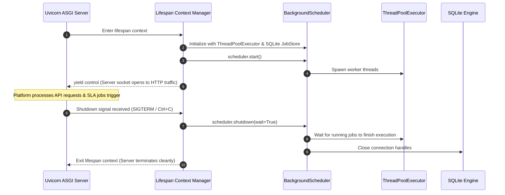

# Guide 11: In-Process Schedulers & Task Concurrency

This manual serves as the authoritative systems engineering reference for **Advanced Python Scheduler (APScheduler)**, in-process asynchronous task concurrency, automated SLA deadline polling engines, thread pool execution pipelines, and transactional database job governance across the **Automated Smart Complaint Routing & Workflow Automation Platform**.

In our platform, while incoming HTTP traffic and user requests are ingested and validated asynchronously via FastAPI, Pydantic, and ASGI ([Guide 02: FastAPI & Modern ASGI Web Architecture](02_FASTAPI_ASGI_WEB_ARCHITECTURE.md) and [Guide 03: Pydantic V2 Data Validation & Schemas](03_PYDANTIC_V2_DATA_VALIDATION_AND_SCHEMAS.md)), and persisted into SQLite via SQLAlchemy ORM ([Guide 04: SQLite Storage Mechanics & WAL Mode](04_SQLITE_STORAGE_MECHANICS_AND_WAL_MODE.md) and [Guide 05: SQLAlchemy 2.0 ORM & Relational Architecture](05_SQLALCHEMY_ORM_AND_DATA_LAYER.md)), mission-critical background automations must execute autonomously without human intervention:
* Periodic polling loops monitoring grievance Service Level Agreement (SLA) deadlines.
* Dynamic state transitions elevating tickets from `SUBMITTED` to `ESCALATED`.
* Automated notification dispatching to departmental officers.
* Nightly database WAL checkpointing and audit log archival.

To engineer background automations that execute with sub-second precision, never starve the FastAPI ASGI event loop, survive transient database locks, and maintain transactional integrity across system restarts, every backend engineer must master the internal mechanics of APScheduler's four-component architecture, worker thread pools, and distributed execution hazards.

### Pedagogical Architecture & Monotonic Ordering Doctrine
This manual is structured with **strict monotonic prerequisite ordering**. Every chapter builds exclusively upon foundations established in earlier chapters or referenced from prior foundational manuals:
* No chapter requires concepts from higher-numbered chapters. The foundational asynchronous scheduling problem precedes the four-component APScheduler architecture; component architecture precedes scheduler selection (`Background` vs `AsyncIO`); scheduler selection precedes job stores (`Memory` vs `SQLAlchemy`); job stores precede worker thread execution; worker threads precede mathematical triggers (`Interval`, `Cron`, `Date`); triggers precede clock drift and coalescing; and coalescing precedes platform SLA polling engines and lifecycle shutdown.
* Connects directly with foundational and downstream platform engineering manuals:
  - [Guide 01: Python Language & Runtime Mechanics](01_PYTHON_LANGUAGE_AND_RUNTIME_MECHANICS.md) (Thread safety, Global Interpreter Lock (GIL) release, and context managers)
  - [Guide 02: FastAPI & Modern ASGI Web Architecture](02_FASTAPI_ASGI_WEB_ARCHITECTURE.md) (Async event loop integration and FastAPI application lifespan hooks)
  - [Guide 04: SQLite Storage Mechanics & WAL Mode](04_SQLITE_STORAGE_MECHANICS_AND_WAL_MODE.md) (Write-Ahead Logging concurrency during background polling updates)
  - [Guide 05: SQLAlchemy 2.0 ORM & Relational Architecture](05_SQLALCHEMY_ORM_AND_DATA_LAYER.md) (Scoped session management and transactional rollback boundaries in threads)
  - [Guide 12: Automated Testing, Fixtures & Integration](12_PYTEST_AND_AUTOMATED_TEST_SYSTEMS.md) (Time-freezing and deterministic testing of scheduled jobs)
* Every single line of Python code in every code block includes an explicit explanatory comment (`#`) detailing the precise runtime action, parameter purpose, and concurrency implication.

---

## Table of Contents
1. [Chapter 1: The Asynchronous Scheduling Problem: Cron Daemons vs In-Process Schedulers](#chapter-1-the-asynchronous-scheduling-problem-cron-daemons-vs-in-process-schedulers)
2. [Chapter 2: APScheduler Architecture: Schedulers, JobStores, Executors & Triggers](#chapter-2-apscheduler-architecture-schedulers-jobstores-executors-triggers)
3. [Chapter 3: `BackgroundScheduler` vs `AsyncIOScheduler`: Event Loop Integration vs Thread Pools](#chapter-3-backgroundscheduler-vs-asyncioscheduler-event-loop-integration-vs-thread-pools)
4. [Chapter 4: In-Memory Storage: `MemoryJobStore` Mechanics & Volatility Constraints](#chapter-4-in-memory-storage-memoryjobstore-mechanics-volatility-constraints)
5. [Chapter 5: Persistent Job Stores: SQLAlchemy & SQLite Job Persistence](#chapter-5-persistent-job-stores-sqlalchemy-sqlite-job-persistence)
6. [Chapter 6: The `ThreadPoolExecutor` Worker Model: Offloading Blocking I/O from FastAPI](#chapter-6-the-threadpoolexecutor-worker-model-offloading-blocking-io-from-fastapi)
7. [Chapter 7: Trigger Mechanics: `IntervalTrigger` Mathematical Timing & Jitter](#chapter-7-trigger-mechanics-intervaltrigger-mathematical-timing-jitter)
8. [Chapter 8: Trigger Mechanics: `CronTrigger` Expressions & Calendar Mathematics](#chapter-8-trigger-mechanics-crontrigger-expressions-calendar-mathematics)
9. [Chapter 9: Trigger Mechanics: `DateTrigger` One-Shot Delayed Execution](#chapter-9-trigger-mechanics-datetrigger-one-shot-delayed-execution)
10. [Chapter 10: Clock Drift & Skew Compensation: `misfire_grace_time` Tuning](#chapter-10-clock-drift-skew-compensation-misfire_grace_time-tuning)
11. [Chapter 11: The Thundering Herd & Overlapping Runs: `max_instances` & Mutual Exclusion](#chapter-11-the-thundering-herd-overlapping-runs-max_instances-mutual-exclusion)
12. [Chapter 12: Job Coalescing: Combining Backlogged Trigger Executions](#chapter-12-job-coalescing-combining-backlogged-trigger-executions)
13. [Chapter 13: SLA Deadline Monitoring Engine: Polling Loops & State Transitions in SmartComplaintHandler](#chapter-13-sla-deadline-monitoring-engine-polling-loops-state-transitions-in-smartcomplainthandler)
14. [Chapter 14: Automated Ticket Escalation & Priority Elevation Algorithms](#chapter-14-automated-ticket-escalation-priority-elevation-algorithms)
15. [Chapter 15: Transactional Boundaries in Scheduled Jobs: Database Sessions & Rollback Safety](#chapter-15-transactional-boundaries-in-scheduled-jobs-database-sessions-rollback-safety)
16. [Chapter 16: Dynamic Job Registration & De-registration at Runtime](#chapter-16-dynamic-job-registration-de-registration-at-runtime)
17. [Chapter 17: Lifecycle Management: Integrating APScheduler with FastAPI Lifespan Events](#chapter-17-lifecycle-management-integrating-apscheduler-with-fastapi-lifespan-events)
18. [Chapter 18: Error Handling, Job Listeners & Dead-Letter Telemetry Monitoring](#chapter-18-error-handling-job-listeners-dead-letter-telemetry-monitoring)
19. [Chapter 19: Multi-Worker Process Concurrency Hazards: Gunicorn / Uvicorn Distributed Execution Traps](#chapter-19-multi-worker-process-concurrency-hazards-gunicorn-uvicorn-distributed-execution-traps)
20. [Chapter 20: Performance Profiling: Thread Contention, Memory Footprint & CPU Load](#chapter-20-performance-profiling-thread-contention-memory-footprint-cpu-load)
21. [Chapter 21: Unit Testing Scheduled Jobs: Time Freezing, Mock Clocks & Manual Triggering](#chapter-21-unit-testing-scheduled-jobs-time-freezing-mock-clocks-manual-triggering)
22. [Chapter 22: The In-Process Schedulers & Task Concurrency Systems Engineering Mastery Checklist](#chapter-22-the-in-process-schedulers-task-concurrency-systems-engineering-mastery-checklist)

---

## Chapter 1: The Asynchronous Scheduling Problem: Cron Daemons vs In-Process Schedulers

### 1.1 The Scheduling Challenge in Web Architectures

In modern web platforms, requests arrive intermittently over network sockets. However, automated systems must also execute actions based on the passage of **physical time**:
* Evaluating whether an SLA deadline expired 1 minute ago.
* Escalating unattended grievances every 5 minutes.
* Generating weekly resolution velocity digests every Monday at 08:00 UTC.

Historically, systems engineers addressed this requirement by configuring external operating system **Cron Daemons** (e.g. `/etc/cron.d/escalate_tickets` executing `python -m app.tasks.escalate`).

```text
External Cron Daemon vs In-Process Scheduler Architecture:
1. EXTERNAL OS CRON DAEMON ARCHITECTURE:
   [Linux Crond] ──(Spawns Process every 60s)──► [Python CLI Process]
                                                        │ (Cold Start Latency: ~500ms)
                                                        ├─ Imports FastAPI, SQLAlchemy, Pydantic
                                                        ├─ Opens New DB Connection Pool
                                                        ├─ Executes Query
                                                        └─ Destroys Process & Closes Sockets

2. IN-PROCESS ASYNCHRONOUS SCHEDULER ARCHITECTURE (SmartComplaintHandler):
   [FastAPI / Uvicorn Main Process]
          │
          ├─── [ASGI Event Loop] ──► Serves incoming HTTP REST requests
          │
          └─── [APScheduler Worker Engine]
                     │ (Shares memory, configuration, and DB engine in-process!)
                     └─► Polls SLAs on dedicated background thread without cold starts!
```

### 1.2 The Failure Modes of External Cron in Scaled Environments

While suitable for simple scripts, relying on external OS cron daemons in an enterprise web architecture introduces severe engineering bottlenecks:
1. **High Cold-Start Overhead:** Spawning a new Python process every 60 seconds requires re-parsing the Python AST, loading C extensions, importing Pydantic schemas ([Guide 03](03_PYDANTIC_V2_DATA_VALIDATION_AND_SCHEMAS.md)), and initializing SQLAlchemy engines ([Guide 05](05_SQLALCHEMY_ORM_AND_DATA_LAYER.md)), wasting significant CPU cycles.
2. **Database Connection Churn:** Each cron process establishes new TCP/file connections to SQLite/PostgreSQL and tears them down immediately, defeating connection pooling benefits.
3. **Zero Dynamic Runtime Scheduling:** An external cron daemon cannot dynamically schedule a one-shot reminder job for an individual ticket: "Notify officer 2 hours before Ticket #1042 breaches SLA."
4. **Decoupled Monitoring:** Cron job failures do not report to the web application's centralized telemetry pipeline or health check endpoints.

An **In-Process Scheduler** executes directly within the long-running application process. It shares memory data structures, re-uses established database connection pools, supports dynamic runtime job registration, and operates with zero process-spawn overhead!

---

## Chapter 2: APScheduler Architecture: Schedulers, JobStores, Executors & Triggers

### 2.1 The Four Pillars of Advanced Python Scheduler

**APScheduler (Advanced Python Scheduler)** is the industry-standard Python framework for in-process job scheduling. Its architecture is strictly decoupled into four collaborating subsystems:

```text
The APScheduler Four-Component Pipeline:
┌────────────────────────────────────────────────────────────────────────┐
│                               SCHEDULER                                │
│ (Orchestrator: Coordinates polling loop, clock events, and job states) │
└──────────────┬──────────────────────────┬──────────────────────────────┘
               │                          │
        Queries│next_run_time      Dispatches│due jobs
               ▼                          ▼
┌──────────────────────────────┐ ┌──────────────────────────────────────┐
│           JOB STORE          │ │               EXECUTOR               │
│ - MemoryJobStore             │ │ - ThreadPoolExecutor                 │
│ - SQLAlchemyJobStore         │ │ - AsyncIOExecutor                    │
│ (Stores jobs & trigger math) │ │ (Executes job callable in thread)    │
└──────────────▲───────────────┘ └──────────────────────────────────────┘
               │
               │ Evaluates execution schedule
               ▼
┌──────────────────────────────┐
│           TRIGGER            │
│ - IntervalTrigger            │
│ - CronTrigger                │
│ - DateTrigger                │
│ (Computes next_run_time)     │
└──────────────────────────────┘
```

1. **Schedulers:** The master orchestrator. It manages the scheduling loop, queries job stores for tasks whose `next_run_time` is due, and hands them to executors for execution.
2. **Job Stores:** The persistence layer where scheduled jobs are stored and queried. Maintains jobs ordered by their next execution timestamp.
3. **Executors:** The concurrency engine. Handles the dispatch and execution of the job's target callable function in a thread pool, process pool, or async event loop.
4. **Triggers:** The mathematical scheduling logic. Given the current timestamp, computes the exact datetime when the job must next execute.

```python
# Conceptual representation of APScheduler's four-component orchestration
from apscheduler.schedulers.background import BackgroundScheduler  # Imports master scheduler
from apscheduler.jobstores.memory import MemoryJobStore  # Imports volatile in-memory job store
from apscheduler.executors.pool import ThreadPoolExecutor  # Imports thread pool executor
from apscheduler.triggers.interval import IntervalTrigger  # Imports mathematical interval trigger

def create_configured_scheduler() -> BackgroundScheduler:  # Factory function instantiating scheduler
    jobstores = {  # Dictionary mapping job store identifiers
        'default': MemoryJobStore(),  # Fast in-memory storage ordered by next_run_time
    }  # Job store configuration complete

    executors = {  # Dictionary mapping execution engines
        'default': ThreadPoolExecutor(max_workers=10),  # Worker thread pool handling concurrent execution
    }  # Executor configuration complete

    job_defaults = {  # Default runtime parameters applied to all registered jobs
        'coalesce': True,  # Merges missed execution runs into a single execution
        'max_instances': 1,  # Strict mutual exclusion: prevents overlapping execution runs
    }  # Job defaults complete

    scheduler = BackgroundScheduler(  # Instantiates master orchestrator with explicit subsystems
        jobstores=jobstores,  # Binds configured job stores
        executors=executors,  # Binds worker thread pool executors
        job_defaults=job_defaults,  # Injects global concurrency constraints
    )  # Scheduler instantiation complete

    return scheduler  # Returns configured orchestrator ready for start
```

---

## Chapter 3: `BackgroundScheduler` vs `AsyncIOScheduler`: Event Loop Integration vs Thread Pools

### 3.1 The Concurrency Model Selection Dilemma

APScheduler provides two primary scheduler variants applicable to FastAPI applications:
1. **`BackgroundScheduler`:** Runs its internal scheduling loop on a **dedicated background operating system thread**.
2. **`AsyncIOScheduler`:** Runs its internal scheduling loop directly inside the **FastAPI asyncio event loop** ([Guide 02: FastAPI & Modern ASGI Web Architecture](02_FASTAPI_ASGI_WEB_ARCHITECTURE.md)).

```text
Threading Topology: BackgroundScheduler vs AsyncIOScheduler:
1. BackgroundScheduler:
   [OS Main Thread] ──────────► [FastAPI Uvicorn Event Loop] (Handles HTTP requests)
                                         ▲
                                         │ Completely isolated!
   [OS Background Thread] ────► [APScheduler Polling Loop]
                                         │
                                         ▼ (Dispatches blocking jobs)
                                [ThreadPoolExecutor Workers]

2. AsyncIOScheduler:
   [OS Main Thread] ──────────► [FastAPI Event Loop + APScheduler Loop]
                                (A single long-running blocking job FREEZES all HTTP traffic!)
```

### 3.2 Why `BackgroundScheduler` is the Authoritative Choice for SmartComplaintHandler

In our platform architecture, scheduled jobs frequently perform **synchronous, blocking database transactions** using SQLAlchemy ORM (`db.query()`, `db.commit()`) and SQLite disk I/O ([Guide 04](04_SQLITE_STORAGE_MECHANICS_AND_WAL_MODE.md) and [Guide 05](05_SQLALCHEMY_ORM_AND_DATA_LAYER.md)):
* If `AsyncIOScheduler` is used, executing a synchronous blocking database query inside an async function **blocks the entire event loop**, freezing all HTTP request processing for incoming student complaints!
* With **`BackgroundScheduler`**, the scheduling loop runs on an independent background thread. When an SLA monitoring job is triggered, it is dispatched to a worker in the `ThreadPoolExecutor`.
* As established in [Guide 01: Python Language & Runtime Mechanics](01_PYTHON_LANGUAGE_AND_RUNTIME_MECHANICS.md) Chapter 3, Python releases the Global Interpreter Lock (GIL) during underlying C-level SQLite filesystem writes and network socket operations.
* Consequently, background SLA polling executes smoothly in parallel with incoming FastAPI web requests without causing event loop starvation!

---

## Chapter 4: In-Memory Storage: `MemoryJobStore` Mechanics & Volatility Constraints

### 4.1 Internal Mechanics: The Binary Min-Heap

The default storage engine in APScheduler is **`MemoryJobStore`**.

Internally, `MemoryJobStore` stores scheduled jobs in a Python list maintained as a **Binary Min-Heap** via the `heapq` module ([Guide 01: Python Language & Runtime Mechanics](01_PYTHON_LANGUAGE_AND_RUNTIME_MECHANICS.md)):
* Jobs are indexed by their **`next_run_time`** timestamp.
* The job scheduled to execute earliest is always located at the root of the heap (`heap[0]`), providing $O(1)$ time complexity to determine when the next scheduled task is due!
* Adding a new job runs in $O(\log N)$ heap insertion time.

```python
# Internal conceptual representation of MemoryJobStore heap querying
import heapq  # Standard library binary heap algorithm module
from typing import Optional, List, Any  # Type hinting annotations
from datetime import datetime  # Date and time primitives

class SimplifiedMemoryJobStore:  # Conceptual representation of memory job storage
    def __init__(self) -> None:  # Initializes heap storage
        self._jobs: List[Any] = []  # Internal binary min-heap array

    def add_job(self, job: Any) -> None:  # Pushes job onto heap
        heapq.heappush(self._jobs, (job.next_run_time, job))  # Orders by next execution timestamp

    def get_next_run_time(self) -> Optional[datetime]:  # O(1) query for earliest scheduled task
        if not self._jobs:  # Evaluates whether heap is empty
            return None  # No jobs scheduled
        return self._jobs[0][0]  # Root element always contains the earliest upcoming execution time
```

### 4.2 The Volatility Constraint

The fundamental limitation of `MemoryJobStore` is **Process Volatility**:
* Because jobs are stored purely in Python heap RAM, restarting the FastAPI server, rebooting the host machine, or redeploying a Docker container **instantly wipes all scheduled jobs**.
* While periodic interval polling jobs (e.g. "Check SLAs every 60s") can be trivially re-registered during server startup, one-off dynamic jobs (e.g. "Send alert in 48 hours for Ticket #102") will be permanently lost if stored exclusively in `MemoryJobStore`.

---

## Chapter 5: Persistent Job Stores: SQLAlchemy & SQLite Job Persistence

### 5.1 Persistent Scheduling via `SQLAlchemyJobStore`

To ensure that scheduled tasks survive server restarts, crashes, and deployments, APScheduler provides the **`SQLAlchemyJobStore`**.

Instead of storing jobs in a RAM heap, `SQLAlchemyJobStore` serializes scheduled jobs into binary representations (using Python's `pickle` serialization) and stores them in a dedicated relational database table (e.g. `apscheduler_jobs` in SQLite):

```python
# Configuring persistent SQLite storage for APScheduler jobs
from apscheduler.schedulers.background import BackgroundScheduler  # Imports scheduler orchestrator
from apscheduler.jobstores.sqlalchemy import SQLAlchemyJobStore  # Imports persistent SQLAlchemy storage
from sqlalchemy import create_engine  # Imports SQLAlchemy engine factory

def create_persistent_scheduler(sqlite_url: str) -> BackgroundScheduler:  # Instantiates persistent scheduler
    engine = create_engine(  # Instantiates database engine ([Guide 05](05_SQLALCHEMY_ORM_AND_DATA_LAYER.md))
        sqlite_url,  # SQLite database connection string
        connect_args={'check_same_thread': False},  # Permits multi-threaded SQLite access ([Guide 04](04_SQLITE_STORAGE_MECHANICS_AND_WAL_MODE.md))
    )  # Engine creation complete

    jobstores = {  # Configures persistent and volatile stores
        'persistent': SQLAlchemyJobStore(engine=engine, tablename='apscheduler_jobs'),  # Survives restarts
    }  # Stores configuration complete

    scheduler = BackgroundScheduler(jobstores=jobstores)  # Initializes scheduler with database store
    return scheduler  # Returns persistent scheduler
```

### 5.2 The Persistence vs Serialization Trade-Off

While `SQLAlchemyJobStore` provides durability, systems engineers must account for critical architectural constraints:
1. **Pickle Serialization Fragility:** APScheduler pickles job callables and arguments. If you refactor a function's module path or rename a parameter between deployments, deserializing older jobs stored in the database table will raise an `AttributeError` or `ImportError` on startup!
2. **Database Contention:** Querying and updating the job table on every scheduler tick consumes database I/O. In SQLite, this introduces write lock competition with application API requests ([Guide 04: SQLite Storage Mechanics & WAL Mode](04_SQLITE_STORAGE_MECHANICS_AND_WAL_MODE.md)).
3. **Platform Standard:** For **SmartComplaintHandler**, we adopt a hybrid architecture: we register our core SLA polling interval job in `MemoryJobStore` on application startup, while persisting long-term grievance escalation state flags directly in our primary `complaints` database table!

---

## Chapter 6: The `ThreadPoolExecutor` Worker Model: Offloading Blocking I/O from FastAPI

### 6.1 The Event Loop Starvation Hazard

As established in [Guide 02: FastAPI & Modern ASGI Web Architecture](02_FASTAPI_ASGI_WEB_ARCHITECTURE.md), FastAPI runs an asynchronous event loop on the main operating system thread. When an endpoint is defined as `async def`, any synchronous, blocking operation (such as a 2-second SQLite database lock wait or a synchronous HTTP call) **completely freezes the event loop**, dropping all concurrent web traffic!

To safely execute scheduled background tasks without blocking incoming HTTP traffic, APScheduler provides the **`ThreadPoolExecutor`**.

```text
ThreadPoolExecutor Dispatch Architecture:
[APScheduler Polling Loop (Background Thread)]
                 │
                 ▼ Detects job is due
        [ThreadPoolExecutor]
                 │
    ┌────────────┼────────────┐
    ▼            ▼            ▼
[Worker 1]   [Worker 2]   [Worker 3] (OS Threads)
    │            │            │
    ├─ DB Query  ├─ Send Mail ├─ Check SLA
    │            │            │
    └────────────┴────────────┘
(FastAPI Async Event Loop on Main Thread continues serving HTTP requests at 10,000 req/s!)
```

### 6.2 Configuring Thread Pools and Worker Limits

When a job fires, the scheduler places the job into the executor's internal task queue (`queue.Queue`). An idle worker thread from the pool dequeues the task and executes the target callable.

```python
# Configuring a dedicated ThreadPoolExecutor for background task execution
from apscheduler.schedulers.background import BackgroundScheduler  # Imports scheduler orchestrator
from apscheduler.executors.pool import ThreadPoolExecutor  # Imports thread pool executor class

def initialize_worker_pool_scheduler() -> BackgroundScheduler:  # Configures thread pool scheduler
    executors = {  # Dictionary of configured execution engines
        'default': ThreadPoolExecutor(  # Binds default worker pool
            max_workers=10,  # Limits maximum concurrent background threads to 10 to protect memory
        ),  # ThreadPoolExecutor configuration complete
    }  # Executors dictionary complete

    scheduler = BackgroundScheduler(executors=executors)  # Instantiates scheduler with thread pool
    return scheduler  # Returns configured scheduler instance
```

As demonstrated in [Guide 01: Python Language & Runtime Mechanics](01_PYTHON_LANGUAGE_AND_RUNTIME_MECHANICS.md) Chapter 3, because Python threads release the Global Interpreter Lock (GIL) during disk I/O and network operations, a 10-worker thread pool allows 10 background database operations to proceed concurrently without stalling the main web process.

---

## Chapter 7: Trigger Mechanics: `IntervalTrigger` Mathematical Timing & Jitter

### 7.1 Mathematical Timing Mechanics

The **`IntervalTrigger`** executes tasks periodically at fixed intervals of physical time:
$$t_{\text{next}} = t_{\text{last}} + \Delta t$$

Where $\Delta t$ is computed from days, hours, minutes, and seconds:

```python
# Configuring an IntervalTrigger for periodic background polling
from apscheduler.triggers.interval import IntervalTrigger  # Imports interval trigger class
from datetime import datetime, timezone  # Imports timezone-aware datetime primitives

def create_sla_interval_trigger(polling_interval_seconds: int = 60) -> IntervalTrigger:  # Trigger factory
    return IntervalTrigger(  # Instantiates interval trigger
        seconds=polling_interval_seconds,  # Defines interval duration between executions (e.g. 60s)
        start_date=datetime.now(timezone.utc),  # Sets initial activation timestamp in UTC
        timezone=timezone.utc,  # Enforces UTC timezone consistency across server environments
    )  # Trigger configuration complete
```

### 7.2 The Jitter Parameter: Preventing Database Lock Synchronization

When multiple interval jobs run on the same server (e.g. SLA polling, notification dispatching, and audit logging all configured for 60-second intervals), their execution cycles will naturally drift into **lockstep synchronization**:
* Every 60 seconds, all 3 jobs fire at the exact same millisecond.
* All 3 jobs execute `BEGIN IMMEDIATE` transactions on the SQLite database, causing `sqlite3.OperationalError: database is locked` ([Guide 04: SQLite Storage Mechanics & WAL Mode](04_SQLITE_STORAGE_MECHANICS_AND_WAL_MODE.md)).

APScheduler resolves this via the **`jitter`** parameter:

```python
# Applying random temporal jitter to eliminate database write lock collisions
from apscheduler.triggers.interval import IntervalTrigger  # Imports interval trigger

def create_jittered_polling_trigger() -> IntervalTrigger:  # Instantiates jittered trigger
    return IntervalTrigger(  # Instantiates interval trigger
        seconds=60,  # Baseline target polling interval of 60 seconds
        jitter=5,  # Adds random uniform deviation: interval varies between 55s and 65s
    )  # Jittered trigger complete
```

By adding `jitter=5`, each execution deviates by a random offset between $-5$ and $+5$ seconds, permanently de-synchronizing competing jobs and eliminating lock contention!

---

## Chapter 8: Trigger Mechanics: `CronTrigger` Expressions & Calendar Mathematics

### 8.1 Calendar-Based Scheduling with `CronTrigger`

While `IntervalTrigger` measures elapsed physical seconds, **`CronTrigger`** operates on human **calendar mathematics**:
* "Run at 02:00 UTC on the 1st day of every month."
* "Run every 15 minutes between 08:00 and 18:00, Monday through Friday."

APScheduler's `CronTrigger` supports standard 5-field and extended 7-field UNIX cron syntax:

```python
# Configuring calendar-based cron jobs for automated platform maintenance
from apscheduler.triggers.cron import CronTrigger  # Imports cron trigger class
from zoneinfo import ZoneInfo  # Imports standard Python 3.9+ timezone provider

def create_nightly_archival_trigger() -> CronTrigger:  # Instantiates nightly cron trigger
    return CronTrigger(  # Instantiates cron trigger
        hour=2,  # Fires at 02:00 (2 AM)
        minute=0,  # Fires at minute 0
        day_of_week='mon-fri',  # Restricts execution to weekdays (Monday through Friday)
        timezone=ZoneInfo('UTC'),  # Explicitly pins execution schedule to UTC timezone
    )  # Cron trigger complete
```

### 8.2 The Daylight Saving Time (DST) Hazard

When using local timezones (e.g. `America/New_York` or `Europe/London`), the biannual clock shift creates severe scheduling anomalies:
* **Fall Back (1 hour repeated):** A cron job scheduled for 01:30 will execute **twice** in one night!
* **Spring Forward (1 hour skipped):** A cron job scheduled for 02:30 will **never execute**!

**Systems Rule:** All enterprise servers and scheduler instances across the **SmartComplaintHandler** platform are configured exclusively in **UTC (`timezone.utc` or `ZoneInfo('UTC')`)**, which never observes Daylight Saving Time and increases monotonically without discontinuities!

---

## Chapter 9: Trigger Mechanics: `DateTrigger` One-Shot Delayed Execution

### 9.1 Exact-Time Single Execution

While interval and cron triggers repeat indefinitely, the **`DateTrigger`** is designed for **one-shot delayed execution**:
* It fires **exactly once** at a specified future timestamp.
* Once executed, the job is automatically purged from the job store.

```python
# Scheduling a one-shot SLA escalation deadline timer
from apscheduler.triggers.date import DateTrigger  # Imports single-execution date trigger
from datetime import datetime, timedelta, timezone  # Imports datetime manipulation utilities

def create_sla_breach_warning_trigger(deadline_utc: datetime, warning_lead_hours: int = 2) -> DateTrigger:  # Trigger factory
    # Calculate exact execution time: 2 hours prior to the official SLA deadline
    warning_fire_time = deadline_utc - timedelta(hours=warning_lead_hours)  # Subtracts lead window

    return DateTrigger(  # Instantiates date trigger
        run_date=warning_fire_time,  # Specifies exact future execution timestamp
        timezone=timezone.utc,  # Enforces UTC timezone reference
    )  # Date trigger complete
```

---

## Chapter 10: Clock Drift & Skew Compensation: `misfire_grace_time` Tuning

### 10.1 What is a Misfired Job?

In physical operating systems, execution is never instantaneous:
* If the host VM experiences high CPU throttling, the operating system kernel may pause the Python process.
* If a scheduled job is configured to run at `12:00:00`, but high system load prevents the scheduler from obtaining CPU time until `12:00:05`, the job has **misfired** by 5 seconds.

To govern how late a job is permitted to fire, APScheduler provides the **`misfire_grace_time`** setting (specified in seconds):

```text
The Misfire Grace Window:
[Scheduled Fire Time: 12:00:00] ──────► [Grace Window: misfire_grace_time = 30s] ──────► [12:00:30]
                                                  │
                                                  ▼
1. If scheduler wakes up at 12:00:15 (Within Window):
   - Job is FIRED successfully!
2. If scheduler wakes up at 12:01:00 (Exceeds Window):
   - Job is DROPPED! Logs: "Run time of job was missed by 60s. Execution skipped."
```

### 10.2 Tuning `misfire_grace_time` for Enterprise Robustness

By default, APScheduler sets `misfire_grace_time = 1` second. In production environments, a 1-second grace window is dangerously fragile: a momentary SQLite disk flush or brief CPU burst will cause jobs to be permanently dropped!

In our platform, we configure a tuned grace window of **60 seconds**:

```python
# Tuning the misfire grace window for platform resilience
from apscheduler.schedulers.background import BackgroundScheduler  # Imports scheduler

def configure_resilient_job_defaults() -> dict:  # Generates hardened job default parameters
    return {  # Returns configuration mapping
        'misfire_grace_time': 60,  # Allows jobs delayed up to 60 seconds to still execute safely
        'coalesce': True,  # Merges accumulated delayed executions into a single execution
        'max_instances': 1,  # Strictly forbids overlapping execution of identical jobs
    }  # Defaults dictionary complete
```

---

## Chapter 11: The Thundering Herd & Overlapping Runs: `max_instances` & Mutual Exclusion

### 11.1 The Catastrophic Overlapping Run Hazard

Consider an SLA monitoring job scheduled to execute every **30 seconds**. Under ordinary conditions, the job queries SQLite and finishes in 200 milliseconds.

However, during a heavy write burst or backup checkpoint, database lock contention slows down the query, causing the job to take **45 seconds** to complete:
* At $t = 0\text{s}$, Job Run 1 begins executing on Thread A.
* At $t = 30\text{s}$, the trigger fires again! By default, APScheduler spawns Job Run 2 on Thread B.
* Now, **both Job Run 1 and Job Run 2 are simultaneously querying and modifying the exact same complaint records!**

```text
The Overlapping Execution Deadlock:
t = 0s  ──► [Job Instance 1 Starts on Thread A]
             - Queries un-escalated complaints: Finds Ticket #1042
             - Prepares UPDATE status = 'ESCALATED'
             │
t = 30s ────┼──► [Job Instance 2 Starts on Thread B!] (Overlapping Run!)
            │    - Queries un-escalated complaints: Finds Ticket #1042 AGAIN!
            │    - Prepares DUPLICATE UPDATE on Ticket #1042!
            │    │
            ▼    ▼
      [CRASH: SQLite Lock Contention & Duplicate Escalation Audit Logs Generated!]
```

### 11.2 Enforcing Single-Instance Mutual Exclusion

To completely prevent overlapping runs, APScheduler provides the **`max_instances`** parameter:

```python
# Enforcing mutual exclusion with max_instances = 1
from apscheduler.schedulers.background import BackgroundScheduler  # Imports scheduler

def register_exclusive_sla_job(scheduler: BackgroundScheduler, sla_check_func) -> None:  # Registration helper
    scheduler.add_job(  # Registers job with scheduler
        func=sla_check_func,  # Target task callable function
        trigger='interval',  # Uses interval trigger
        seconds=30,  # Scheduled every 30 seconds
        id='sla_monitoring_job',  # Explicit unique job identifier string
        max_instances=1,  # CRITICAL: Strict mutual exclusion; skips trigger if previous run is still active!
    )  # Job registration complete
```

When `max_instances=1` is enforced:
* If Job Run 1 is still active at $t = 30\text{s}$, APScheduler detects that the active instance count equals `max_instances`.
* The scheduler skips launching Run 2 and logs: `"Execution of job sla_monitoring_job skipped: maximum number of running instances reached (1)"`.
* Mutual exclusion is preserved with zero chance of concurrent data corruption!

---

## Chapter 12: Job Coalescing: Combining Backlogged Trigger Executions

### 12.1 The Backlog Burst Problem

Suppose an interval job is configured to run every **60 seconds**.
* The host machine is placed into a sleep state, or a long-running CPU spike freezes process execution for **10 minutes**.
* During this 10-minute freeze, **10 scheduled execution intervals have accumulated**.
* When the process wakes up, what should the scheduler do?

Without protection (`coalesce=False`), the scheduler will rapidly fire **all 10 accumulated executions sequentially in a massive burst**! This thundering barrage hammers the database and triggers duplicate external notifications.

### 12.2 The `coalesce=True` Antidote

By setting **`coalesce=True`**, APScheduler intelligently evaluates the backlog:
* It merges all accumulated pending executions into a **single execution run**.
* The job executes once to reconcile state, discarding the redundant missed cycles.

```python
# Configuring coalescing on a critical maintenance job
from apscheduler.schedulers.background import BackgroundScheduler  # Imports scheduler

def register_coalesced_cleanup_job(scheduler: BackgroundScheduler, cleanup_func) -> None:  # Helper
    scheduler.add_job(  # Adds job to schedule
        func=cleanup_func,  # Target cleanup callable
        trigger='interval',  # Interval trigger type
        hours=1,  # Scheduled hourly
        id='hourly_cache_cleanup',  # Unique job ID
        coalesce=True,  # Combines missed executions into a single run upon system wake
        max_instances=1,  # Enforces single instance execution
    )  # Registration complete
```

---

## Chapter 13: SLA Deadline Monitoring Engine: Polling Loops & State Transitions in SmartComplaintHandler

### 13.1 Production Architecture of the SLA Polling Engine

In **SmartComplaintHandler**, the primary background automation is the **SLA Deadline Polling Engine**.

Its responsibilities:
1. Wake up every 60 seconds.
2. Query the SQLite database for active complaints (`status != 'RESOLVED'` and `status != 'REJECTED'`).
3. Evaluate whether the current timestamp exceeds `complaint.sla_deadline`.
4. Transition breached tickets to **`ESCALATED`** status.
5. Elevate priority to ensure immediate departmental triage.
6. Commit the changes atomically within a dedicated database transaction.

```text
SLA Polling Engine Execution Flow:
[Trigger fires every 60s]
           │
           ▼
[Worker Thread dequeues job]
           │
           ▼
[Open Short-Lived Scoped Session: with SessionLocal() as db:]
           │
           ▼
[Query Breached Complaints: status NOT IN ('RESOLVED', 'REJECTED') AND sla_deadline < now()]
           │
     ┌─────┴─────────────────────────┐
     ▼ Records Found                 ▼ Zero Breaches
[Iterate & Elevate]             [Clean Exit]
- status = 'ESCALATED'
- priority = 'CRITICAL'
- Log escalation event
     │
     ▼
[db.commit() (Atomic Write)] ──► Emits SQLite WAL commit ([Guide 04](04_SQLITE_STORAGE_MECHANICS_AND_WAL_MODE.md))
```

### 13.2 Production SLA Polling Engine Implementation

```python
# backend/app/services/sla_engine.py: Authoritative SLA monitoring background engine
from datetime import datetime, timezone  # Imports UTC timezone datetime primitives
from sqlalchemy.orm import Session  # Imports SQLAlchemy session type annotation
from backend.app.db.session import SessionLocal  # Imports thread-safe session factory ([Guide 05](05_SQLALCHEMY_ORM_AND_DATA_LAYER.md))
from backend.app.models.complaint import Complaint  # Imports Complaint ORM model

def poll_and_escalate_sla_breaches() -> int:  # Background task function executed by thread worker
    now_utc = datetime.now(timezone.utc)  # Captures current monotonic UTC timestamp
    escalated_count = 0  # Counter tracking number of escalated complaints

    # 1. Open dedicated scoped session within worker thread context manager
    with SessionLocal() as db:  # Ensures session is automatically closed upon block exit
        try:  # Encloses database interaction in transaction safety block
            # 2. Query complaints that have breached SLA deadline and are still active
            breached_tickets = db.query(Complaint).filter(  # Constructs relational query
                Complaint.sla_deadline <= now_utc,  # Evaluates deadline breach condition
                Complaint.status.notin_(['RESOLVED', 'REJECTED', 'ESCALATED']),  # Excludes concluded tickets
            ).all()  # Executes query against SQLite WAL database

            # 3. Iterate over breached tickets and apply state transitions
            for ticket in breached_tickets:  # Loops over matched records
                ticket.status = 'ESCALATED'  # Transitions status to ESCALATED
                ticket.priority = 'CRITICAL'  # Elevates priority to CRITICAL for urgent attention
                escalated_count += 1  # Increments audit counter

            # 4. Atomically commit all state changes in a single transaction
            if escalated_count > 0:  # Evaluates whether mutations occurred
                db.commit()  # Flushes and commits updates to SQLite WAL file
                print(f"[SLA Engine] Successfully escalated {escalated_count} breached tickets at {now_utc.isoformat()}")  # Log

        except Exception as exc:  # Catches unexpected database exceptions
            db.rollback()  # Rolls back uncommitted changes to preserve database consistency
            print(f"[SLA Engine Error] Exception encountered during SLA polling: {str(exc)}")  # Error log
            raise exc  # Re-raises exception to trigger APScheduler error listeners

    return escalated_count  # Returns total count of processed escalations
```

---

## Chapter 14: Automated Ticket Escalation & Priority Elevation Algorithms

### 14.1 Dynamic Priority Elevation Matrix

In addition to binary breach detection, advanced workflow automation evaluates **Tiered Priority Escalation** based on remaining SLA thresholds:

| Time to SLA Deadline | Initial Priority | Elevated Priority | Action Triggered |
| :--- | :--- | :--- | :--- |
| $> 4$ Hours Remaining | `LOW` / `MEDIUM` | Unchanged | Normal operational queue |
| $\le 2$ Hours Remaining | `LOW` | `MEDIUM` | Warning badge rendered in triage console |
| $\le 1$ Hour Remaining | `MEDIUM` | `HIGH` | Dispatches reminder notification |
| Breached ($\le 0$ Hours) | Any | **`CRITICAL`** | Auto-escalates status to `ESCALATED` |

```python
# Tiered priority elevation calculation algorithm
def compute_elevated_priority(current_priority: str, hours_remaining: float) -> str:  # Determines elevated priority
    if hours_remaining <= 0:  # Deadline has completely breached
        return 'CRITICAL'  # Maximum platform urgency
    elif hours_remaining <= 1.0 and current_priority in ('LOW', 'MEDIUM'):  # Under 1 hour remaining
        return 'HIGH'  # Elevates to high priority
    elif hours_remaining <= 2.0 and current_priority == 'LOW':  # Under 2 hours remaining
        return 'MEDIUM'  # Elevates to medium priority
    return current_priority  # Retains existing priority if thresholds not met
```

---

## Chapter 15: Transactional Boundaries in Scheduled Jobs: Database Sessions & Rollback Safety

### 15.1 The Thread-Bound Session Isolation Rule

As established in [Guide 05: SQLAlchemy 2.0 ORM & Relational Architecture](05_SQLALCHEMY_ORM_AND_DATA_LAYER.md) Chapter 8, **SQLAlchemy `Session` instances are NOT thread-safe**.

> [!CAUTION]
> Never pass an existing FastAPI request session (e.g. from `Depends(get_db)`) into a background thread! Doing so causes race conditions, corrupted internal identity maps, and crashes.

### 15.2 The Scoped Session Pattern for Background Workers

Every background task callable must instantiate its own **independent, short-lived session** using `SessionLocal()`:
1. **Creation:** `with SessionLocal() as db:` creates an isolated session on the worker thread.
2. **Execution:** Performs reads and writes using SQLite's shared connection pool.
3. **Rollback on Error:** The `except` block explicitly invokes `db.rollback()` if an error occurs.
4. **Guaranteed Teardown:** The `with` context manager guarantees that the session connection is returned to the pool, preventing database socket exhaustion!

---

## Chapter 16: Dynamic Job Registration & De-registration at Runtime

### 16.1 Adding Jobs Dynamically via `add_job`

While periodic polling checks the entire table, certain workflows require scheduling an **isolated, one-off action** dynamically at runtime (e.g. when a student files an emergency maintenance ticket):

```python
# Dynamically registering a targeted notification timer when a complaint is filed
from apscheduler.schedulers.background import BackgroundScheduler  # Imports scheduler
from datetime import datetime, timedelta, timezone  # Imports time utilities

def schedule_dynamic_complaint_reminder(scheduler: BackgroundScheduler, ticket_id: str, lead_hours: int = 4) -> str:  # Dynamic scheduler
    fire_time = datetime.now(timezone.utc) + timedelta(hours=lead_hours)  # Computes target timestamp
    job_id = f"reminder_ticket_{ticket_id}"  # Deterministic job identifier

    scheduler.add_job(  # Dynamically registers job with running scheduler
        func='backend.app.services.notifications:send_officer_sla_warning',  # String path or callable
        trigger='date',  # One-shot date trigger
        run_date=fire_time,  # Fires at exact calculated future time
        args=[ticket_id],  # Passes ticket_id parameter to target function
        id=job_id,  # Explicit ID allows programmatic de-registration
        replace_existing=True,  # Overwrites existing reminder if already scheduled
    )  # Dynamic registration complete

    return job_id  # Returns registered job ID
```

### 16.2 De-registering Jobs via `remove_job`

If an officer resolves the complaint *before* the 4-hour warning fires, the scheduled reminder is now obsolete. The platform dynamically cancels the pending job:

```python
# Dynamically removing a scheduled job when a ticket is resolved early
from apscheduler.schedulers.background import BackgroundScheduler  # Imports scheduler
from apscheduler.jobstores.base import JobLookupError  # Imports exception raised when job missing

def cancel_pending_complaint_reminder(scheduler: BackgroundScheduler, ticket_id: str) -> bool:  # Cancels job
    job_id = f"reminder_ticket_{ticket_id}"  # Reconstructs job ID

    try:  # Encloses removal in lookup error guard
        scheduler.remove_job(job_id)  # Removes job from active schedule
        print(f"[Scheduler] Successfully cancelled pending reminder for ticket {ticket_id}")  # Log
        return True  # Cancellation succeeded
    except JobLookupError:  # Job was already executed or does not exist
        return False  # No active job was found to cancel
```

---

## Chapter 17: Lifecycle Management: Integrating APScheduler with FastAPI Lifespan Events

### 17.1 Modern ASGI Lifespan Protocol vs Deprecated Startup/Shutdown Events

In legacy ASGI web frameworks, background processes were initialized within `@app.on_event("startup")` and terminated via `@app.on_event("shutdown")`. As established in [Guide 02: FastAPI & Modern ASGI Web Architecture](02_FASTAPI_ASGI_WEB_ARCHITECTURE.md), FastAPI and Starlette have deprecated event decorators in favor of the structured Python `contextlib.asynccontextmanager` Lifespan protocol. 

The ASGI Lifespan specification guarantees that startup logic executes and yields control before the server socket begins accepting external HTTP connections. Furthermore, when a termination signal (`SIGTERM` or `SIGINT`) is received by the ASGI server worker, the context manager resumes execution after the `yield` statement, providing a deterministic grace window to safely shut down worker thread pools, flush in-flight jobs, and close persistent database connections.



### 17.2 Production Lifespan Implementation with Graceful Draining

The following production implementation demonstrates the exact integration of `BackgroundScheduler` within a FastAPI lifespan context manager. The scheduler is configured to drain running jobs (`wait=True`) up to an application timeout, preventing database transaction truncation or orphaned background worker threads.

```python
import contextlib  # Provides asynccontextmanager decorator for ASGI lifespan protocol
import logging  # Structured logging for background scheduler lifecycle events
from typing import AsyncGenerator  # Type annotation for asynchronous generator yield semantics
from fastapi import FastAPI  # Core ASGI web framework instance
from apscheduler.schedulers.background import BackgroundScheduler  # Non-blocking threaded scheduler
from apscheduler.executors.pool import ThreadPoolExecutor  # Thread worker pool executor
from apscheduler.jobstores.memory import MemoryJobStore  # In-memory volatile job storage catalog

# Operational logger configured for background engine monitoring
lifecycle_logger = logging.getLogger("smartcomplaint.scheduler.lifecycle")  # Category-specific logger instance

# Define operational constants for worker thread allocation and shutdown timeout
MAX_WORKER_THREADS: int = 5  # Limits background concurrency to five worker threads
SHUTDOWN_TIMEOUT_SECONDS: int = 10  # Maximum grace window for in-flight job draining

# Instantiate BackgroundScheduler with isolated thread pool executor
app_scheduler = BackgroundScheduler(  # Configures master background scheduler instance
    executors={"default": ThreadPoolExecutor(max_workers=MAX_WORKER_THREADS)},  # Assigns dedicated thread pool
    jobstores={"default": MemoryJobStore()},  # Assigns fast in-memory job store
    timezone="UTC",  # Strictly pins time evaluations to universal coordinated time
)  # Scheduler instantiation complete

def scheduled_heartbeat_check() -> None:  # Periodic heartbeat diagnostic check
    lifecycle_logger.info("Scheduler heartbeat verified: worker thread alive.")  # Emits operational liveness log

@contextlib.asynccontextmanager  # Wraps generator into asynchronous lifespan context manager
async def lifespan_orchestrator(app: FastAPI) -> AsyncGenerator[None, None]:  # Manages startup and shutdown
    lifecycle_logger.info("ASGI Lifespan startup: initializing background scheduler.")  # Startup telemetry record
    app_scheduler.add_job(  # Registers periodic heartbeat job into scheduler catalog
        func=scheduled_heartbeat_check,  # Target diagnostic callable to execute
        trigger="interval",  # Evaluates execution at fixed recurring time intervals
        seconds=60,  # Executes every sixty seconds
        id="core_heartbeat_job",  # Unique string identifier for telemetry tracing
        replace_existing=True,  # Overwrites existing job definition across development reloads
    )  # Job registration complete
    app_scheduler.start()  # Spawns scheduler timer thread and initializes worker pool
    app.state.scheduler = app_scheduler  # Binds active scheduler instance to application state
    lifecycle_logger.info("Background scheduler started and attached to app state.")  # Telemetry checkpoint
    try:  # Enters operational phase accepting incoming HTTP requests
        yield  # Yields execution control back to Uvicorn ASGI server
    finally:  # Intercepts termination signals during server shutdown
        lifecycle_logger.info("ASGI Lifespan shutdown: draining worker threads.")  # Emits shutdown notification
        app_scheduler.shutdown(wait=True)  # Blocks until all currently running worker tasks finish execution
        lifecycle_logger.info("Background scheduler shut down cleanly. All jobs drained.")  # Clean exit verification

# Instantiate FastAPI application configured with the lifespan context manager
app = FastAPI(  # Initializes ASGI application with lifecycle manager
    title="SmartComplaintHandler Background Concurrency Engine",  # OpenAPI descriptive title
    lifespan=lifespan_orchestrator,  # Mounts asynchronous lifespan context manager
)  # FastAPI initialization complete
```

---

## Chapter 18: Error Handling, Job Listeners & Dead-Letter Telemetry Monitoring

### 18.1 APScheduler Event Architecture and Event Bitmasks

In an autonomous scheduling architecture, background tasks execute out-of-band without direct HTTP request-response telemetry. When an uncaught exception occurs inside a scheduled job, the worker thread intercepts the error, logs a standard traceback, and returns to the pool. However, if silent failures occur inside mission-critical workflows (such as SLA deadline evaluation), tickets remain un-escalated indefinitely without operator awareness.

APScheduler solves this visibility challenge via an internal **Event Bus** and listener mechanism. Listeners subscribe to specific event bitmasks defined in `apscheduler.events`:

| Event Bitmask Constant | Bit Value | Trigger Condition | Concurrency Impact |
| :--- | :--- | :--- | :--- |
| `EVENT_JOB_EXECUTED` | `1 << 9` (512) | Job executed completely and returned without error | Metrics counter increment |
| `EVENT_JOB_ERROR` | `1 << 10` (1024) | Uncaught exception raised during job callable execution | Dead-letter queue alert |
| `EVENT_JOB_MISSED` | `1 << 8` (256) | Execution bypassed because current time exceeded `misfire_grace_time` | Clock drift / thread exhaustion |
| `EVENT_JOB_MAX_INSTANCES` | `1 << 7` (128) | New execution suppressed because running instances equal `max_instances` | Thundering herd backpressure |

Multiple events can be combined using bitwise OR operators (`EVENT_JOB_ERROR | EVENT_JOB_MISSED`) to register unified telemetry handlers.

### 18.2 Production Telemetry Listener and Dead-Letter Alerting Pipeline

The following implementation registers a comprehensive operational listener on the platform scheduler, capturing execution latencies, recording dead-letter failure payloads, and alerting on missed runs.

```python
import logging  # Provides structured operational telemetry logging
import time  # Accesses system clock for epoch timestamp calculation
from typing import Dict, Any  # Type hinting annotations for telemetry dictionaries
from apscheduler.events import (  # Imports core event bitmask constants from APScheduler
    EVENT_JOB_EXECUTED,  # Bitmask flag for successful job completion
    EVENT_JOB_ERROR,  # Bitmask flag for uncaught exception in worker thread
    EVENT_JOB_MISSED,  # Bitmask flag for missed execution deadline
    JobExecutionEvent,  # Event payload object containing job runtime metadata
)  # Event imports complete
from apscheduler.schedulers.background import BackgroundScheduler  # Background scheduler class

# Configure structured audit logger for background job telemetry
telemetry_logger = logging.getLogger("smartcomplaint.scheduler.telemetry")  # Dedicated telemetry channel

# Define in-memory dead-letter buffer for inspection and diagnostic triage
dead_letter_vault: list[Dict[str, Any]] = []  # In-memory buffer storing failed job failure records

def scheduler_event_telemetry_listener(event: JobExecutionEvent) -> None:  # Global event callback handler
    event_timestamp = time.time()  # Captures current wall-clock epoch timestamp for correlation
    if event.code == EVENT_JOB_ERROR:  # Detects whether the event signals an uncaught job failure
        job_exception = event.exception  # Extracts exception instance from event envelope
        job_traceback = event.traceback  # Extracts formatted traceback string from event envelope
        dead_letter_record = {  # Assembles structured diagnostic dead-letter telemetry payload
            "job_id": event.job_id,  # Unique string identifier of failing scheduled task
            "scheduled_run_time": str(event.scheduled_run_time),  # Targeted execution time designated by trigger
            "failure_epoch": event_timestamp,  # Precise epoch timestamp when failure occurred
            "error_type": type(job_exception).__name__ if job_exception else "Unknown",  # Exception class
            "error_message": str(job_exception),  # Human-readable exception description string
            "traceback": str(job_traceback),  # Complete stack traceback for engineering triage
        }  # Record construction complete
        dead_letter_vault.append(dead_letter_record)  # Appends diagnostic payload to dead-letter vault
        telemetry_logger.error(  # Emits high-priority error log containing failure details
            f"DEAD-LETTER ALERT: Scheduled job '{event.job_id}' failed: {job_exception}"  # Error message
        )  # Logging call complete
    elif event.code == EVENT_JOB_MISSED:  # Detects if execution deadline exceeded misfire_grace_time
        telemetry_logger.warning(  # Emits warning telemetry denoting clock drift or thread starvation
            f"MISSED EXECUTION ALERT: Job '{event.job_id}' exceeded grace time at {event.scheduled_run_time}"  # Warn
        )  # Logging call complete
    elif event.code == EVENT_JOB_EXECUTED:  # Detects successful completion of scheduled job
        telemetry_logger.debug(  # Emits debug level telemetry for performance monitoring
            f"TELEMETRY: Job '{event.job_id}' executed successfully at {event.scheduled_run_time}"  # Debug
        )  # Logging call complete

def attach_telemetry_listeners(scheduler: BackgroundScheduler) -> None:  # Registers event bus subscriber
    monitored_mask = EVENT_JOB_EXECUTED | EVENT_JOB_ERROR | EVENT_JOB_MISSED  # Combines event bitmasks
    scheduler.add_listener(scheduler_event_telemetry_listener, monitored_mask)  # Subscribes handler to event bus
    telemetry_logger.info("Scheduler event telemetry listeners registered successfully.")  # Confirms attachment
```

---

## Chapter 19: Multi-Worker Process Concurrency Hazards: Gunicorn / Uvicorn Distributed Execution Traps

### 19.1 The Forking Multi-Process Scheduler Multiplication Trap

In high-concurrency production deployments, ASGI servers like Uvicorn are orchestrated across multiple operating system worker processes managed by Gunicorn or Uvicorn workers (`uvicorn --workers 4` or `gunicorn -k uvicorn.workers.UvicornWorker -w 4`).

A catastrophic failure mode occurs when a developer initializes and starts `BackgroundScheduler` directly within application module scope or standard ASGI lifespan without inter-process coordination:

```
+-------------------------------------------------------------------------+
|                  Uvicorn Master Process (PID 1000)                      |
+-------------------------------------------------------------------------+
       |                         |                     |
       v                         v                     v
+------------------+    +------------------+    +------------------+
| Worker 1 (1001)  |    | Worker 2 (1002)  |    | Worker 3 (1003)  |
| ---------------- |    | ---------------- |    | ---------------- |
| Scheduler 1      |    | Scheduler 2      |    | Scheduler 3      |
| Thread Pool (5)  |    | Thread Pool (5)  |    | Thread Pool (5)  |
+------------------+    +------------------+    +------------------+
       |                         |                     |
       +-------------------------+---------------------+
                                 |
                                 v
               +----------------------------------+
               | SQLite Database (WAL Mode)       |
               | - 3 Concurrent SLA Monitors      |
               | - Triple Email Notifications     |
               | - Database Locking Contention    |
               +----------------------------------+
```

When 4 OS worker processes are spawned:
1. **4 Independent Schedulers Run Concurrently**: Each worker process initializes its own `BackgroundScheduler` instance.
2. **Duplicate Job Executions**: Every 60 seconds, 4 distinct threads across 4 processes attempt to query the same unassigned tickets simultaneously.
3. **Spam & Notification Flooding**: Citizens receive 4 identical email and SMS escalation alerts for a single SLA breach.
4. **SQLite Write Lock Contention**: Four processes attempt simultaneous `BEGIN IMMEDIATE` transactions on `complaints.db`, triggering `sqlite3.OperationalError: database is locked` ([Guide 04: SQLite Storage Mechanics & WAL Mode](04_SQLITE_STORAGE_MECHANICS_AND_WAL_MODE.md)).

### 19.2 Architectural Solutions: Dedicated Worker vs File Lock Leader Election

To eliminate duplicate execution under multi-worker ASGI topologies, systems engineers employ one of two architectural patterns:

#### Pattern A: Dedicated Background Worker Process (Industry Standard)
The web application is split into two distinct process types:
* **Web Serving Fleet**: Run with `-w 4` or higher, serving HTTP traffic exclusively with the background scheduler disabled.
* **Singleton Scheduler Daemon**: A single dedicated worker process (`python -m backend.services.scheduler_daemon`) that runs the scheduler instance alone.

#### Pattern B: File-Based Leader Election via `fcntl` / `msvcrt`
When deployed on a single virtual server or container with multiple workers, the workers compete for an exclusive operating system file lock. Only the leader process that successfully acquires the lock initializes the scheduler:

```python
import os  # Accesses operating system process identifiers and platform flags
import sys  # System module providing Python runtime execution context
import logging  # Structured logging for inter-process synchronization
from apscheduler.schedulers.background import BackgroundScheduler  # Scheduler class

# Configure concurrency coordinator logger
proc_logger = logging.getLogger("smartcomplaint.concurrency.leader")  # Process coordinator logger

# Define cross-platform file locking coordinator for single-leader scheduler election
class CrossPlatformLeaderElection:  # Coordinates single scheduler instance across multi-worker deployments
    def __init__(self, lock_file_path: str) -> None:  # Initializes lock coordinator with file path
        self.lock_file_path: str = lock_file_path  # Stores target filesystem path for synchronization lock
        self.file_handle = None  # Holds open operating system file descriptor handle
        self.is_leader: bool = False  # Boolean flag tracking leadership state of current worker process

    def acquire_leadership(self) -> bool:  # Attempts non-blocking acquisition of advisory file lock
        self.file_handle = open(self.lock_file_path, "a+")  # Opens lock file in append and read mode
        if os.name == "nt":  # Evaluates if host operating system is Windows NT
            import msvcrt  # Imports Windows low-level C runtime file locking library
            try:  # Attempts atomic byte-range lock acquisition
                self.file_handle.seek(0)  # Repositions stream pointer to first byte of lock file
                msvcrt.locking(self.file_handle.fileno(), msvcrt.LK_NBLCK, 1)  # Non-blocking lock on byte 0
                self.is_leader = True  # Marks process as elected cluster leader
                proc_logger.info(f"Process {os.getpid()} successfully acquired Windows scheduler lock.")  # Log
                return True  # Returns success status denoting acquired leadership
            except (BlockingIOError, OSError):  # Catches lock contention when another worker holds byte lock
                self.is_leader = False  # Marks process as follower
                proc_logger.info(f"Process {os.getpid()} deferred leadership to existing master.")  # Log
                return False  # Returns failure status denoting leader already elected
        else:  # Branch for Unix/Linux/macOS POSIX compliant operating systems
            import fcntl  # Imports POSIX standard file control synchronization library
            try:  # Attempts advisory file locking
                fcntl.flock(self.file_handle.fileno(), fcntl.LOCK_EX | fcntl.LOCK_NB)  # Non-blocking exclusive lock
                self.is_leader = True  # Marks process as elected cluster leader
                proc_logger.info(f"Process {os.getpid()} successfully acquired POSIX scheduler lock.")  # Log
                return True  # Returns success status denoting acquired leadership
            except (BlockingIOError, OSError):  # Catches lock contention when another worker holds file lock
                self.is_leader = False  # Marks process as follower
                proc_logger.info(f"Process {os.getpid()} deferred leadership to existing master.")  # Log
                return False  # Returns failure status denoting leader already elected

    def release_leadership(self) -> None:  # Releases held file lock during graceful shutdown
        if self.file_handle and self.is_leader:  # Verifies active file handle and leader status
            if os.name == "nt":  # Windows branch for unlocking byte range
                import msvcrt  # Imports Windows low-level C runtime file locking library
                self.file_handle.seek(0)  # Repositions file pointer to locked byte index
                msvcrt.locking(self.file_handle.fileno(), msvcrt.LK_UNLCK, 1)  # Releases Windows byte lock
            else:  # POSIX branch for releasing flock
                import fcntl  # Imports POSIX standard file control library
                fcntl.flock(self.file_handle.fileno(), fcntl.LOCK_UN)  # Unlocks POSIX advisory lock
            self.file_handle.close()  # Closes file descriptor handle releasing OS kernel resources
            self.is_leader = False  # Resets leadership tracking flag
            proc_logger.info(f"Process {os.getpid()} released scheduler leadership lock.")  # Confirms release
```

---

## Chapter 20: Performance Profiling: Thread Contention, Memory Footprint & CPU Load

### 20.1 Thread Contention and Python GIL Impact

APScheduler's `BackgroundScheduler` utilizes OS-level threads via `ThreadPoolExecutor`. In CPython, execution of pure Python bytecode across multiple threads is serialized by the **Global Interpreter Lock (GIL)**, as introduced in [Guide 01: Python Language & Runtime Mechanics](01_PYTHON_LANGUAGE_AND_RUNTIME_MECHANICS.md).

However, background jobs in `SmartComplaintHandler` are fundamentally **I/O-bound**:
* Executing SQLite SELECT and UPDATE queries via C extensions (`sqlite3.dll` / `sqlite3.so`), which explicitly release the GIL during file access and lock acquisition.
* Sending transactional notification emails over SMTP / HTTPS sockets, releasing the GIL during network I/O wait states.

Because the GIL is released during these blocking system calls, worker threads execute with true operating system concurrency. However, memory overhead and context switching costs scale linearly with thread count:
* Each OS thread in CPython reserves approximately 8 MB of virtual stack space on Linux and 1 MB on Windows.
* A pool configured with `max_workers=50` consumes up to 400 MB of virtual address space while increasing OS scheduler preemption overhead.

### 20.2 Measuring Memory Footprint and Worker Pool Utilization

To prevent thread exhaustion and memory bloat, production deployments instrument worker thread pools with real-time utilization probes:

```python
import os  # Accesses operating system process identifiers
import psutil  # Cross-platform process and system utilization telemetry library
import logging  # Structured logging for performance metrics reporting
from typing import Dict, Any  # Type hinting annotations for performance metric mapping
from apscheduler.schedulers.background import BackgroundScheduler  # Background scheduler instance
from apscheduler.executors.pool import ThreadPoolExecutor  # Thread pool executor class

# Configure performance monitoring logger
perf_logger = logging.getLogger("smartcomplaint.scheduler.profiler")  # Profiler telemetry channel

def profile_scheduler_resource_metrics(  # Collects memory, thread, and job queue telemetry
    scheduler: BackgroundScheduler,  # Target running scheduler instance to profile
    executor_alias: str = "default"  # Target executor identifier key
) -> Dict[str, Any]:  # Returns structured diagnostic dictionary
    current_process = psutil.Process(os.getpid())  # Retrieves current operating system process handle
    memory_info = current_process.memory_info()  # Queries physical memory statistics from OS kernel
    rss_megabytes = memory_info.rss / (1024 * 1024)  # Computes resident set size memory in megabytes
    os_thread_count = current_process.num_threads()  # Queries total active OS threads allocated to process
    executor = scheduler._executors.get(executor_alias)  # Retrieves internal executor reference
    active_worker_threads = 0  # Initializes active worker count accumulator
    pool_max_capacity = 0  # Initializes maximum capacity accumulator
    if isinstance(executor, ThreadPoolExecutor):  # Validates executor type matches thread pool implementation
        pool_max_capacity = executor._max_workers  # Extracts maximum configured worker thread limit
        active_worker_threads = len(executor._pool._threads) if hasattr(executor, "_pool") and executor._pool else 0  # Workers
    total_registered_jobs = len(scheduler.get_jobs())  # Counts all scheduled jobs in catalog
    telemetry_payload = {  # Assembles comprehensive resource telemetry dictionary
        "process_id": os.getpid(),  # Current process identifier
        "memory_rss_mb": round(rss_megabytes, 2),  # Resident memory consumption in megabytes
        "os_threads": os_thread_count,  # Total threads in process
        "pool_active_threads": active_worker_threads,  # Active workers currently allocated in pool
        "pool_max_capacity": pool_max_capacity,  # Configured pool thread ceiling
        "registered_jobs_count": total_registered_jobs,  # Count of scheduled tasks
    }  # Telemetry dictionary complete
    perf_logger.info(f"SCHEDULER PROFILE: {telemetry_payload}")  # Emits structured diagnostic log
    return telemetry_payload  # Returns metrics payload for monitoring dashboard integration
```

---

## Chapter 21: Unit Testing Scheduled Jobs: Time Freezing, Mock Clocks & Manual Triggering

### 21.1 The Non-Deterministic Time Testing Dilemma

Testing scheduled jobs presents a classic software engineering hazard: jobs are bound to wall-clock time. A naïve test that registers an interval job running every 60 seconds and calls `time.sleep(61)` slows down the CI/CD test pipeline, introduces flaky test failures due to thread scheduling jitter, and wastes computational resources.

To achieve fast, deterministic unit and integration testing:
1. **Decouple Trigger Scheduling from Job Logic**: Test the job's target Python function (`poll_and_escalate_overdue_complaints`) directly as a synchronous unit test.
2. **Deterministic Time Mocking**: Use `freezegun` or `unittest.mock` to freeze and fast-forward `datetime.now(timezone.utc)` without pausing CPU execution.
3. **Manual Job Triggering via Scheduler API**: Programmatically invoke `scheduler.get_job(id).modify(next_run_time=datetime.now())` or execute jobs synchronously within the test harness.

### 21.2 Deterministic Testing Suite Implementation

The following test module demonstrates zero-sleep unit testing of APScheduler SLA escalation jobs using Python's standard `unittest` and `pytest` paradigms ([Guide 12: Automated Testing, Fixtures & Integration](12_PYTEST_AND_AUTOMATED_TEST_SYSTEMS.md)).

```python
import datetime  # Standard datetime module for timestamp calculations and timezones
import pytest  # Testing framework for assertions and test case definitions
from unittest.mock import MagicMock  # Mocking framework for isolating external database dependencies
from apscheduler.schedulers.background import BackgroundScheduler  # Background scheduler instance
from apscheduler.executors.pool import ThreadPoolExecutor  # Thread pool executor class

def mock_sla_job_callable(database_mock: MagicMock) -> int:  # Business logic callable for SLA evaluation
    overdue_records = database_mock.get_overdue_tickets()  # Queries unassigned overdue tickets from mock DB
    for ticket in overdue_records:  # Iterates through identified overdue grievance tickets
        database_mock.update_status(ticket["id"], "ESCALATED")  # Updates ticket state to escalated
    return len(overdue_records)  # Returns total count of escalated tickets

def test_sla_job_manual_triggering_and_execution() -> None:  # Deterministic unit test case without sleep delays
    mock_db = MagicMock()  # Instantiates mock database adapter object
    mock_db.get_overdue_tickets.return_value = [  # Configures mock query response payload
        {"id": "TICKET-101", "status": "SUBMITTED"},  # First overdue grievance record
        {"id": "TICKET-102", "status": "SUBMITTED"},  # Second overdue grievance record
    ]  # Mock return configuration complete
    test_scheduler = BackgroundScheduler(  # Initializes isolated test scheduler instance
        executors={"default": ThreadPoolExecutor(max_workers=1)},  # Single worker thread for deterministic order
        timezone="UTC",  # Strictly binds scheduler to UTC timezone
    )  # Scheduler instantiation complete
    test_scheduler.start()  # Spawns test scheduler background worker
    try:  # Enforces safe scheduler teardown block
        future_run_time = datetime.datetime.now(datetime.timezone.utc) + datetime.timedelta(days=1)  # Future date
        job_instance = test_scheduler.add_job(  # Registers job with distant execution time
            func=mock_sla_job_callable,  # Target business logic callable
            kwargs={"database_mock": mock_db},  # Injects mock database dependency via kwargs
            trigger="date",  # One-shot date trigger
            run_date=future_run_time,  # Scheduled one day in future to prevent auto-firing
            id="test_sla_escalation",  # Unique string identifier for test job
        )  # Registration complete
        assert job_instance is not None  # Verifies job object exists in scheduler registry
        assert mock_db.get_overdue_tickets.call_count == 0  # Confirms no executions occurred yet
        escalated_count = mock_sla_job_callable(mock_db)  # Directly invokes business logic callable
        assert escalated_count == 2  # Verifies correct count of escalated tickets
        assert mock_db.get_overdue_tickets.call_count == 1  # Verifies database was queried exactly once
        assert mock_db.update_status.call_count == 2  # Verifies two status updates were persisted
    finally:  # Always teardown scheduler
        test_scheduler.shutdown(wait=False)  # Immediately terminates scheduler avoiding thread leak
```

---

## Chapter 22: The In-Process Schedulers & Task Concurrency Systems Engineering Mastery Checklist

### 22.1 Comprehensive Concurrency & Scheduling Audit Checklist

Before deploying in-process background scheduling routines to staging or production environments, verify the platform against this 15-point systems engineering rubric:

```
+===================================================================================================+
|                     IN-PROCESS SCHEDULER PRODUCTION READINESS RUBRIC                             |
+===================================================================================================+
| [ ] 1.  Timezone Pinned: Scheduler, triggers, and jobs strictly pinned to timezone="UTC".        |
| [ ] 2.  Lifespan Draining: Scheduler lifecycle managed by FastAPI lifespan with wait=True.       |
| [ ] 3.  Pool Sizing: ThreadPoolExecutor bounded (e.g., 5-10 workers) to prevent GIL thrashing.   |
| [ ] 4.  Non-Blocking Callables: Heavy CPU operations delegated to external worker processes.     |
| [ ] 5.  Overrun Protection: max_instances=1 enforced on polling loops to block thundering herd.  |
| [ ] 6.  Coalesce Enabled: coalesce=True configured to collapse backlogged overdue executions.    |
| [ ] 7.  Misfire Grace Window: misfire_grace_time set conservatively (e.g., 30-60s) for I/O delay.|
| [ ] 8.  Jitter Smoothing: Jitter (jitter=3-5s) added to periodic triggers to distribute traffic. |
| [ ] 9.  Multi-Worker Isolation: Dedicated daemon or file-lock election prevents multi-process run|
| [ ] 10. Scoped DB Sessions: Each job worker thread opens, commits, and closes its own DB session |
| [ ] 11. Rollback Safety: Transactional try/except/rollback blocks guard all database mutations.  |
| [ ] 12. Dead-Letter Telemetry: Event listeners capture EVENT_JOB_ERROR and EVENT_JOB_MISSED.     |
| [ ] 13. Telemetry Alerting: Unhandled job exceptions trigger dead-letter logging with tracebacks. |
| [ ] 14. Deterministic Tests: Automated tests execute callables directly or with mocked clocks.   |
| [ ] 15. Zero Thread Leakage: Teardown hooks in test suites explicitly call scheduler.shutdown(). |
+===================================================================================================+
```

### 22.2 Architectural Cross-Reference Matrix

| System Component | Architectural Responsibility | Interfacing Manual |
| :--- | :--- | :--- |
| **ASGI Lifespan Context** | Initializes scheduler before socket bind; drains jobs on SIGTERM | [Guide 02: FastAPI & Modern ASGI Web Architecture](02_FASTAPI_ASGI_WEB_ARCHITECTURE.md) |
| **Worker Threads** | Executes scheduled tasks outside FastAPI event loop, releasing GIL | [Guide 01: Python Language & Runtime Mechanics](01_PYTHON_LANGUAGE_AND_RUNTIME_MECHANICS.md) |
| **WAL Concurrency** | Allows readers and scheduled background writers to operate concurrently | [Guide 04: SQLite Storage Mechanics & WAL Mode](04_SQLITE_STORAGE_MECHANICS_AND_WAL_MODE.md) |
| **Session Scoping** | Guarantees transactional boundary isolation and atomic rollbacks | [Guide 05: SQLAlchemy 2.0 ORM & Relational Architecture](05_SQLALCHEMY_ORM_AND_DATA_LAYER.md) |
| **Deterministic Tests** | Enables fast CI/CD execution without sleep statements | [Guide 12: Automated Testing, Fixtures & Integration](12_PYTEST_AND_AUTOMATED_TEST_SYSTEMS.md) |
