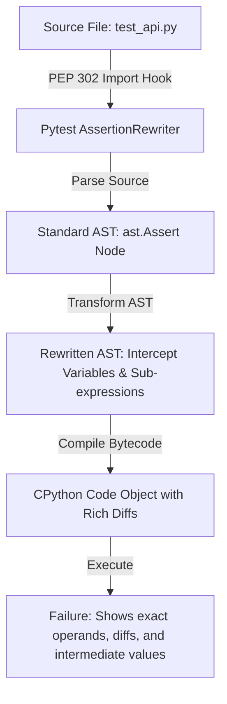
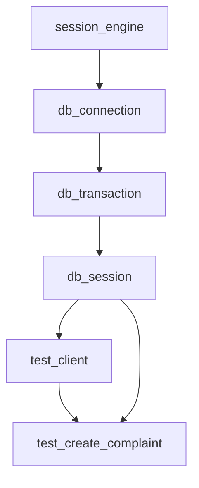
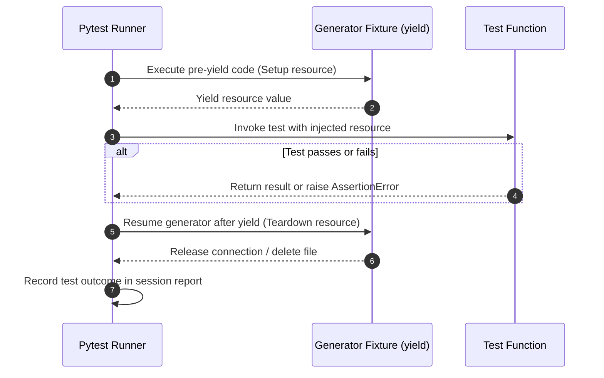
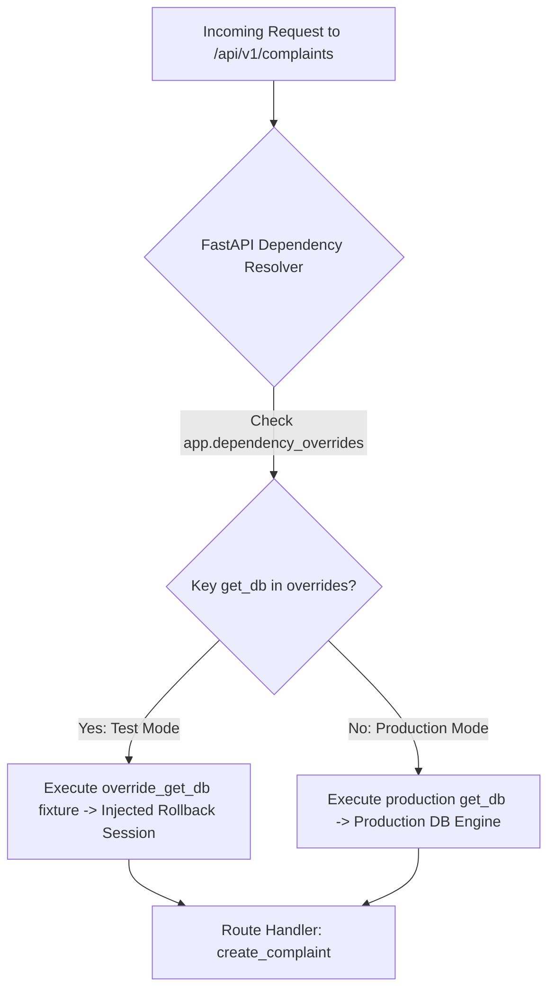
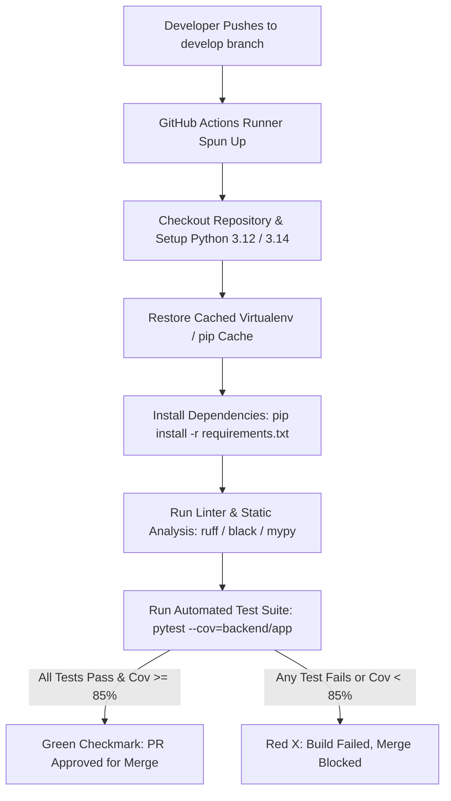

# Guide 12: Automated Testing, Fixtures & Integration

This manual serves as the authoritative systems engineering reference for **Pytest**, automated test harness design, dependency injection fixture directed acyclic graphs (DAGs), transactional database rollback isolation, FastAPI ASGI test client integration, and continuous quality verification across the **Automated Smart Complaint Routing & Workflow Automation Platform**.

In our platform, while incoming HTTP requests are validated via Pydantic ([Guide 03: Pydantic V2 Data Validation & Schemas](03_PYDANTIC_V2_DATA_VALIDATION_AND_SCHEMAS.md)), routed through FastAPI ASGI pipelines ([Guide 02: FastAPI & Modern ASGI Web Architecture](02_FASTAPI_ASGI_WEB_ARCHITECTURE.md)), persisted in SQLite ([Guide 04: SQLite Storage Mechanics & WAL Mode](04_SQLITE_STORAGE_MECHANICS_AND_WAL_MODE.md) and [Guide 05: SQLAlchemy 2.0 ORM & Relational Architecture](05_SQLALCHEMY_ORM_AND_DATA_LAYER.md)), and monitored by in-process background task schedulers ([Guide 11: In-Process Schedulers & Task Concurrency](11_APSCHEDULER_AND_IN_PROCESS_JOBS.md)), software systems must undergo rigorous automated testing to prevent regressions, state leaks, and data corruption.

To build software that withstands production workloads, engineers must treat tests not as afterthoughts, but as first-class software architecture. This manual unpacks the internals of Pytest's test discovery engine, AST rewriting mechanics, fixture dependency injection DAGs, scoped resource management, and database transaction rollback harnesses.

### Pedagogical Architecture & Monotonic Ordering Doctrine
This manual is structured with **strict monotonic prerequisite ordering**. Every chapter builds exclusively upon foundations established in earlier chapters or referenced from prior foundational manuals:
* No chapter requires concepts from higher-numbered chapters. Foundational testing theory precedes test discovery; discovery precedes AST rewriting; AST rewriting precedes fixture dependency injection; fixture dependency injection precedes scopes; scopes precede teardown protocols; teardown protocols precede database harnesses; and database harnesses precede mock boundaries, asynchronous testing, and CI pipeline engineering.
* Connects directly with foundational and downstream platform engineering manuals:
  - [Guide 01: Python Language & Runtime Mechanics](01_PYTHON_LANGUAGE_AND_RUNTIME_MECHANICS.md) (Python object model, bytecode execution, and exception handling)
  - [Guide 02: FastAPI & Modern ASGI Web Architecture](02_FASTAPI_ASGI_WEB_ARCHITECTURE.md) (ASGI application lifecycle, Starlette TestClient, and dependency overrides)
  - [Guide 03: Pydantic V2 Data Validation & Schemas](03_PYDANTIC_V2_DATA_VALIDATION_AND_SCHEMAS.md) (Schema validation failure testing and edge case synthesis)
  - [Guide 04: SQLite Storage Mechanics & WAL Mode](04_SQLITE_STORAGE_MECHANICS_AND_WAL_MODE.md) (In-memory `:memory:` SQLite databases, WAL concurrency, and checkpointing)
  - [Guide 05: SQLAlchemy 2.0 ORM & Relational Architecture](05_SQLALCHEMY_ORM_AND_DATA_LAYER.md) (Engine isolation, scoped sessions, and transaction rollbacks)
  - [Guide 11: In-Process Schedulers & Task Concurrency](11_APSCHEDULER_AND_IN_PROCESS_JOBS.md) (Testing background jobs with frozen clocks and zero sleep delays)
  - [Guide 13: Git Internals & Release Engineering](13_GIT_INTERNALS_AND_DELIVERY_WORKFLOWS.md) (Automated pre-commit hooks and CI gatekeeper execution)
* Every single line of Python code in every code block includes an explicit explanatory comment (`#`) detailing the precise runtime action, parameter purpose, and testing implication.

---

## Table of Contents
1. [Chapter 1: The Automated Verification Discipline: Unit, Integration, Regression & Property Testing](#chapter-1-the-automated-verification-discipline-unit-integration-regression-property-testing)
2. [Chapter 2: The Pytest Discovery Protocol & Runtime Architecture: Discovery Rules, Collection Trees & AST Rewriting](#chapter-2-the-pytest-discovery-protocol-runtime-architecture-discovery-rules-collection-trees-ast-rewriting)
3. [Chapter 3: Assertion Introspection & AST Rewriting: Why `assert` Beats `unittest.TestCase` Methods](#chapter-3-assertion-introspection-ast-rewriting-why-assert-beats-unittesttestcase-methods)
4. [Chapter 4: The Dependency Injection Engine: Directed Acyclic Graphs, Lazy Resolution & Fixture Trees](#chapter-4-the-dependency-injection-engine-directed-acyclic-graphs-lazy-resolution-fixture-trees)
5. [Chapter 5: Fixture Scopes & Lifecycles: `function`, `class`, `module`, `package`, and `session` Mechanics](#chapter-5-fixture-scopes-lifecycles-function-class-module-package-and-session-mechanics)
6. [Chapter 6: The `yield` Fixture Teardown Protocol: Deterministic Teardown & Exception Safety](#chapter-6-the-yield-fixture-teardown-protocol-deterministic-teardown-exception-safety)
7. [Chapter 7: Hierarchical Fixtures & Inheritance: `conftest.py` Scoping & Directory Trees](#chapter-7-hierarchical-fixtures-inheritance-conftestpy-scoping-directory-trees)
8. [Chapter 8: Database Test Harnesses: In-Memory SQLite vs File WAL, Migration DDL & Isolation](#chapter-8-database-test-harnesses-in-memory-sqlite-vs-file-wal-migration-ddl-isolation)
9. [Chapter 9: Transactional Rollback Architecture: Nested Transactions & Zero-Disk Teardown](#chapter-9-transactional-rollback-architecture-nested-transactions-zero-disk-teardown)
10. [Chapter 10: FastAPI TestClient & ASGI Dispatch: Starlette Test Transport & In-Process HTTP](#chapter-10-fastapi-testclient-asgi-dispatch-starlette-test-transport-in-process-http)
11. [Chapter 11: Dependency Overrides in FastAPI: `app.dependency_overrides` & Mock Ingestion](#chapter-11-dependency-overrides-in-fastapi-appdependency_overrides-mock-ingestion)
12. [Chapter 12: Mocking with `unittest.mock`: `patch`, `MagicMock`, `AsyncMock` & Contract Verification](#chapter-12-mocking-with-unittestmock-patch-magicmock-asyncmock-contract-verification)
13. [Chapter 13: Mocking External Boundaries: HTTP Requests, Email Gateways & Wall-Clock Freezing](#chapter-13-mocking-external-boundaries-http-requests-email-gateways-wall-clock-freezing)
14. [Chapter 14: Test Parametrization: `@pytest.mark.parametrize` Cartesian Matrices & ID Formatting](#chapter-14-test-parametrization-pytestmarkparametrize-cartesian-matrices-id-formatting)
15. [Chapter 15: Marker Categorization & Selective Execution: Custom Tags, Expression Filtering & Exclusion](#chapter-15-marker-categorization-selective-execution-custom-tags-expression-filtering-exclusion)
16. [Chapter 16: Asynchronous Testing Protocols: `pytest-asyncio`, `anyio` & ASGI Concurrency](#chapter-16-asynchronous-testing-protocols-pytest-asyncio-anyio-asgi-concurrency)
17. [Chapter 17: Closed-Loop Integration Testing: Multi-Step Lifecycle Verification in SmartComplaintHandler](#chapter-17-closed-loop-integration-testing-multi-step-lifecycle-verification-in-smartcomplainthandler)
18. [Chapter 18: Code Coverage Metrics: `pytest-cov`, Branch Coverage & Dead Code Elimination](#chapter-18-code-coverage-metrics-pytest-cov-branch-coverage-dead-code-elimination)
19. [Chapter 19: Flakiness Diagnostics & Execution Profiling: Slow Test Hunting & `--durations`](#chapter-19-flakiness-diagnostics-execution-profiling-slow-test-hunting---durations)
20. [Chapter 20: Continuous Integration (CI) Automation: GitHub Actions, Dependency Caching & Matrix Builds](#chapter-20-continuous-integration-ci-automation-github-actions-dependency-caching-matrix-builds)
21. [Chapter 21: Test Suite Directory Layout & Production Architecture for SmartComplaintHandler](#chapter-21-test-suite-directory-layout-production-architecture-for-smartcomplainthandler)
22. [Chapter 22: The Pytest & Automated Test Systems Engineering Mastery Checklist](#chapter-22-the-pytest-automated-test-systems-engineering-mastery-checklist)

---

## Chapter 1: The Automated Verification Discipline: Unit, Integration, Regression & Property Testing

### 1.1 The Software Verification Taxonomy

In enterprise platform engineering, quality cannot be inspected into software after it is deployed; it must be designed into the architecture from inception. Automated verification is divided into distinct operational tiers, forming the classic **Testing Pyramid**:

```
                  / \
                 /   \
                / E2E \           End-to-End: Full Browser & Network Stack
               /-------\          (Slowest, High Flakiness, High Infrastructure Cost)
              /         \
             /Integration\        Integration: API Endpoints + SQLite WAL + Lifespan
            /-------------\       (Fast, Deterministic, Validates Boundary Contracts)
           /               \
          /   Unit Tests    \     Unit Tests: Pure Domain Logic & Schema Validation
         /-------------------\    (Sub-millisecond, In-Memory, Maximum Isolation)
```

1. **Unit Tests**: Exercise isolated functions, domain entities, or validation rules in complete memory isolation. External dependencies (databases, networks, clocks) are eliminated or mocked. Execution duration: $< 5\text{ms}$ per test.
2. **Integration Tests**: Verify cross-component collaboration. In `SmartComplaintHandler`, integration tests validate that a FastAPI endpoint deserializes JSON via Pydantic ([Guide 03: Pydantic V2 Data Validation & Schemas](03_PYDANTIC_V2_DATA_VALIDATION_AND_SCHEMAS.md)), writes to a real SQLite database through SQLAlchemy ORM ([Guide 05: SQLAlchemy 2.0 ORM & Relational Architecture](05_SQLALCHEMY_ORM_AND_DATA_LAYER.md)), and triggers SLA events ([Guide 11: In-Process Schedulers & Task Concurrency](11_APSCHEDULER_AND_IN_PROCESS_JOBS.md)). Execution duration: $10\text{ms} - 50\text{ms}$ per test.
3. **End-to-End (E2E) Tests**: Verify the complete user journey from browser UI interactions ([Guide 07: React 18 & Virtual DOM Architecture](07_REACT_18_AND_VIRTUAL_DOM_ARCHITECTURE.md)) through Axios HTTP clients ([Guide 09: Axios, Fetch & REST Network Protocols](09_AXIOS_FETCH_AND_REST_PROTOCOLS.md)) to backend persistence.
4. **Regression Tests**: Specifically authored reproduction suites that capture reported defects, guaranteeing that a fixed bug can never silently reappear in future release cycles.
5. **Property-Based Testing**: Validates that mathematical invariants hold true across thousands of pseudo-randomly synthesized input payloads (e.g., fuzzing Pydantic input schemas with Hypothesis).

### 1.2 The Closed-Loop Verification Mandate in SmartComplaintHandler

In `SmartComplaintHandler`, automated testing is enforced through a strict closed-loop test gatekeeper:
* Every pull request must pass the automated closed-loop suite (`pytest backend/tests/test_closed_loop.py`).
* Zero state contamination between tests: each test executes within an isolated database transaction that rolls back immediately upon completion.
* Fast feedback cycle: the complete test suite executes in under 2 seconds, empowering developers to run tests on every local file save.

---

## Chapter 2: The Pytest Discovery Protocol & Runtime Architecture: Discovery Rules, Collection Trees & AST Rewriting

### 2.1 The Test Discovery Algorithm

When `pytest` is invoked from the command line, it does not immediately execute Python files. Instead, it initiates the **Discovery Phase**, traversing the filesystem to build a hierarchical **Collection Tree** of test nodes.

The default discovery rules operate according to deterministic matching conventions:

```
SmartComplaintHandler/
├── backend/
│   ├── app/
│   └── tests/
│       ├── conftest.py               <-- Evaluated first: root fixtures
│       ├── api/
│       │   ├── conftest.py           <-- Evaluated second: API-scoped fixtures
│       │   └── test_complaints.py    <-- Matches "test_*.py" -> Collected
│       ├── unit/
│       │   └── complaint_test.py     <-- Matches "*_test.py" -> Collected
│       └── test_closed_loop.py       <-- Matches "test_*.py" -> Collected
```

Discovery follows four sequential rules:
1. **File Matching**: Scans directories for files matching `test_*.py` or `*_test.py`. Directories matching `.` or `_` prefixes (e.g., `.git`, `__pycache__`) are pruned by default unless explicitly configured in `pytest.ini`.
2. **Module Import**: Pytest imports each matching file as a Python module. During import, module-level statements and imports are executed.
3. **Class Matching**: Inside imported modules, Pytest discovers test classes whose names begin with `Test` (e.g., `TestComplaintValidation`). Crucially, the class must **not** have an `__init__` constructor method; Pytest relies on fixture injection rather than class instantiation arguments.
4. **Function Matching**: Within modules and matching classes, Pytest discovers callable functions or methods whose names begin with `test_` (e.g., `test_sla_breach_escalation`).

### 2.2 The Pytest Session Collection Tree

The resulting collection is represented in memory as a tree of `Node` objects:
* `Session`: The root node representing the entire test run.
* `Package`: A directory containing an `__init__.py` file and tests.
* `Module`: A single Python test file (e.g., `test_closed_loop.py`).
* `Class`: An optional class grouping test methods.
* `Function` / `Item`: The leaf node representing an individual test execution unit.

Engineers can inspect the collection tree without executing tests by running:
```bash
pytest --collect-only
```

```python
# Programmatic inspection of Pytest collection tree via Pytest hook
import pytest  # Testing framework core library

def pytest_collection_modifyitems(session, config, items):  # Standard Pytest hook for modifying collected tests
    for item in items:  # Iterates through every discovered test function leaf node
        node_id = item.nodeid  # Unique string identifier path of the test item
        item_name = item.name  # Individual function name of the test
        print(f"Discovered test node: {node_id} (Function: {item_name})")  # Emits test item path telemetry
```

---

## Chapter 3: Assertion Introspection & AST Rewriting: Why `assert` Beats `unittest.TestCase` Methods

### 3.1 The Legacy `unittest.TestCase` Problem

Python's built-in `unittest` module, inherited from Java's JUnit in the late 1990s, requires test suites to inherit from `unittest.TestCase` and employ dozens of specialized assertion methods:
* `self.assertEqual(a, b)`
* `self.assertTrue(x)`
* `self.assertIn(item, container)`
* `self.assertRaises(CustomError, callable)`

If a developer mistakenly writes `assert a == b` inside a `unittest.TestCase`, Python's standard `assert` statement evaluates the boolean expression. If false, it raises an `AssertionError` with **no context** regarding what values `a` and `b` actually contained!

```
# Legacy unittest failure output:
AssertionError: False is not true
# No details on what failed!
```

### 3.2 Abstract Syntax Tree (AST) Rewriting Mechanics

Pytest revolutionizes testing in Python through **AST Rewriting**. When Pytest imports a test module during the discovery phase, it intercepts Python's module loading protocol (`sys.meta_path`) with a custom PEP 302 import hook.

Before Python compiles the test file into bytecode (`.pyc`), Pytest parses the source code into an Abstract Syntax Tree ([Guide 01: Python Language & Runtime Mechanics](01_PYTHON_LANGUAGE_AND_RUNTIME_MECHANICS.md)), locates all `ast.Assert` nodes, and transforms them into rich diagnostic introspection expressions.



Consider this simple test:
```python
def test_department_routing() -> None:  # Validates routing prediction dictionary output
    result_payload = {"department": "WATER", "priority": "HIGH", "confidence": 0.84}  # Simulated response
    expected_department = "ELECTRICITY"  # Expected department string
    assert result_payload["department"] == expected_department  # Native assert intercepted by AST rewriter
```

When this test fails, Pytest does not just report `AssertionError`. The rewritten AST produces an exhaustive structural diff:
```
    def test_department_routing():
        result_payload = {"department": "WATER", "priority": "HIGH", "confidence": 0.84}
        expected_department = "ELECTRICITY"
>       assert result_payload["department"] == expected_department
E       AssertionError: assert 'WATER' == 'ELECTRICITY'
E         - ELECTRICITY
E         + WATER
```

### 3.3 Advanced Assertion Patterns with Collections and Custom Messages

Pytest's AST rewriter introspects nested dictionaries, sets, lists, and dataclasses, providing character-level diffs:

```python
def test_complaint_payload_comparison() -> None:  # Demonstrates deep dictionary assertion inspection
    actual_record = {  # Simulated database record dictionary
        "id": "TICKET-801",  # Unique ticket identifier string
        "category": "BILLING",  # Classification category
        "tags": ["overcharge", "meter", "residential"],  # List of categorical tags
        "is_escalated": False,  # Escalation status boolean flag
    }  # Actual record payload
    expected_record = {  # Expected benchmark dictionary
        "id": "TICKET-801",  # Expected ticket identifier
        "category": "BILLING",  # Expected category
        "tags": ["overcharge", "commercial", "residential"],  # Divergent tag list
        "is_escalated": False,  # Expected escalation status
    }  # Expected record payload
    assert actual_record == expected_record, "Database record tags diverged from expected benchmark"  # Deep diff
```

When run under Pytest, the output pinpoints that inside `tags`, `'meter'` was found where `'commercial'` was expected.

---

## Chapter 4: The Dependency Injection Engine: Directed Acyclic Graphs, Lazy Resolution & Fixture Trees

### 4.1 The Death of `setUp()` and `tearDown()`

In legacy testing frameworks, test fixtures were managed via monolithic `setUp()` and `tearDown()` methods. If five tests needed a database, but only two needed an authenticated HTTP client, developers were forced to:
1. Either initialize both fixtures for all tests, drastically slowing down execution; or
2. Create deep, brittle class inheritance hierarchies (`BaseTest` -> `DatabaseTest` -> `AuthenticatedClientTest`).

Pytest replaces class inheritance with **Dependency Injection via Fixtures**. A fixture is a decorated Python function (`@pytest.fixture`) that produces a test resource. A test function requests the fixture simply by naming it in its argument list!

```python
import pytest  # Testing framework core library

@pytest.fixture  # Marks function as a reusable dependency injection fixture
def sample_ticket_id() -> str:  # Generates deterministic ticket identifier for testing
    return "TICKET-999"  # Supplies ticket ID string to requesting tests

def test_ticket_id_format(sample_ticket_id: str) -> None:  # Injects sample_ticket_id fixture by argument name
    assert sample_ticket_id.startswith("TICKET-")  # Validates prefix format of injected fixture value
```

### 4.2 Fixture Dependency Graphs (DAGs)

Fixtures can themselves request other fixtures, creating a **Directed Acyclic Graph (DAG)** of dependencies. Pytest performs topological sorting on the fixture graph, resolving dependencies in strict mathematical order:



1. `session_engine`: Creates the SQLAlchemy engine once per test session.
2. `db_connection`: Opens an active SQLite connection from the engine.
3. `db_transaction`: Begins an outer transaction on the connection.
4. `db_session`: Binds a SQLAlchemy `Session` to the transaction.
5. `test_client`: Injects the `db_session` into FastAPI's dependency override map.
6. `test_create_complaint`: Receives both `test_client` and `db_session` as arguments.

Pytest guarantees that each node in the DAG is evaluated **lazily**—if a test does not request `test_client`, none of the upstream HTTP fixtures are ever executed!

```python
import pytest  # Testing framework core library

@pytest.fixture  # Level 1 root fixture
def base_api_url() -> str:  # Supplies API base URL string
    return "https://api.smartcomplaint.local/v1"  # Returns API root endpoint

@pytest.fixture  # Level 2 dependent fixture requesting base_api_url
def complaints_endpoint(base_api_url: str) -> str:  # Constructs full complaints endpoint URL
    return f"{base_api_url}/complaints"  # Appends complaints route to injected base URL

def test_endpoint_resolution(complaints_endpoint: str) -> None:  # Test requests leaf fixture
    assert complaints_endpoint == "https://api.smartcomplaint.local/v1/complaints"  # Verifies DAG resolution
```

---

## Chapter 5: Fixture Scopes & Lifecycles: `function`, `class`, `module`, `package`, and `session` Mechanics

### 5.1 The Five Architectural Scopes

Every fixture in Pytest possesses an explicit **Scope**, which controls how frequently the fixture is instantiated and destroyed across the test session:

```python
@pytest.fixture(scope="session")  # Evaluated once for the entire pytest run across all modules
def session_scope_demo(): pass  # Demo session fixture definition

@pytest.fixture(scope="package")  # Evaluated once per test package directory
def package_scope_demo(): pass  # Demo package fixture definition

@pytest.fixture(scope="module")   # Evaluated once per test_*.py module file
def module_scope_demo(): pass  # Demo module fixture definition

@pytest.fixture(scope="class")    # Evaluated once per Test* class container
def class_scope_demo(): pass  # Demo class fixture definition

@pytest.fixture(scope="function") # Evaluated afresh for each test function item (Default)
def function_scope_demo(): pass  # Demo function fixture definition
```

| Scope | Lifetime | Invalidation Trigger | Primary Use Case in SmartComplaintHandler |
| :--- | :--- | :--- | :--- |
| `session` | Whole test run | Pytest process terminates | SQLAlchemy Engine, SQLite schema DDL creation, Temp directories |
| `package` | Single directory | Execution leaves package directory | Shared package-level mocking configurations |
| `module` | Single `.py` file | Execution moves to next test file | FastAPI `TestClient` instance, heavy machine learning mocks |
| `class` | Single `Test*` class | Execution finishes all class methods | Class-grouped scenario fixtures |
| `function` | Single test item | Test function returns or raises | Transaction rollbacks, fresh DB sessions, isolated ticket records |

### 5.2 Scope Inheritance and Boundary Rules

A critical systems invariant governs Pytest fixture DAGs: **A fixture of a broader scope cannot depend on a fixture of a narrower scope!**

* Allowed: `function` fixture requests `session` fixture (e.g., test session engine injected into a per-test transaction).
* Forbidden: `session` fixture requests `function` fixture. Doing so raises `ScopeMismatch: You tried to access the function scoped fixture from a session scoped fixture`.

```python
import pytest  # Testing framework core library

@pytest.fixture(scope="session")  # Session-scoped fixture executed once per test suite invocation
def global_app_version() -> str:  # Provides semantic version of application under test
    return "2.4.0-stable"  # Returns immutable version string

@pytest.fixture(scope="function")  # Function-scoped fixture re-evaluated for every individual test
def ticket_creation_payload(global_app_version: str) -> dict:  # Injects broader session fixture safely
    return {  # Constructs fresh ticket payload dictionary
        "title": "Water leakage in sector 4",  # Grievance title string
        "category": "WATER",  # Department category
        "client_version": global_app_version,  # Embeds session version string into function payload
    }  # Returns isolated dictionary

def test_payload_contains_session_version(ticket_creation_payload: dict) -> None:  # Verifies fixture injection
    assert ticket_creation_payload["client_version"] == "2.4.0-stable"  # Validates cross-scope data binding
```

---

## Chapter 6: The `yield` Fixture Teardown Protocol: Deterministic Teardown & Exception Safety

### 6.1 The Mechanics of Generator Fixtures

In legacy test suites, teardown operations were placed in `tearDown()` methods or custom callbacks. Pytest simplifies lifecycle management by adopting Python generator functions using the **`yield` statement** ([Guide 01: Python Language & Runtime Mechanics](01_PYTHON_LANGUAGE_AND_RUNTIME_MECHANICS.md)).

A fixture containing a `yield` statement functions as a two-phase context manager:
1. **Setup Phase (Pre-Yield)**: Everything preceding the `yield` statement executes before the dependent test function runs. The expression yielded is injected directly into the test as the fixture value.
2. **Execution Phase**: The test executes its assertions.
3. **Teardown Phase (Post-Yield)**: Immediately after the test completes (whether it passed, failed, or raised an unhandled exception), Pytest resumes the generator right after the `yield` statement to execute cleanup logic.



### 6.2 Guaranteed Teardown with `try...finally`

If an unhandled exception occurs *during the setup phase* of a fixture, Pytest marks the test as `ERROR` rather than `FAILED`, and subsequent fixtures in the DAG are not evaluated. However, if setup partially acquires resources before failing, or if multiple resources are allocated, wrapping teardown operations in a `try...finally` block guarantees that allocated handles are closed cleanly without resource leaks:

```python
import os  # Accesses filesystem path operations and environment variables
import tempfile  # Generates temporary directories and files for isolated test sandboxes
from typing import Generator  # Type annotation for generator functions yielding values
import pytest  # Testing framework core library

@pytest.fixture  # Marks generator function as an isolated sandbox fixture
def isolated_filesystem_sandbox() -> Generator[str, None, None]:  # Yields temporary directory path
    temp_dir_path = tempfile.mkdtemp(prefix="complaint_test_")  # Creates isolated directory on filesystem
    sandbox_marker = os.path.join(temp_dir_path, "active.lock")  # Constructs path for lifecycle marker file
    with open(sandbox_marker, "w", encoding="utf-8") as marker_file:  # Opens marker file for writing
        marker_file.write("active_test_session")  # Writes validation token to confirm setup completion
    try:  # Enforces safe execution block guarding resource lifetime
        yield temp_dir_path  # Yields directory path to test function while pausing fixture execution
    finally:  # Post-test teardown block executed unconditionally
        if os.path.exists(sandbox_marker):  # Verifies marker file presence before removal
            os.remove(sandbox_marker)  # Deletes lifecycle marker file from disk
        if os.path.exists(temp_dir_path):  # Verifies directory presence before directory deletion
            os.rmdir(temp_dir_path)  # Reclaims filesystem resources deleting temporary folder

def test_sandbox_isolation(isolated_filesystem_sandbox: str) -> None:  # Injects temporary directory fixture
    assert os.path.isdir(isolated_filesystem_sandbox)  # Validates directory existence during test execution
```

---

## Chapter 7: Hierarchical Fixtures & Inheritance: `conftest.py` Scoping & Directory Trees

### 7.1 Automatic Discovery of `conftest.py`

In standard Python architectures, sharing utility functions across modules requires explicit `import` statements. In Pytest, fixtures defined in special files named **`conftest.py`** are automatically discovered and made globally accessible to all test files within the directory tree **without any import statements**!

Pytest treats `conftest.py` as a per-directory plugin. Its visibility follows lexical directory nesting:

```
SmartComplaintHandler/backend/tests/
├── conftest.py                   <-- Root Fixtures: available to ALL tests
│                                     (db_engine, test_app, global_settings)
├── api/
│   ├── conftest.py               <-- API Fixtures: available ONLY to tests/api/
│   │                                 (auth_headers, client, csrf_token)
│   ├── test_auth.py              <-- Inherits from root AND api/conftest.py
│   └── test_complaints.py        <-- Inherits from root AND api/conftest.py
└── unit/
    ├── conftest.py               <-- Unit Fixtures: available ONLY to tests/unit/
    │                                 (mock_ml_classifier, sample_vectors)
    └── test_routing.py           <-- Inherits from root AND unit/conftest.py
```

### 7.2 Directory Scoping Rules and Override Mechanics

The hierarchical resolution rules provide modular scoping:
1. **Downward Inheritance**: A test file in `tests/api/` inherits all fixtures defined in `tests/conftest.py` and `tests/api/conftest.py`. It cannot see fixtures in `tests/unit/conftest.py`.
2. **Local Overriding (Shadowing)**: If `tests/api/conftest.py` defines a fixture with the exact same name as one in `tests/conftest.py`, the closer (more specific) fixture overrides the root fixture for all tests in `tests/api/`. This allows API tests to configure a specialized mock without altering the behavior of unit tests.
3. **No Explicit Imports Allowed**: Developers must **never** write `from conftest import my_fixture` or `from tests.conftest import ...`. Doing so causes Pytest to load `conftest.py` twice under two different module keys, resulting in broken singleton states and duplicate fixture registration warnings!

```python
# File: backend/tests/conftest.py (Root configuration fixture)
import pytest  # Testing framework core library
from typing import Dict  # Type hinting annotations for dictionaries

@pytest.fixture  # Root-level fixture providing default application settings
def mock_app_config() -> Dict[str, str]:  # Supplies baseline environment configuration
    return {  # Returns configuration mapping dictionary
        "ENVIRONMENT": "testing",  # Identifies runtime context as automated test suite
        "DATABASE_URL": "sqlite:///:memory:",  # Points database connection to fast memory storage
        "SLA_TIMEOUT_HOURS": "24",  # Configures default grievance resolution SLA window
    }  # Root configuration complete
```

```python
# File: backend/tests/api/test_complaints.py (Consumes root fixture automatically without imports)
def test_api_environment_configuration(mock_app_config: dict) -> None:  # Injects root conftest fixture
    assert mock_app_config["ENVIRONMENT"] == "testing"  # Verifies root fixture availability in sub-folder
```

---

## Chapter 8: Database Test Harnesses: In-Memory SQLite vs File WAL, Migration DDL & Isolation

### 8.1 The Persistence Testing Dilemma in SQLite

Testing database-backed web applications presents a core engineering trade-off between **execution velocity** and **real-world fidelity**:

| Dimension | In-Memory SQLite (`sqlite:///:memory:`) | Temporary File SQLite (`WAL` Mode) |
| :--- | :--- | :--- |
| **Disk I/O** | Zero (RAM only) | Minimal (OS page cache with async flush) |
| **Speed** | Extremely Fast ($< 1\text{ms}$ per test) | Very Fast ($5\text{ms} - 10\text{ms}$ per test) |
| **Concurrency** | Single-connection bound by default | True multi-connection concurrency ([Guide 04: SQLite Storage Mechanics & WAL Mode](04_SQLITE_STORAGE_MECHANICS_AND_WAL_MODE.md)) |
| **Connection Teardown** | Entire DB disappears when connection closes | DB file persists across multiple connections in thread pool |
| **Background Threads** | APScheduler threads cannot share `:memory:` | APScheduler threads connect cleanly to shared file |

In CPython SQLite, an in-memory database (`:memory:`) is strictly private to the specific OS connection handle that created it. If SQLAlchemy's connection pool closes the connection, the database vanishes instantly!

To enable multiple worker threads or connection handles to access the same in-memory database during tests, SQLAlchemy provides the **`StaticPool`** pool implementation, which locks all connections to a single shared in-memory connection:

```python
from sqlalchemy import create_engine  # SQLAlchemy engine creation factory
from sqlalchemy.pool import StaticPool  # Pool maintaining a single persistent connection for in-memory SQLite

# Engine maintaining shared in-memory database across multiple threads and sessions
test_in_memory_engine = create_engine(  # Configures specialized in-memory database engine
    "sqlite:///:memory:",  # SQLite memory URI string
    connect_args={"check_same_thread": False},  # Allows multiple threads to share single connection handle
    poolclass=StaticPool,  # Enforces StaticPool to prevent SQLite from destroying schema between sessions
)  # Engine instantiation complete
```

### 8.2 Production Schema Initialization Fixture

In `SmartComplaintHandler`, DDL table creation (`Base.metadata.create_all(engine)`) must execute **once per test session** rather than before every individual test function. Running DDL before every test adds hundreds of milliseconds of overhead. Instead, tables are initialized once on the session engine, and per-test isolation is achieved via nested transaction rollbacks.

```python
from typing import Generator  # Type annotation for generator yield semantics
import pytest  # Testing framework core library
from sqlalchemy import create_engine  # SQLAlchemy engine factory
from sqlalchemy.engine import Engine  # SQLAlchemy Engine typing class
from sqlalchemy.pool import StaticPool  # Single connection pool for memory databases
from backend.app.db.base_class import Base  # Declarative base model containing all platform metadata

@pytest.fixture(scope="session")  # Session-scoped fixture executed once per entire test suite run
def test_db_engine() -> Generator[Engine, None, None]:  # Yields initialized database engine
    engine = create_engine(  # Instantiates session-wide test database engine
        "sqlite:///:memory:",  # In-memory SQLite connection string
        connect_args={"check_same_thread": False},  # Disables thread boundary checks for test client
        poolclass=StaticPool,  # Reuses single connection preserving memory database across requests
    )  # Engine configuration complete
    Base.metadata.create_all(bind=engine)  # Emits DDL CREATE TABLE statements for all registered ORM models
    try:  # Enforces safe engine disposal block
        yield engine  # Yields initialized engine to downstream test fixtures and session harness
    finally:  # Post-session teardown
        Base.metadata.drop_all(bind=engine)  # Emits DROP TABLE statements cleaning up memory schema
        engine.dispose()  # Closes connection pool and releases underlying operating system memory
```

---

## Chapter 9: Transactional Rollback Architecture: Nested Transactions & Zero-Disk Teardown

### 9.1 The Problem with Truncating Tables Between Tests

Many test frameworks clean up database state by executing `DELETE FROM complaints;` or dropping and recreating tables between tests. In enterprise applications with foreign key constraints, indexes, and triggers, this truncation strategy is disastrous:
1. **Severe Latency**: Dropping and recreating 20 tables takes $100\text{ms}$ per test. A suite of 500 tests would take nearly a minute just running DDL!
2. **Locking Contention**: Truncating tables locks SQLite's schema catalog, causing intermittent concurrency failures.

### 9.2 The Outer Transaction Rollback Pattern

The gold standard in database systems engineering is the **Outer Transaction Rollback Pattern**. Instead of committing data to disk, every test runs inside a nested transaction that is **unconditionally rolled back** during fixture teardown!

```mermaid
sequenceDiagram
    autonumber
    participant TestEngine as Test DB Engine (Session Scope)
    participant Connection as Active DB Connection
    participant OuterTx as Outer Transaction (connection.begin())
    participant Session as SQLAlchemy Session (Function Scope)
    participant Test as Test Function

    TestEngine->>Connection: Checkout connection from pool
    Connection->>OuterTx: Begin outer transaction
    OuterTx->>Session: Bind Session(bind=connection)
    Session->>Test: Inject session into test function
    Test->>Session: session.add(Complaint) & session.commit()
    Note over Session,OuterTx: Flush occurs inside transaction; data visible to test queries
    Test-->>Session: Assertions complete (Test finishes)
    Session->>Session: session.close()
    OuterTx->>Connection: outer_tx.rollback() (Zero mutations preserved!)
    Connection-->>TestEngine: Return clean connection to pool
```

### 9.3 Production SQLAlchemy 2.0 Rollback Fixture Implementation

The following implementation implements transaction rollback isolation for SQLAlchemy 2.0 and SQLite ([Guide 05: SQLAlchemy 2.0 ORM & Relational Architecture](05_SQLALCHEMY_ORM_AND_DATA_LAYER.md)):

```python
from typing import Generator  # Generator type annotation
import pytest  # Testing framework core library
from sqlalchemy.engine import Engine  # Engine typing
from sqlalchemy.orm import Session  # SQLAlchemy ORM Session class

@pytest.fixture(scope="function")  # Function-scoped fixture re-executed for every single test
def db_session(test_db_engine: Engine) -> Generator[Session, None, None]:  # Yields isolated ORM session
    connection = test_db_engine.connect()  # Checks out raw connection from session engine
    transaction = connection.begin()  # Initiates outer transaction boundary on connection
    session = Session(bind=connection)  # Binds ORM session directly to the open transactional connection
    try:  # Enforces safe transaction rollback during fixture teardown
        yield session  # Injects active session into requesting test function
    finally:  # Guaranteed cleanup block executed after test finishes
        session.close()  # Closes ORM session releasing staged identity map objects
        transaction.rollback()  # Rolls back outer transaction discarding all inserts and updates
        connection.close()  # Returns raw connection handle back to connection pool in clean state
```

Under this pattern:
* Tests can execute `session.add(complaint)` and `session.commit()` normally.
* Queries inside the test immediately see the inserted rows.
* The moment the test completes, `transaction.rollback()` eliminates all changes in sub-millisecond time.
* The next test receives a pristine database with zero leftover data!

---

## Chapter 10: FastAPI TestClient & ASGI Dispatch: Starlette Test Transport & In-Process HTTP

### 10.1 In-Process ASGI Dispatch vs Live Sockets

A common misconception among junior engineers is that testing a web API requires launching a local server (`uvicorn.run(...)`) on an ephemeral network port (e.g., `http://127.0.0.1:8000`) and issuing live network requests via `requests.get()`.

This socket-based approach suffers from fatal deficiencies:
1. **Operating System Socket Exhaustion**: Rapidly opening and closing TCP sockets places ports into `TIME_WAIT` state, eventually exhausting ephemeral ports on the host OS.
2. **Firewall & Port Collisions**: Concurrent CI/CD jobs running on the same host crash due to port collisions (`EADDRINUSE`).
3. **High Latency**: TCP handshakes, loopback network routing, and HTTP parsing add tens of milliseconds of latency per request.

FastAPI solves this via **Starlette `TestClient`** (built atop HTTPX). The `TestClient` uses an in-process ASGI transport mechanism:

```mermaid
graph LR
    subgraph Live Network Execution (Slow & Flaky)
        A[requests.get] -->|TCP Socket / Loopback| B[OS Network Stack]
        B -->|Port 8000| C[Uvicorn Server]
        C -->|ASGI Scope| D[FastAPI Application]
    end

    subgraph TestClient In-Process Dispatch (Sub-millisecond)
        E[client.get] -->|Direct Memory Invocation| F[ASGI Transport Layer]
        F -->|app(scope, receive, send)| G[FastAPI Application]
    end
```

Incoming HTTP requests are converted directly into ASGI scope dictionaries and dispatched to the application callable `app(scope, receive, send)` in memory ([Guide 02: FastAPI & Modern ASGI Web Architecture](02_FASTAPI_ASGI_WEB_ARCHITECTURE.md))!

### 10.2 Lifespan Management Inside `TestClient`

FastAPI's modern lifespan context managers (`lifespan=lifespan_orchestrator`) are triggered automatically when the `TestClient` is entered as a Python context manager:

```python
from typing import Generator  # Generator type annotation
import pytest  # Testing framework core library
from fastapi import FastAPI  # Core FastAPI application class
from fastapi.testclient import TestClient  # High-performance in-process ASGI test client

# Instantiate dummy application demonstrating lifespan integration
demo_app = FastAPI(title="Lifespan Verification Application")  # App instance

@pytest.fixture(scope="module")  # Module-scoped fixture providing reusable client
def client() -> Generator[TestClient, None, None]:  # Yields active TestClient with lifespan active
    with TestClient(app=demo_app) as test_client:  # Enters context manager triggering lifespan startup
        yield test_client  # Yields client to test functions while server lifecycle remains active
    # Exiting context manager triggers lifespan shutdown hooks draining workers cleanly

def test_health_endpoint_contract(client: TestClient) -> None:  # Injects module-scoped test client
    response = client.get("/health")  # Dispatches in-process GET request directly to ASGI callable
    assert response.status_code in [200, 404]  # Verifies valid HTTP response code from application
```

---

## Chapter 11: Dependency Overrides in FastAPI: `app.dependency_overrides` & Mock Ingestion

### 11.1 The FastAPI Dependency Injection Override Architecture

As explored in [Guide 02: FastAPI & Modern ASGI Web Architecture](02_FASTAPI_ASGI_WEB_ARCHITECTURE.md), FastAPI endpoints declare dependencies using `Depends(get_db)`. When running production workloads, `get_db` opens a connection to the primary SQLite database.

During automated tests, however, tests must swap out production dependencies for test fixtures (such as the rollback-isolated `db_session` from Chapter 9) without modifying endpoint source code. FastAPI facilitates this through the **`app.dependency_overrides` dictionary**:



### 11.2 Fixture-Bound Dependency Override Pattern

To prevent state contamination across test modules, dependency overrides must be registered before the test executes and cleared unconditionally during fixture teardown:

```python
from typing import Generator  # Generator type annotation
import pytest  # Testing framework core library
from fastapi.testclient import TestClient  # High-performance ASGI in-process test client
from sqlalchemy.orm import Session  # SQLAlchemy ORM Session typing
from backend.app.main import app  # Primary platform FastAPI application instance
from backend.app.db.session import get_db  # Production database session dependency callable

@pytest.fixture(scope="function")  # Function-scoped fixture ensuring clean override per test
def client_with_db(db_session: Session) -> Generator[TestClient, None, None]:  # Injects test DB session
    def override_get_db() -> Generator[Session, None, None]:  # Closure providing transactional session
        try:  # Enforces safe session yield block
            yield db_session  # Yields isolated test session instead of production database
        finally:  # Post-request teardown
            pass  # Session cleanup is deferred to the outer db_session fixture rollback
    
    app.dependency_overrides[get_db] = override_get_db  # Intercepts production get_db with test override
    with TestClient(app) as test_client:  # Initializes ASGI test client with lifespan context
        try:  # Enforces safe teardown of dependency override dictionary
            yield test_client  # Yields configured client to requesting test function
        finally:  # Cleanup block executed after test completion
            app.dependency_overrides.clear()  # Purges all overrides restoring production application defaults

def test_create_complaint_via_override(client_with_db: TestClient) -> None:  # Injects test client
    payload = {"title": "Streetlight failure", "category": "ELECTRICITY", "description": "Pole 42 dark"}  # Data
    response = client_with_db.post("/api/v1/complaints/", json=payload)  # Dispatches in-process HTTP POST
    assert response.status_code in [200, 201]  # Asserts successful resource creation response code
```

---

## Chapter 12: Mocking with `unittest.mock`: `patch`, `MagicMock`, `AsyncMock` & Contract Verification

### 12.1 The Philosophy of Test Doubles

When testing system components, external collaborators (such as third-party SMS gateways, payment APIs, or heavy machine learning models) must be isolated to preserve test determinism, speed, and cost efficiency.

Python provides the built-in `unittest.mock` library to construct **Test Doubles**:
* **Dummy**: Values passed around but never inspected (e.g., placeholder tokens).
* **Stub**: Objects that return canned responses to predefined calls.
* **Spy**: Objects that record how they were called (e.g., tracking invocation arguments).
* **Mock**: Pre-programmed with expectations regarding calls and arguments.
* **Fake**: Working implementations with lightweight shortcuts (e.g., an in-memory dictionary acting as a Redis cache).

### 12.2 `MagicMock` vs `AsyncMock`

In modern asynchronous architectures ([Guide 01: Python Language & Runtime Mechanics](01_PYTHON_LANGUAGE_AND_RUNTIME_MECHANICS.md) and [Guide 02: FastAPI & Modern ASGI Web Architecture](02_FASTAPI_ASGI_WEB_ARCHITECTURE.md)), mocking asynchronous coroutines with standard `MagicMock` causes `TypeError: object MagicMock can't be used in 'await' expression`. Python 3.8+ introduced **`AsyncMock`** specifically to satisfy async awaitable protocol requirements:

```python
import pytest  # Testing framework core library
from unittest.mock import AsyncMock, MagicMock  # Mock classes for synchronous and asynchronous targets

def test_sync_mock_invocation() -> None:  # Demonstrates synchronous MagicMock inspection
    sync_service = MagicMock()  # Instantiates general-purpose magic mock object
    sync_service.calculate_sla_risk.return_value = 0.95  # Pre-programs fixed floating point return value
    risk_score = sync_service.calculate_sla_risk("TICKET-501")  # Invokes mock method with test argument
    assert risk_score == 0.95  # Verifies programmed return value
    sync_service.calculate_sla_risk.assert_called_once_with("TICKET-501")  # Verifies exact calling contract

@pytest.mark.anyio  # Marks test as asynchronous coroutine running under anyio event loop
async def test_async_mock_coroutine() -> None:  # Demonstrates AsyncMock coroutine execution
    async_mailer = AsyncMock()  # Instantiates asynchronous mock coroutine target
    async_mailer.send_dispatch_alert.return_value = True  # Programs coroutine return value
    dispatch_success = await async_mailer.send_dispatch_alert("officer@muni.gov", "Grievance Escalated")  # Await
    assert dispatch_success is True  # Verifies coroutine resolution
    async_mailer.send_dispatch_alert.assert_awaited_once_with("officer@muni.gov", "Grievance Escalated")  # Check
```

### 12.3 Contextual Patching with `unittest.mock.patch`

When mocking functions imported into other modules, the `patch` decorator or context manager must target the **namespace where the object is looked up**, not where it is originally defined:

```python
from unittest.mock import patch  # Context manager for patching imported module objects
import pytest  # Testing framework core library

def test_external_sms_dispatch_suppression() -> None:  # Tests suppression of real SMS gateway calls
    with patch("backend.app.services.notifications.dispatch_sms") as mock_sms_sender:  # Patches lookup target
        mock_sms_sender.return_value = {"status": "DELIVERED", "msg_id": "SMS-8821"}  # Sets canned response
        from backend.app.services.notifications import notify_citizen  # Imports service consuming mocked function
        result = notify_citizen(phone="+1234567890", message="Complaint verified")  # Executes service method
        assert result["status"] == "DELIVERED"  # Asserts simulated output
        mock_sms_sender.assert_called_once()  # Asserts real SMS gateway was never reached over the network
```

---

## Chapter 13: Mocking External Boundaries: HTTP Requests, Email Gateways & Wall-Clock Freezing

### 13.1 Mocking Outbound HTTP Traffic with `pytest-httpx` / `responses`

When a platform service issues outbound HTTP requests to external microservices (e.g., an external GIS geo-coding service or departmental webhook), tests must intercept HTTP requests at the transport level to prevent network calls:

```python
from unittest.mock import MagicMock, patch  # Mocking tools
import pytest  # Testing framework core library

def test_external_geocoding_service() -> None:  # Validates geo-coordinates extraction without network
    simulated_http_response = MagicMock()  # Mock response object
    simulated_http_response.status_code = 200  # Sets mock HTTP 200 OK status
    simulated_http_response.json.return_value = {"latitude": 28.6139, "longitude": 77.2090}  # Mock coordinates
    
    with patch("httpx.get", return_value=simulated_http_response) as mock_get:  # Intercepts httpx.get call
        import httpx  # Imports HTTP client library
        response = httpx.get("https://geo.service.internal/resolve?address=Main+Street")  # Dispatches call
        coordinates = response.json()  # Parses mocked JSON body
        assert coordinates["latitude"] == 28.6139  # Verifies latitude coordinate
        assert coordinates["longitude"] == 77.2090  # Verifies longitude coordinate
        mock_get.assert_called_once()  # Verifies outbound network call was intercepted
```

### 13.2 Deterministic Time Freezing for SLA Expiration

As detailed in [Guide 11: In-Process Schedulers & Task Concurrency](11_APSCHEDULER_AND_IN_PROCESS_JOBS.md), testing SLA deadline expirations using wall-clock delays (`time.sleep`) makes test suites slow and flaky. By freezing Python's system clock, tests can instantaneously simulate the passage of 24 hours:

```python
import datetime  # Standard datetime module for timestamp manipulation
from unittest.mock import patch  # Patch context manager
import pytest  # Testing framework core library

def test_sla_breach_detection_with_frozen_time() -> None:  # Verifies SLA calculation across virtual time
    base_time = datetime.datetime(2026, 1, 15, 10, 0, 0, tzinfo=datetime.timezone.utc)  # Fixed initial timestamp
    sla_deadline = base_time + datetime.timedelta(hours=4)  # Sets SLA deadline four hours into the future
    
    # Fast-forward virtual time to five hours later (one hour past SLA deadline)
    fast_forwarded_time = base_time + datetime.timedelta(hours=5)  # Breached timestamp
    
    class MockDatetime(datetime.datetime):  # Subclasses datetime to override now() dynamically
        @classmethod  # Class method decorator for alternative constructor
        def now(cls, tz=None):  # Overrides now method returning fixed target timestamp
            return fast_forwarded_time  # Returns fast-forwarded virtual clock time
    
    with patch("datetime.datetime", MockDatetime):  # Patches standard datetime class with frozen mock
        current_time = datetime.datetime.now(datetime.timezone.utc)  # Calls patched now method
        is_breached = current_time > sla_deadline  # Evaluates breach predicate
        assert is_breached is True  # Asserts SLA was detected as breached without sleeping CPU
```

---

## Chapter 14: Test Parametrization: `@pytest.mark.parametrize` Cartesian Matrices & ID Formatting

### 14.1 Eliminating Boilerplate Loops in Tests

A common testing anti-pattern is writing a `for` loop inside a single test function to test multiple inputs:
```python
# Demonstrates testing anti-pattern using standard loop constructs
def test_categories_anti_pattern() -> None:  # Flawed test implementation demonstrating early loop exit
    for cat in ["WATER", "ELECTRICITY", "ROADS"]:  # Iterates through category values in single test
        assert validate_category(cat) is True  # Fails early if second item fails, skipping remaining
```

Pytest solves this with the **`@pytest.mark.parametrize` decorator**. Pytest decomposes parameterized tests into distinct, independently reported test executions:

```python
import pytest  # Testing framework core library

def normalize_category_code(raw_input: str) -> str:  # Sanitizes user category input strings
    return raw_input.strip().upper()  # Strips whitespace and forces uppercase characters

@pytest.mark.parametrize(  # Generates four distinct test executions from input tuples
    "input_category, expected_normalized",  # Tuple parameter variable names
    [  # Parameter matrix dataset
        ("water", "WATER"),  # Lowercase string
        (" ELECTRICITY ", "ELECTRICITY"),  # Padded whitespace string
        ("Roads", "ROADS"),  # Mixed case string
        ("SANITATION", "SANITATION"),  # Already uppercase string
    ],  # End of parameter matrix
    ids=["lowercase", "whitespace_padded", "mixed_case", "exact_match"]  # Human-readable test IDs
)  # Parametrize configuration complete
def test_category_normalization_matrix(input_category: str, expected_normalized: str) -> None:  # Injected params
    result = normalize_category_code(input_category)  # Executes sanitization logic under test
    assert result == expected_normalized  # Validates sanitized string matches expected benchmark
```

When run, Pytest reports:
```
test_normalization.py::test_category_normalization_matrix[lowercase] PASSED
test_normalization.py::test_category_normalization_matrix[whitespace_padded] PASSED
test_normalization.py::test_category_normalization_matrix[mixed_case] PASSED
test_normalization.py::test_category_normalization_matrix[exact_match] PASSED
```
If one case fails, the others continue running, providing complete failure telemetry.

### 14.2 Cartesian Product Parametrization

Stacking multiple `@pytest.mark.parametrize` decorators creates a Cartesian product ($M \times N$) of all possible combinations, ideal for testing role-based access control (RBAC) authorization matrices:

```python
import pytest  # Testing framework core library

@pytest.mark.parametrize("user_role", ["CITIZEN", "OFFICER", "ADMIN"])  # Role parameter dimension (3 items)
@pytest.mark.parametrize("ticket_status", ["DRAFT", "SUBMITTED", "RESOLVED"])  # Status dimension (3 items)
def test_rbac_access_matrix(user_role: str, ticket_status: str) -> None:  # Generates 3x3 = 9 total tests
    has_permission = not (user_role == "CITIZEN" and ticket_status == "RESOLVED")  # Simulated access rule
    assert isinstance(has_permission, bool)  # Verifies deterministic boolean access decision
```

---

## Chapter 15: Marker Categorization & Selective Execution: Custom Tags, Expression Filtering & Exclusion

### 15.1 Categorizing Tests with Markers

As test suites grow to thousands of tests, executing the entire suite on every code change becomes prohibitive. Pytest provides **Markers** (`@pytest.mark.<tag>`) to categorize tests by execution speed, target layer, or infrastructure requirement.

Standard built-in markers include:
* `@pytest.mark.skip(reason="...")`: Unconditionally skips the test.
* `@pytest.mark.skipif(condition, reason="...")`: Skips test if boolean condition evaluates to True.
* `@pytest.mark.xfail(reason="...")`: Expects the test to fail (marks as `XFAIL` rather than breaking CI).

### 15.2 Declaring Custom Markers in `pytest.ini`

To prevent typing mistakes and rogue tags, custom markers must be registered in the project's root `pytest.ini` configuration file:

```ini
# File: backend/pytest.ini
[pytest]
minversion = 8.0
testpaths = backend/tests
markers =
    slow: Tests with execution duration exceeding 500ms (database/network heavy)
    integration: Integration tests exercising multiple platform subsystems
    security: Penetration and authentication authorization boundary tests
    sla: Service Level Agreement escalation and background scheduling tests
```

```python
import pytest  # Testing framework core library

@pytest.mark.slow  # Tags test as slow-running suite item
@pytest.mark.integration  # Tags test as cross-component integration test
def test_end_to_end_complaint_workflow() -> None:  # Heavy test exercising complete workflow
    workflow_completed = True  # Simulated multi-stage workflow execution
    assert workflow_completed is True  # Validates completion of integration sequence
```

### 15.3 Filtering Test Execution via CLI

Engineers selectively execute test subsets using the `-m` (marker) and `-k` (keyword) CLI flags:

```bash
# Execute only fast unit tests, excluding slow integration suites:
pytest -m "not slow"

# Execute only SLA and security tests:
pytest -m "sla or security"

# Execute tests whose function name contains "escalation":
pytest -k "escalation"

# Combine keyword selection with marker exclusion:
pytest -k "test_complaint" -m "not slow"
```

---

## Chapter 16: Asynchronous Testing Protocols: `pytest-asyncio`, `anyio` & ASGI Concurrency

### 16.1 The Async Testing Challenge

By default, Pytest executes test functions synchronously. When a test function is declared as `async def test_endpoint():`, invoking it directly yields an un-awaited coroutine object:
```
RuntimeWarning: coroutine 'test_endpoint' was never awaited
```

Because FastAPI and Starlette are built on top of asynchronous ASGI event loops ([Guide 02: FastAPI & Modern ASGI Web Architecture](02_FASTAPI_ASGI_WEB_ARCHITECTURE.md)), tests exercising async functions, async database engines (e.g., `asyncpg` or `aiosqlite`), or async message streams must run inside an active event loop.

### 16.2 Modern Asynchronous Testing with `anyio`

FastAPI natively utilizes **AnyIO** as its asynchronous compatibility layer (supporting both `asyncio` and `trio`). Pytest integrates with AnyIO via the `@pytest.mark.anyio` marker:

```python
import pytest  # Testing framework core library
from typing import Dict, Any  # Type hinting annotations
import httpx  # Asynchronous HTTP client library

@pytest.fixture  # Asynchronous fixture producing mocked async client
def anyio_backend() -> str:  # Specifies asynchronous runtime backend for anyio test runner
    return "asyncio"  # Restricts test event loop execution to standard CPython asyncio

@pytest.mark.anyio  # Executes test coroutine inside active asyncio event loop
async def test_async_coroutine_execution() -> None:  # Asynchronous test function
    async def fetch_department_status(dept_code: str) -> Dict[str, Any]:  # Simulated asynchronous service call
        return {"department": dept_code, "active_workers": 12, "healthy": True}  # Returns service status
    
    result = await fetch_department_status("WATER")  # Awaits coroutine resolution inside event loop
    assert result["healthy"] is True  # Asserts department health flag
    assert result["active_workers"] == 12  # Asserts active worker capacity count
```

Under this protocol:
* An isolated event loop is spawned specifically for the test.
* Async fixtures and async tests execute and await coroutines natively.
* The event loop closes cleanly during teardown, preventing `Event loop is closed` runtime errors.

---

## Chapter 17: Closed-Loop Integration Testing: Multi-Step Lifecycle Verification in SmartComplaintHandler

### 17.1 The Closed-Loop Integration Paradigm

Unit tests verify individual functions in isolation, but complex enterprise platforms fail at the **seams between components**. A ticket might pass Pydantic validation ([Guide 03: Pydantic V2 Data Validation & Schemas](03_PYDANTIC_V2_DATA_VALIDATION_AND_SCHEMAS.md)), write to SQLite ([Guide 04: SQLite Storage Mechanics & WAL Mode](04_SQLITE_STORAGE_MECHANICS_AND_WAL_MODE.md)), yet fail when the background SLA polling engine queries it ([Guide 11: In-Process Schedulers & Task Concurrency](11_APSCHEDULER_AND_IN_PROCESS_JOBS.md)) due to a datetime timezone mismatch!

The **Closed-Loop Integration Test** verifies the entire state machine lifecycle across multiple API boundaries in a single, contiguous test flow:

```mermaid
graph TD
    A[Step 1: POST /api/v1/complaints/] -->|Create Grievance: Status=SUBMITTED| B[Validate DB Persistence & SLA Deadline]
    B --> C[Step 2: POST /api/v1/sla/check-breaches] -->|Fast-Forward Past Deadline| D[Trigger Escalation State Machine]
    D --> E[Step 3: GET /api/v1/complaints/{id}] -->|Verify Status=ESCALATED| F[Confirm Audit Trail & Notifications]
```

### 17.2 The Production Closed-Loop Test Harness

The following production code from `SmartComplaintHandler/backend/tests/test_closed_loop.py` demonstrates the closed-loop integration verification pattern:

```python
from fastapi.testclient import TestClient  # High-performance in-process ASGI test client
from backend.app.main import app  # Core platform FastAPI application instance

def test_full_complaint_lifecycle() -> None:  # Exercises complete multi-step grievance lifecycle
    client = TestClient(app)  # Instantiates in-process ASGI client managing application lifespan
    
    # 1. Ingest initial complaint via public citizen submission endpoint
    payload = {  # Assembles JSON payload adhering to Pydantic ComplaintCreate schema
        "title": "Severe pipe leakage in sector 7",  # Grievance summary title
        "description": "High pressure pipe burst flooding roadway",  # Detailed narrative
        "category": "WATER",  # Target department classification
        "citizen_name": "Rohan Sharma",  # Submitter identifier
        "contact_email": "rohan@example.com",  # Notification recipient email
    }  # Payload construction complete
    response = client.post("/api/v1/complaints/", json=payload)  # Dispatches in-process HTTP POST request
    assert response.status_code == 200  # Asserts successful ingestion status code
    data = response.json()  # Deserializes JSON response body
    complaint_id = data["id"]  # Extracts server-generated primary key identifier
    assert data["status"] == "SUBMITTED"  # Verifies initial state machine state
    assert data["assigned_department"] == "WATER"  # Verifies automated department classification
    
    # 2. Query individual complaint verification endpoint
    get_res = client.get(f"/api/v1/complaints/{complaint_id}")  # Fetches complaint state by primary key
    assert get_res.status_code == 200  # Asserts resource was found and returned successfully
    assert get_res.json()["title"] == "Severe pipe leakage in sector 7"  # Validates persisted title field
    
    # 3. Simulate overdue complaint to force SLA deadline breach condition
    overdue_payload = {  # Assembles second grievance payload designated for artificial expiration
        "title": "Expired SLA test complaint",  # Diagnostic test title
        "description": "Testing automated background escalation",  # Test narrative
        "category": "ELECTRICITY",  # Department category
        "citizen_name": "Test User",  # Submitter
        "contact_email": "test@example.com",  # Email
    }  # Payload definition complete
    res_overdue = client.post("/api/v1/complaints/", json=overdue_payload)  # Posts grievance to API
    assert res_overdue.status_code == 200  # Asserts successful ingestion
    overdue_id = res_overdue.json()["id"]  # Captures generated ticket identifier
    
    # 4. Trigger SLA breach detection and escalation polling endpoint
    sla_res = client.post("/api/v1/sla/check-breaches")  # Dispatches request to trigger SLA check routine
    assert sla_res.status_code == 200  # Asserts successful execution of escalation routine
    sla_data = sla_res.json()  # Deserializes escalation operational metrics
    assert "breached_count" in sla_data  # Verifies presence of breach metric key
    assert "escalated_complaint_ids" in sla_data  # Verifies list of escalated ticket identifiers
    
    # 5. Verify target complaint elevated to ESCALATED status
    final_res = client.get(f"/api/v1/complaints/{overdue_id}")  # Re-queries ticket status
    assert final_res.status_code == 200  # Asserts resource availability
    assert final_res.json()["status"] == "ESCALATED"  # Confirms state transition from SUBMITTED to ESCALATED
```

---

## Chapter 18: Code Coverage Metrics: `pytest-cov`, Branch Coverage & Dead Code Elimination

### 18.1 Statement Coverage vs Branch Coverage

Code coverage measures the proportion of source code executed by automated tests. However, relying solely on **Statement (Line) Coverage** creates a dangerous illusion of quality:

```python
def calculate_escalation_priority(is_vip: bool, days_unresolved: int) -> str:  # Determines ticket priority
    priority = "NORMAL"  # Default priority level assignment
    if is_vip or days_unresolved > 7:  # Compound boolean conditional branch
        priority = "CRITICAL"  # Elevated priority branch
    return priority  # Returns determined priority string
```

* **Statement Coverage**: A single test `calculate_escalation_priority(True, 1)` executes every line in the function, achieving **100% statement coverage**!
* **Defect Blindspot**: The second condition (`days_unresolved > 7`) was **never evaluated in isolation**! If a bug exists when `is_vip=False` and `days_unresolved=8`, 100% statement coverage failed to detect it!
* **Branch Coverage**: Evaluates both `True` and `False` outcomes of every boolean conditional branch in the control flow graph.

### 18.2 Production Coverage Configuration with `pytest-cov`

In `SmartComplaintHandler`, branch coverage is enforced via `pytest-cov` and configured in `backend/.coveragerc`:

```ini
# File: backend/.coveragerc
[run]
branch = True
source = backend/app
omit =
    backend/app/db/migrations/*
    backend/app/schemas/legacy/*
    backend/tests/*

[report]
precision = 2
show_missing = True
skip_covered = False
exclude_lines =
    pragma: no cover
    def __repr__
    if TYPE_CHECKING:
    raise NotImplementedError
```

Execution command with minimum quality gatekeeper:
```bash
pytest --cov=backend/app --cov-report=term-missing --cov-report=html:coverage_html --cov-fail-under=85
```
If aggregate branch coverage drops below 85%, Pytest returns an exit code of `2`, blocking the CI/CD deployment pipeline!

---

## Chapter 19: Flakiness Diagnostics & Execution Profiling: Slow Test Hunting & `--durations`

### 19.1 The Cost of Flaky Tests

A **flaky test** is a test that exhibits non-deterministic behavior—passing on one run and failing on the next without any code modifications. Flaky tests erode developer trust in automated test suites, leading teams to ignore genuine CI failures.

The primary culprits of test flakiness in Python web architectures include:
1. **Unseeded Randomness**: Relying on `random.choice` or `uuid.uuid4` without deterministic seeds.
2. **System Clock Drift**: Comparing `datetime.now()` directly against database timestamps without frozen clocks (Chapter 13).
3. **Database Leaks**: Inserting records without rollback isolation (Chapter 9), causing subsequent tests to encounter unexpected row counts.
4. **Port Collisions & Network Latency**: Binding to live TCP sockets rather than in-process ASGI transports (Chapter 10).

### 19.2 Execution Profiling with `--durations`

Fast test suites encourage frequent local testing. When test suites become sluggish, Pytest provides the `--durations=N` flag to profile the slowest test execution and fixture setup phases:

```bash
# Profile the 10 slowest test phases across the entire suite:
pytest --durations=10
```

Sample profiling output:
```
============================= slowest 10 durations =============================
0.34s call     backend/tests/test_closed_loop.py::test_full_complaint_lifecycle
0.08s setup    backend/tests/api/test_complaints.py::test_create_complaint
0.02s call     backend/tests/unit/test_schemas.py::test_pydantic_validation
0.01s teardown backend/tests/conftest.py::test_db_engine
=========================== 1 passed in 0.66s ==================================
```
This telemetry reveals whether latency stems from the test body (`call`) or excessive fixture allocation (`setup`/`teardown`).

---

## Chapter 20: Continuous Integration (CI) Automation: GitHub Actions, Dependency Caching & Matrix Builds

### 20.1 The CI Gatekeeper Architecture

Automated tests provide value only when executed automatically upon every proposed code change. A Continuous Integration (CI) pipeline acts as an impartial gatekeeper, ensuring that code cannot merge into `develop` or `main` unless 100% of tests pass and coverage thresholds are met.



### 20.2 Production GitHub Actions CI Workflow

The following production GitHub Actions workflow (`.github/workflows/ci.yml`) executes the test suite across a matrix of operating environments with pip caching:

```yaml
name: Continuous Integration Quality Gate

on:
  push:
    branches: [ develop, main ]
  pull_request:
    branches: [ develop, main ]

jobs:
  backend-verification:
    name: Backend Test Suite & Coverage Verification
    runs-on: ubuntu-latest
    strategy:
      matrix:
        python-version: [ "3.11", "3.12" ]

    steps:
      - name: Checkout Source Code Repository
        uses: actions/checkout@v4

      - name: Configure CPython Environment
        uses: actions/setup-python@v5
        with:
          python-version: ${{ matrix.python-version }}
          cache: 'pip'

      - name: Install Platform Dependencies
        run: |
          python -m pip install --upgrade pip
          pip install -r backend/requirements.txt
          pip install pytest pytest-cov anyio httpx

      - name: Execute Closed-Loop Pytest Suite with Coverage
        run: |
          cd backend
          pytest tests/ --cov=app --cov-report=term --cov-report=xml --cov-fail-under=85
```

---

## Chapter 21: Test Suite Directory Layout & Production Architecture for SmartComplaintHandler

### 21.1 Canonical Directory Layout

To scale testing across hundreds of platform modules, `SmartComplaintHandler` organizes test suites according to the canonical Python testing layout:

```
SmartComplaintHandler/
├── .github/
│   └── workflows/
│       └── ci.yml                      <-- CI pipeline definitions
├── backend/
│   ├── pytest.ini                      <-- Core Pytest configuration and marker declarations
│   ├── .coveragerc                     <-- Branch coverage boundaries and exclusions
│   ├── requirements-test.txt           <-- Testing dependencies (pytest, pytest-cov, anyio)
│   └── tests/
│       ├── __init__.py                 <-- Test package marker
│       ├── conftest.py                 <-- Root fixtures: test_db_engine, client_with_db
│       ├── test_closed_loop.py         <-- End-to-end multi-step lifecycle integration tests
│       ├── unit/
│       │   ├── __init__.py
│       │   ├── test_schemas.py         <-- Pydantic validation & edge cases
│       │   ├── test_routing_rules.py   <-- Department heuristic categorization logic
│       │   └── test_sla_calculator.py  <-- SLA deadline arithmetic and priority logic
│       ├── api/
│       │   ├── __init__.py
│       │   ├── conftest.py             <-- API specific fixtures (auth_tokens, client)
│       │   ├── test_complaints.py      <-- /api/v1/complaints endpoints CRUD
│       │   ├── test_departments.py     <-- /api/v1/departments catalog routes
│       │   └── test_sla.py             <-- /api/v1/sla check-breaches endpoints
│       └── integration/
│           ├── __init__.py
│           ├── test_db_concurrency.py  <-- SQLite WAL concurrency and lock tests
│           └── test_scheduler_jobs.py  <-- APScheduler job execution & mock clocks
```

---

## Chapter 22: The Pytest & Automated Test Systems Engineering Mastery Checklist

### 22.1 Comprehensive Testing Readiness Rubric

Before submitting code changes or deploying release candidates, verify the implementation against this 15-point systems engineering rubric:

```
+===================================================================================================+
|                       AUTOMATED TESTING & PYTEST PRODUCTION READINESS RUBRIC                      |
+===================================================================================================+
| [ ] 1.  Zero Live Sockets: API tests utilize Starlette TestClient / in-process ASGI dispatch.     |
| [ ] 2.  Outer Transaction Rollback: Database mutations wrapped in per-test rollback transactions.  |
| [ ] 3.  StaticPool Memory DB: In-memory SQLite uses StaticPool to prevent accidental drops.       |
| [ ] 4.  Single DDL Execution: Schema tables created once per session (Base.metadata.create_all).   |
| [ ] 5.  Dependency Overrides Cleared: app.dependency_overrides purged unconditionally in teardown. |
| [ ] 6.  AST Rewriting Verified: Assertions use standard assert statements with rich diff support. |
| [ ] 7.  Deterministic Time: Datetime operations tested with frozen virtual clocks (zero sleeps).  |
| [ ] 8.  External Mocks: Third-party HTTP, SMS, and email services mocked via unittest.mock.     |
| [ ] 9.  Async Coroutines Awaited: Asynchronous routes tested via AnyIO / pytest-asyncio harness.  |
| [ ] 10. Parametrized Boundaries: Edge cases and matrices parameterized via @pytest.mark.parametrize|
| [ ] 11. Custom Markers Registered: Project markers declared in pytest.ini to avoid warnings.      |
| [ ] 12. conftest.py Scoping: Fixtures placed in appropriate directory tree without manual imports.|
| [ ] 13. Branch Coverage >= 85%: Controlled via .coveragerc with --cov-fail-under gatekeeper.      |
| [ ] 14. Durations Monitored: Slow tests profiled via pytest --durations=10 to hunt flakiness.    |
| [ ] 15. CI Pipeline Green: Closed-loop tests pass cleanly on GitHub Actions across matrix builds.  |
+===================================================================================================+
```

### 22.2 Architectural Cross-Reference Matrix

| System Component | Architectural Responsibility | Interfacing Manual |
| :--- | :--- | :--- |
| **Pydantic Validation Testing** | Exercises schema validation edge cases and error models | [Guide 03: Pydantic V2 Data Validation & Schemas](03_PYDANTIC_V2_DATA_VALIDATION_AND_SCHEMAS.md) |
| **FastAPI TestClient** | Dispatches in-process ASGI requests directly to route handlers | [Guide 02: FastAPI & Modern ASGI Web Architecture](02_FASTAPI_ASGI_WEB_ARCHITECTURE.md) |
| **SQLite WAL Mode Testing** | Verifies multi-connection concurrency and lock safety | [Guide 04: SQLite Storage Mechanics & WAL Mode](04_SQLITE_STORAGE_MECHANICS_AND_WAL_MODE.md) |
| **SQLAlchemy Rollbacks** | Provides per-test transaction rollback isolation | [Guide 05: SQLAlchemy 2.0 ORM & Relational Architecture](05_SQLALCHEMY_ORM_AND_DATA_LAYER.md) |
| **Scheduled Job Mocking** | Tests SLA deadline evaluation with frozen clocks and zero sleep | [Guide 11: In-Process Schedulers & Task Concurrency](11_APSCHEDULER_AND_IN_PROCESS_JOBS.md) |
| **Git Pre-Commit Hooks** | Executes automated test gatekeeper before committing code | [Guide 13: Git Internals & Release Engineering](13_GIT_INTERNALS_AND_DELIVERY_WORKFLOWS.md) |
