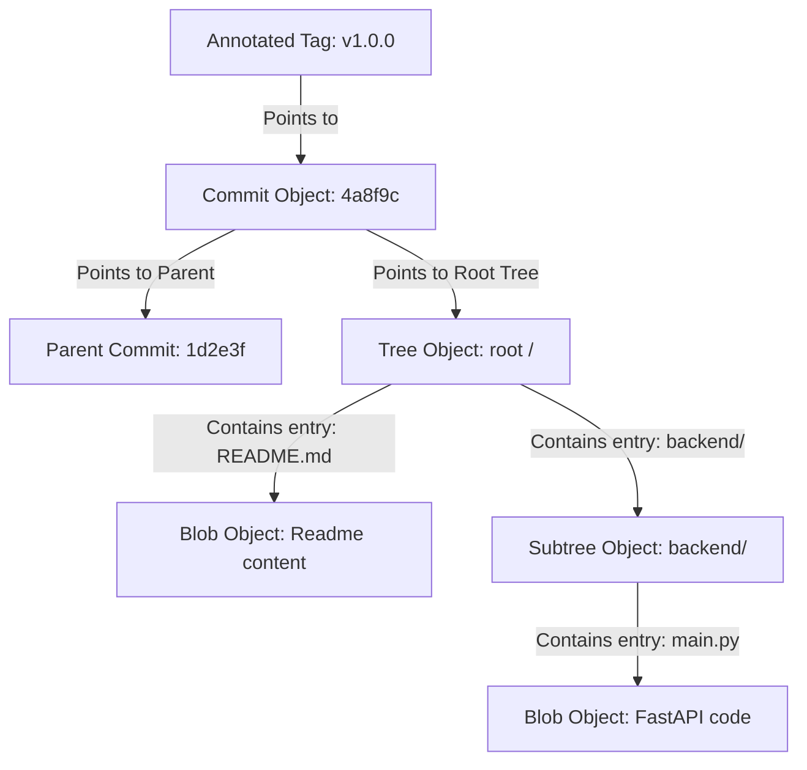
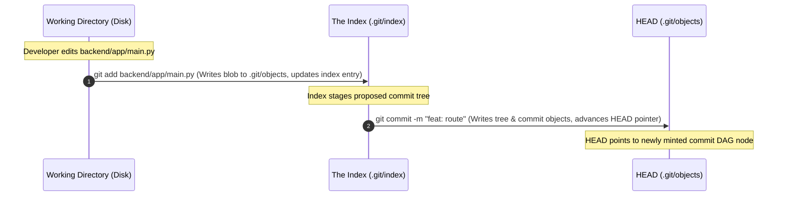
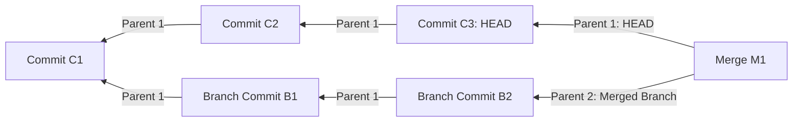
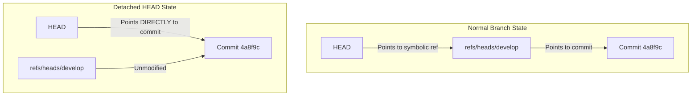
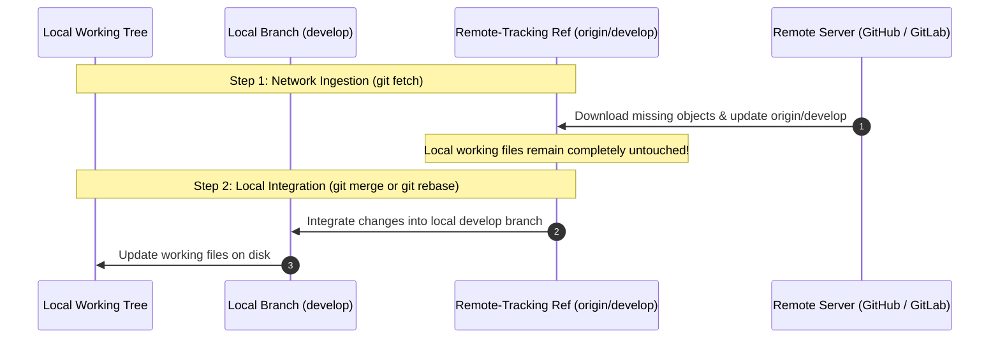
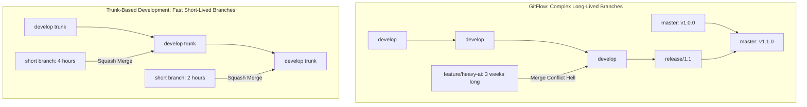

# Guide 13: Git Internals & Delivery Workflows

This manual serves as the authoritative systems engineering reference for **Git Internals**, content-addressable storage engines, directed acyclic graph (DAG) commit topologies, index cache mechanics, merge and rebase mathematics, client/server hook pipelines, and continuous delivery branching workflows across the **Automated Smart Complaint Routing & Workflow Automation Platform**.

In our platform, software engineering velocity depends on immutable history tracking, deterministic artifact versioning, and zero-defect collaborative delivery. While application runtime logic is governed by FastAPI, Pydantic, and SQLite ([Guide 02: FastAPI & Modern ASGI Web Architecture](02_FASTAPI_ASGI_WEB_ARCHITECTURE.md), [Guide 03: Pydantic V2 Data Validation & Schemas](03_PYDANTIC_V2_DATA_VALIDATION_AND_SCHEMAS.md), and [Guide 04: SQLite Storage Mechanics & WAL Mode](04_SQLITE_STORAGE_MECHANICS_AND_WAL_MODE.md)), and validated through automated Pytest gatekeepers ([Guide 12: Automated Testing, Fixtures & Integration](12_PYTEST_AND_AUTOMATED_TEST_SYSTEMS.md)), every line of source code, database migration, and frontend UI component is versioned, audited, and deployed through Git.

To master version control at an enterprise level, engineers must look past the porcelain surface commands (`git add`, `git commit`, `git push`) and understand Git as what it fundamentally is: **a content-addressable object store atop a directed acyclic graph with a mutable pointer tree**.

### Pedagogical Architecture & Monotonic Ordering Doctrine
This manual is structured with **strict monotonic prerequisite ordering**. Every chapter builds exclusively upon foundations established in earlier chapters or referenced from prior foundational manuals:
* No chapter requires concepts from higher-numbered chapters. Foundational content-addressable hashing precedes core object types; object types precede disk storage and zlib compression; disk storage precedes the three-tree architecture; the three-tree architecture precedes the index cache file format; the index precedes references and commits; commits precede branching and merging; merging precedes rebasing and history rewriting; rewriting precedes reflog disaster recovery; and disaster recovery precedes hooks, branching strategies, and release engineering.
* Connects directly with foundational and downstream platform engineering manuals:
  - [Guide 01: Python Language & Runtime Mechanics](01_PYTHON_LANGUAGE_AND_RUNTIME_MECHANICS.md) (Hashing, zlib decompression, and filesystem byte streams)
  - [Guide 02: FastAPI & Modern ASGI Web Architecture](02_FASTAPI_ASGI_WEB_ARCHITECTURE.md) (Application semantic versioning and deployment hooks)
  - [Guide 04: SQLite Storage Mechanics & WAL Mode](04_SQLITE_STORAGE_MECHANICS_AND_WAL_MODE.md) (Append-only storage comparison: Git packfiles vs SQLite WAL pages)
  - [Guide 10: Vite & Modern Frontend Build Toolchains](10_VITE_AND_MODERN_BUILD_TOOLCHAINS.md) (Git tracking of build assets, lockfiles, and bundle output)
  - [Guide 12: Automated Testing, Fixtures & Integration](12_PYTEST_AND_AUTOMATED_TEST_SYSTEMS.md) (Enforcing pre-commit test execution and CI validation gates)
* Every single line of code in every code block includes an explicit explanatory comment (`#`) detailing the precise operational action and systems implication.

---

## Table of Contents
1. [Chapter 1: The Content-Addressable Object Database: Key-Value Architecture & Cryptographic Hashes (SHA-1 / SHA-256)](#chapter-1-the-content-addressable-object-database-key-value-architecture-cryptographic-hashes-sha-1-sha-256)
2. [Chapter 2: The Four Core Object Types: Blobs, Trees, Commits & Annotated Tags](#chapter-2-the-four-core-object-types-blobs-trees-commits-annotated-tags)
3. [Chapter 3: Object Storage on Disk: Zlib Deflation, Loose Objects & `.git/objects/` Directory Sharding](#chapter-3-object-storage-on-disk-zlib-deflation-loose-objects-gitobjects-directory-sharding)
4. [Chapter 4: The Three-Tree Architecture: Working Directory, The Index (Staging Area) & `HEAD`](#chapter-4-the-three-tree-architecture-working-directory-the-index-staging-area-head)
5. [Chapter 5: The Index File Format: Cache Entries, Stat Cache & Sub-Second Dirty File Detection](#chapter-5-the-index-file-format-cache-entries-stat-cache-sub-second-dirty-file-detection)
6. [Chapter 6: Git References (Refs): Symbolic Refs, Heads, Tags, Remote Tracking Branches & `HEAD` Indirection](#chapter-6-git-references-refs-symbolic-refs-heads-tags-remote-tracking-branches-head-indirection)
7. [Chapter 7: The Commit DAG: Parentage, Ancestry Traversal (`~` vs `^`) & Reachability Analysis](#chapter-7-the-commit-dag-parentage-ancestry-traversal-vs-reachability-analysis)
8. [Chapter 8: Branching Internals: Zero-Cost Pointers, Branch Creation, Switching & Detached HEAD States](#chapter-8-branching-internals-zero-cost-pointers-branch-creation-switching-detached-head-states)
9. [Chapter 9: Merging Mechanics: Fast-Forward, True 3-Way Merge, Merge Commits & Lowest Common Ancestor (LCA)](#chapter-9-merging-mechanics-fast-forward-true-3-way-merge-merge-commits-lowest-common-ancestor-lca)
10. [Chapter 10: Merge Conflict Anatomy: Three-Way Merge Markers (`<<<<<<<`, `=======`, `>>>>>>>`) & Index Stages (1, 2, 3)](#chapter-10-merge-conflict-anatomy-three-way-merge-markers-index-stages-1-2-3)
11. [Chapter 11: Rebasing Internals: Replaying Commit DAGs, Upstream Basing & History Linearization](#chapter-11-rebasing-internals-replaying-commit-dags-upstream-basing-history-linearization)
12. [Chapter 12: Interactive Rebase: Squashing, Rewording, Splitting & Reordering Commits](#chapter-12-interactive-rebase-squashing-rewording-splitting-reordering-commits)
13. [Chapter 13: Cherry-Picking & Reverting: Patch Application, Inverted Commits & History Preservation](#chapter-13-cherry-picking-reverting-patch-application-inverted-commits-history-preservation)
14. [Chapter 14: State Restoration & Time Travel: `git reset` (Soft, Mixed, Hard) vs `git checkout` vs `git restore`](#chapter-14-state-restoration-time-travel-git-reset-soft-mixed-hard-vs-git-checkout-vs-git-restore)
15. [Chapter 15: Disaster Recovery with the Reflog: `git reflog`, Orphaned Commits & Garbage Collection Pruning](#chapter-15-disaster-recovery-with-the-reflog-git-reflog-orphaned-commits-garbage-collection-pruning)
16. [Chapter 16: Git Packfiles & Delta Compression: Loose Object Compaction, Packfile Indexes (`.idx`) & `git gc`](#chapter-16-git-packfiles-delta-compression-loose-object-compaction-packfile-indexes-idx-git-gc)
17. [Chapter 17: Remote Synchronization: Fetch, Pull, Push Protocols & Remote-Tracking Branch Lifecycles](#chapter-17-remote-synchronization-fetch-pull-push-protocols-remote-tracking-branch-lifecycles)
18. [Chapter 18: Git Hooks & Automated Quality Enforcers: Client-Side (`pre-commit`, `commit-msg`) & Server-Side Hooks](#chapter-18-git-hooks-automated-quality-enforcers-client-side-pre-commit-commit-msg-server-side-hooks)
19. [Chapter 19: Branching Topologies in Enterprise: GitFlow vs GitHub Flow vs Trunk-Based Development](#chapter-19-branching-topologies-in-enterprise-gitflow-vs-github-flow-vs-trunk-based-development)
20. [Chapter 20: Monorepo Delivery Mechanics: Subdirectories, Partial Clones (`--filter`), Sparse Checkouts & Worktrees](#chapter-20-monorepo-delivery-mechanics-subdirectories-partial-clones---filter-sparse-checkouts-worktrees)
21. [Chapter 21: Release Engineering in SmartComplaintHandler: Semantic Versioning, Changelog Automation & Delivery Pipelines](#chapter-21-release-engineering-in-smartcomplainthandler-semantic-versioning-changelog-automation-delivery-pipelines)
22. [Chapter 22: The Git Internals & Delivery Workflows Systems Engineering Mastery Checklist](#chapter-22-the-git-internals-delivery-workflows-systems-engineering-mastery-checklist)

---

## Chapter 1: The Content-Addressable Object Database: Key-Value Architecture & Cryptographic Hashes (SHA-1 / SHA-256)

### 1.1 Git as a Simple Key-Value Store

At its core, Git is not a diff-based version control system like CVS or Subversion. Subversion records changes as delta file diffs applied sequentially over time. Git, by contrast, is a **content-addressable object store** ([Guide 01: Python Language & Runtime Mechanics](01_PYTHON_LANGUAGE_AND_RUNTIME_MECHANICS.md)):
* The **Key**: A 160-bit cryptographic hash (SHA-1, rendered as 40 hexadecimal characters) or 256-bit hash (SHA-256 in modern Git).
* The **Value**: A raw sequence of bytes preceded by a standardized type header, compressed using zlib deflation.

If two files in completely different directories contain the exact same content, Git stores that content **only once** in its object database. The key is derived purely from the file's bytes, making data corruption immediately detectable and duplication impossible.

### 1.2 The Canonical Object Header Formula

Every object stored in Git begins with a strict header prefix:
$$\text{header} = \text{type} + \text{" "} + \text{size\_in\_bytes} + \text{"\textbackslash 0"}$$
$$\text{payload} = \text{header} + \text{content}$$
$$\text{object\_id} = \text{SHA1}(\text{payload})$$

```python
import hashlib  # Standard cryptographic hashing library for SHA-1 calculation
import zlib  # Standard compression library for Git object storage simulation

def compute_git_blob_hash(raw_content_bytes: bytes) -> tuple[str, bytes]:  # Computes SHA-1 hash and payload
    header = f"blob {len(raw_content_bytes)}\0".encode("utf-8")  # Constructs canonical Git header with null byte
    full_payload = header + raw_content_bytes  # Concatenates object header and raw content bytes
    sha1_digest = hashlib.sha1(full_payload).hexdigest()  # Calculates 40-character hexadecimal SHA-1 hash key
    return sha1_digest, full_payload  # Returns cryptographic hash key and uncompressed object payload

# Validate Git's canonical hashing against the string "hello world\n"
content = b"hello world\n"  # Raw content byte string with newline
computed_sha, payload = compute_git_blob_hash(content)  # Computes Git blob hash for sample content
assert computed_sha == "3b18e512dba79e4c8300dd08aeb37f8e728b8dad"  # Verifies exact Git canonical SHA-1 match
```

We can verify this directly via the low-level Git plumbing command `git hash-object`:
```bash
# Pipes string directly into Git's object hashing plumbing tool
printf "hello world\n" | git hash-object --stdin  # Produces 3b18e512dba79e4c8300dd08aeb37f8e728b8dad
```

---

## Chapter 2: The Four Core Object Types: Blobs, Trees, Commits & Annotated Tags

### 2.1 The Object Taxonomy

The Git object database (`.git/objects/`) recognizes exactly four fundamental object types:



1. **Blob (Binary Large Object)**: Stores raw file data without metadata. A blob does **not** store the filename, directory path, creation timestamp, or file permissions (`chmod`). It stores only the raw file bytes.
2. **Tree**: Represents a directory. A tree stores a list of directory entries, where each entry contains:
   * File mode / permissions (e.g., `100644` for normal file, `100755` for executable, `040000` for subtree directory)
   * Object type (`blob` or `tree`)
   * Cryptographic SHA-1 hash of the target object
   * File or directory name (e.g., `main.py`, `README.md`)
3. **Commit**: Represents a snapshot of the project at a point in time. A commit contains:
   * Pointer to the root `tree` object representing the project snapshot
   * Pointers to zero, one, or more parent commit hashes (forming the commit DAG)
   * Author metadata (name, email, epoch timestamp, timezone)
   * Committer metadata (name, email, epoch timestamp, timezone)
   * Commit log message
4. **Annotated Tag**: A permanent, annotated reference pointing to a specific commit. Unlike lightweight tags (which are simple text pointers), an annotated tag is an immutable object in `.git/objects/` with its own tagger, timestamp, PGP signature, and message.

### 2.2 Inspecting Low-Level Objects via Git Plumbing

High-level Git commands are called **porcelain** (`git add`, `git commit`). Low-level internal commands that inspect and manipulate the object database directly are called **plumbing**:

```bash
# View the object type of an arbitrary SHA-1 hash
git cat-file -t 3b18e512dba79e4c8300dd08aeb37f8e728b8dad  # Prints "blob"

# View the byte size of an object
git cat-file -s 3b18e512dba79e4c8300dd08aeb37f8e728b8dad  # Prints size in bytes

# Pretty-print the raw contents of an object (blob, tree, commit, or tag)
git cat-file -p 3b18e512dba79e4c8300dd08aeb37f8e728b8dad  # Prints uncompressed content
```

---

## Chapter 3: Object Storage on Disk: Zlib Deflation, Loose Objects & `.git/objects/` Directory Sharding

### 3.1 Directory Sharding (Fan-Out) Mechanics

When Git writes an object to disk, saving tens of thousands of files inside a single flat directory causes severe performance degradation on most filesystems (NTFS, ext4, APFS) due to linear directory indexing lookup limits.

Git solves this via **Two-Character Directory Sharding (Fan-Out)**:
* A 40-character SHA-1 hash `3b18e512dba79e4c8300dd08aeb37f8e728b8dad` is split:
  * Directory prefix: First 2 characters -> `.git/objects/3b/`
  * Object filename: Remaining 38 characters -> `18e512dba79e4c8300dd08aeb37f8e728b8dad`
* Path on disk: `.git/objects/3b/18e512dba79e4c8300dd08aeb37f8e728b8dad`

This splits the object space across at most $16^2 = 256$ subdirectories, maintaining high filesystem lookup throughput.

### 3.2 Reading and Decompressing Loose Objects with Python

Loose objects on disk are stored as compressed zlib byte streams ([Guide 01: Python Language & Runtime Mechanics](01_PYTHON_LANGUAGE_AND_RUNTIME_MECHANICS.md)). The following Python script reconstructs Git's exact object reading and parsing logic without using the `git` binary:

```python
import os  # Standard operating system filesystem path operations
import zlib  # Decompresses Git's deflated object byte streams

def read_loose_git_object(git_dir: str, sha1_hex: str) -> tuple[str, int, bytes]:  # Reads Git object from disk
    prefix = sha1_hex[:2]  # Extracts two-character directory fan-out prefix
    postfix = sha1_hex[2:]  # Extracts remaining thirty-eight character object filename
    object_path = os.path.join(git_dir, "objects", prefix, postfix)  # Assembles absolute path to loose object
    
    with open(object_path, "rb") as obj_file:  # Opens compressed object file in binary read mode
        compressed_bytes = obj_file.read()  # Reads complete compressed byte payload from disk
    
    decompressed_bytes = zlib.decompress(compressed_bytes)  # Decompresses raw payload using zlib decompression
    null_byte_index = decompressed_bytes.find(b"\0")  # Locates null byte delimiter separating header and body
    header_str = decompressed_bytes[:null_byte_index].decode("utf-8")  # Decodes object header string
    object_type, byte_size_str = header_str.split(" ")  # Splits header into object type and content size
    content_body = decompressed_bytes[null_byte_index + 1:]  # Extracts raw object content payload bytes
    
    return object_type, int(byte_size_str), content_body  # Returns parsed tuple with type, size, and body
```

---

## Chapter 4: The Three-Tree Architecture: Working Directory, The Index (Staging Area) & `HEAD`

### 4.1 The Three Mental Spaces of Git

Unlike simple backup systems that copy files from disk to an archive, Git operates across **three separate data trees**:

```
+-----------------------------------------------------------------------------------+
|                            THE THREE-TREE ARCHITECTURE                            |
+-----------------------------------------------------------------------------------+
|  1. Working Directory  |  Files on physical disk that you edit in your IDE         |
|                        |  (Untracked, modified, deleted)                          |
+------------------------+----------------------------------------------------------+
|  2. The Index (Staging)|  Binary cache file (`.git/index`) staging the next commit|
|                        |  (Prepared snapshot with file paths, modes, and hashes)  |
+------------------------+----------------------------------------------------------+
|  3. HEAD (Last Commit) |  Immutable root tree snapshot of current checked-out tip |
|                        |  (Committed history in `.git/objects/`)                  |
+-----------------------------------------------------------------------------------+
```



1. **`git add`**: Reads files from the Working Directory, writes them into `.git/objects/` as loose `blob` objects, and updates the `.git/index` cache with the new blob's SHA-1 and filesystem metadata.
2. **`git commit`**: Writes a `tree` object representing the current contents of the Index, writes a `commit` object pointing to that tree, and updates the current branch ref (pointed to by `HEAD`) to the new commit SHA-1.
3. **`git checkout` / `git restore`**: Copies blobs from `HEAD` or the Index back into the Working Directory, overwriting uncommitted disk files.

---

## Chapter 5: The Index File Format: Cache Entries, Stat Cache & Sub-Second Dirty File Detection

### 5.1 The Binary Anatomy of `.git/index`

The Index (`.git/index`) is a critical, highly optimized binary file that allows Git to determine in milliseconds whether any file among tens of thousands on disk has been modified, without calculating SHA-1 hashes for every file!

The `.git/index` file structure consists of:
1. **Header (12 bytes)**:
   * 4 bytes: Signature string `DIRC` ("Directory Cache")
   * 4 bytes: Version number (typically `2`, `3`, or `4`)
   * 4 bytes: Count of index entries
2. **Sorted Array of Index Entries**: One entry per tracked file on disk. Each entry contains:
   * `ctime_seconds` & `ctime_nanoseconds` (8 bytes): Inode change timestamp
   * `mtime_seconds` & `mtime_nanoseconds` (8 bytes): File modification timestamp
   * `dev` (4 bytes) & `ino` (4 bytes): Filesystem device and inode numbers
   * `mode` (4 bytes): File permissions (e.g., `100644`, `100755`)
   * `uid` (4 bytes) & `gid` (4 bytes): User and group ownership IDs
   * `file_size` (4 bytes): Exact file size in bytes
   * `sha1` (20 bytes): 160-bit SHA-1 hash of the staged blob object
   * `flags` (2 bytes): Stage number (0 for normal, 1-3 for merge conflicts) and path length
   * `path_name`: Null-padded relative file path (e.g., `backend/app/main.py\0`)
3. **Extensions**: Optional cached directory trees and untracked cache data.
4. **Checksum (20 bytes)**: SHA-1 hash over the entire index file content.

### 5.2 Sub-Second Dirty File Detection via the Stat Cache

When `git status` runs, Git does **not** hash files to see if they changed. Instead, it issues a fast operating system `stat()` system call:
* If the `mtime`, `ctime`, and `file_size` on disk match the values stored in `.git/index`, Git immediately knows the file is **clean** without opening it or calculating its hash!
* Only if `stat()` reports that the timestamp or file size differs does Git open the file, hash its contents, and verify whether its bytes actually changed.

This design enables repositories with 100,000 files to report `git status` in under 50 milliseconds!

---

## Chapter 6: Git References (Refs): Symbolic Refs, Heads, Tags, Remote Tracking Branches & `HEAD` Indirection

### 6.1 What is a Git Reference?

Because memorizing 40-character SHA-1 hashes (e.g., `3b18e512...`) is impossible for humans, Git provides **References (Refs)**. A reference is simply a human-readable text pointer to a commit hash.

References reside on disk inside the `.git/refs/` directory hierarchy:
* **Local Branches (`.git/refs/heads/`)**: Each local branch is a 41-byte text file containing a 40-character commit hash followed by a newline:
  ```bash
  # Display the exact contents of the develop branch reference file
  cat .git/refs/heads/develop  # Prints exact 40-character SHA-1 commit hash
  ```
* **Tags (`.git/refs/tags/`)**: Pointers to commits representing release milestones. Lightweight tags point directly to a commit hash; annotated tags point to a tag object in `.git/objects/`.
* **Remote-Tracking Branches (`.git/refs/remotes/origin/`)**: Read-only local pointers tracking the state of branches on the remote repository as of the last network fetch.

### 6.2 The `HEAD` Indirection and Symbolic References

The most important reference in any repository is **`HEAD`**. `HEAD` defines what you currently have checked out in your working directory.

In normal operation, `HEAD` is a **Symbolic Reference**, meaning it does not point directly to a commit hash, but rather points to another branch reference:
```bash
# Inspect the active symbolic reference of the current working copy
cat .git/HEAD  # Prints: ref: refs/heads/develop
```

When you create a new commit, Git:
1. Resolves `HEAD` to find the current branch (`refs/heads/develop`).
2. Creates the new commit object pointing to the old commit as its parent.
3. Updates the file `.git/refs/heads/develop` to contain the new commit SHA-1.
4. `HEAD` remains untouched—still pointing to `refs/heads/develop`!

---

## Chapter 7: The Commit DAG: Parentage, Ancestry Traversal (`~` vs `^`) & Reachability Analysis

### 7.1 The Directed Acyclic Graph (DAG) Structure

Every commit in Git contains pointers to its immediate predecessor commits (its **parents**). This forms a mathematically strict **Directed Acyclic Graph (DAG)**:
* A root commit has zero parents.
* A standard commit has exactly one parent.
* A merge commit has two (or more) parents.
* The edges are strictly directed backward in time from child to parent, guaranteeing that cycles are impossible.



### 7.2 Ancestry Traversal: Tilde (`~`) vs Caret (`^`)

Navigating the commit graph backwards requires understanding the distinct mathematical behaviors of `~` and `^`:

| Syntax | Mental Model | Meaning |
| :--- | :--- | :--- |
| `HEAD~1` | Step backward in time | Go to the 1st parent of `HEAD` |
| `HEAD~2` | Step backward twice | Go to the 1st parent of the 1st parent (`HEAD~1~1`) |
| `HEAD~N` | Linear historical descent | Travel $N$ generations back along the primary commit line |
| `HEAD^1` | Choose parent branch | Go to the **first parent** of a merge commit (the branch you merged *into*) |
| `HEAD^2` | Choose parent branch | Go to the **second parent** of a merge commit (the branch you merged *in*) |
| `HEAD~2^2` | Combination | Travel 2 generations back, then choose the 2nd parent of that merge |

```python
# Python implementation demonstrating commit parentage traversal
def traverse_commit_history(commit_dag: dict, start_sha: str, depth: int) -> list[str]:  # Walks commit DAG
    history_line = []  # Initializes list accumulator for visited commit hashes
    current_sha = start_sha  # Sets starting traversal pointer to current commit SHA
    for _ in range(depth):  # Iterates up to specified historical generation depth
        if not current_sha or current_sha not in commit_dag:  # Checks if commit node exists in DAG
            break  # Halts traversal if root commit reached or missing node encountered
        history_line.append(current_sha)  # Appends current commit hash to chronological history
        parents = commit_dag[current_sha].get("parents", [])  # Extracts list of parent hashes
        current_sha = parents[0] if parents else None  # Selects first parent following primary lineage (~1)
    return history_line  # Returns linearized list of historical commit hashes
```

---

## Chapter 8: Branching Internals: Zero-Cost Pointers, Branch Creation, Switching & Detached HEAD States

### 8.1 Zero-Cost Branching

In older version control systems like Subversion, creating a branch required copying the entire project directory tree into a new `/branches/feature-x/` folder on the server, consuming disk space and network bandwidth.

In Git, **a branch is simply a 41-byte text file** containing a 40-character SHA-1 hash!
* Creating a branch (`git branch feature-auth`) executes in under 1 millisecond: it simply writes the current `HEAD` commit SHA-1 into a new file `.git/refs/heads/feature-auth`.
* Deleting a branch (`git branch -d feature-auth`) simply unlinks that 41-byte file. The commits themselves remain untouched in the object database!

```bash
# Create a new branch pointer pointing to the current commit
git branch feature-routing  # Writes current HEAD commit hash to .git/refs/heads/feature-routing

# Switch active working branch pointer by updating .git/HEAD
git switch feature-routing  # Updates .git/HEAD content to "ref: refs/heads/feature-routing"
```

### 8.2 The Detached HEAD State

When you run `git checkout <commit-sha>` or check out a remote tag directly, `HEAD` no longer points to a branch reference file; **`HEAD` points directly to an immutable commit hash**:

```
.git/HEAD content: 4a8f9c2d1e0b5f7a8b9c...
(NOT: ref: refs/heads/develop)
```



**The Danger of Detached HEAD**:
* If you make new commits while in a detached HEAD state, those commits are created normally and `HEAD` advances.
* However, if you switch back to `develop` (`git switch develop`), **no branch points to your newly created commits**!
* Those commits become **orphaned** and will eventually be permanently deleted by Git's garbage collector (`git gc`)!

To rescue commits made in a detached HEAD state:
```bash
# Safely bind orphaned commits to a new named branch pointer
git switch -c rescued-work  # Creates branch at current detached HEAD position
```

---

## Chapter 9: Merging Mechanics: Fast-Forward, True 3-Way Merge, Merge Commits & Lowest Common Ancestor (LCA)

### 9.1 Fast-Forward Merges

When you merge branch `B` into branch `A`, Git first inspects the commit DAG. If the tip of branch `A` is an exact ancestor of branch `B`, no changes have occurred on `A` since `B` was branched off.

In this scenario, Git performs a **Fast-Forward Merge**:
* Git does not create any new commit objects.
* Git simply advances the reference pointer of branch `A` forward to match the commit SHA-1 of branch `B`!

```
Before Fast-Forward:
main:    C1 --- C2
                 \
feature:          C3 --- C4 (HEAD)

After Fast-Forward (git merge feature):
main:    C1 --- C2 --- C3 --- C4 (HEAD)
feature:                      ^
```

To force Git to record an explicit merge commit even when a fast-forward is possible, engineers use the `--no-ff` flag:
```bash
# Force explicit merge commit creation for release tracking audit trails
git merge --no-ff feature-routing  # Generates explicit merge commit with two parents
```

### 9.2 The True Three-Way Merge Algorithm and Lowest Common Ancestor (LCA)

When both branches have diverged (commits have been added to `main` AND to `feature`), a fast-forward is mathematically impossible. Git must execute a **Three-Way Merge**:

```
        C3 --- C4 (feature)
       /
C1 --- C2 (LCA: Lowest Common Ancestor)
       \
        C5 --- C6 (main, HEAD)
```

To perform a three-way merge, Git identifies **three distinct tree snapshots**:
1. **Base Tree ($B$)**: The **Lowest Common Ancestor (LCA)** commit where the two branches originally diverged (`C2`).
2. **Ours Tree ($O$)**: The current active commit on the target branch (`C6`).
3. **Theirs Tree ($T$)**: The commit being merged into our branch (`C4`).

For every file in the repository, Git calculates:
$$\Delta_{\text{ours}} = O - B$$
$$\Delta_{\text{theirs}} = T - B$$

* If a file changed in $O$ but remained unchanged in $T$ ($\Delta_{\text{theirs}} = 0$), Git automatically keeps $O$.
* If a file changed in $T$ but remained unchanged in $O$ ($\Delta_{\text{ours}} = 0$), Git automatically accepts $T$.
* If a file was modified in **both** $O$ and $T$ in different lines, Git weaves the changes together automatically.
* If a file was modified in **both** $O$ and $T$ on the exact same lines with differing content, a **Merge Conflict** occurs!

---

## Chapter 10: Merge Conflict Anatomy: Three-Way Merge Markers (`<<<<<<<`, `=======`, `>>>>>>>`) & Index Stages (1, 2, 3)

### 10.1 The Three Stages of the Git Index During a Conflict

When a three-way merge encounters conflicting edits, Git halts the merge process and populates the **Index (`.git/index`)** with up to **three distinct versions of the conflicting file**, known as **Index Stages**:

| Index Stage | Version Represented | Source Tree | Description |
| :--- | :--- | :--- | :--- |
| **Stage 0** | Normal / Clean | Clean state | Default stage for non-conflicting files |
| **Stage 1** | Base Version ($B$) | Lowest Common Ancestor (LCA) | The state of the file before branches diverged |
| **Stage 2** | Ours Version ($O$) | Current branch (`HEAD`) | Your active modifications |
| **Stage 3** | Theirs Version ($T$) | Merging branch | The incoming modifications |

Engineers can inspect and extract individual conflict stages directly using `git show`:
```bash
# View the original common ancestor (Stage 1)
git show :1:backend/app/main.py  # Displays LCA base version

# View our active local branch version (Stage 2)
git show :2:backend/app/main.py  # Displays our local HEAD version

# View the incoming branch version being merged (Stage 3)
git show :3:backend/app/main.py  # Displays incoming remote branch version
```

### 10.2 Conflict Markers in the Working Directory

Simultaneously, Git writes standard conflict boundary markers into the conflicting file on disk:

```
<<<<<<< HEAD (Stage 2: Ours)
SLA_TIMEOUT_HOURS: int = 12
=======
SLA_TIMEOUT_HOURS: int = 24
>>>>>>> feature-extended-sla (Stage 3: Theirs)
```

To resolve the conflict:
1. The engineer edits the file to select or synthesize the correct business logic.
2. The conflict marker lines (`<<<<<<<`, `=======`, `>>>>>>>`) are deleted.
3. The engineer runs `git add backend/app/main.py`.
4. Running `git add` collapses Stages 1, 2, and 3 back into a single **Stage 0** entry in `.git/index`.
5. Running `git commit` writes the final merge commit referencing both branch parent hashes!

---

## Chapter 11: Rebasing Internals: Replaying Commit DAGs, Upstream Basing & History Linearization

### 11.1 The Mathematics of Rebasing

While merging combines two branches by creating a multi-parent merge commit (Chapter 9), **rebasing rewrites history by replaying a sequence of commits on top of a new upstream base commit**.

Consider a feature branch `feature` branched off `develop` at commit `C2`:
```
develop: C1 --- C2 --- C3 --- C4
                 \
feature:          C5 --- C6 (HEAD)
```

When you run `git switch feature` and `git rebase develop`:
1. Git identifies the Lowest Common Ancestor (`C2`).
2. Git saves the unique commits of `feature` (`C5`, `C6`) into temporary patch files.
3. Git resets the `feature` branch pointer directly to the current tip of `develop` (`C4`).
4. Git replays each patch sequentially:
   * Applies patch `C5` on top of `C4`, generating a brand new commit `C5'`.
   * Applies patch `C6` on top of `C5'`, generating a brand new commit `C6'`.
5. The `feature` branch pointer is updated to `C6'`.

```
After Rebase:
develop: C1 --- C2 --- C3 --- C4
                                \
feature:                         C5' --- C6' (HEAD)
```

**Crucial Internal Reality**: Even if the file changes in `C5'` and `C6'` are identical to `C5` and `C6`, their parent hashes, timestamps, and commit hashes are **completely different** ($C5 \neq C5'$).

### 11.2 The Golden Rule of Rebasing

```
+===================================================================================================+
|                                    THE GOLDEN RULE OF REBASING                                    |
+===================================================================================================+
| NEVER rebase commits that have already been pushed to a shared public remote branch (e.g., main)!  |
|                                                                                                   |
| Rebasing destroys existing commit hashes and creates new ones. If team members have based work on  |
| the original commits, force-pushing a rebased branch fractures their commit history, causing      |
| duplicate commits, phantom merge conflicts, and severe repository corruption.                     |
+===================================================================================================+
```

Rebase is strictly reserved for:
* Synchronizing local, unpushed feature branches with the latest `develop` branch.
* Cleaning up local commit history before opening a pull request.

---

## Chapter 12: Interactive Rebase: Squashing, Rewording, Splitting & Reordering Commits

### 12.1 The Interactive Rebase Instruction Sheet

During local development, engineers often produce messy micro-commits:
`wip`, `fix typo`, `oops forgot file`, `testing fix`.

Interactive rebase (`git rebase -i`) allows engineers to reshape local commit history into clean, atomic logical commits before submitting code for review:

```bash
# Initiate interactive rebase across the last 4 commits on the current branch
git rebase -i HEAD~4  # Opens default text editor displaying rebase instruction sheet
```

Git presents an instruction script executed from top to bottom (oldest commit to newest):

```
pick 4a8f9c2 feat: add initial complaint Pydantic schemas
squash 7e1b3d4 fix typo in schema field
squash 9c4a2e1 add missing validator test
reword 1f8b3c5 feat: implement complaint routing endpoint
```

### 12.2 Core Interactive Rebase Commands

| Command | Shorthand | Operational Action |
| :--- | :--- | :--- |
| `pick` | `p` | Retain the commit as-is in the history. |
| `reword` | `r` | Retain commit contents, but pause to edit the commit message. |
| `edit` | `e` | Pause execution at this commit to amend code or split into multiple commits. |
| `squash` | `s` | Melt commit into the previous commit; combine commit log messages. |
| `fixup` | `f` | Melt commit into previous commit; discard this commit's message. |
| `drop` | `d` | Permanently delete the commit and its changes from the branch. |

By squashing interim fixups into meaningful atomic commits, the repository history remains clean, self-contained, and easily bisectable via `git bisect`.

---

## Chapter 13: Cherry-Picking & Reverting: Patch Application, Inverted Commits & History Preservation

### 13.1 Cherry-Picking: Selective Commit Extraction

Sometimes a critical bugfix or feature developed on one branch needs to be applied to another branch without merging the entire branch history. **Cherry-picking** achieves this:

```bash
# Apply the exact diff introduced by commit 8f2a1c onto the current branch
git cherry-pick 8f2a1c  # Creates new commit on current branch containing the isolated patch
```

Under the hood:
1. Git inspects commit `8f2a1c` and its parent `8f2a1c~1`.
2. Git computes the diff $\Delta = 8f2a1c - 8f2a1c\sim 1$.
3. Git applies this diff $\Delta$ directly onto the current branch's `HEAD` commit.
4. Git creates a brand-new commit with the current `HEAD` as parent.

### 13.2 Reverting: History-Preserving Undo

When a defect is discovered in production on a shared public branch (`main` or `develop`), rewriting history via `git reset` is forbidden because it breaks team synchronization.

The safe enterprise pattern is **`git revert`**:
```bash
# Create a new commit that inverts the changes made in a faulty commit
git revert 4a8f9c2  # Computes inverse diff and commits it to advance history
```

* `git revert` does **not** erase the faulty commit from history.
* Instead, it generates a **new forward commit** containing the exact inverse diff of the target commit.
* History remains strictly append-only, preserving an audit trail of both the original change and the emergency rollback.

---

## Chapter 14: State Restoration & Time Travel: `git reset` (Soft, Mixed, Hard) vs `git checkout` vs `git restore`

### 14.1 The Three Flavors of `git reset`

`git reset` is one of the most powerful and misunderstood commands in Git. Its behavior depends entirely on which of the **Three Trees** (Chapter 4) it modifies:

```mermaid
graph TD
    subgraph git reset --soft HEAD~1
        A1[Move Branch Ref & HEAD] -->|Leaves Index Untouched| B1[Staged Changes Preserved]
        B1 -->|Leaves Working Directory Untouched| C1[Disk Files Preserved]
    end

    subgraph git reset --mixed HEAD~1 (Default)
        A2[Move Branch Ref & HEAD] -->|Resets Index to Match Target| B2[Unstages Changes]
        B2 -->|Leaves Working Directory Untouched| C2[Disk Files Preserved]
    end

    subgraph git reset --hard HEAD~1 (DESTRUCTIVE)
        A3[Move Branch Ref & HEAD] -->|Resets Index to Match Target| B3[Clears Index]
        B3 -->|OVERWRITES Working Directory on Disk| C3[Uncommitted Changes WIPED OUT!]
    end
```

| Command | HEAD (Commit Pointer) | The Index (Staging Area) | Working Directory (Disk Files) |
| :--- | :--- | :--- | :--- |
| `git reset --soft <sha>` | **Moved** to target | **Preserved** (Unchanged) | **Preserved** (Unchanged) |
| `git reset --mixed <sha>` | **Moved** to target | **Reset** to match target | **Preserved** (Unchanged) |
| `git reset --hard <sha>` | **Moved** to target | **Reset** to match target | **Reset** (Uncommitted work destroyed!) |

Use cases:
* **`--soft`**: You made three commits, want to collapse them into a single staged commit: `git reset --soft HEAD~3` followed by `git commit -m "feat: consolidated"`.
* **`--mixed`**: You staged files with `git add .` but want to unstage them: `git reset`.
* **`--hard`**: You want to completely discard all local changes and reset your workspace to match the last commit: `git reset --hard HEAD`.

### 14.2 Modern Disambiguation: `git restore`

In Git 2.23+, `git checkout`'s overloaded file-restoration duties were split into the safer, dedicated command **`git restore`**:
```bash
# Unstage a file from the index without moving branch pointers
git restore --staged backend/app/main.py  # Copies blob from HEAD to index

# Discard uncommitted disk changes in working directory
git restore backend/app/main.py  # Copies blob from index to working directory disk file
```

---

## Chapter 15: Disaster Recovery with the Reflog: `git reflog`, Orphaned Commits & Garbage Collection Pruning

### 15.1 The Safety Net: What is the Reflog?

A terrifying experience for developers is running `git reset --hard` and realizing they destroyed uncommitted or unpushed work. In almost all cases, **the work is not lost**!

Git maintains a local append-only ledger called the **Reference Log (Reflog)** located at `.git/logs/HEAD` and `.git/logs/refs/heads/<branch>`. The reflog records **every single time `HEAD` changes position**, including:
* Making a commit
* Switching branches (`checkout`, `switch`)
* Rebasing
* Resetting
* Merging

```bash
# Inspect the local chronological ledger of HEAD movements
git reflog  # Displays history of recent HEAD positions with index notations
```

Sample output:
```
1a2b3c4 HEAD@{0}: reset: moving to HEAD~1
5d6e7f8 HEAD@{1}: commit: feat: complete routing heuristic
9a0b1c2 HEAD@{2}: checkout: moving from develop to feature-routing
```

### 15.2 Rescuing Lost Commits

To undo an accidental `git reset --hard` and recover lost commits:
```bash
# Point a new recovery branch to the commit where HEAD was prior to the reset
git branch recovery-branch HEAD@{1}  # Rescues commit 5d6e7f8 instantly!
```

### 15.3 Garbage Collection and Pruning

When a commit has no branches or tags pointing to it, it becomes **unreachable** (orphaned). Git does not delete orphaned commits immediately.
* Reachable commits are preserved forever.
* Unreachable commits referenced in the reflog are kept for **90 days** by default (`gc.reflogExpire`).
* Truly unreachable, unreferenced objects are kept for **14 days** (`gc.pruneExpire`).
* Running `git gc` packs loose objects and permanently prunes expired unreachable objects.

---

## Chapter 16: Git Packfiles & Delta Compression: Loose Object Compaction, Packfile Indexes (`.idx`) & `git gc`

### 16.1 The Loose Object Problem

In Chapter 3, we observed that every `git add` writes a separate compressed file into `.git/objects/`. In a repository with thousands of commits, storing every version of every file as an individual loose object:
1. Consumes massive numbers of filesystem inodes.
2. Wastes storage space because full copies of files are saved even if only one line changed.

### 16.2 Packfiles and Sliding-Window Delta Compression

Git solves this through **Packfiles** (`.git/objects/pack/`). During `git gc` or network pushes/fetches, Git compacts hundreds of loose objects into a single pair of files:
1. **`.pack` File**: A single binary concatenation containing all compressed objects.
2. **`.idx` File**: A binary index enabling fast $O(\log N)$ binary search lookups of object SHA-1 hashes within the `.pack` file.

Git uses **Sliding-Window Delta Compression**:
* Git sorts all objects in the repository by filename and file size.
* When two revisions of `main.py` are adjacent, Git compares them and computes a binary delta.
* **Counter-Intuitive Masterstroke**: Git stores the **most recent version as the full object**, and older versions as backward deltas! Why? Because developers check out and read the *latest* version 99% of the time, so recent reads require zero delta decompression!

```bash
# Manually trigger repository optimization, loose object packing, and delta compression
git gc --aggressive --prune=now  # Packs loose objects and prunes unreachable commits
```

---

## Chapter 17: Remote Synchronization: Fetch, Pull, Push Protocols & Remote-Tracking Branch Lifecycles

### 17.1 The Decoupled Remote Synchronization Model

In distributed version control, local and remote repositories are completely independent object databases. When synchronizing across networks (via HTTPS or SSH), Git operates through explicit network transfer protocols:



1. **`git fetch`**: Connects to the remote server, negotiates which commits are missing via the smart transfer protocol packfile exchange, downloads missing objects into `.git/objects/`, and advances **remote-tracking branches** (`.git/refs/remotes/origin/<branch>`). **It never touches your local working tree or local branch pointers!**
2. **`git merge origin/<branch>`**: Merges the updated remote-tracking branch into your active local branch.
3. **`git pull`**: A composite porcelain command that simply runs `git fetch` followed immediately by `git merge`.
4. **The Safe Enterprise Pull Standard**: To prevent accidental merge commits from cluttering history, enterprise environments configure:
   ```bash
   # Enforce fast-forward only or rebase during git pull operations
   git config --global pull.rebase true  # Automatically replays local commits on top of incoming remote tip
   ```

### 17.2 Refspecs Explained

When Git fetches or pushes, it uses a **Refspec** mapping local references to remote references:
```
+refs/heads/*:refs/remotes/origin/*
```
* `+`: Tells Git to update references even if it is not a fast-forward (overriding safe checks).
* `refs/heads/*`: Source pattern on the remote repository.
* `refs/remotes/origin/*`: Destination pattern where refs are saved locally.

---

## Chapter 18: Git Hooks & Automated Quality Enforcers: Client-Side (`pre-commit`, `commit-msg`) & Server-Side Hooks

### 18.1 The Git Hook Lifecycle

Git hooks are executable scripts located in `.git/hooks/` that run automatically before or after key Git lifecycle events. If a hook exits with a non-zero status code ($> 0$), Git **aborts the operation immediately**, protecting repository integrity.

```
Client-Side Hooks (Run locally on developer machine):
1. pre-commit: Runs before commit message is written. Enforces linting, syntax, and unit tests.
2. prepare-commit-msg: Injects ticket IDs or branch metadata into commit message template.
3. commit-msg: Validates commit message formatting (e.g., Conventional Commits).
4. post-commit: Emits local notification or telemetry after commit finishes.
5. pre-push: Runs full test suite before pushing commits over network.

Server-Side Hooks (Run on central Git server):
1. pre-receive: Validates all incoming pushed refs before updating remote repository.
2. update: Per-branch validation script.
3. post-receive: Triggers CI/CD webhooks or deployment pipelines.
```

### 18.2 Production Python Pre-Commit Hook Implementation

The following production script functions as an executable `.git/hooks/pre-commit` hook in `SmartComplaintHandler`. It verifies that the automated closed-loop test suite passes ([Guide 12: Automated Testing, Fixtures & Integration](12_PYTEST_AND_AUTOMATED_TEST_SYSTEMS.md)) before allowing a developer to commit code:

```python
import subprocess  # Subprocess module for spawning command line test runners
import sys  # System module for managing hook exit codes

def execute_pre_commit_gatekeeper() -> None:  # Validates repository health before committing
    print("[PRE-COMMIT HOOK] Executing closed-loop test gatekeeper...")  # Diagnostic status message
    # Invoke pytest against the closed-loop test suite
    test_run = subprocess.run(  # Executes test command synchronously
        ["backend/venv/Scripts/python.exe", "-m", "pytest", "backend/tests/test_closed_loop.py"],  # Pytest command
        capture_output=True,  # Intercepts stdout and stderr streams
        text=True,  # Decodes command output as string
    )  # Test execution complete
    
    if test_run.returncode != 0:  # Evaluates whether test suite reported any failure
        print("\n[ERROR] Pre-commit gatekeeper FAILED! Tests did not pass.")  # Failure banner
        print(test_run.stdout)  # Prints test runner output to developer terminal
        print(test_run.stderr)  # Prints test error tracebacks
        sys.exit(1)  # Exits with non-zero status aborting the git commit operation!
    
    print("[PRE-COMMIT HOOK] All tests passed! Proceeding with commit.")  # Success confirmation
    sys.exit(0)  # Exits with status zero permitting the git commit to proceed

if __name__ == "__main__":  # Entry point block
    execute_pre_commit_gatekeeper()  # Invokes gatekeeper routine
```

### 18.3 Commit-Message Linting for Conventional Commits

To enforce standardized changelogs, a `.git/hooks/commit-msg` script validates adherence to the **Conventional Commits** specification (`feat:`, `fix:`, `docs:`, `chore:`, `refactor:`, `test:`):

```python
import re  # Regular expressions library for commit message pattern matching
import sys  # System module for reading commit message file path and exiting

def validate_conventional_commit_message(commit_msg_filepath: str) -> None:  # Lints commit subject line
    with open(commit_msg_filepath, "r", encoding="utf-8") as f:  # Opens temporary commit message file
        first_line = f.readline().strip()  # Reads primary subject line of proposed commit message
    
    conventional_regex = r"^(feat|fix|docs|style|refactor|perf|test|chore)(\([a-z0-9-_]+\))?:\s.+$"  # Regex
    
    if not re.match(conventional_regex, first_line):  # Evaluates whether subject line matches convention
        print("\n[ERROR] Invalid commit message format!")  # Emits error banner
        print(f"Proposed message: '{first_line}'")  # Displays rejected commit message
        print("Format must strictly follow: <type>(<scope>): <description>")  # Displays expected format
        print("Valid types: feat, fix, docs, style, refactor, perf, test, chore")  # Lists valid types
        sys.exit(1)  # Aborts commit operation
    
    sys.exit(0)  # Permits commit operation

if __name__ == "__main__":  # Entry point block
    validate_conventional_commit_message(sys.argv[1])  # Passes commit message file argument to validator
```

---

## Chapter 19: Branching Topologies in Enterprise: GitFlow vs GitHub Flow vs Trunk-Based Development

### 19.1 Comparative Architectural Evaluation

Choosing a branching model dictates team delivery velocity, merge conflict frequency, and release risk:

| Dimension | GitFlow | GitHub Flow | Trunk-Based Development (TBD) |
| :--- | :--- | :--- | :--- |
| **Core Philosophy** | Heavy formal releases | Deploy every feature PR | Continuous integration directly to mainline |
| **Primary Branches** | `master`, `develop`, `release/*`, `hotfix/*` | `main` | `main` (or `develop` in staging) |
| **Branch Lifetime** | Weeks to months | Days | Hours ($< 24$ hours) |
| **Merge Conflict Risk** | Severe (Long-lived branch divergence) | Moderate | Minimal (Constant daily integration) |
| **Deployment Speed** | Slow (Scheduled release trains) | Fast | Real-time continuous deployment |
| **Feature Isolation** | Long-lived feature branches | Feature branches | **Feature Flags (Toggles)** in code |



### 19.2 The Trunk-Based Protocol in SmartComplaintHandler

`SmartComplaintHandler` adopts **Trunk-Based Development with Short-Lived Branches**:
1. All developers branch off `develop` into short-lived branches (`feature/`, `fix/`).
2. Branch lifespan is constrained to $< 24$ hours.
3. Every commit must pass the automated closed-loop test gatekeeper ([Guide 12: Automated Testing, Fixtures & Integration](12_PYTEST_AND_AUTOMATED_TEST_SYSTEMS.md)).
4. Features spanning multiple days are merged continuously behind **Runtime Feature Flags** ([Guide 02: FastAPI & Modern ASGI Web Architecture](02_FASTAPI_ASGI_WEB_ARCHITECTURE.md)), completely eliminating massive merge conflicts!

---

## Chapter 20: Monorepo Delivery Mechanics: Subdirectories, Partial Clones (`--filter`), Sparse Checkouts & Worktrees

### 20.1 Git Worktrees: Concurrent Multi-Branch Development Without Re-Cloning

A major productivity bottleneck occurs when a developer is in the middle of a complex feature, and an urgent production hotfix arrives. Running `git stash` and `git switch` is disruptive and risks file pollution.

Git provides **Worktrees** (`git worktree`), allowing multiple branches to be checked out **simultaneously in separate directories from a single repository database**:

```bash
# Spawn a dedicated directory for hotfix development linked to the same repository
git worktree add ../SmartComplaint-Hotfix develop  # Creates new directory with clean develop checkout

# List all active worktrees linked to the repository
git worktree list  # Displays path, commit hash, and active branch for each worktree

# Remove the worktree directory when the hotfix is merged
git worktree remove ../SmartComplaint-Hotfix  # Cleans up worktree directory and internal references
```

Both directories share the single `.git/objects/` database, saving disk space and avoiding network cloning!

### 20.2 Monorepo Optimization: Partial Clones and Sparse Checkouts

In `SmartComplaintHandler`, the backend Python application and frontend React application reside in a single repository (**Monorepo**). As repositories grow to tens of gigabytes, Git provides optimizations to download and check out only what is needed:

1. **Blobless Partial Clone (`--filter=blob:none`)**: Downloads commit history and directory trees, but defers downloading file blobs until they are actually opened or checked out:
   ```bash
   # Clone commit metadata without downloading file bodies until checkout
   git clone --filter=blob:none https://github.com/org/SmartComplaintHandler.git  # Fast lightweight clone
   ```
2. **Sparse Checkout**: Checks out only a subset of directories (e.g., checking out only `backend/` on backend servers):
   ```bash
   # Initialize sparse checkout in non-cone mode
   git sparse-checkout init --cone  # Enables high-performance prefix path matching
   
   # Restrict working directory to backend application files only
   git sparse-checkout set backend  # Prunes frontend files from physical disk while preserving git tracking
   ```

---

## Chapter 21: Release Engineering in SmartComplaintHandler: Semantic Versioning, Changelog Automation & Delivery Pipelines

### 21.1 Semantic Versioning 2.0.0 (SemVer)

Platform release versions strictly adhere to the Semantic Versioning formula:
$$\text{Version} = \text{MAJOR}.\text{MINOR}.\text{PATCH}$$

* **`MAJOR`**: Incompatible API breaking changes (e.g., altering FastAPI request payload schemas or removing public REST endpoints).
* **`MINOR`**: Backward-compatible new functionality (e.g., adding a new complaint category heuristic or SLA export format).
* **`PATCH`**: Backward-compatible bug fixes (e.g., fixing an off-by-one error in SLA deadline arithmetic).

### 21.2 The Release Pipeline Workflow

```bash
# 1. Create annotated release tag pointing to verified commit on develop
git tag -a v1.2.0 -m "release: platform v1.2.0 with automated SLA escalation"  # Creates annotated tag

# 2. Push release tag to remote origin triggering CD deployment pipeline
git push origin v1.2.0  # Dispatches tag to remote server triggering CI/CD release action
```

---

## Chapter 22: The Git Internals & Delivery Workflows Systems Engineering Mastery Checklist

### 22.1 Comprehensive Version Control Readiness Rubric

Before proposing changes, executing merges, or releasing artifacts, verify your operational workflow against this 15-point systems engineering rubric:

```
+===================================================================================================+
|                          GIT & DELIVERY SYSTEMS ENGINEERING RUBRIC                                |
+===================================================================================================+
| [ ] 1.  Atomic Commits: Each commit encapsulates exactly one logical change with tests.          |
| [ ] 2.  Conventional Commits: Messages formatted as <type>(<scope>): <subject> (e.g., feat: ...). |
| [ ] 3.  No Rebase on Public Branches: Rebasing strictly limited to local unpushed branches.      |
| [ ] 4.  Linear History: Local feature branches rebased onto develop prior to opening PRs.        |
| [ ] 5.  Pre-Commit Testing: .git/hooks/pre-commit verifies test suite before commit creation.     |
| [ ] 6.  Fast-Forward Pulls: pull.rebase configured to prevent accidental merge bubbles.           |
| [ ] 7.  Conflict Stage Awareness: Resolving conflicts verifies Stages 1, 2, and 3 via git show.   |
| [ ] 8.  Zero Loose Tracking: .gitignore excludes virtual environments, SQLite DBs, and build dist|
| [ ] 9.  Reflog Recovery: Knowledge of git reflog applied to rescue accidentally reset commits.    |
| [ ] 10. Annotated Tags for Releases: All production releases marked with git tag -a (SemVer).    |
| [ ] 11. Worktree Concurrency: Urgent hotfixes branched via git worktree without stashing.         |
| [ ] 12. Short-Lived Branches: Feature branches merged within 24 hours under Trunk-Based model.    |
| [ ] 13. Garbage Collection: git gc --aggressive executed periodically on developer machines.      |
| [ ] 14. Sparse Checkouts Tested: Large monorepo builds optimized via git sparse-checkout.        |
| [ ] 15. CI Pipeline Verified: All commits pass automated remote gatekeepers before release.       |
+===================================================================================================+
```

### 22.2 Architectural Cross-Reference Matrix

| System Component | Architectural Responsibility | Interfacing Manual |
| :--- | :--- | :--- |
| **Object Hashing & Serialization** | Cryptographic content addressing and zlib compression | [Guide 01: Python Language & Runtime Mechanics](01_PYTHON_LANGUAGE_AND_RUNTIME_MECHANICS.md) |
| **Release Versioning** | Exposing API semantic versioning through FastAPI root schemas | [Guide 02: FastAPI & Modern ASGI Web Architecture](02_FASTAPI_ASGI_WEB_ARCHITECTURE.md) |
| **Frontend Asset Tracking** | Versioning Vite bundle outputs and tracking package-lock.json | [Guide 10: Vite & Modern Frontend Build Toolchains](10_VITE_AND_MODERN_BUILD_TOOLCHAINS.md) |
| **Automated Test Hooks** | Pre-commit gatekeeper executing closed-loop test suites | [Guide 12: Automated Testing, Fixtures & Integration](12_PYTEST_AND_AUTOMATED_TEST_SYSTEMS.md) |
| **Database Migration Tracking** | Version controlling Alembic schema migration scripts | [Guide 16: Database Versioning & Migrations](16_DATABASE_MIGRATIONS_WITH_ALEMBIC.md) |
