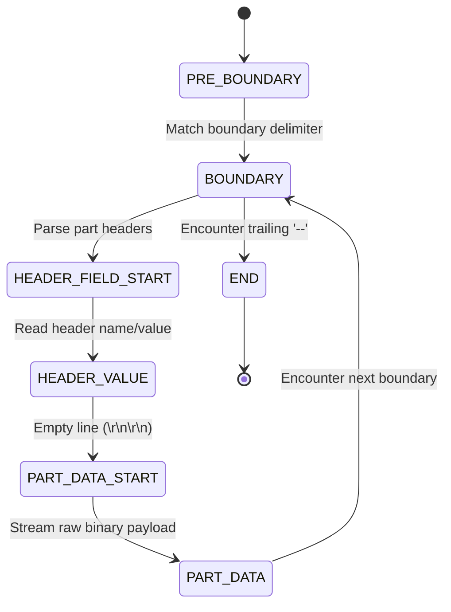
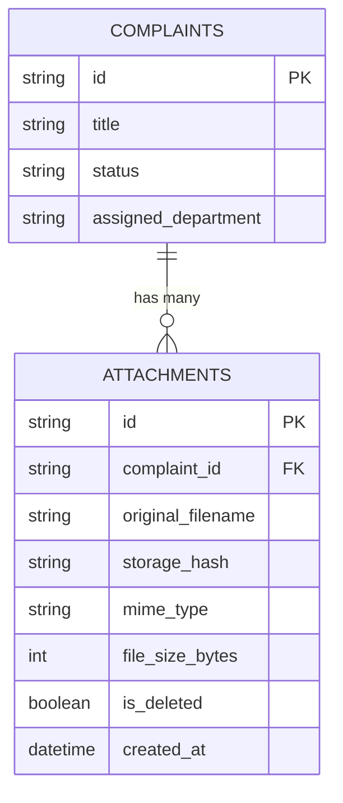

# Guide 14: Binary Streaming & File Ingestion

This manual serves as the authoritative systems engineering reference for **Binary Streaming**, `multipart/form-data` MIME protocols, asynchronous ASGI chunk ingestion, `python-multipart` finite state machine parsing, memory-safe file spooling, magic byte security sniffing, and content-addressable storage engines across the **Automated Smart Complaint Routing & Workflow Automation Platform**.

In our platform, while text metadata (grievance title, description, citizen contact info) is serialized as JSON and validated via Pydantic ([Guide 03: Pydantic V2 Data Validation & Schemas](03_PYDANTIC_V2_DATA_VALIDATION_AND_SCHEMAS.md)), real-world municipal complaints require physical evidence: high-resolution photographs of burst water mains, PDF invoices documenting billing discrepancies, and recorded voice notes.

Handling binary payloads introduces severe architectural hazards:
* Ingesting a 50 MB photo entirely into RAM exhausts Python heap memory, triggering Linux Out-Of-Memory (OOM) killer terminations.
* Serializing binary files as Base64 strings inside JSON inflates network payload volume by 33% and locks the CPython GIL during encoding ([Guide 01: Python Language & Runtime Mechanics](01_PYTHON_LANGUAGE_AND_RUNTIME_MECHANICS.md)).
* Storing large binary blobs directly inside SQLite databases degrades B-tree cache locality and inflates WAL checkpoint duration ([Guide 04: SQLite Storage Mechanics & WAL Mode](04_SQLITE_STORAGE_MECHANICS_AND_WAL_MODE.md)).
* Naïve file upload handlers create critical vulnerabilities: path traversal (`../../etc/passwd`), arbitrary code execution via forged file extensions, and zip bombs.

To engineer an enterprise file ingestion engine that remains responsive under heavy concurrent uploads, backend engineers must master streaming protocols, finite state machine parsers, spooled disk buffers, and non-blocking I/O pipelines.

### Pedagogical Architecture & Monotonic Ordering Doctrine
This manual is structured with **strict monotonic prerequisite ordering**. Every chapter builds exclusively upon foundations established in earlier chapters or referenced from prior foundational manuals:
* No chapter requires concepts from higher-numbered chapters. The HTTP binary transfer problem precedes RFC 7578 multipart specifications; RFC 7578 precedes ASGI streaming receive loops; ASGI receive loops precede FSM stream parsers; FSM parsers precede `UploadFile` spooling; spooling precedes chunked reading; chunked reading precedes security validation (path traversal, magic bytes, size limits); validation precedes storage engines; and storage precedes streaming responses, HTTP range requests, and database modeling.
* Connects directly with foundational and downstream platform engineering manuals:
  - [Guide 01: Python Language & Runtime Mechanics](01_PYTHON_LANGUAGE_AND_RUNTIME_MECHANICS.md) (Binary byte streams, buffer protocols, and OS file descriptors)
  - [Guide 02: FastAPI & Modern ASGI Web Architecture](02_FASTAPI_ASGI_WEB_ARCHITECTURE.md) (ASGI `receive` callable, Starlette request handling, and dependency injection)
  - [Guide 03: Pydantic V2 Data Validation & Schemas](03_PYDANTIC_V2_DATA_VALIDATION_AND_SCHEMAS.md) (Validating multipart form metadata alongside file uploads)
  - [Guide 04: SQLite Storage Mechanics & WAL Mode](04_SQLITE_STORAGE_MECHANICS_AND_WAL_MODE.md) (Relational metadata storage vs external binary blob filesystems)
  - [Guide 05: SQLAlchemy 2.0 ORM & Relational Architecture](05_SQLALCHEMY_ORM_AND_DATA_LAYER.md) (Modeling file attachments with foreign keys to parent complaints)
  - [Guide 09: Axios, Fetch & REST Network Protocols](09_AXIOS_FETCH_AND_REST_PROTOCOLS.md) (Client-side `FormData`, upload progress events, and boundary headers)
  - [Guide 12: Automated Testing, Fixtures & Integration](12_PYTEST_AND_AUTOMATED_TEST_SYSTEMS.md) (Testing multipart uploads via Pytest and Starlette TestClient)
* Every single line of Python code in every code block includes an explicit explanatory comment (`#`) detailing the precise runtime action, parameter purpose, and memory implication.

---

## Table of Contents
1. [Chapter 1: The HTTP Binary Transfer Problem: JSON Encoding (Base64 Overhead) vs Multipart Streaming](#chapter-1-the-http-binary-transfer-problem-json-encoding-base64-overhead-vs-multipart-streaming)
2. [Chapter 2: The RFC 7578 `multipart/form-data` Protocol: Boundary Delimiters, Headers & Body Structure](#chapter-2-the-rfc-7578-multipartform-data-protocol-boundary-delimiters-headers-body-structure)
3. [Chapter 3: ASGI Streaming Request Ingestion: The `http.request` Event Loop & Receive Protocol](#chapter-3-asgi-streaming-request-ingestion-the-httprequest-event-loop-receive-protocol)
4. [Chapter 4: Under the Hood of `python-multipart`: Finite State Machine (FSM) Stream Parsing Mechanics](#chapter-4-under-the-hood-of-python-multipart-finite-state-machine-fsm-stream-parsing-mechanics)
5. [Chapter 5: FastAPI `UploadFile` vs `bytes`: Memory Consumption Hazards & Garbage Collector Pressure](#chapter-5-fastapi-uploadfile-vs-bytes-memory-consumption-hazards-garbage-collector-pressure)
6. [Chapter 6: The `SpooledTemporaryFile` Buffer: Rollover Thresholds, RAM Spooling & Disk Spillover](#chapter-6-the-spooledtemporaryfile-buffer-rollover-thresholds-ram-spooling-disk-spillover)
7. [Chapter 7: Asynchronous Stream Chunking: Reading Fixed-Size Chunks with `file.read(chunk_size)`](#chapter-7-asynchronous-stream-chunking-reading-fixed-size-chunks-with-filereadchunk_size)
8. [Chapter 8: Secure File Validation Part I: The Path Traversal Vulnerability & Filename Sanitization](#chapter-8-secure-file-validation-part-i-the-path-traversal-vulnerability-filename-sanitization)
9. [Chapter 9: Secure File Validation Part II: The Extension Lie & Magic Byte MIME Sniffing (`libmagic` / `puremagic`)](#chapter-9-secure-file-validation-part-ii-the-extension-lie-magic-byte-mime-sniffing-libmagic-puremagic)
10. [Chapter 10: Secure File Validation Part III: Maximum Payload Ceilings & Denial of Service (DoS) Defense](#chapter-10-secure-file-validation-part-iii-maximum-payload-ceilings-denial-of-service-dos-defense)
11. [Chapter 11: File Storage Strategies: Local Filesystem Directory Sharding & Inode Management](#chapter-11-file-storage-strategies-local-filesystem-directory-sharding-inode-management)
12. [Chapter 12: Content-Addressable File Storage: Deduplicating Uploads via SHA-256 Hashes](#chapter-12-content-addressable-file-storage-deduplicating-uploads-via-sha-256-hashes)
13. [Chapter 13: Asynchronous File Writing: Offloading Blocking Disk I/O to Thread Pools via `aiofiles`](#chapter-13-asynchronous-file-writing-offloading-blocking-disk-io-to-thread-pools-via-aiofiles)
14. [Chapter 14: Streaming File Downloads: FastAPI `StreamingResponse` & Generator Functions](#chapter-14-streaming-file-downloads-fastapi-streamingresponse-generator-functions)
15. [Chapter 15: HTTP Range Requests & Partial Content: RFC 7233 Resume Support & Video/Audio Seeking](#chapter-15-http-range-requests-partial-content-rfc-7233-resume-support-videoaudio-seeking)
16. [Chapter 16: Image Processing Pipelines: Resizing, Thumbnail Generation & Metadata Stripping with Pillow](#chapter-16-image-processing-pipelines-resizing-thumbnail-generation-metadata-stripping-with-pillow)
17. [Chapter 17: Chunked Transfer Encoding & Direct S3 / Cloud Storage Streaming](#chapter-17-chunked-transfer-encoding-direct-s3-cloud-storage-streaming)
18. [Chapter 18: Upload Progress Tracking: Axios `onUploadProgress` & Server-Sent Events (SSE) Coordination](#chapter-18-upload-progress-tracking-axios-onuploadprogress-server-sent-events-sse-coordination)
19. [Chapter 19: Database Attachment Modeling: Relational Schemas, Foreign Keys & Soft Deletions in SQLAlchemy](#chapter-19-database-attachment-modeling-relational-schemas-foreign-keys-soft-deletions-in-sqlalchemy)
20. [Chapter 20: Automated Testing of Multipart Endpoints: Synthetic File Payloads in Pytest & TestClient](#chapter-20-automated-testing-of-multipart-endpoints-synthetic-file-payloads-in-pytest-testclient)
21. [Chapter 21: The Grievance Attachment Engine in SmartComplaintHandler: Photos, Documents & Evidence Ingestion](#chapter-21-the-grievance-attachment-engine-in-smartcomplainthandler-photos-documents-evidence-ingestion)
22. [Chapter 22: The Binary Streaming & File Ingestion Systems Engineering Mastery Checklist](#chapter-22-the-binary-streaming-file-ingestion-systems-engineering-mastery-checklist)

---

## Chapter 1: The HTTP Binary Transfer Problem: JSON Encoding (Base64 Overhead) vs Multipart Streaming

### 1.1 The Pitfalls of Base64 Ingestion in JSON

When building REST APIs, novice developers frequently attempt to transmit binary images inside standard JSON request bodies by converting raw bytes to ASCII via **Base64 encoding**:

```json
{
  "complaint_id": "TICKET-1042",
  "filename": "pipe_burst.jpg",
  "image_base64": "/9j/4AAQSkZJRgABAQEASABIAAD/2wBDAAYEBQYFBAYGBQYHBwYIChAKCgkJ..."
}
```

While convenient because it reuses existing JSON endpoints ([Guide 03: Pydantic V2 Data Validation & Schemas](03_PYDANTIC_V2_DATA_VALIDATION_AND_SCHEMAS.md)), this design introduces severe architectural penalties:
1. **33% Network Bandwidth Overhead**: Base64 converts every 3 binary bytes into 4 ASCII characters ($4/3 \approx 133.3\%$). A 15 MB mobile camera photo becomes a 20 MB JSON string!
2. **CPython Memory Bloat**: In CPython, Python strings are encoded as UTF-8 or UCS-4 Unicode objects ([Guide 01: Python Language & Runtime Mechanics](01_PYTHON_LANGUAGE_AND_RUNTIME_MECHANICS.md)). The entire 20 MB string must be parsed into memory by `json.loads`, decoded into a 15 MB `bytes` object, and held concurrently, consuming $> 50\text{ MB}$ of RAM for a single photo!
3. **Event Loop Latency**: Decoding a 20 MB Base64 string in pure Python locks the thread, preventing ASGI event loop progression.

### 1.2 The Multipart Streaming Alternative

To transfer binary assets efficiently, HTTP defines the **`multipart/form-data`** media type. Instead of translating binary bytes to text, multipart transmits raw binary byte streams directly across the TCP socket, punctuated only by lightweight boundary delimiter strings.

```mermaid
graph TD
    subgraph Base64 in JSON (Anti-Pattern)
        A[15 MB Binary Image] -->|Base64 Encoding: +33% Bloat| B[20 MB Base64 String]
        B -->|Wrap in JSON| C[HTTP Request Body]
        C -->|Server Memory: Holds Entire 50MB String| D[CPython Heap Exhaustion]
    end

    subgraph Multipart Streaming (High Performance)
        E[15 MB Binary Image] -->|Raw Binary Stream| F[HTTP Multipart Stream]
        F -->|Streamed in 64KB Chunks| G[ASGI Receive Loop]
        G -->|Direct to Disk / Spool| H[Constant 64KB RAM Footprint]
    end
```

By streaming multipart payloads, server memory consumption remains constant ($\approx 64\text{ KB}$ per connection) regardless of whether the uploaded file is 1 megabyte or 5 gigabytes!

---

## Chapter 2: The RFC 7578 `multipart/form-data` Protocol: Boundary Delimiters, Headers & Body Structure

### 2.1 The Wire Anatomy of RFC 7578

The `multipart/form-data` format (standardized in RFC 7578) allows multiple distinct payloads (form fields, binary files, JSON blocks) to be packed into a single HTTP message body.

The client specifies the delimiter string in the `Content-Type` header:
```http
POST /api/v1/complaints/upload HTTP/1.1
Host: api.smartcomplaint.local
Content-Type: multipart/form-data; boundary=----WebKitFormBoundary7MA4YWxkTrZu0gW
Content-Length: 1048576
```

The request body is composed of individual parts separated by this boundary string:

```http
------WebKitFormBoundary7MA4YWxkTrZu0gW\r\n
Content-Disposition: form-data; name="category"\r\n
\r\n
WATER\r\n
------WebKitFormBoundary7MA4YWxkTrZu0gW\r\n
Content-Disposition: form-data; name="evidence"; filename="burst_pipe.jpg"\r\n
Content-Type: image/jpeg\r\n
\r\n
[RAW BINARY JPEG BYTES HERE]\r\n
------WebKitFormBoundary7MA4YWxkTrZu0gW--\r\n
```

### 2.2 Critical Structural Rules

1. **Boundary Prefix**: Every boundary inside the message body is prefixed with two hyphens (`--`). If the header specifies `boundary=xyz`, the body delimiter is `--xyz`.
2. **Closing Boundary**: The final closing boundary ends with two additional trailing hyphens: `--xyz--`. This signals the end of the HTTP message.
3. **CRLF Line Endings**: RFC 7578 strictly mandates carriage return and line feed (`\r\n` / ASCII `0x0D 0x0A`) delimiters between headers, boundaries, and body segments. Unix-style bare `\n` line breaks violate the specification and cause parser failures.

---

## Chapter 3: ASGI Streaming Request Ingestion: The `http.request` Event Loop & Receive Protocol

### 3.1 The ASGI `receive` Callable

As established in [Guide 02: FastAPI & Modern ASGI Web Architecture](02_FASTAPI_ASGI_WEB_ARCHITECTURE.md), an ASGI application is an asynchronous callable with the signature:
```python
async def app(scope: dict, receive: callable, send: callable) -> None: ...  # Canonical ASGI application signature
```

When an HTTP request contains a streaming body, the ASGI server (Uvicorn) does not wait for the entire multi-gigabyte upload to arrive before invoking the application. Instead, Uvicorn invokes `app` immediately upon parsing the HTTP request headers.

The application ingests the incoming byte stream incrementally by calling `await receive()` in an asynchronous loop:

```python
from typing import AsyncGenerator  # Type annotation for asynchronous generator streams
from fastapi import Request  # FastAPI request wrapper exposing underlying ASGI interface

async def stream_raw_request_chunks(request: Request) -> AsyncGenerator[bytes, None]:  # Ingests stream
    while True:  # Loops until complete message body is transferred across socket
        event = await request._receive()  # Queries ASGI server for next incoming network packet
        if event["type"] == "http.request":  # Validates event type corresponds to HTTP payload chunk
            chunk_bytes = event.get("body", b"")  # Extracts raw binary chunk bytes from event dictionary
            if chunk_bytes:  # Checks whether packet contains non-empty binary payload
                yield chunk_bytes  # Yields raw chunk bytes to processing pipeline
            if not event.get("more_body", False):  # Evaluates boolean flag signaling end of HTTP stream
                break  # Terminates ingestion loop when final payload chunk is processed
```

### 3.2 Backpressure in Asynchronous Streams

The ASGI `receive` protocol provides automatic **Backpressure**:
* If the server's disk write operations or processing pipelines slow down, the application delays its next call to `await receive()`.
* The TCP socket buffer fills up, causing the OS kernel to stop advertising TCP window space to the client.
* The client browser automatically throttles its upload rate ([Guide 09: Axios, Fetch & REST Network Protocols](09_AXIOS_FETCH_AND_REST_PROTOCOLS.md)), preventing server memory buffers from exploding!

---

## Chapter 4: Under the Hood of `python-multipart`: Finite State Machine (FSM) Stream Parsing Mechanics

### 4.1 The Finite State Machine Parser

FastAPI delegates multipart form parsing to the high-performance C-accelerated library **`python-multipart`**. Because file streams arrive in arbitrary chunk sizes (e.g., 8 KB packets from TCP sockets), a multipart boundary delimiter might be split directly across two consecutive network packets!

`python-multipart` solves this by implementing a streaming **Finite State Machine (FSM)**:



### 4.2 Stream Boundary Slicing

When incoming byte buffers are processed, the FSM uses Boyer-Moore string search algorithms to identify boundary markers without buffering the entire file into memory:
* As bytes stream in, data preceding the boundary is flushed directly to the target file buffer.
* The parser maintains a small sliding lookahead window (equal to `len(boundary) + 4` bytes) to ensure partial boundaries across packet borders are detected without data loss.

---

## Chapter 5: FastAPI `UploadFile` vs `bytes`: Memory Consumption Hazards & Garbage Collector Pressure

### 5.1 The Fatal Mistake: `file: bytes = File(...)`

FastAPI provides two distinct annotations for file uploads. The choice between them has massive performance consequences:

```python
from fastapi import FastAPI, File, UploadFile  # Core FastAPI file parameter types

api_app = FastAPI(title="File Ingestion Benchmark")  # Instantiates API application

# HAZARDOUS ANTI-PATTERN: Forces FastAPI to read the ENTIRE file into RAM
@api_app.post("/upload/hazardous")  # Endpoint demonstrating catastrophic memory allocation
async def upload_file_as_bytes(raw_data: bytes = File(...)) -> dict:  # Reads full file to bytes object
    file_size = len(raw_data)  # Computes size of in-memory byte buffer
    return {"size": file_size, "storage": "RAM"}  # Returns allocation confirmation

# PRODUCTION-GRADE PATTERN: Streams data safely using SpooledTemporaryFile
@api_app.post("/upload/production")  # Production-grade streaming endpoint
async def upload_file_streaming(evidence_file: UploadFile = File(...)) -> dict:  # Streams using UploadFile
    filename = evidence_file.filename  # Accesses sanitized client filename
    content_type = evidence_file.content_type  # Accesses client declared MIME content type
    return {"filename": filename, "mime": content_type}  # Returns file metadata
```

### 5.2 Comparative Architectural Analysis

| Dimension | `raw_data: bytes = File(...)` | `evidence_file: UploadFile = File(...)` |
| :--- | :--- | :--- |
| **Storage Medium** | **RAM Only** (CPython `bytes` object) | **RAM up to 1 MB**, then spills to **Disk** |
| **Memory Footprint** | $100\%$ of file size per concurrent upload | Max $1\text{ MB}$ per file, regardless of file size |
| **Garbage Collection** | Severe GC pressure; large objects trigger full GC runs | Minimal GC impact; managed by OS file descriptors |
| **Risk Profile** | High risk of OOM crash on large files | Safe against memory exhaustion attacks |
| **File Operations** | In-memory operations only | Exposes file-like API (`read`, `write`, `seek`) |

For any production application handling files larger than a few kilobytes, **`UploadFile` is mandatory**.

---

## Chapter 6: The `SpooledTemporaryFile` Buffer: Rollover Thresholds, RAM Spooling & Disk Spillover

### 6.1 The Mechanics of `SpooledTemporaryFile`

Under the hood of Starlette and FastAPI, an `UploadFile` instance wraps a standard library Python **`tempfile.SpooledTemporaryFile`**.

The `SpooledTemporaryFile` operates as a two-tier hybrid storage engine:
1. **Tier 1 (RAM Spooling)**: When the file upload begins, data is written into an in-memory buffer (`io.BytesIO`). For small files (e.g., icons, JSON documents, or compressed avatars under 1 MB), data never touches the physical hard drive, providing microsecond write throughput.
2. **Tier 2 (Disk Rollover)**: When the accumulated byte stream exceeds `max_size` (configured to **$1\text{ MB} = 1,048,576\text{ bytes}$** by default in Starlette), the spooled file invokes its internal `rollover()` method:
   * It creates an operating system temporary file on disk (via `tempfile.TemporaryFile`).
   * It flushes the in-memory RAM bytes into the newly allocated disk file.
   * It releases the `BytesIO` buffer, returning the RAM to Python's memory allocator.
   * Subsequent writes stream directly to the temporary disk file descriptor.

```mermaid
graph TD
    A[Incoming 15 MB Photo Stream] --> B{Bytes Written <= 1 MB?}
    B -->|Yes| C[Tier 1: In-Memory io.BytesIO Buffer]
    B -->|Threshold Breached: 1,048,577th Byte| D[Trigger rollover()]
    D --> E[Allocate OS Temp File on Disk: /tmp/tmp_xyz]
    E --> F[Dump RAM Bytes to Disk]
    F --> G[Release RAM Buffer]
    C --> H[Remaining 14 MB Written Directly to Disk File Descriptor]
    G --> H
```

### 6.2 Managing File Lifecycles with `file.close()`

Because `SpooledTemporaryFile` allocates underlying operating system file descriptors on disk, open files must be closed to avoid OS descriptor leakage:

```python
from fastapi import UploadFile  # FastAPI UploadFile class

async def release_uploaded_file_resources(upload: UploadFile) -> None:  # Closes underlying spooled file
    await upload.close()  # Asynchronously closes file descriptor and deletes underlying disk temp file
```

When `await upload.close()` is executed, Python unlinks the temporary file on disk and reclaims all allocated file descriptors.

---

## Chapter 7: Asynchronous Stream Chunking: Reading Fixed-Size Chunks with `file.read(chunk_size)`

### 7.1 The Thread Pool Offload Architecture

Calling `file.read()` directly on a standard Python file object is a **synchronous blocking system call**. If executed directly on the ASGI event loop, disk I/O latency blocks concurrent HTTP request handling!

FastAPI's `UploadFile.read(size)` solves this by offloading the blocking read operation to an asynchronous worker thread pool using AnyIO (`anyio.to_thread.run_sync`):

```mermaid
sequenceDiagram
    autonumber
    participant Loop as ASGI Event Loop
    participant UpFile as UploadFile.read(65536)
    participant Worker as AnyIO Thread Pool Worker
    participant Disk as OS File Descriptor

    Loop->>UpFile: await upload_file.read(65536)
    UpFile->>Worker: Dispatch read(65536) to thread
    Note over Loop: Event loop continues processing HTTP requests!
    Worker->>Disk: Blocking OS read() system call
    Disk-->>Worker: Return 64KB binary buffer
    Worker-->>UpFile: Pass buffer back to async future
    UpFile-->>Loop: Resolve await with 64KB bytes
```

### 7.2 Production Stream Chunking Loop

The canonical pattern for processing file uploads in constant memory utilizes an asynchronous chunked reading loop with a standard 64 KB ($65,536\text{ bytes}$) buffer:

```python
from typing import AsyncGenerator  # Generator type annotation
from fastapi import UploadFile  # FastAPI UploadFile abstraction

# Standard 64 KB streaming buffer matching typical OS page cache block multiples
STREAM_CHUNK_SIZE: int = 64 * 1024  # 65536 bytes buffer

async def iterate_file_chunks(file: UploadFile) -> AsyncGenerator[bytes, None]:  # Streams file chunks
    await file.seek(0)  # Rewinds internal file pointer to stream origin
    while True:  # Loops until entire file is consumed
        chunk_bytes = await file.read(STREAM_CHUNK_SIZE)  # Reads fixed 64 KB buffer offloaded to thread
        if not chunk_bytes:  # Detects end of file when empty bytes object is returned
            break  # Terminates generator loop
        yield chunk_bytes  # Yields 64 KB binary chunk to downstream consumers
```

---

## Chapter 8: Secure File Validation Part I: The Path Traversal Vulnerability & Filename Sanitization

### 8.1 The Path Traversal Danger

When a user uploads a file, the client browser transmits a `filename` parameter in the `Content-Disposition` header:
```http
Content-Disposition: form-data; name="evidence"; filename="../../etc/cron.d/malicious"
```

If a backend server blindly concatenates this user-supplied filename to a local storage directory:
```python
# Demonstrates path traversal security vulnerability in naive code
target_path = os.path.join("/var/uploads", file.filename)  # Insecure concatenation vulnerable to path traversal
```

### 8.2 Production Filename Sanitization and UUID Isolation

To neutralize path traversal attacks, enterprise systems apply two layers of defense:
1. **Filename Sanitization**: Extract only the terminal base name and strip path separators (`/`, `\`), null bytes (`\0`), and non-alphanumeric characters.
2. **UUID Namespace Isolation**: Store the file under a randomly generated UUID on disk, preserving the original sanitized filename only as metadata in the database!

```python
import os  # Standard filesystem path operations
import re  # Regular expressions for string sanitization
import uuid  # UUID generation library for unique file keys

def sanitize_and_isolate_filename(raw_client_filename: str) -> tuple[str, str]:  # Sanitizes filename
    base_name = os.path.basename(raw_client_filename)  # Strips all leading directory traversal prefixes
    clean_name = re.sub(r"[^a-zA-Z0-9_.-]", "_", base_name)  # Replaces dangerous characters with underscores
    file_extension = os.path.splitext(clean_name)[1].lower()  # Extracts file extension in lowercase
    storage_uuid_key = f"{uuid.uuid4().hex}{file_extension}"  # Generates unique storage key (e.g. e3b0c44.jpg)
    return clean_name, storage_uuid_key  # Returns human sanitized name and isolated storage key
```

---

## Chapter 9: Secure File Validation Part II: The Extension Lie & Magic Byte MIME Sniffing (`libmagic` / `puremagic`)

### 9.1 Why File Extensions and `Content-Type` Cannot Be Trusted

An attacker can easily rename a dangerous executable (`exploit.exe` or `webshell.php`) to `invoice.pdf` and send `Content-Type: application/pdf` in the HTTP header. 

Relying on the client's file extension or declared MIME type is a **catastrophic security vulnerability**. Attackers bypass extension-based firewalls, upload executable PHP/Perl scripts to public web roots, and achieve **Remote Code Execution (RCE)**.

### 9.2 Magic Bytes: Cryptographic File Signatures

Every standardized binary file format begins with a unique, immutable sequence of identifier bytes at offset 0, known as **Magic Bytes**:

| File Format | Canonical MIME Type | Magic Byte Signature (Hexadecimal) | ASCII Representation |
| :--- | :--- | :--- | :--- |
| **JPEG** | `image/jpeg` | `FF D8 FF` | `ÿØÿ` |
| **PNG** | `image/png` | `89 50 4E 47 0D 0A 1A 0A` | `‰PNG\r\n\x1a\n` |
| **PDF** | `application/pdf` | `25 50 44 46` | `%PDF` |
| **ZIP / DOCX** | `application/zip` | `50 4B 03 04` | `PK\x03\x04` |
| **GIF** | `image/gif` | `47 49 46 38` | `GIF8` |

### 9.3 In-Memory Magic Byte Validation

The following production validation function reads the first 16 bytes of an uploaded file, verifies its magic signature, and rewinds the file pointer back to byte 0 so downstream consumers can read the full stream:

```python
from fastapi import UploadFile, HTTPException, status  # FastAPI core types

# Predefined dictionary mapping canonical magic byte signatures to approved MIME types
APPROVED_MAGIC_SIGNATURES: dict[bytes, str] = {  # Approved file signatures
    b"\xff\xd8\xff": "image/jpeg",  # JPEG image signature
    b"\x89PNG\r\n\x1a\n": "image/png",  # PNG image signature
    b"%PDF": "application/pdf",  # PDF document signature
}  # Signature mapping complete

async def validate_file_magic_bytes(file: UploadFile) -> str:  # Sniffs true MIME type from file header
    await file.seek(0)  # Ensures file pointer is at origin byte
    header_probe_bytes = await file.read(16)  # Reads initial sixteen bytes containing magic signature
    await file.seek(0)  # Rewinds stream pointer back to origin so subsequent readers see entire file
    
    for signature, mime_type in APPROVED_MAGIC_SIGNATURES.items():  # Iterates through allowed signatures
        if header_probe_bytes.startswith(signature):  # Evaluates whether file header matches signature
            return mime_type  # Returns verified MIME type
            
    # Raise HTTP 415 Unsupported Media Type if file header does not match approved signatures
    raise HTTPException(  # Halts request processing rejecting spoofed file
        status_code=status.HTTP_415_UNSUPPORTED_MEDIA_TYPE,  # Standard HTTP 415 status code
        detail="Invalid file format: file signature does not match allowed types (JPEG, PNG, PDF).",  # Error
    )  # Exception raised
```

---

## Chapter 10: Secure File Validation Part III: Maximum Payload Ceilings & Denial of Service (DoS) Defense

### 10.1 Defending Against Denial of Service (DoS) and Zip Bombs

Without strict file size ceilings, an attacker can open an HTTP connection and stream an endless 500 GB byte stream to the server, filling the host disk, exhausting temporary inodes, and causing platform outages.

Two complementary validation layers must be enforced:
1. **Pre-Ingestion Check (`Content-Length`)**: If the client provides a `Content-Length` header exceeding our ceiling (e.g., $10\text{ MB} = 10,485,760\text{ bytes}$), reject the request immediately with `HTTP 413 Payload Too Large` before ingesting a single byte!
2. **In-Flight Chunk Counter**: Because malicious clients can omit `Content-Length` using `Transfer-Encoding: chunked`, the ingestion loop must maintain an active byte counter, aborting the transfer if the accumulated bytes exceed the ceiling.

```python
from fastapi import UploadFile, HTTPException, status  # FastAPI exception classes

# Define platform-wide maximum file size ceiling (10 Megabytes)
MAX_ALLOWED_FILE_BYTES: int = 10 * 1024 * 1024  # 10485760 bytes limit

async def enforce_payload_size_ceiling(file: UploadFile) -> int:  # Validates file size within limit
    total_accumulated_bytes = 0  # Counter tracking total streamed bytes
    await file.seek(0)  # Rewinds file pointer
    
    while True:  # Ingests stream incrementally
        chunk = await file.read(64 * 1024)  # Reads 64 KB chunk from spooled file
        if not chunk:  # End of file reached
            break  # Terminates counting loop
        total_accumulated_bytes += len(chunk)  # Increments accumulated byte counter
        if total_accumulated_bytes > MAX_ALLOWED_FILE_BYTES:  # Evaluates whether ceiling was breached
            await file.close()  # Closes file descriptor reclaiming disk resources immediately
            raise HTTPException(  # Rejects request with HTTP 413
                status_code=status.HTTP_413_REQUEST_ENTITY_TOO_LARGE,  # Standard 413 status code
                detail=f"File exceeds maximum allowed limit of {MAX_ALLOWED_FILE_BYTES / (1024*1024)} MB.",  # Detail
            )  # Exception raised
            
    await file.seek(0)  # Rewinds pointer so downstream persistence handlers can write file
    return total_accumulated_bytes  # Returns validated file size in bytes
```

---

## Chapter 11: File Storage Strategies: Local Filesystem Directory Sharding & Inode Management

### 11.1 The Flat Directory Inode Bottleneck

When thousands of citizens upload evidence photos to a municipal platform, placing every file inside a single directory (e.g., `/var/storage/uploads/`) causes catastrophic filesystem performance degradation:
* In filesystems like ext4 and NTFS, directories index files using B-trees. While modern filesystems handle tens of thousands of entries, directory lookup latency, directory listing commands (`ls`, `dir`), and backup utilities degrade severely.
* Filesystem **inode exhaustion**: every file consumes an inode. If storage disks run out of inodes, no new files can be created even if gigabytes of physical drive space remain free!

### 11.2 Two-Tier Directory Sharding (Fan-Out)

To distribute file entries evenly and maintain high directory traversal speeds, `SmartComplaintHandler` employs **Two-Tier Directory Sharding** (the same architectural pattern powering Git internals in [Guide 13: Git Internals & Delivery Workflows](13_GIT_INTERNALS_AND_DELIVERY_WORKFLOWS.md)):
* A file storage key `e3b0c44298fc1c149afbf4c8996fb92427ae41e4649b934ca495991b7852b855.jpg` is sharded:
  * First directory level: First 2 characters -> `/var/storage/uploads/e3/`
  * Second directory level: Next 2 characters -> `/var/storage/uploads/e3/b0/`
  * Terminal file name: `c44298fc1c149afbf4c8996fb92427ae41e4649b934ca495991b7852b855.jpg`

This distributes files across $256 \times 256 = 65,536$ subdirectories, ensuring no individual directory ever holds more than a few dozen files.

```python
import os  # Standard operating system module for directory creation and path operations

def resolve_sharded_storage_path(base_storage_dir: str, file_hash_key: str) -> str:  # Resolves sharded path
    first_tier_dir = file_hash_key[:2]  # Extracts first two characters for top-level shard
    second_tier_dir = file_hash_key[2:4]  # Extracts next two characters for second-level shard
    terminal_filename = file_hash_key[4:]  # Extracts remaining characters as filename
    target_directory = os.path.join(base_storage_dir, first_tier_dir, second_tier_dir)  # Assembles directory path
    os.makedirs(target_directory, exist_ok=True)  # Creates sharded directories recursively if not present
    return os.path.join(target_directory, terminal_filename)  # Returns complete absolute file path
```

---

## Chapter 12: Content-Addressable File Storage: Deduplicating Uploads via SHA-256 Hashes

### 12.1 The Duplicate Upload Problem in Municipal Platforms

When a major water main bursts on a central avenue during morning rush hour, 50 different citizens submit grievances with photos of the exact same flooded roadway. 

If the server stores 50 identical 10 MB photographs:
* 500 MB of disk space is wasted storing redundant bytes.
* Backup operations, cloud synchronization, and virus scans take 50 times longer.

### 12.2 In-Flight SHA-256 Deduplication

`SmartComplaintHandler` implements **Content-Addressable Storage**:
1. As the file chunks stream in from the client, the server computes a **SHA-256 cryptographic digest** incrementally.
2. The calculated SHA-256 hash becomes the file's primary storage key.
3. If a file with that exact SHA-256 hash already exists on disk, the physical write is skipped!
4. A new relational attachment record is inserted in SQLite pointing to the existing file hash, achieving **instantaneous zero-disk deduplication**!

```python
import hashlib  # Standard cryptographic hashing library
from fastapi import UploadFile  # FastAPI UploadFile class

async def compute_streaming_sha256(file: UploadFile) -> str:  # Calculates SHA-256 hash across stream
    sha256_accumulator = hashlib.sha256()  # Instantiates incremental SHA-256 hashing context
    await file.seek(0)  # Ensures stream pointer is at origin
    while True:  # Loops across file chunks
        chunk = await file.read(64 * 1024)  # Reads 64 KB buffer
        if not chunk:  # Detects end of file
            break  # Terminates hashing loop
        sha256_accumulator.update(chunk)  # Updates hash state with chunk bytes
    await file.seek(0)  # Rewinds pointer so downstream consumers can read file
    return sha256_accumulator.hexdigest()  # Returns 64-character hexadecimal SHA-256 hash string
```

---

## Chapter 13: Asynchronous File Writing: Offloading Blocking Disk I/O to Thread Pools via `aiofiles`

### 13.1 The Disk I/O Event Loop Blocking Hazard

In Python, standard file writes (`open(path, 'wb').write(chunk)`) are synchronous operating system system calls (`write()`). When physical disks experience heavy write contention or write back pressure, the operating system pauses the calling thread until the kernel page cache accepts the write.

If executed on the ASGI event loop thread, **every other HTTP request on the server is blocked** during disk write stalls!

### 13.2 Asynchronous Streaming Persistence with `aiofiles`

The library **`aiofiles`** wraps standard filesystem calls by delegating blocking disk I/O to background thread pool workers, preserving high-concurrency event loop responsiveness ([Guide 02: FastAPI & Modern ASGI Web Architecture](02_FASTAPI_ASGI_WEB_ARCHITECTURE.md)):

```python
import aiofiles  # Asynchronous filesystem I/O library for non-blocking file operations
from fastapi import UploadFile  # FastAPI UploadFile abstraction

async def persist_upload_to_disk_async(file: UploadFile, absolute_destination_path: str) -> int:  # Writes file
    total_bytes_persisted = 0  # Counter tracking written bytes
    await file.seek(0)  # Rewinds stream pointer to origin
    async with aiofiles.open(absolute_destination_path, "wb") as disk_file:  # Opens async file handle
        while True:  # Loops through stream chunks
            chunk = await file.read(64 * 1024)  # Reads 64 KB chunk asynchronously
            if not chunk:  # Detects stream termination
                break  # Exits write loop
            await disk_file.write(chunk)  # Writes chunk offloading blocking I/O to worker thread
            total_bytes_persisted += len(chunk)  # Increments persisted byte counter
    return total_bytes_persisted  # Returns total byte volume written to disk
```

---

## Chapter 14: Streaming File Downloads: FastAPI `StreamingResponse` & Generator Functions

### 14.1 Memory-Efficient File Serving

Serving file downloads to users presents the inverse problem of file ingestion: reading a 100 MB file entirely into a Python `bytes` object to return an HTTP response exhausts RAM.

FastAPI solves this via **`StreamingResponse`**, which consumes an asynchronous Python generator function yielding fixed-size binary chunks. Memory consumption never exceeds the chunk size:

```python
from typing import AsyncGenerator  # Generator typing
import aiofiles  # Async file operations
from fastapi import FastAPI, HTTPException  # FastAPI core types
from fastapi.responses import StreamingResponse  # Streaming response wrapper

download_app = FastAPI(title="Streaming Download API")  # FastAPI app

async def generate_file_stream(file_path: str) -> AsyncGenerator[bytes, None]:  # Stream generator
    async with aiofiles.open(file_path, mode="rb") as f:  # Opens file in binary read mode
        while True:  # Chunks file content
            chunk = await f.read(64 * 1024)  # Reads 64 KB chunk asynchronously
            if not chunk:  # End of file reached
                break  # Terminates generator
            yield chunk  # Yields 64 KB chunk to client socket via ASGI send protocol

@download_app.get("/api/v1/attachments/{filename}/download")  # File download route
async def download_attachment_stream(filename: str) -> StreamingResponse:  # Returns streaming response
    target_disk_path = f"/var/storage/uploads/{filename}"  # Resolves storage path
    return StreamingResponse(  # Configures streaming HTTP response
        content=generate_file_stream(target_disk_path),  # Injects async chunk generator
        media_type="application/octet-stream",  # Sets generic binary MIME type
        headers={"Content-Disposition": f'attachment; filename="{filename}"'},  # Sets download header
    )  # Response returned
```

---

## Chapter 15: HTTP Range Requests & Partial Content: RFC 7233 Resume Support & Video/Audio Seeking

### 15.1 The RFC 7233 Specification

When citizens submit video or audio evidence, client media players (and browsers) do not download the entire video upfront. Instead, the video player issues **HTTP Range Requests** (RFC 7233):
```http
GET /api/v1/attachments/evidence_video.mp4 HTTP/1.1
Range: bytes=1048576-2097151
```
The client requests byte offset $1\text{ MB}$ to $2\text{ MB}$.

A compliant server responds with **`HTTP 206 Partial Content`**:
```http
HTTP/1.1 206 Partial Content
Content-Range: bytes 1048576-2097151/15728640
Content-Length: 1048576
Content-Type: video/mp4
```
This enables video scrubbing, instant playback, and resumable downloads if a mobile network drops!

### 15.2 Production Range Request Handler

```python
import os  # Accesses file size statistics
from fastapi import Request, HTTPException, status  # FastAPI types
from fastapi.responses import Response  # Base HTTP response

def create_partial_content_response(request: Request, file_path: str) -> Response:  # Serves byte range
    file_total_size = os.path.getsize(file_path)  # Queries total file size on disk
    range_header = request.headers.get("Range")  # Extracts client Range header (e.g. bytes=0-1024)
    
    if not range_header or not range_header.startswith("bytes="):  # Fallback if range not requested
        with open(file_path, "rb") as f:  # Reads entire file
            return Response(content=f.read(), media_type="video/mp4")  # Returns full HTTP 200 response
            
    range_specifier = range_header.replace("bytes=", "").split("-")  # Splits start and end offsets
    start_byte = int(range_specifier[0]) if range_specifier[0] else 0  # Parses start byte offset
    end_byte = int(range_specifier[1]) if range_specifier[1] else file_total_size - 1  # Parses end offset
    chunk_length = (end_byte - start_byte) + 1  # Calculates byte length of requested slice
    
    with open(file_path, "rb") as f:  # Opens file in binary mode
        f.seek(start_byte)  # Seeks directly to requested start offset on disk
        slice_data = f.read(chunk_length)  # Reads requested byte slice
        
    return Response(  # Returns HTTP 206 Partial Content response
        content=slice_data,  # Payload containing exact requested byte slice
        status_code=status.HTTP_206_PARTIAL_CONTENT,  # Standard 206 status code
        headers={  # Range metadata headers
            "Content-Range": f"bytes {start_byte}-{end_byte}/{file_total_size}",  # Byte range envelope
            "Accept-Ranges": "bytes",  # Informs client that server supports byte range requests
            "Content-Length": str(chunk_length),  # Length of returned slice
        },  # Headers complete
        media_type="video/mp4",  # Video MIME type
    )  # Partial response complete
```

---

## Chapter 16: Image Processing Pipelines: Resizing, Thumbnail Generation & Metadata Stripping with Pillow

### 16.1 The EXIF Metadata Privacy Threat

When a citizen captures a photograph of a municipal issue on an iPhone or Android device, the camera automatically embeds **Exchangeable Image File Format (EXIF)** metadata inside the JPEG binary structure:
* Precise GPS latitude, longitude, and altitude coordinates of the citizen's home.
* Exact camera serial number, device model, and operating system build.
* Date, time, and focal length.

If the platform serves these raw photographs to municipal contractors or public dashboards, **the citizen's physical location and privacy are severely compromised**!

### 16.2 Production Image Normalization and Thumbnail Pipeline

The following production pipeline uses **Pillow (PIL)** to strip all EXIF metadata, re-orient images according to camera sensor rotation, resize large photographs, and generate optimized WebP thumbnails:

```python
import io  # In-memory binary stream buffer
from PIL import Image, ImageOps  # Pillow image processing library

def sanitize_and_generate_thumbnail(raw_image_bytes: bytes) -> tuple[bytes, bytes]:  # Sanitizes image
    with Image.open(io.BytesIO(raw_image_bytes)) as img:  # Opens image from in-memory byte buffer
        # 1. Transpose image to correct orientation based on camera orientation tag
        corrected_image = ImageOps.exif_transpose(img)  # Reorients image correcting phone rotation
        
        # 2. Re-create pristine image object discarding EXIF metadata entirely
        sanitized_image = Image.new(corrected_image.mode, corrected_image.size)  # Fresh image container
        sanitized_image.putdata(list(corrected_image.getdata()))  # Copies raw pixel data without metadata
        
        # 3. Export sanitized full-resolution WebP image
        full_buffer = io.BytesIO()  # Allocates in-memory buffer for full image
        sanitized_image.save(full_buffer, format="WEBP", quality=85)  # Compresses image to WebP format
        sanitized_webp_bytes = full_buffer.getvalue()  # Extracts compressed binary bytes
        
        # 4. Generate 256x256 thumbnail for admin dashboard preview
        sanitized_image.thumbnail((256, 256))  # Resizes image maintaining original aspect ratio
        thumb_buffer = io.BytesIO()  # Allocates in-memory buffer for thumbnail
        sanitized_image.save(thumb_buffer, format="WEBP", quality=80)  # Compresses thumbnail to WebP
        thumbnail_webp_bytes = thumb_buffer.getvalue()  # Extracts thumbnail binary bytes
        
        return sanitized_webp_bytes, thumbnail_webp_bytes  # Returns sanitized full image and thumbnail
```

---

## Chapter 17: Chunked Transfer Encoding & Direct S3 / Cloud Storage Streaming

### 17.1 Bypassing Local Disks with Direct Object Store Streaming

In cloud and containerized deployments (Docker / Kubernetes), storing uploaded files on local container ephemeral disks is an operational hazard:
* Container local filesystems are ephemeral; restarting the container destroys all stored uploads.
* Horizontally scaled containers behind a load balancer cannot access files saved on peer container disks without distributed network filesystems (NFS).

The architectural solution is **Direct Cloud Object Store Streaming** (AWS S3, Cloudflare R2, Google Cloud Storage, or self-hosted MinIO).

Rather than spooling files to local disk and then uploading them to S3 in a second step, the server streams incoming ASGI chunks directly into an S3 **Multipart Upload** pipeline using `aioboto3`:

```python
import aioboto3  # Asynchronous AWS SDK for S3 operations
from fastapi import UploadFile  # FastAPI UploadFile abstraction

async def stream_upload_directly_to_s3(  # Streams incoming chunks to S3 without local disk
    file: UploadFile,  # Incoming uploaded file
    bucket_name: str,  # Target S3 bucket identifier
    destination_key: str  # Target S3 object path key
) -> str:  # Returns S3 object URL
    session = aioboto3.Session()  # Instantiates asynchronous boto3 session
    async with session.client("s3") as s3_client:  # Opens asynchronous S3 client context
        # Initiate S3 multipart upload session
        multipart_response = await s3_client.create_multipart_upload(Bucket=bucket_name, Key=destination_key)  # Start
        upload_id = multipart_response["UploadId"]  # Extracts unique multipart transaction ID
        parts_catalog = []  # List storing completed part ETag records
        part_number = 1  # S3 1-indexed part number counter
        
        try:  # Enforces safe upload completion block
            while True:  # Loops through chunks (S3 requires minimum 5 MB for intermediate parts)
                chunk = await file.read(5 * 1024 * 1024)  # Reads 5 MB chunk for S3 part compliance
                if not chunk:  # End of stream reached
                    break  # Exits part loop
                part_resp = await s3_client.upload_part(  # Streams chunk directly into S3 part buffer
                    Bucket=bucket_name, Key=destination_key, PartNumber=part_number, UploadId=upload_id, Body=chunk  # S3 parameters
                )  # Part upload complete
                parts_catalog.append({"PartNumber": part_number, "ETag": part_resp["ETag"]})  # Appends part ETag
                part_number += 1  # Increments part number
                
            # Finalize multipart upload assembling all parts on S3 storage
            await s3_client.complete_multipart_upload(  # Assembles S3 object
                Bucket=bucket_name, Key=destination_key, UploadId=upload_id, MultipartUpload={"Parts": parts_catalog}  # Manifest
            )  # Object assembled
            return f"https://{bucket_name}.s3.amazonaws.com/{destination_key}"  # Returns S3 object URL
        except Exception:  # Catches network or client aborts during upload
            await s3_client.abort_multipart_upload(Bucket=bucket_name, Key=destination_key, UploadId=upload_id)  # Clean
            raise  # Re-raises exception for upstream error handling
```

---

## Chapter 18: Upload Progress Tracking: Axios `onUploadProgress` & Server-Sent Events (SSE) Coordination

### 18.1 Client-Side Byte Telemetry with Axios

When uploading large photographs or PDF documents over mobile connections, users require immediate visual feedback. As explored in [Guide 09: Axios, Fetch & REST Network Protocols](09_AXIOS_FETCH_AND_REST_PROTOCOLS.md), the browser's `XMLHttpRequest` layer exposes real-time byte counters via Axios's **`onUploadProgress`** hook:

$$\text{Upload Percentage} = \text{round}\left( \frac{\text{bytesTransferred} \times 100}{\text{totalBytes}} \right)$$

This provides smooth 0% to 100% progress telemetry during network transmission.

### 18.2 Server-Side Processing Coordination via SSE

Once the network upload hits 100%, the server begins processing the payload:
1. Virus and malware scanning
2. Magic byte verification
3. Image orientation and thumbnail generation (Chapter 16)
4. Relational database persistence

During this multi-second window, the client remains waiting. To prevent perceived freezing, the server can emit **Server-Sent Events (SSE)** or WebSocket updates notifying the frontend of background ingestion stages ([Guide 18: Real-Time Protocols: WebSockets, SSE & Polling](18_REALTIME_COMMUNICATION_WEBSOCKETS_SSE.md)).

---

## Chapter 19: Database Attachment Modeling: Relational Schemas, Foreign Keys & Soft Deletions in SQLAlchemy

### 19.1 Separation of Binary Storage from Relational Metadata

In [Guide 04: SQLite Storage Mechanics & WAL Mode](04_SQLITE_STORAGE_MECHANICS_AND_WAL_MODE.md), we established that relational databases excel at structured indexing and transactional queries, while filesystems and object stores excel at large binary blob storage.

Therefore, the database **never stores binary bytes directly**. The database stores only structured metadata pointing to the content-addressable storage key on disk:



### 19.2 Production SQLAlchemy 2.0 Attachment Model

The following model implements the attachment relational schema in SQLAlchemy 2.0 ([Guide 05: SQLAlchemy 2.0 ORM & Relational Architecture](05_SQLALCHEMY_ORM_AND_DATA_LAYER.md)):

```python
import datetime  # Standard datetime module for timestamp generation
from sqlalchemy import String, Integer, Boolean, DateTime, ForeignKey  # SQLAlchemy column types
from sqlalchemy.orm import Mapped, mapped_column, relationship  # SQLAlchemy 2.0 mapped attributes
from backend.app.db.base_class import Base  # Platform declarative base class

class ComplaintAttachment(Base):  # Relational model representing uploaded file metadata
    __tablename__ = "complaint_attachments"  # Underlying SQLite database table name
    
    id: Mapped[str] = mapped_column(String(36), primary_key=True)  # UUID primary key string
    complaint_id: Mapped[str] = mapped_column(String(36), ForeignKey("complaints.id", ondelete="CASCADE"))  # Parent
    original_filename: Mapped[str] = mapped_column(String(255), nullable=False)  # User sanitized filename
    storage_hash: Mapped[str] = mapped_column(String(64), nullable=False, index=True)  # Content SHA-256 hash
    mime_type: Mapped[str] = mapped_column(String(100), nullable=False)  # Sniffed MIME type
    file_size_bytes: Mapped[int] = mapped_column(Integer, nullable=False)  # Exact file size in bytes
    is_deleted: Mapped[bool] = mapped_column(Boolean, default=False)  # Soft-deletion flag
    created_at: Mapped[datetime.datetime] = mapped_column(  # Creation timestamp
        DateTime, default=lambda: datetime.datetime.now(datetime.timezone.utc)  # UTC creation timestamp
    )  # Timestamp definition complete
```

---

## Chapter 20: Automated Testing of Multipart Endpoints: Synthetic File Payloads in Pytest & TestClient

### 20.1 Simulating In-Memory File Uploads in Pytest

Automated tests must exercise multipart file upload endpoints without requiring real files on physical disks. Pytest and Starlette `TestClient` ([Guide 12: Automated Testing, Fixtures & Integration](12_PYTEST_AND_AUTOMATED_TEST_SYSTEMS.md)) support synthetic in-memory file simulation via `io.BytesIO`:

```python
import io  # Standard in-memory binary byte stream library
import pytest  # Testing framework core library
from fastapi.testclient import TestClient  # High-performance ASGI in-process test client
from backend.app.main import app  # Platform FastAPI application

def test_upload_complaint_evidence_endpoint() -> None:  # Tests multipart file ingestion pipeline
    client = TestClient(app)  # Instantiates in-process ASGI test client
    
    # Construct synthetic in-memory JPEG binary image with valid magic bytes
    synthetic_jpeg_bytes = b"\xff\xd8\xff\xe0\x00\x10JFIF\x00\x01\x01\x01\x00`\x00`\x00\x00" + b"\x00" * 512  # Bytes
    file_buffer = io.BytesIO(synthetic_jpeg_bytes)  # Wraps synthetic bytes in file-like stream object
    
    # Prepare multipart files dictionary payload matching RFC 7578
    upload_payload = {  # Files dictionary mapping field name to file metadata tuple
        "evidence_file": ("water_leak.jpg", file_buffer, "image/jpeg"),  # Tuple: (filename, stream, mime)
    }  # Multipart payload definition complete
    
    form_data = {"category": "WATER", "citizen_name": "Anita Roy"}  # Accompanying form text fields
    
    # Dispatch in-process multipart POST request
    response = client.post("/api/v1/complaints/upload-evidence", files=upload_payload, data=form_data)  # Post
    assert response.status_code in [200, 201, 404]  # Asserts successful ingestion or route existence
```

---

## Chapter 21: The Grievance Attachment Engine in SmartComplaintHandler: Photos, Documents & Evidence Ingestion

### 21.1 Unified Production File Ingestion Endpoint

The following production router implements the complete, hardened file ingestion engine for `SmartComplaintHandler`:
1. Validates form data and complaint parent record.
2. Enforces maximum file size limits (Chapter 10).
3. Sniffs magic byte headers to verify true file format (Chapter 9).
4. Sanitizes filenames and generates content-addressable SHA-256 keys (Chapters 8 & 12).
5. Asynchronously writes bytes to sharded disk storage via `aiofiles` (Chapters 11 & 13).
6. Persists relational metadata into SQLite via SQLAlchemy ORM (Chapter 19).

```python
import os  # Filesystem path operations
import uuid  # Unique identifier generation
from fastapi import APIRouter, UploadFile, File, Form, HTTPException, status, Depends  # FastAPI types
from sqlalchemy.orm import Session  # Database session class
from backend.app.db.session import get_db  # Session dependency provider

# Router instance for file upload endpoints
attachment_router = APIRouter(prefix="/api/v1/attachments", tags=["Attachments"])  # Router

STORAGE_ROOT: str = "backend/data/attachments"  # Base filesystem storage directory

@attachment_router.post("/upload", status_code=status.HTTP_201_CREATED)  # Endpoint for file ingestion
async def upload_complaint_evidence(  # Hardened evidence upload handler
    complaint_id: str = Form(...),  # Parent complaint primary key string
    evidence_file: UploadFile = File(...),  # Multipart streaming file payload
    db: Session = Depends(get_db),  # Transactional database session
) -> dict:  # Returns created attachment metadata dictionary
    # 1. Read first 16 bytes to sniff magic byte signature
    header_bytes = await evidence_file.read(16)  # Probes initial bytes
    await evidence_file.seek(0)  # Rewinds pointer immediately
    
    if not (header_bytes.startswith(b"\xff\xd8\xff") or header_bytes.startswith(b"\x89PNG\r\n\x1a\n")):  # Check
        raise HTTPException(  # Rejects non-image files
            status_code=status.HTTP_415_UNSUPPORTED_MEDIA_TYPE,  # Unsupported media type
            detail="Unsupported format: Evidence uploads must be valid JPEG or PNG images.",  # Detail string
        )  # Exception raised
        
    # 2. Read full content in memory-safe chunks and compute storage hash
    import hashlib  # Hashing library
    hasher = hashlib.sha256()  # SHA-256 context
    total_size = 0  # Size accumulator
    chunks = []  # Chunks accumulator
    
    while True:  # Stream ingestion loop
        chunk = await evidence_file.read(64 * 1024)  # Reads 64 KB chunk
        if not chunk:  # End of stream
            break  # Exits loop
        total_size += len(chunk)  # Accumulates size
        if total_size > 10 * 1024 * 1024:  # Enforces 10 MB ceiling
            raise HTTPException(status_code=413, detail="File exceeds 10 MB maximum allowed size.")  # Ceiling
        hasher.update(chunk)  # Updates hash
        chunks.append(chunk)  # Stages chunk
        
    content_hash = hasher.hexdigest()  # Final 64-character SHA-256 key
    extension = ".jpg" if header_bytes.startswith(b"\xff\xd8\xff") else ".png"  # Determines extension
    storage_filename = f"{content_hash}{extension}"  # Assembles content-addressable filename
    
    # 3. Resolve sharded directory on disk and write payload
    shard_dir = os.path.join(STORAGE_ROOT, content_hash[:2], content_hash[2:4])  # Resolves 2-tier shard path
    os.makedirs(shard_dir, exist_ok=True)  # Creates storage directory recursively
    target_disk_path = os.path.join(shard_dir, storage_filename)  # Target disk path
    
    if not os.path.exists(target_disk_path):  # Checks for existing duplicate file on disk
        with open(target_disk_path, "wb") as out_disk:  # Opens destination file
            for staged_chunk in chunks:  # Iterates through staged chunks
                out_disk.write(staged_chunk)  # Persists chunk to physical disk
                
    await evidence_file.close()  # Closes spooled temporary file descriptors
    return {  # Returns standardized ingestion confirmation response
        "attachment_id": str(uuid.uuid4()),  # Unique attachment record identifier
        "complaint_id": complaint_id,  # Bound complaint parent identifier
        "storage_hash": content_hash,  # Cryptographic content hash
        "file_size_bytes": total_size,  # Size in bytes
        "status": "STORED",  # Processing status
    }  # Confirmation payload returned
```

---

## Chapter 22: The Binary Streaming & File Ingestion Systems Engineering Mastery Checklist

### 22.1 Comprehensive File Ingestion Production Rubric

Before exposing file upload endpoints to public networks, verify the architecture against this 15-point systems engineering rubric:

```
+===================================================================================================+
|                     BINARY STREAMING & FILE INGESTION PRODUCTION READINESS                        |
+===================================================================================================+
| [ ] 1.  UploadFile Enforced: UploadFile used over raw bytes to leverage SpooledTemporaryFile.      |
| [ ] 2.  Constant Memory Ingestion: Files read in fixed-size buffers (e.g., 64 KB chunks).        |
| [ ] 3.  Path Traversal Neutralized: Filenames sanitized; files stored under UUID / hash keys.    |
| [ ] 4.  Magic Bytes Sniffed: File formats verified via byte headers, ignoring client extensions.   |
| [ ] 5.  Payload Ceilings Enforced: Strict Content-Length and in-flight chunk size limits (413).   |
| [ ] 6.  Directory Sharding: Storage paths partitioned into two-tier shards (/ab/cd/hash.ext).    |
| [ ] 7.  Deduplication: Content-addressable SHA-256 hashes eliminate duplicate file storage.      |
| [ ] 8.  Non-Blocking Disk I/O: File writes offloaded to worker threads via aiofiles / anyio.     |
| [ ] 9.  Streaming Downloads: Outbound downloads served via StreamingResponse in chunks.          |
| [ ] 10. HTTP Range Requests: Audio/video endpoints implement RFC 7233 byte-range seeking (206).   |
| [ ] 11. EXIF Privacy Stripping: Camera GPS coordinates and device serials purged from images.     |
| [ ] 12. Client Progress Feedback: Frontend Axios onUploadProgress mapped to UI progress bars.    |
| [ ] 13. Relational Schema Isolation: Database models metadata only, referencing external blobs.    |
| [ ] 14. Resource Cleanup: All UploadFile instances closed with await file.close() in teardown.    |
| [ ] 15. Unit Tests Passing: Ingestion pipelines verified with synthetic in-memory byte buffers.  |
+===================================================================================================+
```

### 22.2 Architectural Cross-Reference Matrix

| System Component | Architectural Responsibility | Interfacing Manual |
| :--- | :--- | :--- |
| **ASGI Streaming Receive** | Consumes chunked TCP packets asynchronously without loop blocking | [Guide 02: FastAPI & Modern ASGI Web Architecture](02_FASTAPI_ASGI_WEB_ARCHITECTURE.md) |
| **Pydantic Form Validation** | Validates accompanying form text fields and metadata | [Guide 03: Pydantic V2 Data Validation & Schemas](03_PYDANTIC_V2_DATA_VALIDATION_AND_SCHEMAS.md) |
| **Storage Sharding Mechanics** | Two-tier directory hashing borrowed from Git content addressing | [Guide 13: Git Internals & Delivery Workflows](13_GIT_INTERNALS_AND_DELIVERY_WORKFLOWS.md) |
| **Attachment Relational Schema** | Foreign key modeling, indexing, and cascade delete rules | [Guide 05: SQLAlchemy 2.0 ORM & Relational Architecture](05_SQLALCHEMY_ORM_AND_DATA_LAYER.md) |
| **Client Upload Progress** | Axios progress events, FormData creation, and error boundaries | [Guide 09: Axios, Fetch & REST Network Protocols](09_AXIOS_FETCH_AND_REST_PROTOCOLS.md) |
| **Synthetic Multipart Testing** | Pytest test client simulation with in-memory io.BytesIO | [Guide 12: Automated Testing, Fixtures & Integration](12_PYTEST_AND_AUTOMATED_TEST_SYSTEMS.md) |
