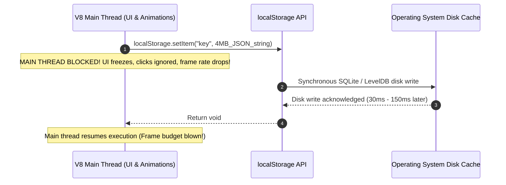
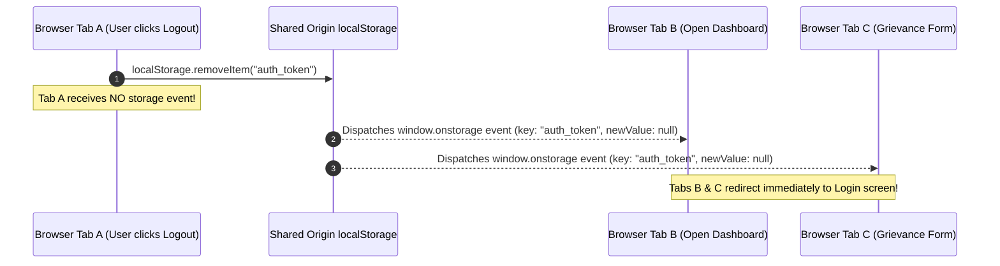
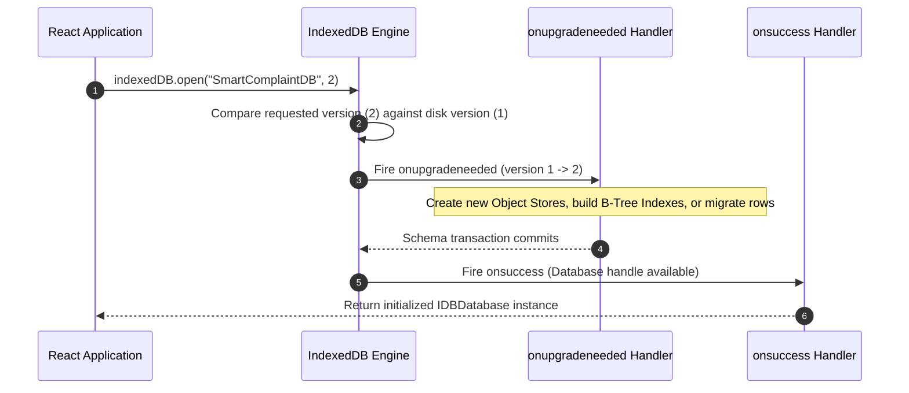
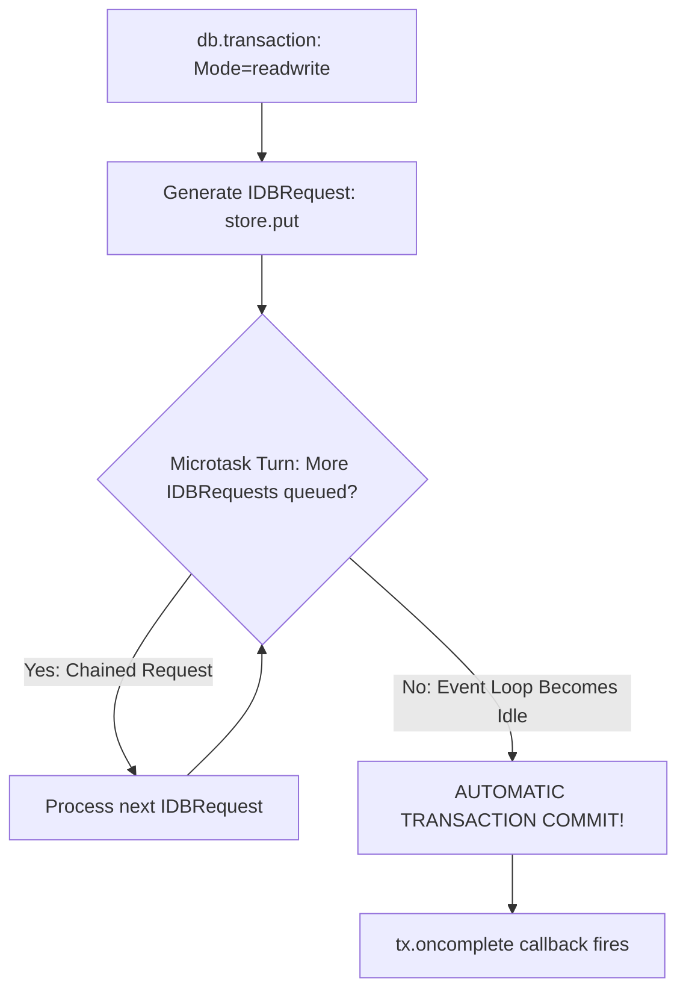
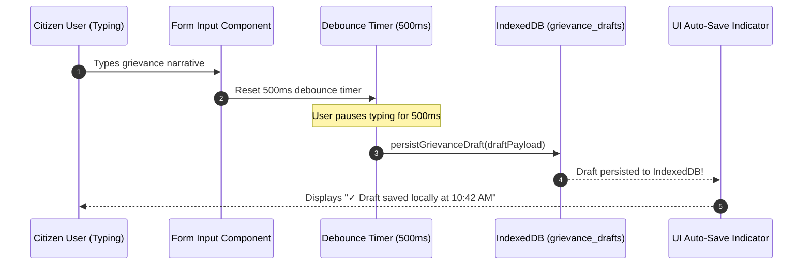

# Guide 15: Client-Side Storage & Session State

This manual serves as the authoritative systems engineering reference for **Browser Storage Architectures**, `localStorage`, `sessionStorage`, asynchronous IndexedDB object stores, Web Cryptography data vaults, storage quota management, cross-tab synchronization buses, and offline-first state persistence across the **Automated Smart Complaint Routing & Workflow Automation Platform**.

In our platform, while backend business workflows execute across FastAPI, Pydantic, and SQLite ([Guide 02: FastAPI & Modern ASGI Web Architecture](02_FASTAPI_ASGI_WEB_ARCHITECTURE.md), [Guide 03: Pydantic V2 Data Validation & Schemas](03_PYDANTIC_V2_DATA_VALIDATION_AND_SCHEMAS.md), and [Guide 04: SQLite Storage Mechanics & WAL Mode](04_SQLITE_STORAGE_MECHANICS_AND_WAL_MODE.md)), the citizen and officer user experiences are mediated through browser web applications ([Guide 07: React 18 & Virtual DOM Architecture](07_REACT_18_AND_VIRTUAL_DOM_ARCHITECTURE.md)). 

Modern web applications require reliable client-side storage to:
* Cache authentication JWT tokens and user profile state to avoid unneeded round-trip network latency on page refreshes.
* Auto-save multi-step grievance drafts, ensuring that if a citizen accidentally closes their browser tab or suffers an intermittent network drop, their partially typed complaint is never lost.
* Synchronize session logout events across multiple open browser tabs in real time.
* Cache municipal department catalogs and GIS routing polygons locally for instant UI rendering.

However, client-side storage is fraught with performance and security hazards: synchronous Web Storage calls block the browser's V8 main thread ([Guide 06: JavaScript Runtime & V8 Engine Mechanics](06_JAVASCRIPT_RUNTIME_AND_V8_MECHANICS.md)), storage quotas trigger silent browser write rejections, and insecure token storage exposes credentials to Cross-Site Scripting (XSS) exfiltration.

To build resilient, high-performance web frontends, engineers must master the fundamental mechanics of browser storage engines, transactional object databases, and client-side encryption.

### Pedagogical Architecture & Monotonic Ordering Doctrine
This manual is structured with **strict monotonic prerequisite ordering**. Every chapter builds exclusively upon foundations established in earlier chapters or referenced from prior foundational manuals:
* No chapter requires concepts from higher-numbered chapters. The browser storage taxonomy precedes synchronous I/O mechanics; synchronous I/O precedes `localStorage` and `sessionStorage`; storage APIs precede quotas and eviction; quotas precede serialization challenges; serialization precedes cross-tab synchronization; synchronization precedes security and Web Cryptography; encryption precedes IndexedDB; IndexedDB architecture precedes transactions and cursors; and cursors precede React persistence hooks, offline draft engines, and automated storage testing.
* Connects directly with foundational and downstream platform engineering manuals:
  - [Guide 06: JavaScript Runtime & V8 Engine Mechanics](06_JAVASCRIPT_RUNTIME_AND_V8_MECHANICS.md) (Main thread event loop starvation caused by synchronous storage I/O)
  - [Guide 07: React 18 & Virtual DOM Architecture](07_REACT_18_AND_VIRTUAL_DOM_ARCHITECTURE.md) (Hydrating React component state from client storage during mounting)
  - [Guide 09: Axios, Fetch & REST Network Protocols](09_AXIOS_FETCH_AND_REST_PROTOCOLS.md) (Injecting stored tokens into HTTP Authorization headers)
  - [Guide 10: Vite & Modern Frontend Build Toolchains](10_VITE_AND_MODERN_BUILD_TOOLCHAINS.md) (Client-side bundle caching and storage polyfills)
  - [Guide 22: Authentication & Cryptographic Hashing](22_AUTHENTICATION_AND_CRYPTOGRAPHIC_HASHING.md) (Token security, XSS defenses, and session expiry)
* Every single line of JavaScript and JSX code in every code block includes an explicit explanatory comment (`//`) detailing the precise runtime action, parameter purpose, and storage implication.

---

## Table of Contents
1. [Chapter 1: The Browser Storage Taxonomy: Cookies vs Web Storage vs IndexedDB vs OPFS](#chapter-1-the-browser-storage-taxonomy-cookies-vs-web-storage-vs-indexeddb-vs-opfs)
2. [Chapter 2: The Synchronous I/O Dilemma: Why `localStorage` Blocks the V8 Main Thread](#chapter-2-the-synchronous-io-dilemma-why-localstorage-blocks-the-v8-main-thread)
3. [Chapter 3: `localStorage` Internal Mechanics: UTF-16 String Encoding, Key-Value Maps & Origin Boundaries](#chapter-3-localstorage-internal-mechanics-utf-16-string-encoding-key-value-maps-origin-boundaries)
4. [Chapter 4: `sessionStorage` Lifecycles: Window Tabs, Iframes, Page Reloads & Transient State](#chapter-4-sessionstorage-lifecycles-window-tabs-iframes-page-reloads-transient-state)
5. [Chapter 5: Storage Quotas & Eviction Policies: 5 MB Limits, QuotaExceededError & `navigator.storage.estimate()`](#chapter-5-storage-quotas-eviction-policies-5-mb-limits-quotaexceedederror-navigatorstorageestimate)
6. [Chapter 6: Serialization & Deserialization Pitfalls: Handling `Date`, `BigInt`, `Set` & Circular Graphs](#chapter-6-serialization-deserialization-pitfalls-handling-date-bigint-set-circular-graphs)
7. [Chapter 7: Cross-Tab Synchronization Part I: The `window.addEventListener("storage")` Event Bus](#chapter-7-cross-tab-synchronization-part-i-the-windowaddeventlistenerstorage-event-bus)
8. [Chapter 8: Cross-Tab Synchronization Part II: Modern Multi-Tab Coordination with `BroadcastChannel`](#chapter-8-cross-tab-synchronization-part-ii-modern-multi-tab-coordination-with-broadcastchannel)
9. [Chapter 9: Authentication Token Storage: The Security Debate (LocalStorage XSS vs HttpOnly Cookie CSRF)](#chapter-9-authentication-token-storage-the-security-debate-localstorage-xss-vs-httponly-cookie-csrf)
10. [Chapter 10: Client-Side Cryptographic Vaults: Encrypting Local Storage with the Web Cryptography API (`SubtleCrypto`)](#chapter-10-client-side-cryptographic-vaults-encrypting-local-storage-with-the-web-cryptography-api-subtlecrypto)
11. [Chapter 11: Introduction to IndexedDB: An Asynchronous NoSQL Object Database in the Browser](#chapter-11-introduction-to-indexeddb-an-asynchronous-nosql-object-database-in-the-browser)
12. [Chapter 12: IndexedDB Architecture: Databases, Schema Versioning & `onupgradeneeded` Handlers](#chapter-12-indexeddb-architecture-databases-schema-versioning-onupgradeneeded-handlers)
13. [Chapter 13: Object Stores & Keys: In-Line Keys, KeyPaths, Auto-Incrementing Generators & Out-of-Line Keys](#chapter-13-object-stores-keys-in-line-keys-keypaths-auto-incrementing-generators-out-of-line-keys)
14. [Chapter 14: IndexedDB Indexes & Query Performance: B-Tree Indexes, Multi-Entry Arrays & Unique Constraints](#chapter-14-indexeddb-indexes-query-performance-b-tree-indexes-multi-entry-arrays-unique-constraints)
15. [Chapter 15: The Transaction Lifecycle: `readonly` vs `readwrite`, Concurrency & Auto-Commit Timeouts](#chapter-15-the-transaction-lifecycle-readonly-vs-readwrite-concurrency-auto-commit-timeouts)
16. [Chapter 16: Cursors & Range Queries: `IDBKeyRange` (Lower, Upper, Bound) & Direction Traversal](#chapter-16-cursors-range-queries-idbkeyrange-lower-upper-bound-direction-traversal)
17. [Chapter 17: Promisifying IndexedDB: Eliminating Callback Hell with Async/Await Wrappers](#chapter-17-promisifying-indexeddb-eliminating-callback-hell-with-asyncawait-wrappers)
18. [Chapter 18: State Persistence in React: Building a Resilient `useLocalStorage` Custom Hook](#chapter-18-state-persistence-in-react-building-a-resilient-uselocalstorage-custom-hook)
19. [Chapter 19: Offline Draft Auto-Save Engine in SmartComplaintHandler: Debounced Storage of Unsubmitted Grievances](#chapter-19-offline-draft-auto-save-engine-in-smartcomplainthandler-debounced-storage-of-unsubmitted-grievances)
20. [Chapter 20: Cache Invalidation, Schema Migrations & Storage Garbage Collection in Production](#chapter-20-cache-invalidation-schema-migrations-storage-garbage-collection-in-production)
21. [Chapter 21: Unit Testing Storage Harnesses: Mocking `localStorage` and `indexedDB` in Jest / Vitest](#chapter-21-unit-testing-storage-harnesses-mocking-localstorage-and-indexeddb-in-jest-vitest)
22. [Chapter 22: The Browser Storage & Session Persistence Systems Engineering Mastery Checklist](#chapter-22-the-browser-storage-session-persistence-systems-engineering-mastery-checklist)

---

## Chapter 1: The Browser Storage Taxonomy: Cookies vs Web Storage vs IndexedDB vs OPFS

### 1.1 The Client-Side Storage Matrix

Modern web browsers provide multiple distinct persistence mechanisms, each engineered for specific access patterns, data volumes, and security postures:

| Storage Engine | Execution Model | Storage Capacity | Data Types Stored | Automatically Sent to Server? | Primary Platform Use Case |
| :--- | :--- | :--- | :--- | :--- | :--- |
| **HTTP Cookies** | Synchronous | $\approx 4\text{ KB}$ per cookie | String text only | **Yes** (Sent on every HTTP request) | Session identifiers, CSRF tokens |
| **`sessionStorage`** | Synchronous | $\approx 5\text{ MB}$ per origin | String text only | **No** (Client-side only) | Multi-step wizard page progress |
| **`localStorage`** | Synchronous | $\approx 5\text{ MB}$ per origin | String text only | **No** (Client-side only) | User UI preferences (Dark mode) |
| **`IndexedDB`** | **Asynchronous** | Hundreds of MBs / GBs | Structured objects, Blobs | **No** (Client-side only) | Offline complaint drafts, evidence photos |
| **Origin Private File System (OPFS)** | Asynchronous | Hundreds of MBs / GBs | Raw binary file handles | **No** (Client-side only) | Client-side SQLite databases (WASM) |

### 1.2 The Evolution from Cookies to Modern Storage

Historically, cookies were the only mechanism to preserve state between page visits. However, because the browser appends all domain cookies to the `Cookie:` HTTP header of **every single network request** (including images, CSS stylesheets, and API calls), storing large application state in cookies wastes tens of kilobytes of upstream network bandwidth.

Web Storage (`localStorage` / `sessionStorage`) and IndexedDB were introduced to decouple client-side persistence from network transmission, allowing megabytes of data to live strictly inside the browser sandbox.

---

## Chapter 2: The Synchronous I/O Dilemma: Why `localStorage` Blocks the V8 Main Thread

### 2.1 The Architectural Flaw of Synchronous Web Storage

As explored in [Guide 06: JavaScript Runtime & V8 Engine Mechanics](06_JAVASCRIPT_RUNTIME_AND_V8_MECHANICS.md), JavaScript in the browser executes on a **single main execution thread**. This single thread handles:
1. JavaScript bytecode execution
2. React Virtual DOM reconciliation ([Guide 07: React 18 & Virtual DOM Architecture](07_REACT_18_AND_VIRTUAL_DOM_ARCHITECTURE.md))
3. Browser style calculations, layout, and pixel painting (targeting 60 frames per second = $16.6\text{ms}$ budget per frame).

The Web Storage specification (`localStorage.getItem()`, `localStorage.setItem()`) defines a **synchronous blocking API**:
```javascript
// Calling setItem halts JavaScript execution until OS disk write acknowledges!
localStorage.setItem("complaint_backup", largeJsonPayloadString); // Synchronous disk I/O
```



### 2.2 Quantifying the Latency Impact

Under modern operating systems, `localStorage` writes are backed by internal database engines (Chromium uses LevelDB; Firefox and Safari use SQLite). 

When host disks experience write contention (e.g., during virus scans or heavy background downloading):
* A `localStorage.setItem()` call containing 2 MB of JSON data can block the V8 main thread for **$50\text{ms}$ to $200\text{ms}$**!
* User input clicks during this window are queued or dropped, animations stutter, and Google Core Web Vitals (Interaction to Next Paint / INP) metrics degrade severely.

**The Golden Engineering Rule of Web Storage**:
* Use `localStorage` exclusively for tiny, sub-100-kilobyte key-value strings (e.g., UI theme preference, user language).
* For complex objects, offline queues, or data exceeding 100 KB, **always use IndexedDB**!

---

## Chapter 3: `localStorage` Internal Mechanics: UTF-16 String Encoding, Key-Value Maps & Origin Boundaries

### 3.1 UTF-16 String Storage and Memory Calculations

`localStorage` does **not** store JavaScript objects, arrays, booleans, or numbers natively. **Every key and value is stored strictly as a UTF-16 DOMString**.

If an engineer passes a non-string object to `setItem`, the browser implicitly invokes `.toString()`:
```javascript
// DANGEROUS MISTAKE: Implicit object stringification
const complaintDraft = { id: "TICKET-101", priority: "HIGH" }; // Object instance
localStorage.setItem("active_draft", complaintDraft); // Coerces object to string "[object Object]"
const retrievedDraft = localStorage.getItem("active_draft"); // Returns literal string "[object Object]"
// Data permanently lost because JSON.stringify was omitted!
```

Because Web Storage strings use 16-bit code units (UTF-16), each character consumes **2 bytes of storage**. Therefore, a 5 MB storage quota holds approximately $2.5 \times 10^6$ characters!

### 3.2 The Same-Origin Policy (SOP) Boundary

`localStorage` is strictly isolated by the browser's **Same-Origin Policy (SOP)**. An origin is defined by the triple:
$$\text{Origin} = (\text{Protocol}, \text{Domain}, \text{Port})$$

* `https://smartcomplaint.gov:443`
* `http://smartcomplaint.gov:80` (Different protocol $\rightarrow$ completely isolated storage!)
* `https://api.smartcomplaint.gov:443` (Different subdomain $\rightarrow$ completely isolated storage!)
* `https://smartcomplaint.gov:8443` (Different port $\rightarrow$ completely isolated storage!)

Subdomains cannot access each other's `localStorage` unless mediated via `postMessage` or shared cross-origin iframes.

---

## Chapter 4: `sessionStorage` Lifecycles: Window Tabs, Iframes, Page Reloads & Transient State

### 4.1 Tab-Scoped Isolation Mechanics

While `localStorage` persists data across browser restarts and is shared across all open tabs belonging to the same origin, **`sessionStorage` is strictly scoped to a single top-level browsing context (the individual browser tab)**:

```
+-----------------------------------------------------------------------------------+
|                     BROWSER STORAGE ISOLATION MATRIX                              |
+-----------------------------------------------------------------------------------+
| Action                                  | localStorage       | sessionStorage     |
+-----------------------------------------+--------------------+--------------------+
| Page Refresh (F5 / Ctrl+R)              | Preserved          | Preserved          |
| Open New Tab to Same URL                | Shared             | SEPARATE / EMPTY   |
| Duplicate Tab (Right Click -> Duplicate)| Shared             | CLONED at fork time|
| Close Tab and Reopen                    | Preserved          | DESTROYED          |
| Restart Entire Browser                  | Preserved          | DESTROYED          |
+-----------------------------------------------------------------------------------+
```

### 4.2 Production Use Case: Multi-Step Grievance Wizard

`sessionStorage` is the ideal storage medium for multi-step form workflows. If a citizen opens two separate browser tabs to file two distinct complaints simultaneously:
* Storing wizard progress in `localStorage` would cause Tab 1 to overwrite Tab 2's category and fields.
* Storing wizard progress in `sessionStorage` isolates each tab's form state completely!

```javascript
// Safely persisting multi-step complaint wizard progress in tab-isolated sessionStorage
export function saveWizardStepState(stepNumber, formFields) { // Helper function for wizard persistence
  const storagePayload = JSON.stringify({ // Serializes state object to valid JSON string
    step: stepNumber, // Current active step integer
    fields: formFields, // Form input fields object
    lastSavedEpoch: Date.now(), // Millisecond epoch timestamp
  }); // Serialization complete
  sessionStorage.setItem("grievance_wizard_state", storagePayload); // Persists string into tab session
} // Function complete

export function restoreWizardStepState() { // Restores wizard progress on tab reload
  const rawData = sessionStorage.getItem("grievance_wizard_state"); // Retrieves raw JSON string
  if (!rawData) { // Checks whether saved session state exists
    return null; // Returns null when no session state is found
  } // Guard complete
  try { // Enforces safe JSON parsing block
    return JSON.parse(rawData); // Deserializes and returns state object
  } catch (error) { // Catches malformed JSON string errors
    sessionStorage.removeItem("grievance_wizard_state"); // Purges corrupted state key
    return null; // Returns null on corruption
  } // Error block complete
} // Function complete
```

---

## Chapter 5: Storage Quotas & Eviction Policies: 5 MB Limits, QuotaExceededError & `navigator.storage.estimate()`

### 5.1 The `QuotaExceededError` Exception

When the volume of data stored in `localStorage` exceeds the browser quota (typically **5 MB to 10 MB** depending on the browser engine), the browser does not overwrite older keys. Instead, it synchronously throws a DOMException:
`QuotaExceededError: Failed to execute 'setItem' on 'Storage': Setting the value of 'key' exceeded the quota.`

If unhandled, this uncaught exception crashes the calling React component and breaks application execution!

```javascript
// Production-grade safe setItem with quota overflow handling
export function safeLocalStorageSet(key, valueString) { // Safe storage write wrapper
  try { // Attempts synchronous storage write
    localStorage.setItem(key, valueString); // Writes string into localStorage
    return true; // Returns true denoting successful write operation
  } catch (err) { // Catches storage exceptions
    if (err.name === "QuotaExceededError" || err.code === 22) { // Evaluates standard quota overflow error
      console.warn(`[STORAGE QUOTA] LocalStorage quota exceeded while writing key: ${key}`); // Emits warning
      // Execute emergency eviction of non-critical cache keys
      localStorage.removeItem("cached_department_catalog"); // Evicts department catalog cache
      localStorage.removeItem("analytics_event_buffer"); // Evicts analytics buffer
      try { // Re-attempts write following emergency cache clearance
        localStorage.setItem(key, valueString); // Re-executes write
        return true; // Write succeeded after eviction
      } catch (retryErr) { // Quota still exceeded
        console.error("[STORAGE FATAL] Storage full even after cache eviction!"); // Logs fatal storage error
        return false; // Returns false signaling persistent failure
      } // Retry block complete
    } // Error branch complete
    return false; // Returns false for non-quota errors
  } // Catch block complete
} // Function complete
```

### 5.2 Querying Browser Storage Quotas with `navigator.storage.estimate()`

Modern browsers expose the asynchronous **StorageManager API**, allowing web applications to query exact storage usage and available capacity:

```javascript
// Asynchronous storage capacity audit using modern StorageManager API
export async function auditBrowserStorageCapacity() { // Queries browser storage quotas
  if (navigator.storage && navigator.storage.estimate) { // Validates browser API support
    const quotaEstimate = await navigator.storage.estimate(); // Asynchronously queries quota metrics
    const usedBytes = quotaEstimate.usage || 0; // Total bytes currently consumed by origin
    const totalAllowedBytes = quotaEstimate.quota || 0; // Total byte quota allocated by browser
    const usedMegabytes = (usedBytes / (1024 * 1024)).toFixed(2); // Converts usage to megabytes
    const quotaMegabytes = (totalAllowedBytes / (1024 * 1024)).toFixed(2); // Converts quota to megabytes
    const percentageUsed = ((usedBytes / totalAllowedBytes) * 100).toFixed(1); // Computes percentage
    return { // Returns structured capacity telemetry object
      usedMB: parseFloat(usedMegabytes), // Consumed storage in megabytes
      quotaMB: parseFloat(quotaMegabytes), // Total allowed storage in megabytes
      percentUsed: parseFloat(percentageUsed), // Percentage of quota consumed
    }; // Object complete
  } // Guard complete
  return null; // Returns null if StorageManager API is unsupported in host browser
} // Function complete
```

---

## Chapter 6: Serialization & Deserialization Pitfalls: Handling `Date`, `BigInt`, `Set` & Circular Graphs

### 6.1 The Silent Data Mutilation of `JSON.stringify`

Because `localStorage` and `sessionStorage` store strings exclusively, developers rely on `JSON.stringify()` and `JSON.parse()`. However, standard JSON has a severely restricted type system (Strings, Numbers, Booleans, Null, Arrays, and Plain Objects).

Passing advanced JavaScript types into `JSON.stringify()` results in silent data loss or fatal runtime exceptions:
1. **`Date` Objects**: Serialized into ISO-8601 strings (`"2026-09-12T10:00:00.000Z"`). When parsed back with `JSON.parse()`, they remain **plain strings**, not `Date` instances! Calling `.getTime()` or `.toISOString()` on the restored property throws `TypeError: ticket.createdAt.getTime is not a function`!
2. **`BigInt` Numbers**: Throws a fatal exception: `TypeError: Do not know how to serialize a BigInt`.
3. **`Set` and `Map`**: Serialized into empty objects (`{}`) or ignored, wiping out all elements!
4. **`undefined` and Functions**: Object properties with `undefined` or function values are silently dropped from the serialized string.
5. **Circular Object Graphs**: Throws `TypeError: Converting circular structure to JSON`!

### 6.2 The Custom Replacer and Reviver Protocol

To serialize complex domain entities safely, engineers supply custom **Replacer** and **Reviver** functions to `JSON.stringify` and `JSON.parse`:

```javascript
// Custom JSON serialization protocol with explicit type metadata preservation
export function serializeDomainState(dataObject) { // Serializes domain object with type preservation
  return JSON.stringify(dataObject, (key, value) => { // Custom replacer function for JSON.stringify
    if (value instanceof Date) { // Detects Date instances
      return { __type: "Date", iso: value.toISOString() }; // Wraps Date into typed envelope object
    } // Date check complete
    if (typeof value === "bigint") { // Detects BigInt primitive values
      return { __type: "BigInt", value: value.toString() }; // Wraps BigInt into typed string envelope
    } // BigInt check complete
    if (value instanceof Set) { // Detects Set collection instances
      return { __type: "Set", values: Array.from(value) }; // Converts Set to array envelope
    } // Set check complete
    return value; // Returns standard primitive or object values unchanged
  }); // Serialization complete
} // Function complete

export function deserializeDomainState(jsonString) { // Deserializes and restores native types
  return JSON.parse(jsonString, (key, value) => { // Custom reviver function for JSON.parse
    if (value && typeof value === "object" && value.__type) { // Checks for typed envelope signature
      if (value.__type === "Date") { // Evaluates Date envelope type
        return new Date(value.iso); // Reconstructs true JavaScript Date instance
      } // Date restoration complete
      if (value.__type === "BigInt") { // Evaluates BigInt envelope type
        return BigInt(value.value); // Reconstructs native BigInt primitive
      } // BigInt restoration complete
      if (value.__type === "Set") { // Evaluates Set envelope type
        return new Set(value.values); // Reconstructs native JavaScript Set collection
      } // Set restoration complete
    } // Envelope check complete
    return value; // Returns value as-is if no typed envelope detected
  }); // Deserialization complete
} // Function complete
```

---

## Chapter 7: Cross-Tab Synchronization Part I: The `window.addEventListener("storage")` Event Bus

### 7.1 The Architectural Counter-Intuition of the `storage` Event

When an application is open across multiple browser tabs, changes in one tab (e.g., logging out or submitting a complaint) should reflect instantly across all other tabs without requiring manual page refreshes.

The browser provides the **`storage` event**:
```javascript
window.addEventListener("storage", (event) => { /* Cross-tab storage event handler */ }); // Event listener
```

**The Critical Architectural Catch**:
* The `storage` event is dispatched **exclusively to other tabs/windows belonging to the same origin**!
* The specific tab that executed `localStorage.setItem()` or `removeItem()` **never receives the event**!
* `sessionStorage` changes **never trigger the `storage` event**, because `sessionStorage` is private to each individual tab.



### 7.2 The `StorageEvent` Payload

The event object passed to the callback contains exhaustive change metadata:

```javascript
// Global cross-tab synchronization listener for authentication and session events
export function registerCrossTabStorageListener(onSessionLogout) { // Registers storage bus handler
  const handleStorageEvent = (event) => { // Event callback function
    // Filter only events originating from localStorage mutations
    if (event.storageArea !== localStorage) { // Verifies event originated from localStorage
      return; // Ignores non-localStorage events
    } // Guard complete
    
    // Evaluate if authentication token key was removed in a peer tab
    if (event.key === "auth_jwt_token" && event.newValue === null) { // Detects external logout action
      console.info(`[CROSS-TAB SYNC] Logout detected from peer window: ${event.url}`); // Logs event origin
      onSessionLogout(); // Executes logout callback redirecting user to login screen
    } // Key check complete
  }; // Callback complete
  
  window.addEventListener("storage", handleStorageEvent); // Attaches listener to window event bus
  return () => window.removeEventListener("storage", handleStorageEvent); // Returns cleanup unsubscriber
} // Function complete
```

---

## Chapter 8: Cross-Tab Synchronization Part II: Modern Multi-Tab Coordination with `BroadcastChannel`

### 8.1 The Limitations of the `storage` Event

While the `storage` event provides primitive cross-tab notification, it has severe architectural drawbacks:
1. It forces messages to be written to persistent disk storage (`localStorage`) even for transient communication.
2. It requires manual string serialization and deserialization.
3. It cannot send messages within the same tab or to Web Workers.

### 8.2 The `BroadcastChannel` Protocol

The modern **BroadcastChannel API** creates a dedicated, in-memory, bidirectional publish-subscribe message bus between all browsing contexts (windows, tabs, iframes, Web Workers, and Service Workers) sharing the same origin:

```javascript
// Cross-tab real-time communication channel using BroadcastChannel API
export class PlatformCrossTabBus { // Enterprise multi-tab pub-sub coordinator
  constructor(channelName = "smartcomplaint_internal_bus") { // Initializes channel with namespace
    this.channel = new BroadcastChannel(channelName); // Instantiates native BroadcastChannel
    this.listeners = new Map(); // Maps message types to registered callback functions
    
    this.channel.onmessage = (event) => { // Listens for incoming broadcast messages from peer tabs
      const { messageType, payload } = event.data || {}; // Deserializes structured message envelope
      if (this.listeners.has(messageType)) { // Checks if listener is registered for message type
        this.listeners.get(messageType).forEach((callback) => callback(payload)); // Dispatches payload
      } // Dispatch complete
    }; // Handler complete
  } // Constructor complete
  
  publish(messageType, payload) { // Publishes message to all other open tabs
    this.channel.postMessage({ messageType, payload, originEpoch: Date.now() }); // Posts envelope
  } // Publish complete
  
  subscribe(messageType, callback) { // Subscribes to specific message event type
    if (!this.listeners.has(messageType)) { // Initializes handler array for new message type
      this.listeners.set(messageType, []); // Sets empty listener array
    } // Initialization complete
    this.listeners.get(messageType).push(callback); // Adds callback to handler list
  } // Subscribe complete
  
  close() { // Closes broadcast channel releasing browser resources
    this.channel.close(); // Terminates native channel connection
  } // Close complete
} // Class complete
```

---

## Chapter 9: Authentication Token Storage: The Security Debate (LocalStorage XSS vs HttpOnly Cookie CSRF)

### 9.1 The Security Threat Vectors: XSS vs CSRF

The software engineering community has debated where to store JSON Web Tokens (JWTs) for over a decade. The trade-off is between two catastrophic attack vectors:

| Storage Location | Primary Vulnerability | Attack Mechanics | Mitigation Strategy |
| :--- | :--- | :--- | :--- |
| **`localStorage`** | **Cross-Site Scripting (XSS)** | Any JavaScript script (malicious NPM dependency, third-party analytics script, or injected comment) can execute `localStorage.getItem("token")` and exfiltrate the user's credentials to an attacker server! | Strict Content Security Policy (CSP), sanitizing DOM inputs, subresource integrity. |
| **`HttpOnly Cookies`** | **Cross-Site Request Forgery (CSRF)** | JavaScript **cannot read** the cookie. However, the browser automatically sends the cookie on cross-site requests, allowing malicious websites to forge actions on behalf of the user! | `SameSite=Lax` / `SameSite=Strict` cookie attributes, custom anti-CSRF headers (`X-Requested-With`). |

```mermaid
graph TD
    subgraph LocalStorage Vulnerability: XSS Attack
        A[Malicious Script in Third-Party NPM Package] -->|Executes inside page context| B[localStorage.getItem('jwt_token')]
        B -->|Reads Secret Token Directly| C[Exfiltrates Token to Attacker Server]
        C -->|Attacker Impersonates User Forever| D[Total Account Takeover]
    end

    subgraph HttpOnly Cookie Protection
        E[Malicious Script in Third-Party NPM Package] -->|Attempts document.cookie access| F{Cookie has HttpOnly flag?}
        F -->|Yes: Browser Denies Access| G[document.cookie returns empty string!]
        G -->|Token Cannot Be Read by JavaScript| H[Exfiltration Blocked Completely]
    end
```

### 9.2 The Enterprise Architecture: The Dual-Token Hybrid Model

`SmartComplaintHandler` adopts the industry-standard **Dual-Token Architecture**:
1. **Short-Lived Access Token (15-Minute Expiry)**: Stored strictly in **JavaScript In-Memory State** (React Context / memory variable). Never written to `localStorage`! If XSS occurs, the token is not on disk and expires in minutes.
2. **Long-Lived Refresh Token (7-Day Expiry)**: Stored in an **`HttpOnly, Secure, SameSite=Strict` Cookie**. JavaScript cannot access this cookie under any circumstances.
3. **Silent Refresh**: When the in-memory access token expires, Axios intercepts the 401 response and requests a new access token from `/api/v1/auth/refresh`, which uses the secure cookie automatically ([Guide 09: Axios, Fetch & REST Network Protocols](09_AXIOS_FETCH_AND_REST_PROTOCOLS.md)).

---

## Chapter 10: Client-Side Cryptographic Vaults: Encrypting Local Storage with the Web Cryptography API (`SubtleCrypto`)

### 10.1 Defense-in-Depth for Client-Side Sensitive Data

When an application must store semi-sensitive information locally (e.g., offline unsubmitted grievance drafts containing citizen phone numbers or addresses), storing them as plaintext JSON in `localStorage` allows physical device observers or browser inspection tools to read the data.

To protect client-side data at rest, we employ the browser's hardware-accelerated **Web Cryptography API (`window.crypto.subtle`)**:
* **Key Derivation**: PBKDF2 with SHA-256 and 100,000 iterations derived from a user passphrase or device master key.
* **Encryption Algorithm**: AES-GCM (Galois/Counter Mode) with 256-bit keys and a unique 12-byte initialization vector (IV) per encryption.

```javascript
// Hardware-accelerated client-side encryption vault using native Web Cryptography API
export class ClientStorageCryptoVault { // Enterprise client-side encryption coordinator
  static async deriveKey(passphrase, saltBuffer) { // Derives AES-256 key from passphrase via PBKDF2
    const textEncoder = new TextEncoder(); // Instantiates text encoder for byte conversion
    const baseKey = await crypto.subtle.importKey( // Imports raw passphrase bytes
      "raw", // Raw key format
      textEncoder.encode(passphrase), // Encodes passphrase string to byte buffer
      "PBKDF2", // Algorithm identifier
      false, // Key cannot be extracted
      ["deriveKey"] // Key usage permissions
    ); // Key import complete
    
    return crypto.subtle.deriveKey( // Derives symmetric AES-GCM encryption key
      { name: "PBKDF2", salt: saltBuffer, iterations: 100000, hash: "SHA-256" }, // PBKDF2 params
      baseKey, // Base key material
      { name: "AES-GCM", length: 256 }, // Target algorithm specification
      false, // Key cannot be exported
      ["encrypt", "decrypt"] // Allowed cryptographic operations
    ); // Symmetric key derived
  } // Method complete

  static async encryptPayload(plainText, passphrase) { // Encrypts plaintext string to base64 payload
    const textEncoder = new TextEncoder(); // Text encoder instance
    const salt = crypto.getRandomValues(new Uint8Array(16)); // Generates cryptographically secure 16-byte salt
    const iv = crypto.getRandomValues(new Uint8Array(12)); // Generates unique 12-byte IV for AES-GCM
    const aesKey = await this.deriveKey(passphrase, salt); // Derives symmetric encryption key
    
    const cipherBuffer = await crypto.subtle.encrypt( // Encrypts plaintext bytes
      { name: "AES-GCM", iv: iv }, // AES-GCM parameters with initialization vector
      aesKey, // Injected symmetric key
      textEncoder.encode(plainText) // Plaintext byte buffer
    ); // Encryption complete
    
    // Assemble composite package: Salt + IV + Ciphertext
    return JSON.stringify({ // Serializes composite cryptographic payload to JSON
      salt: Array.from(salt), // Base-10 byte array representation of salt
      iv: Array.from(iv), // Base-10 byte array representation of initialization vector
      cipher: Array.from(new Uint8Array(cipherBuffer)), // Encrypted ciphertext bytes
    }); // Serialization complete
  } // Method complete
} // Class complete
```

---

## Chapter 11: Introduction to IndexedDB: An Asynchronous NoSQL Object Database in the Browser

### 11.1 The Need for an In-Browser Database

While `localStorage` and `sessionStorage` provide simple key-value string storage, enterprise web applications require:
* Storing rich structured objects (JavaScript objects, typed arrays, `Blob` images, and `File` handles) without costly stringification.
* Non-blocking asynchronous I/O that never freezes the V8 main execution thread.
* Secondary indexes to perform fast range queries ($O(\log N)$) on non-primary-key attributes (e.g., querying complaints by `assignedDepartment` or `submissionStatus`).
* Multi-megabyte and multi-gigabyte storage quotas.
* Transactional atomicity guaranteeing that multi-record updates either succeed completely or roll back cleanly.

The browser platform satisfies all these requirements through **IndexedDB**.

### 11.2 The Structured Clone Algorithm

Unlike `localStorage`, which forces every value through UTF-16 string conversion, IndexedDB utilizes the browser's native **Structured Clone Algorithm**:
* JavaScript `Date` instances, `RegExp` objects, `Map`, `Set`, `ArrayBuffer`, and `Blob` payloads are cloned and persisted in their true binary/object representations!
* Circular references (`obj.self = obj`) are preserved without throwing exceptions.
* Upon retrieval, objects re-emerge with their native prototypes and binary buffers intact!

---

## Chapter 12: IndexedDB Architecture: Databases, Schema Versioning & `onupgradeneeded` Handlers

### 12.1 The Schema Versioning Contract

IndexedDB operates under a strict **Schema Versioning Contract**:
1. When opening a database (`indexedDB.open(name, version)`), the version must be an integer ($\ge 1$).
2. You **cannot** create, modify, or delete Object Stores or Indexes inside normal transaction handlers.
3. Schema modifications are permitted **exclusively inside the `onupgradeneeded` lifecycle event**, which fires only when:
   * The database is being opened for the very first time on this client machine; or
   * The requested integer version is higher than the currently persisted version on disk.



### 12.2 Production Database Initialization Implementation

```javascript
// Opens or initializes the SmartComplaintHandler IndexedDB database
export function openPlatformDatabase() { // Initializes IndexedDB connection
  return new Promise((resolve, reject) => { // Wraps event-based API in Promise
    const DB_NAME = "SmartComplaintDB"; // Database namespace string
    const DB_VERSION = 1; // Integer schema version
    
    const openRequest = indexedDB.open(DB_NAME, DB_VERSION); // Requests database open handle
    
    openRequest.onupgradeneeded = (event) => { // Lifecycle event for DDL schema mutations
      const db = openRequest.result; // Extracts active IDBDatabase instance
      console.info(`[INDEXEDDB] Upgrading schema to version ${DB_VERSION}`); // Telemetry log
      
      // Create primary Object Store for caching offline grievance drafts
      if (!db.objectStoreNames.contains("grievance_drafts")) { // Checks if store exists
        const draftStore = db.createObjectStore("grievance_drafts", { // Creates object store
          keyPath: "draftId", // Designates draftId property as in-line primary key
          autoIncrement: false, // Disables automatic numeric key generation
        }); // Store creation complete
        
        // Build secondary B-Tree indexes for fast querying
        draftStore.createIndex("by_department", "department", { unique: false }); // Department index
        draftStore.createIndex("by_updated_at", "updatedAt", { unique: false }); // Timestamp index
      } // Store branch complete
    }; // Upgrade complete
    
    openRequest.onsuccess = () => resolve(openRequest.result); // Resolves promise with database instance
    openRequest.onerror = () => reject(openRequest.error); // Rejects promise on database open failure
  }); // Promise complete
} // Function complete
```

---

## Chapter 13: Object Stores & Keys: In-Line Keys, KeyPaths, Auto-Incrementing Generators & Out-of-Line Keys

### 13.1 Object Stores vs Relational Tables

In IndexedDB, an **Object Store** is the equivalent of an SQL table or MongoDB collection. However, Object Stores are schema-free: individual records inside the same store do not need to share the same property fields, though they must all possess a valid primary key.

### 13.2 In-Line Keys vs Out-of-Line Keys

IndexedDB supports two fundamentally different key architectures:

| Key Architecture | Definition | Creation Syntax | Data Placement | Primary Use Case |
| :--- | :--- | :--- | :--- | :--- |
| **In-Line Key (`keyPath`)** | The primary key is a named property stored directly *inside* the record object. | `{ keyPath: "id" }` | Part of the object (`{ id: "T-101", title: "..." }`) | Domain entities, complaints, users |
| **Out-of-Line Key** | The key is stored *externally* in a separate internal B-tree index, outside the object. | `{}` (No keyPath) | Passed separately: `store.put(data, externalKey)` | Binary blobs, files, cached HTTP responses |
| **Auto-Incrementing Key** | The database engine automatically generates a monotonically increasing integer. | `{ autoIncrement: true }` | Handled by database engine ($1, 2, 3...$) | Audit logs, local offline event queues |

---

## Chapter 14: IndexedDB Indexes & Query Performance: B-Tree Indexes, Multi-Entry Arrays & Unique Constraints

### 14.1 Secondary B-Tree Index Mechanics

Without an index, finding all complaints belonging to the `"WATER"` department requires a full linear scan of every record in the Object Store ($O(N)$ operations).

When an index is created (`store.createIndex("by_department", "department", { unique: false })`):
* IndexedDB constructs an internal secondary B-tree sorted by the indexed property.
* Queries against the index execute in logarithmic time ($O(\log N)$).

### 14.2 Multi-Entry Array Indexes

A powerful feature of IndexedDB is the **`multiEntry` index**, engineered specifically for searching arrays of tags or categories:

```javascript
// Configures multi-entry index for tag arrays inside onupgradeneeded
export function configureTagMultiEntryIndex(store) { // Configures array indexing
  // When multiEntry is true, IndexedDB adds a separate index entry for EACH element in the array
  store.createIndex("by_tags", "tags", { // Creates multi-entry index on tags array property
    unique: false, // Allows duplicate tags across multiple records
    multiEntry: true, // Indexes each individual string element within the tags array
  }); // Index creation complete
} // Function complete
```

If a complaint has `tags: ["leak", "emergency", "pipeline"]`, the record is indexed under all three terms independently. A query for `"emergency"` locates the record instantly!

---

## Chapter 15: The Transaction Lifecycle: `readonly` vs `readwrite`, Concurrency & Auto-Commit Timeouts

### 15.1 The Transaction Isolation Modes

Every interaction with an IndexedDB Object Store must execute inside an explicit **Transaction**:
```javascript
const tx = db.transaction(["grievance_drafts"], "readwrite"); // Initiates readwrite transaction
```

IndexedDB defines three transaction modes:
1. **`readonly`**: Multiple `readonly` transactions can execute concurrently across the same Object Store. Reads are completely non-blocking.
2. **`readwrite`**: Grants write permission. Only one `readwrite` transaction can access a specific Object Store at any time. Other transactions are queued, preventing race conditions.
3. **`versionchange`**: Exclusive lock across the entire database. Can only be created by the browser during `onupgradeneeded`.



### 15.2 The Auto-Commit Gotcha: The Asynchronous Trap

A common failure mode for developers new to IndexedDB is attempting to perform external async operations (`fetch()`, `setTimeout()`) inside an IndexedDB transaction:

```javascript
// DISASTROUS ANTI-PATTERN: Transaction auto-commit timeout!
const tx = db.transaction(["grievance_drafts"], "readwrite"); // Opens transaction
const store = tx.objectStore("grievance_drafts"); // Obtains store reference
const response = await fetch("/api/v1/complaints/draft-token"); // ASYNC FETCH!
// FATAL ERROR: While fetch() awaited network, the V8 event loop turned!
// IndexedDB detected no active requests and AUTO-COMMITTED the transaction!
store.put({ id: "101", token: await response.json() }); // Throws InvalidStateError!
```

**The Strict Transaction Invariant**: You must gather all data **before** opening the transaction, or keep requests executing in an unbroken chain of IDB callbacks.

---

## Chapter 16: Cursors & Range Queries: `IDBKeyRange` (Lower, Upper, Bound) & Direction Traversal

### 16.1 Querying with `IDBKeyRange`

To query a subset of records from an index, IndexedDB provides the **`IDBKeyRange`** mathematical bounding utility:

| Method | Boundary Formula | Description |
| :--- | :--- | :--- |
| `IDBKeyRange.only(val)` | $x = \text{val}$ | Exact equality match |
| `IDBKeyRange.lowerBound(val, true)` | $x > \text{val}$ | Open lower bound (greater than) |
| `IDBKeyRange.lowerBound(val, false)` | $x \ge \text{val}$ | Closed lower bound (greater than or equal) |
| `IDBKeyRange.upperBound(val, false)` | $x \le \text{val}$ | Closed upper bound (less than or equal) |
| `IDBKeyRange.bound(a, b, false, false)` | $a \le x \le b$ | Closed interval range between $a$ and $b$ |

### 16.2 Iterating Records with Cursors

A **Cursor (`IDBCursorWithValue`)** iterates across thousands of matching records sequentially with minimal memory overhead:

```javascript
// Queries complaints updated within a specific timestamp window using an IDB cursor
export function queryDraftsByTimeWindow(db, startEpoch, endEpoch) { // Range cursor query helper
  return new Promise((resolve, reject) => { // Promisifies cursor traversal
    const tx = db.transaction(["grievance_drafts"], "readonly"); // Read-only transaction
    const store = tx.objectStore("grievance_drafts"); // Store handle
    const timeIndex = store.index("by_updated_at"); // Index handle
    
    // Define closed time boundary range: startEpoch <= updatedAt <= endEpoch
    const timeRange = IDBKeyRange.bound(startEpoch, endEpoch, false, false); // Range definition
    const matchingRecords = []; // Result accumulator array
    
    const cursorRequest = timeIndex.openCursor(timeRange, "prev"); // Opens cursor in reverse chronological order
    
    cursorRequest.onsuccess = (event) => { // Success handler invoked for every matching record
      const cursor = event.target.result; // Extracts active cursor instance
      if (cursor) { // If cursor points to a valid record
        matchingRecords.push(cursor.value); // Collects record payload
        cursor.continue(); // Advances cursor to next record in index
      } else { // Cursor reached end of range
        resolve(matchingRecords); // Resolves promise with all collected records
      } // Branch complete
    }; // Success callback complete
    
    cursorRequest.onerror = () => reject(cursorRequest.error); // Rejects promise on cursor error
  }); // Promise complete
} // Function complete
```

---

## Chapter 17: Promisifying IndexedDB: Eliminating Callback Hell with Async/Await Wrappers

### 17.1 The Asynchronous Callback Legacy

Because the IndexedDB API was standardized before JavaScript introduced Promises and `async`/`await`, its native methods rely on event listener callbacks:
`request.onsuccess = ...` and `request.onerror = ...`.

Chaining multiple database operations using native callbacks produces nested "callback hell". To achieve modern, readable code, enterprise applications wrap `IDBRequest` objects into Promises:

```javascript
// Generic promisification wrapper converting native IDBRequest objects to standard Promises
export function promisifyIDBRequest(idbRequest) { // Wraps IDBRequest in Promise
  return new Promise((resolve, reject) => { // Returns standard ES6 Promise
    idbRequest.onsuccess = () => resolve(idbRequest.result); // Resolves promise with request result
    idbRequest.onerror = () => reject(idbRequest.error); // Rejects promise with request error
  }); // Promise complete
} // Function complete

// Generic promisification wrapper converting native IDBTransaction objects to standard Promises
export function promisifyIDBTransaction(transaction) { // Wraps IDBTransaction lifecycle in Promise
  return new Promise((resolve, reject) => { // Returns standard ES6 Promise
    transaction.oncomplete = () => resolve(); // Resolves promise when transaction commits successfully
    transaction.onerror = () => reject(transaction.error); // Rejects promise on transaction error
    transaction.onabort = () => reject(new Error("IndexedDB transaction was aborted.")); // Abort reject
  }); // Promise complete
} // Function complete
```

### 17.2 Clean Asynchronous CRUD Operations

With these utility helpers, interacting with IndexedDB becomes as clean and intuitive as any modern async ORM:

```javascript
// Clean async/await insertion using promisified IndexedDB helpers
export async function persistGrievanceDraft(db, draftPayload) { // Persists draft record asynchronously
  const tx = db.transaction(["grievance_drafts"], "readwrite"); // Initiates readwrite transaction
  const store = tx.objectStore("grievance_drafts"); // Retrieves object store reference
  
  // Attach last updated timestamp to payload
  const recordWithTimestamp = { ...draftPayload, updatedAt: Date.now() }; // Injects timestamp property
  
  // Issue put request to store and await both operation and transaction completion
  store.put(recordWithTimestamp); // Stages upsert operation in transaction pipeline
  await new Promise((resolve, reject) => { // Awaits transaction commit
    tx.oncomplete = () => resolve(); // Resolves on successful commit
    tx.onerror = () => reject(tx.error); // Rejects on transaction failure
  }); // Transaction commit awaited
  
  return recordWithTimestamp.draftId; // Returns persisted primary key identifier
} // Function complete
```

---

## Chapter 18: State Persistence in React: Building a Resilient `useLocalStorage` Custom Hook

### 18.1 Hydration Safety and Cross-Tab Synchronization

When integrating client-side storage with React 18 ([Guide 07: React 18 & Virtual DOM Architecture](07_REACT_18_AND_VIRTUAL_DOM_ARCHITECTURE.md)), a naive `useEffect` hook causes screen flicker, layout shifts, or hydration mismatches.

A production-grade `useLocalStorage` hook must satisfy four invariants:
1. **Lazy State Initialization**: Read from `localStorage` **only during initial mount** via a function initializer `useState(() => ...)` to avoid blocking re-renders.
2. **SSR / Server-Safe**: Check `typeof window !== "undefined"` to prevent Node.js / Vite build crashes ([Guide 10: Vite & Modern Frontend Build Toolchains](10_VITE_AND_MODERN_BUILD_TOOLCHAINS.md)).
3. **Cross-Tab Synchronization**: Listen to the `storage` event (Chapter 7) so UI components update automatically when another tab changes the value.
4. **Exception Handling**: Catch `QuotaExceededError` and JSON parsing errors gracefully.

### 18.2 Production `useLocalStorage` Implementation

```javascript
import { useState, useEffect, useCallback } from "react"; // React core hooks

export function useLocalStorage(storageKey, initialFallbackValue) { // Custom persistence hook
  // Lazy state initializer: reads disk only once during component mount
  const [storedValue, setStoredValue] = useState(() => { // Lazy initialization function
    if (typeof window === "undefined") { // Checks if executing in server-side or non-browser context
      return initialFallbackValue; // Fallback for SSR environments
    } // Guard complete
    try { // Safe read block
      const itemString = window.localStorage.getItem(storageKey); // Queries storage by key
      return itemString ? JSON.parse(itemString) : initialFallbackValue; // Parses JSON or returns fallback
    } catch (error) { // Catches malformed JSON or access denied errors
      console.warn(`[STORAGE HOOK] Error reading key "${storageKey}":`, error); // Logs read error
      return initialFallbackValue; // Falls back to initial value
    } // Catch block complete
  }); // State initialization complete

  // Setter function persisting to localStorage and updating local state
  const setValue = useCallback((valueOrUpdater) => { // Memoized state updater function
    try { // Safe write block
      // Support functional state updater syntax: setValue(prev => prev + 1)
      const valueToStore = valueOrUpdater instanceof Function ? valueOrUpdater(storedValue) : valueOrUpdater; // Eval
      setStoredValue(valueToStore); // Updates React state immediately
      if (typeof window !== "undefined") { // Verifies browser environment
        window.localStorage.setItem(storageKey, JSON.stringify(valueToStore)); // Persists JSON string
      } // Write complete
    } catch (error) { // Catches quota exceeded or serialization errors
      console.error(`[STORAGE HOOK] Error writing key "${storageKey}":`, error); // Logs write failure
    } // Catch complete
  }, [storageKey, storedValue]); // Dependency array

  // Synchronize state across other open browser tabs in real time
  useEffect(() => { // Cross-tab event listener effect
    const handleStorageChange = (event) => { // Storage event handler
      if (event.storageArea === window.localStorage && event.key === storageKey) { // Matches target key
        try { // Safe parse block
          setStoredValue(event.newValue ? JSON.parse(event.newValue) : initialFallbackValue); // Syncs state
        } catch { // Catches parsing errors
          setStoredValue(initialFallbackValue); // Falls back on parse error
        } // Catch complete
      } // Key match complete
    }; // Handler complete
    window.addEventListener("storage", handleStorageChange); // Attaches cross-tab listener
    return () => window.removeEventListener("storage", handleStorageChange); // Detaches listener on unmount
  }, [storageKey, initialFallbackValue]); // Effect dependencies

  return [storedValue, setValue]; // Returns tuple matching useState signature
} // Hook complete
```

---

## Chapter 19: Offline Draft Auto-Save Engine in SmartComplaintHandler: Debounced Storage of Unsubmitted Grievances

### 19.1 The Frustration of Lost Form Progress

A citizen filling out a detailed grievance form with municipal photos and addresses may spend 10 minutes typing a comprehensive description. If their laptop battery dies, their browser crashes, or an accidental navigation occurs, **all input is lost** unless an auto-save engine is running in the background.



### 19.2 Production Debounced Auto-Save Component

The following React component demonstrates debounced IndexedDB persistence for grievance form state:

```jsx
import React, { useState, useEffect, useRef } from "react"; // React core imports
import { openPlatformDatabase, persistGrievanceDraft } from "./storageUtils"; // IndexedDB helpers

export function GrievanceDraftEditor({ draftId }) { // Form component with auto-save
  const [formData, setFormData] = useState({ title: "", description: "", category: "WATER" }); // Form state
  const [saveStatus, setSaveStatus] = useState("Saved"); // UI status message ("Saving...", "Saved")
  const dbRef = useRef(null); // Ref preserving database handle across re-renders
  const debounceTimerRef = useRef(null); // Ref tracking active debounce timeout handle

  // 1. Initialize IndexedDB connection on mount
  useEffect(() => { // Initialization effect
    openPlatformDatabase().then((db) => { // Opens IndexedDB handle
      dbRef.current = db; // Assigns database handle to ref
    }); // Open complete
  }, []); // Run once on mount

  // 2. Debounced auto-save effect triggered on every keystroke
  useEffect(() => { // Auto-save effect
    if (!dbRef.current) return; // Wait until database is initialized
    
    setSaveStatus("Saving..."); // Updates UI badge indicating pending persistence
    if (debounceTimerRef.current) { // Clears previous debounce timer if user continues typing
      clearTimeout(debounceTimerRef.current); // Cancels pending timer
    } // Timer clearance complete
    
    // Set 500ms debounce timer
    debounceTimerRef.current = setTimeout(async () => { // Spawns delayed persistence callback
      try { // Safe persistence block
        await persistGrievanceDraft(dbRef.current, { draftId, ...formData }); // Saves to IndexedDB
        setSaveStatus("Draft saved locally"); // Updates badge confirming local persistence
      } catch (err) { // Catches database errors
        setSaveStatus("Error saving draft"); // Updates UI with error state
      } // Catch complete
    }, 500); // 500 millisecond debounce window
    
    return () => clearTimeout(debounceTimerRef.current); // Cleanup timer on re-render
  }, [formData, draftId]); // Triggers whenever form data changes

  return ( // JSX rendering
    <div className="p-4 border rounded shadow-sm"> // Container element wrapper
      <div className="flex justify-between items-center mb-2"> // Header row flexbox
        <h2 className="text-lg font-bold">File a Grievance</h2> // Form title heading
        <span className="text-xs text-gray-500">{saveStatus}</span> // Live auto-save status indicator
      </div> // Header row closing tag
      <input // Title input field
        type="text" // Text input type
        className="w-full border p-2 mb-2 rounded" // Tailwind styling
        placeholder="Grievance Title" // Placeholder text
        value={formData.title} // Controlled value
        onChange={(e) => setFormData({ ...formData, title: e.target.value })} // State updater
      /> // Input element self-closing tag
      <textarea // Description text area
        className="w-full border p-2 rounded" // Tailwind styling
        placeholder="Describe the municipal issue..." // Placeholder text
        rows={4} // Visible text rows
        value={formData.description} // Controlled value
        onChange={(e) => setFormData({ ...formData, description: e.target.value })} // State updater
      /> // Textarea element self-closing tag
    </div> // Container closing tag
  ); // Component JSX render return complete
} // Component complete
```

---

## Chapter 20: Cache Invalidation, Schema Migrations & Storage Garbage Collection in Production

### 20.1 Client-Side Storage Drift and Migrations

When web platforms deploy new versions of frontend software, client machines retain outdated data in `localStorage` and `IndexedDB`. If the format of a stored draft changes (e.g., renaming `category_id` to `departmentCode`), the application crashes when reading the legacy object!

### 20.2 Storage Garbage Collection Strategy

To prevent client storage bloat, `SmartComplaintHandler` runs a lightweight **Storage Garbage Collection Routine** on application boot:
* Deletes grievance drafts whose `updatedAt` timestamp is older than **30 days**.
* Verifies application semantic versioning: if `app_version` in `localStorage` indicates an incompatible breaking major release, purges non-essential cache stores.

```javascript
// Purges stale offline drafts older than 30 days from IndexedDB
export async function pruneExpiredGrievanceDrafts(db) { // Garbage collection routine
  const THIRTY_DAYS_MS = 30 * 24 * 60 * 60 * 1000; // 30 days in milliseconds
  const cutoffTimestamp = Date.now() - THIRTY_DAYS_MS; // Computes expiration threshold
  
  const tx = db.transaction(["grievance_drafts"], "readwrite"); // Readwrite transaction
  const store = tx.objectStore("grievance_drafts"); // Object store reference
  const timeIndex = store.index("by_updated_at"); // Secondary timestamp index
  
  // Bound range: all timestamps less than or equal to cutoffTimestamp
  const expiredRange = IDBKeyRange.upperBound(cutoffTimestamp, false); // Range bound
  const cursorReq = timeIndex.openCursor(expiredRange); // Opens cursor across expired records
  
  let prunedCount = 0; // Pruned records counter
  cursorReq.onsuccess = (event) => { // Cursor success callback
    const cursor = event.target.result; // Extracts cursor
    if (cursor) { // If cursor points to expired record
      cursor.delete(); // Deletes expired record from object store
      prunedCount += 1; // Increments counter
      cursor.continue(); // Advances cursor to next record
    } else { // Traversal complete
      console.info(`[STORAGE GC] Pruned ${prunedCount} expired drafts from IndexedDB.`); // Telemetry log
    } // Branch complete
  }; // Callback complete
} // Function complete
```

---

## Chapter 21: Unit Testing Storage Harnesses: Mocking `localStorage` and `indexedDB` in Jest / Vitest

### 21.1 The Headless Testing Environment Challenge

When running frontend unit tests under Vitest or Jest, tests execute inside Node.js using `jsdom` or `happy-dom`. While `jsdom` provides a basic `localStorage` mock, its storage events, quotas, and IndexedDB implementations are either incomplete or entirely absent!

### 21.2 Vitest Storage Test Suite Implementation

The following test suite demonstrates testing `useLocalStorage` and storage functions using Vitest and `fake-indexeddb` ([Guide 12: Automated Testing, Fixtures & Integration](12_PYTEST_AND_AUTOMATED_TEST_SYSTEMS.md)):

```javascript
import { describe, it, expect, beforeEach, vi } from "vitest"; // Vitest testing primitives
import { safeLocalStorageSet } from "./storageUtils"; // Module under test

describe("Browser Storage Utility Test Suite", () => { // Test suite container
  beforeEach(() => { // Runs before each individual test case
    localStorage.clear(); // Resets localStorage state providing test isolation
    vi.restoreAllMocks(); // Clears all Vitest function spies and mocks
  }); // Teardown complete

  it("successfully persists and retrieves valid JSON key-value pairs", () => { // Test case
    const testKey = "theme_preference"; // Test key string
    const testValue = JSON.stringify({ mode: "dark", fontSize: 14 }); // Test JSON payload
    
    const writeSuccess = safeLocalStorageSet(testKey, testValue); // Invokes safe storage write helper
    expect(writeSuccess).toBe(true); // Asserts successful write return code
    expect(localStorage.getItem(testKey)).toBe(testValue); // Verifies persistence on localStorage object
  }); // Test complete

  it("catches QuotaExceededError and evicts non-critical caches gracefully", () => { // Quota test case
    // Pre-populate emergency eviction targets
    localStorage.setItem("cached_department_catalog", "old_catalog_data"); // Seed cache key
    
    // Mock localStorage.setItem to simulate QuotaExceededError on first attempt
    let firstCall = true; // Call sequence tracking flag
    vi.spyOn(Storage.prototype, "setItem").mockImplementation((key, val) => { // Injects mock spy
      if (firstCall) { // First attempt triggers quota error
        firstCall = false; // Toggles flag
        const quotaError = new Error("Quota exceeded"); // Instantiates simulated DOMException
        quotaError.name = "QuotaExceededError"; // Sets error name
        throw quotaError; // Simulates browser quota rejection
      } // Error simulation complete
      // Subsequent calls succeed normally
    }); // Mock implementation complete
    
    const outcome = safeLocalStorageSet("new_critical_data", "payload"); // Triggers retry logic
    expect(outcome).toBe(true); // Asserts recovery after cache eviction
    expect(localStorage.getItem("cached_department_catalog")).toBeNull(); // Verifies cache was evicted
  }); // Test complete
}); // Suite complete
```

---

## Chapter 22: The Browser Storage & Session Persistence Systems Engineering Mastery Checklist

### 22.1 Comprehensive Client-Side Persistence Rubric

Before shipping client-side storage features to staging or production, verify your architecture against this 15-point systems engineering rubric:

```
+===================================================================================================+
|                    BROWSER STORAGE & SESSION PERSISTENCE PRODUCTION RUBRIC                        |
+===================================================================================================+
| [ ] 1.  Storage Engine Segregation: Strings <100 KB in localStorage; objects/blobs in IndexedDB.   |
| [ ] 2.  No Main-Thread Freezing: Heavy multi-megabyte JSON writes excluded from localStorage.     |
| [ ] 3.  Safe Type Serialization: Replacer/reviver functions guard Date, BigInt, and Set types.    |
| [ ] 4.  Quota Handled: QuotaExceededError caught with automatic cache eviction fallbacks.          |
| [ ] 5.  Cross-Tab Sync: window.onstorage or BroadcastChannel synchronizes multi-tab state.         |
| [ ] 6.  Tab Isolation Verified: sessionStorage used for multi-step wizards to prevent collision.  |
| [ ] 7.  No Tokens in LocalStorage: Access tokens kept in memory; refresh tokens in HttpOnly cookies|
| [ ] 8.  WebCrypto for Sensitive Drafts: Offline sensitive fields encrypted via AES-GCM 256.        |
| [ ] 9.  IndexedDB Schema Versioning: All store/index creations restricted to onupgradeneeded.      |
| [ ] 10. Secondary Indexes Indexed: Frequent queries indexed with B-trees (multiEntry for arrays). |
| [ ] 11. Transaction Auto-Commit Safe: No fetch() or async network calls inside active IDB tx.     |
| [ ] 12. Lazy React Initialization: useLocalStorage initializes via function to avoid lag on mount. |
| [ ] 13. Debounced Auto-Save: Form inputs debounced (e.g., 500ms) before writing to IndexedDB.      |
| [ ] 14. Automated Garbage Collection: Drafts >30 days pruned automatically on application boot.    |
| [ ] 15. Unit Tests Passing: Storage adapters verified in Vitest with isolated mock harnesses.     |
+===================================================================================================+
```

### 22.2 Architectural Cross-Reference Matrix

| System Component | Architectural Responsibility | Interfacing Manual |
| :--- | :--- | :--- |
| **V8 Main Thread Protection** | Avoiding event loop starvation from synchronous storage calls | [Guide 06: JavaScript Runtime & V8 Engine Mechanics](06_JAVASCRIPT_RUNTIME_AND_V8_MECHANICS.md) |
| **React Component Hydration** | Managing state hydration without UI layout shifts or flicker | [Guide 07: React 18 & Virtual DOM Architecture](07_REACT_18_AND_VIRTUAL_DOM_ARCHITECTURE.md) |
| **HTTP Token Injection** | Attaching memory-cached tokens to Axios request interceptors | [Guide 09: Axios, Fetch & REST Network Protocols](09_AXIOS_FETCH_AND_REST_PROTOCOLS.md) |
| **Frontend Bundle Isolation** | Managing Vite client bundling and polyfills for Web Storage | [Guide 10: Vite & Modern Frontend Build Toolchains](10_VITE_AND_MODERN_BUILD_TOOLCHAINS.md) |
| **Authentication Security** | Defending against XSS and CSRF token exfiltration | [Guide 22: Authentication & Cryptographic Hashing](22_AUTHENTICATION_AND_CRYPTOGRAPHIC_HASHING.md) |
