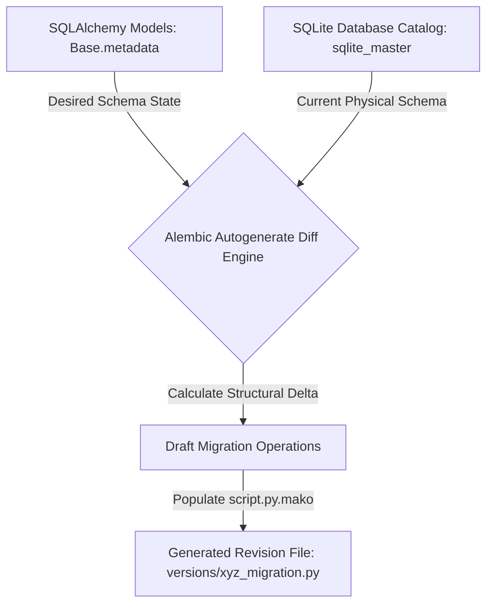
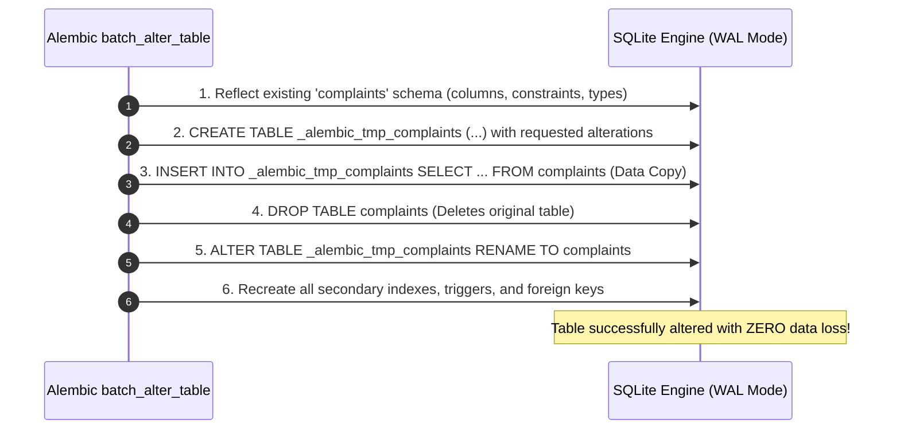
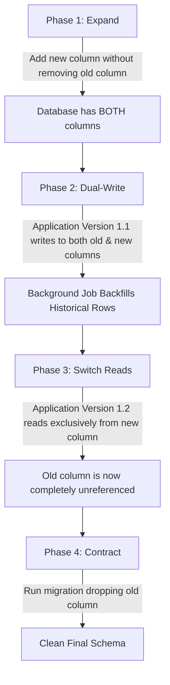

# Guide 16: Database Versioning & Schema Migrations

This manual serves as the authoritative systems engineering reference for **Database Versioning**, Alembic migration environments, Directed Acyclic Graph (DAG) revision topologies, SQLite `batch_alter_table` shadow table recreation, WAL mode lock governance, and zero-downtime schema evolution across the **Automated Smart Complaint Routing & Workflow Automation Platform**.

In our platform, data models are defined using SQLAlchemy 2.0 declarative mappings ([Guide 05: SQLAlchemy 2.0 ORM & Relational Architecture](05_SQLALCHEMY_ORM_AND_DATA_LAYER.md)) and persisted within SQLite in WAL mode ([Guide 04: SQLite Storage Mechanics & WAL Mode](04_SQLITE_STORAGE_MECHANICS_AND_WAL_MODE.md)). During early development, running `Base.metadata.create_all(engine)` suffices to create database tables from scratch.

However, once a software platform is deployed to staging and production environments containing real citizen grievances, audit trails, and officer accounts, **`create_all()` becomes completely useless**:
* `create_all()` creates tables only if they do not already exist; it **cannot detect or apply column additions, type modifications, index changes, or foreign key updates to existing tables**!
* Manually executing `ALTER TABLE` statements in production creates unversioned schema drift, breaks CI/CD pipeline reproducibility, and leads to catastrophic runtime failures when application code expects columns that do not exist.
* In SQLite, standard SQL `ALTER TABLE` commands cannot modify column datatypes, alter nullability, or drop constraints, causing naive migration scripts to crash immediately.

To safely evolve relational schemas across release cycles without data loss or downtime, software engineers rely on **Alembic**—the industry-standard migration engine for SQLAlchemy.

### Pedagogical Architecture & Monotonic Ordering Doctrine
This manual is structured with **strict monotonic prerequisite ordering**. Every chapter builds exclusively upon foundations established in earlier chapters or referenced from prior foundational manuals:
* No chapter requires concepts from higher-numbered chapters. The failure of `create_all()` precedes Alembic architecture; architecture precedes the `alembic_version` table; the version table precedes `env.py` metadata binding; `env.py` precedes autogenerate diffing; diffing precedes revision script anatomy; revision scripts precede the migration DAG; the DAG precedes SQLite `batch_alter_table` mechanics; batch alterations precede data migrations; and data migrations precede zero-downtime expand/contract patterns, CI validation, and disaster recovery.
* Connects directly with foundational and downstream platform engineering manuals:
  - [Guide 01: Python Language & Runtime Mechanics](01_PYTHON_LANGUAGE_AND_RUNTIME_MECHANICS.md) (Dynamic module importing, inspect reflection, and context managers)
  - [Guide 02: FastAPI & Modern ASGI Web Architecture](02_FASTAPI_ASGI_WEB_ARCHITECTURE.md) (Automated migration execution during application startup)
  - [Guide 04: SQLite Storage Mechanics & WAL Mode](04_SQLITE_STORAGE_MECHANICS_AND_WAL_MODE.md) (Exclusive locks during table recreation and WAL concurrency)
  - [Guide 05: SQLAlchemy 2.0 ORM & Relational Architecture](05_SQLALCHEMY_ORM_AND_DATA_LAYER.md) (Declarative Base, metadata inspection, and mapped columns)
  - [Guide 12: Automated Testing, Fixtures & Integration](12_PYTEST_AND_AUTOMATED_TEST_SYSTEMS.md) (Testing forward and backward migration roundtrips)
  - [Guide 13: Git Internals & Delivery Workflows](13_GIT_INTERNALS_AND_DELIVERY_WORKFLOWS.md) (Branching DAGs, merge conflicts, and version-controlled migration files)
* Every single line of Python and Bash code in every code block includes an explicit explanatory comment (`#`) detailing the precise operational action and schema implication.

---

## Table of Contents
1. [Chapter 1: The Schema Evolution Challenge: Why `create_all()` Fails in Production Systems](#chapter-1-the-schema-evolution-challenge-why-create_all-fails-in-production-systems)
2. [Chapter 2: Alembic Architecture & The Migration Runtime: `alembic.ini`, `env.py` & Directory Topology](#chapter-2-alembic-architecture-the-migration-runtime-alembicini-envpy-directory-topology)
3. [Chapter 3: The `alembic_version` Table: Single-Row State Tracking & Head Pointer Mechanics](#chapter-3-the-alembic_version-table-single-row-state-tracking-head-pointer-mechanics)
4. [Chapter 4: Configuring `env.py`: Binding SQLAlchemy `target_metadata`, Dynamic URLs & Engine Drivers](#chapter-4-configuring-envpy-binding-sqlalchemy-target_metadata-dynamic-urls-engine-drivers)
5. [Chapter 5: Autogenerate Mechanics: AST Diffing Between SQLAlchemy Models and Database Catalogs](#chapter-5-autogenerate-mechanics-ast-diffing-between-sqlalchemy-models-and-database-catalogs)
6. [Chapter 6: What Autogenerate Detects (and What It Silently Misses)](#chapter-6-what-autogenerate-detects-and-what-it-silently-misses)
7. [Chapter 7: The Anatomy of an Alembic Revision File: Down Revisions, Dependencies & Docstrings](#chapter-7-the-anatomy-of-an-alembic-revision-file-down-revisions-dependencies-docstrings)
8. [Chapter 8: Reversible Migrations: Authoring Symmetrical `upgrade()` and `downgrade()` Routines](#chapter-8-reversible-migrations-authoring-symmetrical-upgrade-and-downgrade-routines)
9. [Chapter 9: The Migration DAG: Revision Hashes, History Traversal & Resolving Branch Divergence (`alembic merge`)](#chapter-9-the-migration-dag-revision-hashes-history-traversal-resolving-branch-divergence-alembic-merge)
10. [Chapter 10: SQLite Schema Alteration Constraints: The Limited `ALTER TABLE` Problem](#chapter-10-sqlite-schema-alteration-constraints-the-limited-alter-table-problem)
11. [Chapter 11: The `batch_alter_table` Context Manager: Shadow Table Re-Creation Under the Hood](#chapter-11-the-batch_alter_table-context-manager-shadow-table-re-creation-under-the-hood)
12. [Chapter 12: Column Alterations in SQLite: Renaming, Type Changes & Nullability Constraints](#chapter-12-column-alterations-in-sqlite-renaming-type-changes-nullability-constraints)
13. [Chapter 13: Foreign Key & Index Migrations: SQLite PRAGMA `foreign_keys` Hazards](#chapter-13-foreign-key-index-migrations-sqlite-pragma-foreign_keys-hazards)
14. [Chapter 14: Data Migrations vs Schema Migrations: Seeding Catalogs & Transforming Stored Payloads](#chapter-14-data-migrations-vs-schema-migrations-seeding-catalogs-transforming-stored-payloads)
15. [Chapter 15: Executing Raw SQL Operations: `op.execute()`, Parameter Binding & Transaction Isolation](#chapter-15-executing-raw-sql-operations-opexecute-parameter-binding-transaction-isolation)
16. [Chapter 16: Concurrency & Lock Management: SQLite WAL Mode During DDL Table Recreation](#chapter-16-concurrency-lock-management-sqlite-wal-mode-during-ddl-table-recreation)
17. [Chapter 17: Zero-Downtime Database Migrations: The Expand/Contract (Parallel Run) Pattern](#chapter-17-zero-downtime-database-migrations-the-expandcontract-parallel-run-pattern)
18. [Chapter 18: Automated Migration Validation: The Round-Trip CI Test (`head` -> `base` -> `head`)](#chapter-18-automated-migration-validation-the-round-trip-ci-test-head---base---head)
19. [Chapter 19: Preventing Drift: Enforcing `alembic check` in Pre-Commit Hooks and Pull Requests](#chapter-19-preventing-drift-enforcing-alembic-check-in-pre-commit-hooks-and-pull-requests)
20. [Chapter 20: Disaster Recovery & Migration Rollbacks: Unsticking Broken State & Stamp Manual Sync (`alembic stamp`)](#chapter-20-disaster-recovery-migration-rollbacks-unsticking-broken-state-stamp-manual-sync-alembic-stamp)
21. [Chapter 21: The Production Schema Evolution Engine for SmartComplaintHandler: Complete Real-World Revisions](#chapter-21-the-production-schema-evolution-engine-for-smartcomplainthandler-complete-real-world-revisions)
22. [Chapter 22: The Database Versioning & Alembic Migrations Systems Engineering Mastery Checklist](#chapter-22-the-database-versioning-alembic-migrations-systems-engineering-mastery-checklist)

---

## Chapter 1: The Schema Evolution Challenge: Why `create_all()` Fails in Production Systems

### 1.1 The Prototype vs Production Dilemma

In early software prototyping, relational persistence is often initialized via a simple script:
```python
from backend.app.db.base_class import Base  # Platform declarative base class
from backend.app.db.session import engine  # SQLAlchemy database engine handle

# Naive database table creation routine
def initialize_empty_database() -> None:  # Populates tables on brand new databases
    Base.metadata.create_all(bind=engine)  # Emits CREATE TABLE IF NOT EXISTS statements
```

When this script executes against a brand new, empty SQLite database, SQLAlchemy queries the database catalog. Finding no tables, it executes `CREATE TABLE` for every model defined in Python.

Now consider what happens in **Sprint 3**:
* The engineering team adds a new mapped column `is_vip: Mapped[bool] = mapped_column(Boolean, default=False)` to the `Complaint` model.
* The application restarts in production and executes `Base.metadata.create_all(bind=engine)`.
* SQLAlchemy queries the SQLite system catalog (`sqlite_master`) and finds that the `complaints` table **already exists**.
* **SQLAlchemy does absolutely nothing!** It will not alter the table, will not add the column, and will emit zero warnings.
* Five minutes later, a citizen submits a complaint. The application attempts to execute `INSERT INTO complaints (..., is_vip) VALUES (...)`.
* **CRASH!** `sqlite3.OperationalError: table complaints has no column named is_vip`.

### 1.2 The Database Versioning Mandate

A production database cannot be dropped and recreated to apply schema changes because doing so destroys citizen grievance records. Relational databases require **Incremental, Version-Controlled Schema Migrations**:
* Every schema change is encapsulated in an immutable, timestamped migration script.
* Migration scripts are committed to Git ([Guide 13: Git Internals & Delivery Workflows](13_GIT_INTERNALS_AND_DELIVERY_WORKFLOWS.md)) alongside the application code that depends on them.
* When deployed, a migration runner detects which scripts have not yet been executed on that specific database instance and applies them in strict sequential order.

---

## Chapter 2: Alembic Architecture & The Migration Runtime: `alembic.ini`, `env.py` & Directory Topology

### 2.1 The Alembic Directory Structure

Alembic initializes a dedicated directory structure inside the project repository:

```
SmartComplaintHandler/backend/
├── alembic.ini                  <-- Global configuration: file paths, logging, DB URL
└── migrations/                  <-- Migration package directory
    ├── env.py                   <-- Core Python runtime script orchestrating migrations
    ├── script.py.mako           <-- Mako template for generating new revision files
    ├── README
    └── versions/                <-- Chronological directory containing revision scripts
        ├── 20260901_1000_01a2b3_initial_schema.py
        ├── 20260905_1430_4f5e6d_add_is_vip_column.py
        └── 20260910_0915_7c8d9e_add_complaint_attachments.py
```

### 2.2 Roles of the Core Components

1. **`alembic.ini`**: Defines global configuration settings, such as the path to the migration script directory (`script_location = migrations`), template configurations, and standard Python logging handlers.
2. **`migrations/env.py`**: The central execution orchestrator. Every time an `alembic` command runs (`alembic upgrade head` or `alembic revision`), Alembic executes `env.py` as a Python script. It configures the database connection engine and exposes the target metadata to the migration engine.
3. **`migrations/script.py.mako`**: A Python Mako template used by the `alembic revision` command to generate boilerplate Python files inside `versions/`.
4. **`migrations/versions/`**: The immutable ledger of migration scripts forming the schema version DAG.

---

## Chapter 3: The `alembic_version` Table: Single-Row State Tracking & Head Pointer Mechanics

### 3.1 The In-Database Version Ledger

How does Alembic determine which migrations have already run on a database? It creates an internal tracking table in the database itself: **`alembic_version`**.

In SQLite, this table is created automatically during the first migration run:
```sql
CREATE TABLE alembic_version (
    version_num VARCHAR(32) NOT NULL,
    CONSTRAINT alembic_version_pkc PRIMARY KEY (version_num)
);
```

```
+-------------------------------------------------------------+
|                      alembic_version                        |
+-------------------------------------------------------------+
| version_num                                                 |
| ----------------------------------------------------------- |
| "7c8d9e1f2a3b"                                              |
+-------------------------------------------------------------+
(Contains EXACTLY ONE row representing the current schema state)
```

### 3.2 State Evaluation Mechanics

When an engineer runs `alembic upgrade head`:
1. Alembic inspects the `alembic_version` table in SQLite.
2. It reads the single revision hash string stored in `version_num` (e.g., `4f5e6d`).
3. It traverses the migration scripts in `migrations/versions/` starting from `4f5e6d` up to the terminal revision node (`head`).
4. For each pending revision, it executes the script's `upgrade()` function inside a database transaction.
5. Upon successful completion of each script, Alembic updates the single row in `alembic_version` to match the newly applied revision hash!

```bash
# View the current database revision state directly from SQLite
alembic current  # Prints the active revision hash stored in alembic_version table
```

---

## Chapter 4: Configuring `env.py`: Binding SQLAlchemy `target_metadata`, Dynamic URLs & Engine Drivers

### 4.1 Bridging SQLAlchemy Models to Alembic

By default, an initialized Alembic `env.py` contains `target_metadata = None`. With this setting, Alembic has no knowledge of your SQLAlchemy ORM models, making automated schema comparison (`--autogenerate`) impossible!

To enable schema reflection and autogeneration, `env.py` must import the project's declarative `Base` metadata ([Guide 05: SQLAlchemy 2.0 ORM & Relational Architecture](05_SQLALCHEMY_ORM_AND_DATA_LAYER.md)) and application settings:

```python
import os  # Accesses environment variables
import sys  # System module for Python path manipulation
from logging.config import fileConfig  # Configures standard Python logging from alembic.ini
from sqlalchemy import engine_from_config, pool  # SQLAlchemy engine creation utilities
from alembic import context  # Alembic runtime context module

# Append project root directory to sys.path to enable backend module imports
sys.path.insert(0, os.path.abspath(os.path.join(os.path.dirname(__file__), "..", "..")))  # Adds root path

# Import application declarative base and runtime settings
from backend.app.db.base_class import Base  # Base containing all mapped table metadata
from backend.app.core.config import settings  # Application environment configuration

# Fetch Alembic configuration object
config = context.config  # Accesses active alembic.ini configuration wrapper

# Configure Python logging from configuration file
if config.config_file_name is not None:  # Verifies config file presence
    fileConfig(config.config_file_name)  # Loads logging configuration

# Bind application declarative metadata to Alembic target_metadata
target_metadata = Base.metadata  # Exposes all mapped SQLAlchemy models for autogeneration diffing

# Dynamically override database URL from application settings rather than static alembic.ini
config.set_main_option("sqlalchemy.url", settings.DATABASE_URL)  # Binds active environment database URL
```

### 4.2 Offline vs Online Migration Modes

Alembic operates in two distinct operational modes within `env.py`:
1. **Offline Mode (`run_migrations_offline()`)**: Runs without an active database connection engine. Instead of executing SQL directly against a live server, Alembic evaluates revision scripts and generates a raw SQL script printed to standard output (`alembic upgrade head --sql`). This is essential for enterprise deployments where database DBAs must manually review and execute raw SQL scripts.
2. **Online Mode (`run_migrations_online()`)**: Connects directly to the target SQLite database via SQLAlchemy, begins a transaction, and executes the DDL statements in real time.

---

## Chapter 5: Autogenerate Mechanics: AST Diffing Between SQLAlchemy Models and Database Catalogs

### 5.1 How Autogenerate Works

The most celebrated feature of Alembic is **Autogenerate** (`alembic revision --autogenerate -m "..."`).

When executed in online mode:
1. Alembic connects to the live database and uses SQLAlchemy's reflection engine (`inspector`) to inspect the physical database catalog (tables, columns, datatypes, constraints, indexes).
2. Alembic inspects the Python `target_metadata` imported into `env.py`.
3. It performs a structural diff between the **Desired State (Python ORM Models)** and the **Current Physical State (Database Catalog)**:
   $$\text{Schema Diff} = \text{Python Metadata} - \text{Physical Database Catalog}$$
4. It compiles the detected differences into Python migration operations (`op.create_table`, `op.add_column`, `op.drop_column`) and writes a new revision script inside `migrations/versions/`.



### 5.2 Executing Autogenerate

```bash
# Generate a new migration script comparing models against database
alembic revision --autogenerate -m "add is_vip column to complaints"  # Creates revision script
```

Output:
```
INFO  [alembic.runtime.migration] Context impl SQLiteImpl.
INFO  [alembic.runtime.migration] Will assume non-transactional DDL.
INFO  [alembic.autogenerate.compare] Detected added column 'complaints.is_vip'
  Generating migrations/versions/20260912_1145_4f5e6d_add_is_vip_column_to_complaints.py ...  done
```

---

## Chapter 6: What Autogenerate Detects (and What It Silently Misses)

### 6.1 The Capabilities Matrix of Autogenerate

While Alembic's autogenerate diff engine is remarkably powerful, treating its output as infallible is one of the most dangerous traps in database engineering.

| Database Construct | Autogenerate Behavior | Operational Risk / Mitigation |
| :--- | :--- | :--- |
| **New Tables** | **Detected reliably** (`op.create_table`) | Low risk |
| **Dropped Tables** | **Detected reliably** (`op.drop_table`) | **HIGH RISK**: Will drop tables with live data! |
| **Added Columns** | **Detected reliably** (`op.add_column`) | Safe |
| **Dropped Columns** | **Detected reliably** (`op.drop_column`) | **HIGH RISK**: Permanently destroys existing column data! |
| **Renamed Tables** | **DETECTED AS DROP + CREATE!** | **CATASTROPHIC**: Drops old table, wiping all data, and creates empty table! Must manually edit to `op.rename_table`. |
| **Renamed Columns** | **DETECTED AS DROP + ADD!** | **CATASTROPHIC**: Deletes old column data and adds empty new column! Must manually edit to `op.alter_column(new_column_name=...)`. |
| **Column Type Changes** | **IGNORED BY DEFAULT** | Must enable `compare_type=True` in `env.py`. |
| **Server Default Values** | **IGNORED BY DEFAULT** | Must enable `compare_server_default=True` in `env.py`. |
| **Indexes & Unique Constraints** | **Detected reliably** | Safe |
| **Foreign Key Constraints** | Partially detected in SQLite | Requires SQLite `PRAGMA foreign_keys` enforcement. |

### 6.2 Enabling Deep Type and Server Default Comparison in `env.py`

To instruct Alembic to inspect column datatype alterations and server-side defaults, configure these flags inside `migrations/env.py`:

```python
from alembic import context  # Alembic context module

def configure_context_diff_engine(engine_connection, target_meta):  # Configures diff flags in env.py
    context.configure(  # Configures active migration context parameters
        connection=engine_connection,  # Injects active database connection
        target_metadata=target_meta,  # Injects application declarative metadata
        compare_type=True,  # CRITICAL: Enables detection of column datatype changes (e.g. Integer -> BigInteger)
        compare_server_default=True,  # CRITICAL: Enables detection of server-side default expression mutations
    )  # Context configuration complete
```

---

## Chapter 7: The Anatomy of an Alembic Revision File: Down Revisions, Dependencies & Docstrings

### 7.1 Structural Anatomy of a Revision Script

Each file generated inside `migrations/versions/` is a standalone Python module with a standardized contract:

```python
# Migration revision: add is_vip column to complaints
# Revision ID: 4f5e6d1a2b3c (Generated unique revision hash)
# Revises: 01a2b3c4d5e6 (Preceding parent revision)
# Create Date: 2026-09-12 11:45:00.000000 (Creation timestamp)
from typing import Sequence, Union  # Type hinting annotations
from alembic import op  # Alembic operations facade exposing DDL migration commands
import sqlalchemy as sa  # SQLAlchemy core types and column definitions

# Revision identifiers used by Alembic DAG traversal engine
revision: str = '4f5e6d1a2b3c'  # Unique hexadecimal revision hash identifier for this migration
down_revision: Union[str, None] = '01a2b3c4d5e6'  # Parent revision hash that must precede this migration
branch_labels: Union[str, Sequence[str], None] = None  # Branch label identifier for DAG branching
depends_on: Union[str, Sequence[str], None] = None  # External revision dependencies across branches

def upgrade() -> None:  # Forward migration routine executed when upgrading schema
    op.add_column('complaints', sa.Column('is_vip', sa.Boolean(), nullable=True, server_default='0'))  # Adds column

def downgrade() -> None:  # Rollback migration routine executed when downgrading schema
    op.drop_column('complaints', 'is_vip')  # Drops column restoring prior schema state
```

### 7.2 The `op` Operations Facade

The `op` module (`from alembic import op`) is the primary interface for declaring schema modifications:
* `op.create_table(table_name, *columns)`: Emits `CREATE TABLE` DDL.
* `op.drop_table(table_name)`: Emits `DROP TABLE` DDL.
* `op.add_column(table_name, column)`: Emits `ALTER TABLE ADD COLUMN`.
* `op.drop_column(table_name, column_name)`: Emits `ALTER TABLE DROP COLUMN`.
* `op.alter_column(table_name, column_name, ...)`: Modifies nullability, type, or name.
* `op.create_index(index_name, table_name, columns)`: Emits `CREATE INDEX`.
* `op.drop_index(index_name, table_name)`: Emits `DROP INDEX`.

---

## Chapter 8: Reversible Migrations: Authoring Symmetrical `upgrade()` and `downgrade()` Routines

### 8.1 The Operational Necessity of Downgrades

In enterprise deployments, every production release carries the risk of unforeseen defects. If a new application version fails immediately after release, the automated deployment pipeline must execute an emergency rollback:
1. Revert application code to the prior release version.
2. Roll back the database schema to the previous revision via `alembic downgrade -1`.

If an engineer leaves `def downgrade(): pass` empty or implements an asymmetric downgrade, **the database cannot be rolled back**, forcing high-stress manual database surgery during a production outage!

### 8.2 Symmetrical Operation Mapping

Every forward operation in `upgrade()` must possess an exact mathematical inverse in `downgrade()`:

```
+-----------------------------------------------------------------------------------+
|                        SYMMETRICAL MIGRATION OPERATIONS                           |
+-----------------------------------------------------------------------------------+
| upgrade() Operation                     | downgrade() Inverse Operation           |
+-----------------------------------------+-----------------------------------------+
| op.create_table('audit_logs', ...)      | op.drop_table('audit_logs')             |
| op.add_column('users', Column('phone')) | op.drop_column('users', 'phone')        |
| op.create_index('idx_dept', 'tickets')  | op.drop_index('idx_dept', 'tickets')     |
| op.alter_column(..., nullable=False)    | op.alter_column(..., nullable=True)     |
+-----------------------------------------------------------------------------------+
```

```python
# Demonstrating symmetrical reversible migration logic
from alembic import op  # Alembic operations facade
import sqlalchemy as sa  # SQLAlchemy types

def upgrade() -> None:  # Forward migration applying department code index
    op.create_index('idx_complaints_dept', 'complaints', ['assigned_department'], unique=False)  # Creates index

def downgrade() -> None:  # Symmetrical rollback dropping department code index
    op.drop_index('idx_complaints_dept', table_name='complaints')  # Drops index cleanly
```

---

## Chapter 9: The Migration DAG: Revision Hashes, History Traversal & Resolving Branch Divergence (`alembic merge`)

### 9.1 Branching in the Migration DAG

Much like Git commits ([Guide 13: Git Internals & Delivery Workflows](13_GIT_INTERNALS_AND_DELIVERY_WORKFLOWS.md)), Alembic revisions form a **Directed Acyclic Graph (DAG)**. Each revision points backward to its parent via `down_revision`.

In collaborative teams, a common synchronization hazard occurs:
1. Developer Alice branches off `develop` at revision `C1` and creates migration `A1` (`down_revision = 'C1'`).
2. Simultaneously, Developer Bob branches off `develop` at revision `C1` and creates migration `B1` (`down_revision = 'C1'`).
3. Both developers merge their branches into `develop`.

```
        A1 (Alice's migration: down_revision = C1) -> HEAD 1
       /
C1 ---
       \
        B1 (Bob's migration: down_revision = C1)   -> HEAD 2
```

When the CI pipeline executes `alembic upgrade head`, Alembic halts with an error:
`alembic.util.exc.CommandError: Multiple head revisions are present for given argument 'head'; please use 'heads' or specify a specific revision, or merge them with 'alembic merge'.`

### 9.2 Resolving Multiple Heads with `alembic merge`

To reconcile divergent migration heads, engineers use the `alembic merge` command to create a **Merge Revision** with two parents:

```bash
# Create a merge revision combining both divergent migration branches
alembic merge -m "merge alice and bob revisions" a1b2c3 d4e5f6  # Generates merge revision script
```

The generated merge file contains a tuple of parent revisions:
```python
# Alembic merge revision file
revision: str = 'm1e2r3g4e5'  # Unique merge revision hash
down_revision: tuple[str, str] = ('a1b2c3', 'd4e5f6')  # Dual parent tuple reconciling the two heads

def upgrade() -> None:  # Pass-through upgrade joining branches
    pass  # No DDL mutations needed for merge join node

def downgrade() -> None:  # Pass-through rollback
    pass  # No DDL mutations needed for merge join node
```

Once merged, the migration DAG becomes linear again, and `alembic upgrade head` proceeds without errors!

---

## Chapter 10: SQLite Schema Alteration Constraints: The Limited `ALTER TABLE` Problem

### 10.1 The SQLite DDL Limitation

Relational database management systems like PostgreSQL and MySQL support extensive `ALTER TABLE` capabilities:
```sql
-- Supported in PostgreSQL:
ALTER TABLE complaints ALTER COLUMN category TYPE VARCHAR(50);
ALTER TABLE complaints ALTER COLUMN priority SET NOT NULL;
ALTER TABLE complaints DROP COLUMN old_notes;
```

**In SQLite, however, the native SQL `ALTER TABLE` command supports only two operations**:
1. `ALTER TABLE name RENAME TO new_name` (Renaming an entire table)
2. `ALTER TABLE name ADD COLUMN column_definition` (Adding a new column)

SQLite historically **cannot**:
* Drop a column (`DROP COLUMN` was only added in SQLite 3.35.0, but with severe restrictions on foreign keys and indexed columns)
* Alter a column's datatype (e.g., changing `INTEGER` to `VARCHAR`)
* Change column nullability (e.g., setting a nullable column to `NOT NULL`)
* Add or drop primary keys or foreign key constraints!

If an Alembic migration script blindly attempts `op.alter_column('complaints', 'category', nullable=False)` against an SQLite database, SQLite terminates execution with:
`sqlite3.OperationalError: near "ALTER": syntax error`.

To overcome this fundamental limitation of SQLite, Alembic engineers must employ **Batch Mode (`batch_alter_table`)**.

---

## Chapter 11: The `batch_alter_table` Context Manager: Shadow Table Re-Creation Under the Hood

### 11.1 The Shadow Table Recreation Algorithm

Because SQLite's native `ALTER TABLE` cannot modify existing columns or constraints (Chapter 10), Alembic introduces the **Batch Operations (`batch_alter_table`) Context Manager**.

When an engineer modifies a table inside a `with op.batch_alter_table("complaints") as batch_op:` block, Alembic does not execute invalid SQL `ALTER` commands. Instead, it executes an automated **6-Step Shadow Table Recreation Algorithm**:



### 11.2 Production Batch Alteration Syntax

```python
from alembic import op  # Alembic operations facade
import sqlalchemy as sa  # SQLAlchemy core types

def upgrade() -> None:  # Forward migration using batch mode for SQLite compatibility
    # batch_alter_table intercepts all child operations and bundles them into shadow table recreation
    with op.batch_alter_table('complaints', schema=None) as batch_op:  # Enters batch context manager
        # Alter column priority from nullable to non-nullable
        batch_op.alter_column(  # Modifies existing column attributes
            'priority',  # Target column name string
            existing_type=sa.String(length=20),  # Declares existing column type for reflection safety
            nullable=False,  # Enforces NOT NULL constraint on priority column
            server_default='MEDIUM'  # Sets fallback default value for existing null rows
        )  # Column alteration complete
        # Add new tracking column
        batch_op.add_column(sa.Column('resolution_notes', sa.Text(), nullable=True))  # Adds notes column

def downgrade() -> None:  # Rollback migration reversing batch changes
    with op.batch_alter_table('complaints', schema=None) as batch_op:  # Re-enters batch context manager
        batch_op.drop_column('resolution_notes')  # Drops resolution notes column
        batch_op.alter_column(  # Reverts priority column back to nullable
            'priority',  # Target column name
            existing_type=sa.String(length=20),  # Existing type specification
            nullable=True,  # Restores nullable status
            server_default=None  # Removes server default expression
        )  # Rollback alteration complete
```

---

## Chapter 12: Column Alterations in SQLite: Renaming, Type Changes & Nullability Constraints

### 12.1 The `existing_type` Mandate in Alembic

When altering an existing column in SQLAlchemy/Alembic, developers must provide `existing_type`. Why?

Because many relational database drivers cannot deduce the column's prior datatype during AST compilation. Providing `existing_type=sa.Integer()` guarantees that when Alembic constructs the shadow table `_alembic_tmp_tablename`, it retains the exact column specification without corrupting data representations.

### 12.2 Handling `NOT NULL` on Existing Tables with Live Data

A critical production hazard occurs when altering an existing nullable column to `nullable=False`:
* If existing rows in production contain `NULL` in that column, executing `batch_alter_table` crashes during Step 3 (`INSERT INTO ... SELECT`) with:
  `sqlite3.IntegrityError: NOT NULL constraint failed: _alembic_tmp_complaints.column_name`.

To safely enforce `NOT NULL` on live production databases:
1. Populate all existing `NULL` rows with a valid fallback value via `op.execute()` *before* altering the constraint.
2. Provide `server_default` during the alteration:

```python
from alembic import op  # Operations facade
import sqlalchemy as sa  # Core types

def upgrade() -> None:  # Safe two-stage nullability migration
    # Stage 1: Update legacy NULL rows with default department code
    op.execute("UPDATE complaints SET assigned_department = 'GENERAL' WHERE assigned_department IS NULL")  # Data fix
    
    # Stage 2: Enforce NOT NULL constraint via batch alteration
    with op.batch_alter_table('complaints') as batch_op:  # Enters batch context
        batch_op.alter_column(  # Alters nullability safely
            'assigned_department',  # Column name
            existing_type=sa.String(50),  # Existing type
            nullable=False,  # Now safe because zero NULL rows remain in table
            server_default='GENERAL'  # Default for future inserts
        )  # Column alteration complete

def downgrade() -> None:  # Reversible downgrade
    with op.batch_alter_table('complaints') as batch_op:  # Batch context
        batch_op.alter_column('assigned_department', existing_type=sa.String(50), nullable=True)  # Nullable
```

---

## Chapter 13: Foreign Key & Index Migrations: SQLite PRAGMA `foreign_keys` Hazards

### 13.1 The Foreign Key Drop Cascading Trap

In SQLite, when foreign key enforcement is active (`PRAGMA foreign_keys = ON`), executing `batch_alter_table` can trigger a catastrophic failure:
* When Step 4 executes (`DROP TABLE complaints`), SQLite's foreign key engine detects that child tables (`complaint_attachments`, `audit_logs`) reference `complaints.id`.
* If configured with `ON DELETE CASCADE`, SQLite **permanently deletes all child attachments and audit logs**, believing the parent complaint was deleted!
* If not cascading, SQLite terminates with:
  `sqlite3.OperationalError: FOREIGN KEY constraint failed`.

### 13.2 Disabling Foreign Keys During Migrations in `env.py`

To eliminate this hazard, `migrations/env.py` must explicitly configure SQLite connections to disable foreign keys during DDL migration batches, or pass `render_as_batch=True`:

```python
from alembic import context  # Alembic context

def run_migrations_online_sqlite(connectable, target_meta) -> None:  # SQLite-safe migration runner
    with connectable.connect() as connection:  # Opens raw database connection
        # Temporarily disable foreign key constraints during DDL shadow table recreation
        connection.execute(sa.text("PRAGMA foreign_keys = OFF;"))  # Disables cascade deletes during migration
        
        context.configure(  # Configures migration runner context
            connection=connection,  # Bound connection
            target_metadata=target_meta,  # Application metadata
            render_as_batch=True,  # Automatically forces batch mode for all SQLite table alterations!
        )  # Configuration complete
        
        with context.begin_transaction():  # Begins migration transaction
            context.run_migrations()  # Executes all pending migration scripts
            
        # Re-enable foreign key enforcement after schema recreation completes
        connection.execute(sa.text("PRAGMA foreign_keys = ON;"))  # Restores referential integrity enforcement
```

---

## Chapter 14: Data Migrations vs Schema Migrations: Seeding Catalogs & Transforming Stored Payloads

### 14.1 Schema DDL vs Data DML

Migrations are not limited to DDL schema changes (adding columns and tables). In real-world platforms, new features require **Data Migrations (DML)**:
* Seeding initial municipal department catalogs (`WATER`, `ELECTRICITY`, `ROADS`, `SANITATION`).
* Splitting a `full_name` column into `first_name` and `last_name`.
* Encrypting legacy citizen phone numbers.

### 14.2 Seeding Reference Data with `op.bulk_insert()`

Alembic provides **`op.bulk_insert()`** to seed static catalog rows directly within a migration script:

```python
from alembic import op  # Alembic operations facade
import sqlalchemy as sa  # SQLAlchemy core types

# Define lightweight table reflection structure for seeding
departments_table = sa.table(  # Ad-hoc table declaration for data seeding
    'departments',  # Target database table name
    sa.column('code', sa.String(20)),  # Primary key department code column
    sa.column('name', sa.String(100)),  # Human readable department name
    sa.column('sla_hours', sa.Integer())  # Target resolution SLA hours
)  # Table structure complete

def upgrade() -> None:  # Seeds initial platform department catalog
    op.bulk_insert(  # Executes multi-row SQL INSERT statement efficiently
        departments_table,  # Target table structure
        [  # Seed dataset records
            {"code": "WATER", "name": "Municipal Water Supply", "sla_hours": 24},  # Water department
            {"code": "ELECTRICITY", "name": "Power & Grid Distribution", "sla_hours": 12},  # Power department
            {"code": "ROADS", "name": "Roads & Infrastructure Maintenance", "sla_hours": 48},  # Roads department
            {"code": "SANITATION", "name": "Public Waste & Sanitation", "sla_hours": 24},  # Sanitation
        ]  # Dataset complete
    )  # Bulk insert complete

def downgrade() -> None:  # Rolls back seeded catalog data
    op.execute("DELETE FROM departments WHERE code IN ('WATER', 'ELECTRICITY', 'ROADS', 'SANITATION')")  # Clean
```

---

## Chapter 15: Executing Raw SQL Operations: `op.execute()`, Parameter Binding & Transaction Isolation

### 15.1 When the Alembic ORM Facade is Insufficient

Complex data updates—such as computing geospatial distances, concatenating columns, or running subqueries—are difficult to express cleanly through `op.alter_column()`.

Alembic exposes **`op.execute()`** to execute raw SQL statements within the migration transaction:

```python
from alembic import op  # Operations facade
import sqlalchemy as sa  # Core types

def upgrade() -> None:  # Demonstrates raw SQL execution with parameter binding
    # Normalize legacy status codes: convert PENDING to SUBMITTED
    op.execute(  # Executes raw SQL update statement
        sa.text("UPDATE complaints SET status = :new_status WHERE status = :old_status")  # Bound text statement
        .bindparams(new_status="SUBMITTED", old_status="PENDING")  # Safely binds parameters preventing injection
    )  # Execution complete

def downgrade() -> None:  # Reversible SQL rollback
    op.execute(  # Reverts status code transformation
        sa.text("UPDATE complaints SET status = :old_status WHERE status = :new_status")  # Bound statement
        .bindparams(old_status="PENDING", new_status="SUBMITTED")  # Binds parameters
    )  # Execution complete
```

Every `op.execute()` runs inside the active migration transaction. If any statement raises an error, the entire transaction is rolled back, preventing partial schema corruption!

---

## Chapter 16: Concurrency & Lock Management: SQLite WAL Mode During DDL Table Recreation

### 16.1 The Exclusive Lock Requirement of Schema DDL

In [Guide 04: SQLite Storage Mechanics & WAL Mode](04_SQLITE_STORAGE_MECHANICS_AND_WAL_MODE.md), we established that SQLite in WAL mode allows concurrent readers to operate without blocking writers.

However, **DDL operations (such as table recreation via `batch_alter_table`) require an `EXCLUSIVE` lock on the entire database file**:
* When Alembic runs `batch_alter_table`, it acquires a reserved lock and attempts to transition to an exclusive lock to drop the old table and rename the shadow table.
* If a background worker (such as the APScheduler SLA polling engine from [Guide 11: In-Process Schedulers & Task Concurrency](11_APSCHEDULER_AND_IN_PROCESS_JOBS.md)) or an incoming FastAPI HTTP read transaction is active on the database, the exclusive lock **cannot be granted**!
* Alembic blocks, waits for the `busy_timeout` period (default 5 seconds), and if the reader does not release its lock, Alembic terminates with:
  `sqlite3.OperationalError: database is locked`.

### 16.2 Production Migration Execution Protocol

To guarantee lock acquisition without crashing:
1. **Drain Background Workers**: Temporarily pause or drain in-process schedulers before executing migrations.
2. **Configure Busy Timeout**: Set `PRAGMA busy_timeout = 30000;` (30 seconds) in `env.py` to give long-running readers time to complete their queries before Alembic errors out.
3. **Execute Migrations Prior to App Boot**: In containerized entrypoints, execute `alembic upgrade head` *before* starting Uvicorn server processes!

---

## Chapter 17: Zero-Downtime Database Migrations: The Expand/Contract (Parallel Run) Pattern

### 17.1 The Rolling Deployment Migration Hazard

In modern high-availability architectures, applications are updated using **Rolling Deployments**:
* Version 1 of the application is running across 4 worker processes.
* The deployment orchestrator starts Version 2 on Worker 1 while Workers 2, 3, and 4 continue serving traffic on Version 1.

A catastrophic failure occurs if a migration drops or renames a column abruptly:
* The migration drops `assigned_department` and creates `department_code`.
* Workers 2, 3, and 4 (still running Version 1) attempt to read `assigned_department`.
* **500 Server Errors flood production** because the database schema no longer supports the older, active application code!

### 17.2 The Four-Phase Expand/Contract Pattern

To achieve zero downtime during schema modifications, enterprise engineering teams follow the **Expand/Contract Pattern**:



1. **Phase 1 (Expand)**: Add the new column (`department_code`) as nullable. Old application code continues functioning unaffected.
2. **Phase 2 (Dual-Write)**: Deploy intermediate application code that writes to **both** `assigned_department` and `department_code`. Run a background data migration backfilling historical rows.
3. **Phase 3 (Switch Reads)**: Deploy new application code that reads exclusively from `department_code`.
4. **Phase 4 (Contract)**: Execute an Alembic migration dropping the old `assigned_department` column.

---

## Chapter 18: Automated Migration Validation: The Round-Trip CI Test (`head` -> `base` -> `head`)

### 18.1 The Downward Migration Test Dilemma

Most software teams only ever test upward migrations (`upgrade head`). Consequently, broken `downgrade()` functions remain undetected until an emergency production incident occurs, when developers discover their rollback script crashes!

### 18.2 Automated Round-Trip Test Harness in Pytest

`SmartComplaintHandler` enforces an automated **Round-Trip Migration Test** in its CI test suite ([Guide 12: Automated Testing, Fixtures & Integration](12_PYTEST_AND_AUTOMATED_TEST_SYSTEMS.md)):
1. Upgrades from an empty database to `head`.
2. Downgrades all the way back to `base` (verifying 100% of downgrade routines).
3. Re-upgrades all the way back to `head`.

```python
import os  # Standard filesystem path operations
import pytest  # Testing framework core library
from alembic.config import Config  # Alembic configuration wrapper
from alembic import command  # Programmatic Alembic command execution interface

def test_alembic_migration_roundtrip() -> None:  # Verifies forward and backward migration symmetry
    # Resolve absolute path to alembic.ini configuration file
    ini_path = os.path.abspath(os.path.join(os.path.dirname(__file__), "..", "..", "alembic.ini"))  # Path to ini
    alembic_cfg = Config(ini_path)  # Instantiates programmatic Alembic configuration context
    
    # Point migration run to isolated in-memory or temporary test SQLite database
    alembic_cfg.set_main_option("sqlalchemy.url", "sqlite:///test_migration_sandbox.db")  # Sets sandbox URL
    
    try:  # Enforces safe cleanup block
        # 1. Forward run: Apply all migrations up to head
        command.upgrade(alembic_cfg, "head")  # Exercises all upgrade() functions across migration history
        
        # 2. Backward run: Revert all migrations back to base (empty state)
        command.downgrade(alembic_cfg, "base")  # Exercises all downgrade() functions verifying reversibility!
        
        # 3. Second forward run: Re-apply all migrations to head to verify idempotent re-creation
        command.upgrade(alembic_cfg, "head")  # Confirms database can be cleanly re-upgraded without errors
    finally:  # Post-test cleanup block
        if os.path.exists("test_migration_sandbox.db"):  # Verifies sandbox database file exists on disk
            os.remove("test_migration_sandbox.db")  # Deletes sandbox database file after test completion
```

---

## Chapter 19: Preventing Drift: Enforcing `alembic check` in Pre-Commit Hooks and Pull Requests

### 19.1 The Forgotten Migration Vulnerability

A frequent defect in fast-moving engineering teams occurs when a developer updates a SQLAlchemy model:
```python
class Complaint(Base):  # Declarative model class definition
    # Added new mapped attribute in Python code:
    sla_grace_minutes: Mapped[int] = mapped_column(Integer, default=30)  # Newly added mapped column
```
The developer writes a unit test with a mock database, commits the code, and opens a Pull Request. **They completely forgot to run `alembic revision --autogenerate`!**

When deployed, the code expects `sla_grace_minutes`, but the production database does not have it, triggering catastrophic runtime crashes.

### 19.2 The `alembic check` CI Gatekeeper

In Alembic 1.9+, the command **`alembic check`** compares Python models against the latest migration revision. If any model changes exist that are not captured in a revision file, `alembic check` terminates with an exit code of `1`:

```bash
# Verify that all SQLAlchemy model changes are captured in migration files
alembic check  # Returns 0 if schema matches models; returns 1 if schema drift detected
```

Integration into CI/CD workflows:
```bash
# Execute drift detection in pre-commit hooks or GitHub Actions CI pipeline
alembic check || (echo "ERROR: Unmigrated SQLAlchemy model changes detected! Run alembic revision --autogenerate" && exit 1)  # Gate
```

---

## Chapter 20: Disaster Recovery & Migration Rollbacks: Unsticking Broken State & Stamp Manual Sync (`alembic stamp`)

### 20.1 How Migrations Get Stuck

During development, merge conflicts or unhandled errors can leave the database in an inconsistent state:
* An engineer manually created a table in SQLite via the command line.
* The migration script attempts `op.create_table('audit_logs')` and crashes with `table already exists`.
* The migration failed, but the transaction was partially committed or the version pointer was not updated.

### 20.2 The `alembic stamp` Emergency Override

When the physical database schema already matches a target revision, but Alembic's `alembic_version` table is pointing to the wrong revision hash, developers use **`alembic stamp`**:

```bash
# Forcefully update the alembic_version pointer WITHOUT executing any DDL statements
alembic stamp head  # Updates version_num in database directly to latest head revision

# Forcefully sync pointer to a specific revision hash
alembic stamp 4f5e6d1a2b3c  # Overwrites version_num with designated revision hash
```

`alembic stamp` does **not** execute `upgrade()` or `downgrade()`. It directly updates the row in the `alembic_version` table, allowing engineers to synchronize the version pointer after manual database surgery.

---

## Chapter 21: The Production Schema Evolution Engine for SmartComplaintHandler: Complete Real-World Revisions

### 21.1 Canonical Migration Sequence in SmartComplaintHandler

The following production revision script illustrates the complete real-world schema setup for `SmartComplaintHandler`:
* Creates `departments` catalog with pre-seeded municipal reference data.
* Creates `complaints` table with foreign key relationships.
* Builds secondary B-tree indexes for status and SLA filtering.

```python
# Initial platform schema migration script for SmartComplaintHandler
# Revision ID: 01a2b3c4d5e6
# Revises: None
# Create Date: 2026-09-01 10:00:00.000000
from typing import Sequence, Union  # Type annotations
from alembic import op  # Operations facade
import sqlalchemy as sa  # SQLAlchemy types

revision: str = '01a2b3c4d5e6'  # Initial root revision hash
down_revision: Union[str, None] = None  # None denotes root node in DAG
branch_labels: Union[str, Sequence[str], None] = None  # Branch labels
depends_on: Union[str, Sequence[str], None] = None  # Dependencies

def upgrade() -> None:  # Forward creation of platform tables
    # 1. Create departments catalog table
    op.create_table(  # Emits CREATE TABLE DDL for departments
        'departments',  # Table name
        sa.Column('code', sa.String(length=20), primary_key=True),  # Primary key department code
        sa.Column('name', sa.String(length=100), nullable=False),  # Department name
        sa.Column('sla_hours', sa.Integer(), nullable=False, server_default='24'),  # SLA threshold hours
    )  # Table created
    
    # 2. Create core complaints table
    op.create_table(  # Emits CREATE TABLE DDL for complaints
        'complaints',  # Table name
        sa.Column('id', sa.String(length=36), primary_key=True),  # UUID primary key
        sa.Column('title', sa.String(length=200), nullable=False),  # Complaint summary title
        sa.Column('description', sa.Text(), nullable=False),  # Narrative description
        sa.Column('category', sa.String(length=50), nullable=False),  # Grievance category
        sa.Column('assigned_department', sa.String(length=20), nullable=True),  # Assigned department code
        sa.Column('status', sa.String(length=20), nullable=False, server_default='SUBMITTED'),  # State machine
        sa.Column('citizen_name', sa.String(length=100), nullable=False),  # Submitter name
        sa.Column('contact_email', sa.String(length=100), nullable=False),  # Submitter email
        sa.Column('sla_deadline', sa.DateTime(), nullable=False),  # SLA target deadline timestamp
        sa.Column('created_at', sa.DateTime(), nullable=False),  # Creation timestamp
        sa.ForeignKeyConstraint(['assigned_department'], ['departments.code'], ondelete='SET NULL'),  # FK
    )  # Table created
    
    # 3. Create secondary performance indexes
    op.create_index('idx_complaints_status', 'complaints', ['status'], unique=False)  # Status index
    op.create_index('idx_complaints_deadline', 'complaints', ['sla_deadline'], unique=False)  # SLA deadline index

def downgrade() -> None:  # Symmetrical rollback dropping all created structures
    op.drop_index('idx_complaints_deadline', table_name='complaints')  # Drops deadline index
    op.drop_index('idx_complaints_status', table_name='complaints')  # Drops status index
    op.drop_table('complaints')  # Drops complaints table
    op.drop_table('departments')  # Drops departments table
```

---

## Chapter 22: The Database Versioning & Alembic Migrations Systems Engineering Mastery Checklist

### 22.1 Comprehensive Database Migration Production Rubric

Before applying database migrations to staging or production environments, verify the implementation against this 15-point systems engineering rubric:

```
+===================================================================================================+
|                    DATABASE VERSIONING & ALEMBIC MIGRATION PRODUCTION RUBRIC                      |
+===================================================================================================+
| [ ] 1.  No create_all in Prod: Base.metadata.create_all excluded from production startup code.   |
| [ ] 2.  target_metadata Bound: Base.metadata imported into env.py for accurate autogeneration.   |
| [ ] 3.  Compare Flags Enabled: compare_type=True and compare_server_default=True set in env.py.  |
| [ ] 4.  Renames Inspected: Autogenerated DROP+CREATE verified and converted to op.alter_column.   |
| [ ] 5.  Batch Mode for SQLite: batch_alter_table enforced to handle SQLite DDL limitations.       |
| [ ] 6.  Foreign Keys Disabled in DDL: PRAGMA foreign_keys=OFF during shadow table recreation.    |
| [ ] 7.  Symmetrical Downgrades: Every upgrade() possesses a mathematically verified downgrade().   |
| [ ] 8.  Linear DAG Enforced: Multiple heads merged via alembic merge before merging Git branches. |
| [ ] 9.  NOT NULL Safe: Existing NULL rows updated via op.execute before adding NOT NULL constraint|
| [ ] 10. Data Migrations Isolated: Reference data seeded via op.bulk_insert within migrations.     |
| [ ] 11. Lock Safety in WAL Mode: Migrations executed before Uvicorn boots to avoid locked errors. |
| [ ] 12. Round-Trip Tests: CI executes upgrade head -> downgrade base -> upgrade head cleanly.      |
| [ ] 13. CI Drift Check: alembic check enforced in pre-commit hooks and PR gatekeeper actions.     |
| [ ] 14. Expand/Contract Pattern: Multi-phase parallel run pattern used for zero-downtime releases.|
| [ ] 15. Stamp Recovery Documented: Knowledge of alembic stamp maintained for disaster recovery.   |
+===================================================================================================+
```

### 22.2 Architectural Cross-Reference Matrix

| System Component | Architectural Responsibility | Interfacing Manual |
| :--- | :--- | :--- |
| **SQLAlchemy 2.0 Models** | Source of truth for database schema definitions | [Guide 05: SQLAlchemy 2.0 ORM & Relational Architecture](05_SQLALCHEMY_ORM_AND_DATA_LAYER.md) |
| **SQLite WAL Lock Mechanics** | Governs exclusive locks during shadow table recreation | [Guide 04: SQLite Storage Mechanics & WAL Mode](04_SQLITE_STORAGE_MECHANICS_AND_WAL_MODE.md) |
| **FastAPI Startup Verification** | Executes schema checks and migrations prior to socket listen | [Guide 02: FastAPI & Modern ASGI Web Architecture](02_FASTAPI_ASGI_WEB_ARCHITECTURE.md) |
| **Automated Migration Testing** | Validates forward and backward migration roundtrips | [Guide 12: Automated Testing, Fixtures & Integration](12_PYTEST_AND_AUTOMATED_TEST_SYSTEMS.md) |
| **Version Control DAGs** | Manages migration revision files and resolves branch merges | [Guide 13: Git Internals & Delivery Workflows](13_GIT_INTERNALS_AND_DELIVERY_WORKFLOWS.md) |
