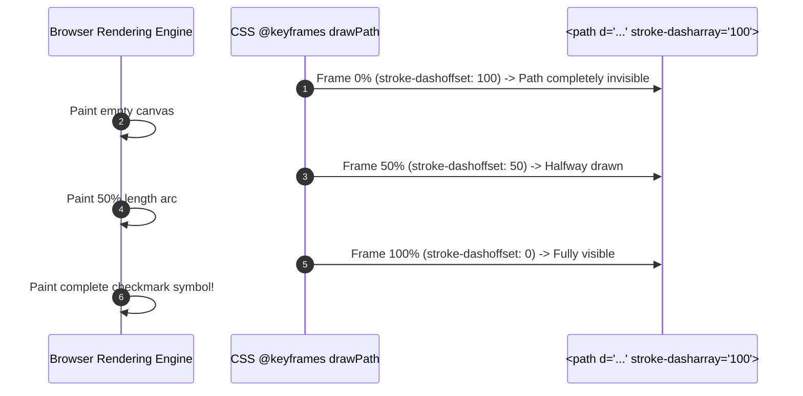

# Guide 17: Scalable Vector Graphics & Icon Systems

This manual serves as the authoritative systems engineering reference for **Scalable Vector Graphics (SVG)**, Cartesian coordinate spaces, `viewBox` geometry, Bézier curve path grammars, `currentColor` dynamic palette inheritance, Lucide React component architectures, tree-shaking optimizations, and accessible design system iconography across the **Automated Smart Complaint Routing & Workflow Automation Platform**.

In our platform, users interact with rich visual dashboards to monitor municipal grievances, track resolution timelines, and assess department workloads ([Guide 07: React 18 & Virtual DOM Architecture](07_REACT_18_AND_VIRTUAL_DOM_ARCHITECTURE.md) and [Guide 08: Tailwind CSS & PostCSS Engineering](08_TAILWIND_CSS_AND_POSTCSS_ENGINEERING.md)). Visual iconography is not mere decorative ornamentation; it serves as a critical cognitive shorthand:
* Instantaneously communicating grievance status (`SUBMITTED`, `ASSIGNED`, `RESOLVED`, `ESCALATED`).
* Visually categorizing municipal sectors (Water, Electricity, Roads, Sanitation).
* Highlighting SLA breach risks with warning glyphs and progress spinners.

Historically, web platforms relied on raster icon sprites (PNG/GIF) or Icon Fonts (FontAwesome). These legacy approaches suffered from severe defects: raster images blur on high-DPI (Retina) displays, icon fonts cause Flash of Unstyled Text (FOUT), and neither supports fine-grained stroke styling or granular color inheritance.

Modern frontends solve this via **Scalable Vector Graphics (SVG)** and componentized vector libraries like **Lucide React**. To construct an accessible, responsive, and pixel-perfect design system, frontend engineers must master vector mathematics, coordinate transformations, and component compilation pipelines.

### Pedagogical Architecture & Monotonic Ordering Doctrine
This manual is structured with **strict monotonic prerequisite ordering**. Every chapter builds exclusively upon foundations established in earlier chapters or referenced from prior foundational manuals:
* No chapter requires concepts from higher-numbered chapters. The vector paradigm precedes the SVG DOM; the SVG DOM precedes `viewBox` coordinate geometry; coordinate geometry precedes the SVG path command grammar; path grammar precedes stroke and fill attributes; stroke and fill precede `currentColor` dynamic theming; theming precedes Lucide React architecture; Lucide precedes tree-shaking and dynamic factories; factories precede accessibility (a11y); accessibility precedes animation; and animation precedes enterprise status components and automated Vitest testing.
* Connects directly with foundational and downstream platform engineering manuals:
  - [Guide 06: JavaScript Runtime & V8 Engine Mechanics](06_JAVASCRIPT_RUNTIME_AND_V8_MECHANICS.md) (DOM parsing, reflow, and paint cycles for vector elements)
  - [Guide 07: React 18 & Virtual DOM Architecture](07_REACT_18_AND_VIRTUAL_DOM_ARCHITECTURE.md) (Compiling SVG tags into React virtual DOM nodes)
  - [Guide 08: Tailwind CSS & PostCSS Engineering](08_TAILWIND_CSS_AND_POSTCSS_ENGINEERING.md) (Sizing icons with `w-5 h-5` and controlling colors via Tailwind utility classes)
  - [Guide 10: Vite & Modern Frontend Build Toolchains](10_VITE_AND_MODERN_BUILD_TOOLCHAINS.md) (Rollup tree-shaking of vector icon libraries to minimize JS bundle size)
  - [Guide 20: Form State Machines & Optimistic UI](20_FORM_STATE_MACHINES_AND_OPTIMISTIC_UI.md) (Interactive feedback states, spinners, and checkmark animations)
* Every single line of JavaScript and JSX code in every code block includes an explicit explanatory comment (`//`) detailing the precise graphical action, geometric calculation, and rendering implication.

---

## Table of Contents
1. [Chapter 1: The Vector Paradigm: Resolution Independence, Mathematical Primitives & Raster Limitations](#chapter-1-the-vector-paradigm-resolution-independence-mathematical-primitives-raster-limitations)
2. [Chapter 2: The SVG Document Object Model (DOM) & XML Namespace Architecture](#chapter-2-the-svg-document-object-model-dom-xml-namespace-architecture)
3. [Chapter 3: Geometry & Coordinate Spaces: The `viewBox` Attribute, Aspect Ratios & Viewport Scaling](#chapter-3-geometry-coordinate-spaces-the-viewbox-attribute-aspect-ratios-viewport-scaling)
4. [Chapter 4: The SVG Path Grammar: Decoding `M`, `L`, `C`, `S`, `Q`, `T`, `A` & `Z` Primitives](#chapter-4-the-svg-path-grammar-decoding-m-l-c-s-q-t-a-z-primitives)
5. [Chapter 5: Stroke & Fill Mathematics: `stroke-width`, `stroke-linecap`, `stroke-linejoin` & Miter Limits](#chapter-5-stroke-fill-mathematics-stroke-width-stroke-linecap-stroke-linejoin-miter-limits)
6. [Chapter 6: Color Dynamics: CSS `currentColor` Inheritance & Dark Mode Harmony](#chapter-6-color-dynamics-css-currentcolor-inheritance-dark-mode-harmony)
7. [Chapter 7: Lucide React Architecture: The 24x24 Grid Standard & Component Transformation](#chapter-7-lucide-react-architecture-the-24x24-grid-standard-component-transformation)
8. [Chapter 8: Tree-Shaking & Bundle Optimization: Avoiding CommonJS Traps with Named Imports](#chapter-8-tree-shaking-bundle-optimization-avoiding-commonjs-traps-with-named-imports)
9. [Chapter 9: Dynamic Icon Factories: Safe Component Mapping vs Unsafe Runtime Reflection](#chapter-9-dynamic-icon-factories-safe-component-mapping-vs-unsafe-runtime-reflection)
10. [Chapter 10: Accessible Iconography (a11y): Screen Readers, `aria-hidden`, `role="img"` & `<title>` Elements](#chapter-10-accessible-iconography-a11y-screen-readers-aria-hidden-roleimg-title-elements)
11. [Chapter 11: Responsive Styling with Tailwind CSS: Scaling, Stroke Width Modifiers & Hover States](#chapter-11-responsive-styling-with-tailwind-css-scaling-stroke-width-modifiers-hover-states)
12. [Chapter 12: SVG Animation Engineering: `stroke-dasharray`, `stroke-dashoffset` & Custom Loaders](#chapter-12-svg-animation-engineering-stroke-dasharray-stroke-dashoffset-custom-loaders)
13. [Chapter 13: SVG Sprites vs Inline Components: Caching, Network Payloads & Reusability Trade-offs](#chapter-13-svg-sprites-vs-inline-components-caching-network-payloads-reusability-trade-offs)
14. [Chapter 14: Masking, Clipping & Drop Shadows: `<clipPath>`, `<mask>` & `<filter>` Primitives](#chapter-14-masking-clipping-drop-shadows-clippath-mask-filter-primitives)
15. [Chapter 15: Optimizing Raw SVGs with SVGO: Precision Stripping, Path Merging & Metadata Pruning](#chapter-15-optimizing-raw-svgs-with-svgo-precision-stripping-path-merging-metadata-pruning)
16. [Chapter 16: Badging & Visual Hierarchy: Designing Status Indicators in Enterprise Design Systems](#chapter-16-badging-visual-hierarchy-designing-status-indicators-in-enterprise-design-systems)
17. [Chapter 17: Icon System Architecture in SmartComplaintHandler: Department & Priority Iconography](#chapter-17-icon-system-architecture-in-smartcomplainthandler-department-priority-iconography)
18. [Chapter 18: Building a Reusable `StatusIcon` Component in React 18](#chapter-18-building-a-reusable-statusicon-component-in-react-18)
19. [Chapter 19: Building an Interactive Animated Priority Picker](#chapter-19-building-an-interactive-animated-priority-picker)
20. [Chapter 20: Performance Profiling: DOM Node Overheads, Repaints & GPU Acceleration](#chapter-20-performance-profiling-dom-node-overheads-repaints-gpu-acceleration)
21. [Chapter 21: Unit Testing Icon Components: Snapshot Testing & ARIA Accessibility Assertions in Vitest](#chapter-21-unit-testing-icon-components-snapshot-testing-aria-accessibility-assertions-in-vitest)
22. [Chapter 22: The Scalable Vector Graphics & Lucide React Systems Engineering Mastery Checklist](#chapter-22-the-scalable-vector-graphics-lucide-react-systems-engineering-mastery-checklist)

---

## Chapter 1: The Vector Paradigm: Resolution Independence, Mathematical Primitives & Raster Limitations

### 1.1 Raster vs Vector Graphics

In computer graphics, digital images are divided into two fundamentally distinct mathematical representations:

| Dimension | Raster Graphics (PNG, JPEG, WebP) | Vector Graphics (SVG) |
| :--- | :--- | :--- |
| **Underlying Data** | 2D Grid of colored pixels ($W \times H$) | Mathematical formulas (points, lines, Bézier curves, polygons) |
| **Scaling Behavior** | Pixelates, blurs, and loses sharpness when scaled up | **Infinitely sharp** at any resolution or zoom level |
| **Display Density** | Requires `@2x`, `@3x` assets for high-DPI (Retina) | Single asset renders natively across all device pixel ratios (DPR) |
| **File Size** | Scales with pixel dimensions ($O(W \times H)$) | Scales with geometric complexity ($O(\text{nodes})$) |
| **Styling via CSS** | Impossible (requires exporting new image files) | **Fully stylable via CSS** (`fill`, `stroke`, `transform`) |
| **DOM Programmability**| Opaque binary blob | Fully interactive XML DOM tree inspectable by JavaScript |

```
Raster Pixelation at 400% Zoom:       Vector Crispness at 400% Zoom:
+---+---+---+---+                     /-------------------\
| # | # |   |   |  (Jagged Pixels)    |                   |  (Smooth Geometric Formula)
+---+---+---+---+                     |                   |
|   | # | # |   |                     \-------------------/
```

### 1.2 The Vector Superiority in Enterprise UI

For user interface controls, icons, badges, and charts, vector graphics eliminate the operational overhead of generating and managing multi-resolution raster asset bundles (`icon.png`, `icon@2x.png`, `icon@3x.png`). A single 500-byte SVG icon renders crisply on a 1080p desktop monitor, a 4K external display, and a mobile Retina screen.

---

## Chapter 2: The SVG Document Object Model (DOM) & XML Namespace Architecture

### 2.1 SVG as an XML Application

SVG is not an image format in the traditional binary sense; it is an **XML application** standardized by the World Wide Web Consortium (W3C).

When an SVG is embedded directly inside an HTML document (known as **Inline SVG**), its elements become part of the browser's live **Document Object Model (DOM)** ([Guide 06: JavaScript Runtime & V8 Engine Mechanics](06_JAVASCRIPT_RUNTIME_AND_V8_MECHANICS.md)):
* The `<svg>` root element and its children (`<path>`, `<circle>`, `<rect>`) belong to the XML namespace `http://www.w3.org/2000/svg`.
* JavaScript can query SVG nodes using standard DOM APIs: `document.querySelector("path")`.
* CSS rules apply directly to SVG nodes: `path:hover { stroke: #2563eb; }`.

```jsx
// Native Inline SVG component demonstrating direct DOM node representation
export function RawSvgDemo() { // Component rendering inline SVG element
  return ( // JSX return containing inline vector graphics
    <svg // SVG root container
      xmlns="http://www.w3.org/2000/svg" // W3C standard XML namespace declaration
      width="24" // Layout viewport width in CSS pixels
      height="24" // Layout viewport height in CSS pixels
      viewBox="0 0 24 24" // Coordinate reference bounding box
      fill="none" // Disables interior fill rendering
      stroke="currentColor" // Binds stroke outline to active CSS text color
      strokeWidth="2" // Line thickness in coordinate units
      strokeLinecap="round" // Rounded stroke termination
      strokeLinejoin="round" // Rounded stroke intersection vertices
    > // Container open
      <circle cx="12" cy="12" r="10" /> // Circle element at center (12,12) with radius 10
      <line x1="12" y1="8" x2="12" y2="12" /> // Vertical line element from (12,8) to (12,12)
      <line x1="12" y1="16" x2="12.01" y2="16" /> // Point line element at (12,16)
    </svg> // SVG root close
  ); // Return complete
} // Function complete
```

---

## Chapter 3: Geometry & Coordinate Spaces: The `viewBox` Attribute, Aspect Ratios & Viewport Scaling

### 3.1 Viewport vs `viewBox`

Understanding the distinction between the **Viewport** and the **`viewBox`** is the single most critical concept in SVG systems engineering:
1. **Viewport**: The physical rectangular window on the screen allocated for the SVG by CSS or HTML (`width="48px" height="48px"`).
2. **`viewBox`**: The internal, virtual Cartesian coordinate system in which the shapes and paths are defined.

The `viewBox` attribute accepts four numerical parameters:
$$\text{viewBox} = "min\text{-}x \quad min\text{-}y \quad width \quad height"$$

```
(min-x, min-y) = (0, 0)
       +---------------------------------------------+
       |                                             |
       |             viewBox Coordinate Space        |
       |                  (24 x 24 units)            |
       |                                             |
       +---------------------------------------------+
                                     (width, height) = (24, 24)
```

If the viewport is styled to `width: 96px; height: 96px;` and the `viewBox="0 0 24 24"`:
* The browser automatically scales every coordinate unit by a factor of $96 / 24 = 4.0\times$.
* A circle with radius $r = 10$ coordinates is rendered with a physical screen radius of $40\text{ pixels}$.
* Coordinate mathematics remain completely isolated from screen dimensions!

### 3.2 Aspect Ratio Preservation (`preserveAspectRatio`)

When the viewport dimensions do not match the aspect ratio of the `viewBox` (e.g., rendering a square $24 \times 24$ icon inside a $100 \times 50$ rectangular container), the browser uses the **`preserveAspectRatio`** directive:

```javascript
// Controlling aspect ratio scaling behavior
export function getSvgScaleAttributes(fitMode = "meet") { // Scaling attribute generator
  // xMidYMid meet: Scales uniformly and centers shape within viewport without cropping
  // xMidYMid slice: Scales uniformly to cover entire container, cropping overflow
  const directive = fitMode === "cover" ? "xMidYMid slice" : "xMidYMid meet"; // Determines directive
  return { preserveAspectRatio: directive }; // Returns attribute object for SVG injection
} // Function complete
```

---

## Chapter 4: The SVG Path Grammar: Decoding `M`, `L`, `C`, `S`, `Q`, `T`, `A` & `Z` Primitives

### 4.1 The Ubiquitous `<path>` Element

While SVG provides basic geometric elements (`<rect>`, `<circle>`, `<polygon>`), virtually all professional iconography (including Lucide React) is drawn using the versatile **`<path>` element**.

A path contains a single attribute: `d` (the **data string**). The `d` attribute is a compact, space-efficient domain-specific language (DSL) consisting of single-letter drawing commands followed by coordinate parameters.

**Case Sensitivity Rule**:
* **UPPERCASE** commands use **Absolute Coordinates** (measured from the origin $(0, 0)$).
* **lowercase** commands use **Relative Coordinates** (measured as deltas from the current pen position).

### 4.2 The Path Command Dictionary

| Command | Name | Parameters | Operational Drawing Action |
| :--- | :--- | :--- | :--- |
| `M x y` | **MoveTo** | $x, y$ | Lifts pen and moves to $(x, y)$ without drawing. |
| `L x y` | **LineTo** | $x, y$ | Draws a straight line from current point to $(x, y)$. |
| `H x` | **Horizontal Line** | $x$ | Draws horizontal line to coordinate $x$ (keeps $y$). |
| `V y` | **Vertical Line** | $y$ | Draws vertical line to coordinate $y$ (keeps $x$). |
| `C x1 y1, x2 y2, x y` | **Cubic Bézier** | 2 control points + end | Draws smooth cubic Bézier curve. |
| `S x2 y2, x y` | **Smooth Cubic** | 1 control point + end | Reflects previous control point to ensure continuity. |
| `Q x1 y1, x y` | **Quadratic Bézier**| 1 control point + end | Draws parabolic curve with single control point. |
| `A rx ry rot large sweep x y`| **Elliptical Arc** | Radii, angle, flags, end | Draws circular or elliptical curved arc. |
| `Z` | **ClosePath** | None | Closes path drawing straight line back to initial `M`. |

```javascript
// Decoding an SVG path data string: Drawing an alert triangle icon
// "M10.29 3.86L1.82 18a2 2 0 0 0 1.71 3h16.94a2 2 0 0 0 1.71-3L13.71 3.86a2 2 0 0 0-3.42 0z"
export const alertTriangleDataString = // Constant containing SVG path data string
  "M 10.29 3.86 " + // 1. Move pen to near top apex (10.29, 3.86)
  "L 1.82 18 " + // 2. Draw straight line down to left corner (1.82, 18)
  "a 2 2 0 0 0 1.71 3 " + // 3. Draw rounded arc with radius 2 around left corner
  "h 16.94 " + // 4. Draw horizontal line across bottom base
  "a 2 2 0 0 0 1.71 -3 " + // 5. Draw rounded arc around right corner
  "L 13.71 3.86 " + // 6. Draw straight line back up to top apex
  "a 2 2 0 0 0 -3.42 0 " + // 7. Draw rounded arc around top peak
  "z"; // 8. Close path connecting back to origin
```

---

## Chapter 5: Stroke & Fill Mathematics: `stroke-width`, `stroke-linecap`, `stroke-linejoin` & Miter Limits

### 5.1 Stroke Linecaps: Terminating Open Curves

When an SVG path draws an open line, how should the end of the line be shaped? The **`stroke-linecap`** attribute governs line endings:

```
butt:        round:       square:
+-------+    /-----\      +-------+--+
|       |   (       )     |       |  |  (Extends by stroke-width / 2)
+-------+    \-----/      +-------+--+
```

1. **`butt` (Default)**: Truncates the stroke abruptly at the exact terminal coordinate with a sharp $90^\circ$ perpendicular edge.
2. **`round`**: Caps the stroke with a semi-circle whose diameter equals `stroke-width`. This is the signature modern aesthetic used by Lucide React, Apple SF Symbols, and Google Material Symbols!
3. **`square`**: Extends the stroke beyond the terminal point by half the stroke width, squared off.

### 5.2 Stroke Linejoins and Miter Limits

When two line segments meet at an angle, the **`stroke-linejoin`** attribute defines how the corner vertex is rendered:

```jsx
// Component demonstrating the visual impact of linejoin and linecap properties
export function StrokePropertiesDemo() { // Demo component
  return ( // JSX rendering
    <svg width="100" height="50" viewBox="0 0 100 50"> // Viewport container
      <path // Path demonstrating round corners
        d="M 10 40 L 50 10 L 90 40" // Inverted V-shape path
        fill="none" // Disables interior fill
        stroke="#2563eb" // Blue stroke color
        strokeWidth="6" // Thick 6px stroke
        strokeLinecap="round" // Smooth semi-circular endpoints
        strokeLinejoin="round" // Smooth rounded corner vertex
      /> // Path complete
    </svg> // SVG container complete
  ); // Return complete
} // Function complete
```

* **`round`**: Fillets the sharp corner with a circular arc, eliminating harsh spikes.
* **`miter`**: Extends the outer edges of lines until they meet at a sharp point.
* **`bevel`**: Chops off the sharp corner with a straight diagonal edge.

---

## Chapter 6: Color Dynamics: CSS `currentColor` Inheritance & Dark Mode Harmony

### 6.1 The Anti-Pattern of Hardcoded Hex Values

When exporting SVG icons from design tools like Figma or Adobe Illustrator, paths frequently contain hardcoded color attributes:
```xml
<!-- HARDCODED SVG: Fails in Dark Mode! -->
<path stroke="#1e293b" fill="#ffffff" />
```

Hardcoding hex color codes creates a maintenance nightmare:
* When the application toggles between Light Mode and Dark Mode ([Guide 08: Tailwind CSS & PostCSS Engineering](08_TAILWIND_CSS_AND_POSTCSS_ENGINEERING.md)), the icon remains dark, vanishing into dark slate backgrounds.
* Developers are forced to maintain duplicate icon assets (`icon-light.svg` and `icon-dark.svg`) or write complex CSS filter overrides.

### 6.2 The Power of `currentColor`

CSS defines a special dynamic keyword: **`currentColor`**. 

When an SVG specifies `stroke="currentColor"` or `fill="currentColor"`, the SVG element automatically inherits the exact CSS `color` property resolved on its parent DOM node!

```jsx
// Seamless Dark Mode harmony using Tailwind CSS text color utilities and currentColor
export function ThemedStatusBadge({ status, label }) { // Component rendering themed icon badge
  // When Tailwind sets text-emerald-600 or dark:text-emerald-400, currentColor adapts instantly!
  const colorClasses = status === "RESOLVED" // Checks if status is resolved
    ? "text-emerald-600 dark:text-emerald-400 bg-emerald-50 dark:bg-emerald-950/40" // Green styling
    : "text-amber-600 dark:text-amber-400 bg-amber-50 dark:bg-amber-950/40"; // Amber warning styling

  return ( // JSX rendering
    <span className={`inline-flex items-center gap-1.5 px-2.5 py-1 rounded-full text-xs font-medium ${colorClasses}`}> // Badge
      <svg className="w-4 h-4" viewBox="0 0 24 24" fill="none" stroke="currentColor" strokeWidth="2"> // SVG
        <circle cx="12" cy="12" r="10" /> // Circle outline inheriting currentColor
        <path d="M12 8v4l3 3" /> // Clock hands inheriting currentColor
      </svg> // SVG close
      <span>{label}</span> // Badge text
    </span> // Badge container close
  ); // Return complete
} // Function complete
```

---

## Chapter 7: Lucide React Architecture: The 24x24 Grid Standard & Component Transformation

### 7.1 The 24x24 Vector Grid Standard

**Lucide** is an open-source, community-driven icon library derived from Feather Icons. Every Lucide icon is engineered strictly atop a standardized **24x24 coordinate grid** with standard visual rules:
* Bounding `viewBox="0 0 24 24"`
* Default `strokeWidth="2"` (balanced visual weight)
* `strokeLinecap="round"` and `strokeLinejoin="round"`
* Pure geometric primitives with minimal path points

### 7.2 The Lucide Component Model

In `lucide-react`, icons are not rendered as raw strings or web fonts. Each icon is a native React component created via an internal factory function (`createLucideIcon`).

The component accepts standard React props:
* `size`: Number or string controlling pixel dimensions (default: `24`).
* `color`: String overriding the CSS color (default: `"currentColor"`).
* `strokeWidth`: Number controlling stroke thickness (default: `2`).
* `className`: Standard Tailwind CSS classes passed directly to the `<svg>` element.

```jsx
import React from "react"; // React core library
import { AlertCircle } from "lucide-react"; // Imports individual Lucide icon component

export function PriorityAlertBanner({ message }) { // Alert banner component
  return ( // JSX return
    <div className="flex items-center gap-3 p-4 bg-red-50 border border-red-200 rounded-lg"> // Banner container
      <AlertCircle // Lucide icon instance
        size={20} // Sets width and height to 20px
        className="text-red-600 shrink-0" // Binds stroke color to red-600 and blocks flex shrinkage
        strokeWidth={2.5} // Increases stroke thickness for urgent emphasis
      /> // Icon close
      <p className="text-sm text-red-800 font-medium">{message}</p> // Alert narrative text
    </div> // Container close
  ); // Return complete
} // Function complete
```

---

## Chapter 8: Tree-Shaking & Bundle Optimization: Avoiding CommonJS Traps with Named Imports

### 8.1 The Catastrophic Wildcard Import

The Lucide icon catalog contains over **1,400 distinct SVG icons**. A common mistake by junior frontend developers is importing icons via wildcard syntax:

```javascript
// CATASTROPHIC BUNDLE BLOAT ANTI-PATTERN!
import * as Icons from "lucide-react"; // Pulls in all 1,400+ icons into the JavaScript bundle!
```

When Vite and Rollup compile the production bundle ([Guide 10: Vite & Modern Frontend Build Toolchains](10_VITE_AND_MODERN_BUILD_TOOLCHAINS.md)):
* The wildcard `* as Icons` creates an explicit object reference to every single icon in the library.
* Rollup's dead-code elimination (tree-shaking) engine cannot determine which icons will be accessed at runtime.
* **The production bundle is bloated by over 1.5 Megabytes of unused SVG path coordinates!**

### 8.2 Production Named Imports

To ensure Rollup prunes 99% of unused icons, always use explicit **Named Imports**:

```javascript
// PRODUCTION-GRADE TREE-SHAKING: Only 2 icons bundled (< 3 KB total)
import { Droplet, Zap } from "lucide-react"; // Rollup drops remaining 1,398 unused icons!
```

In the compiled Vite production bundle, only the two requested SVG path functions are included in the JavaScript chunk, preserving sub-second initial page load times.

---

## Chapter 9: Dynamic Icon Factories: Safe Component Mapping vs Unsafe Runtime Reflection

### 9.1 The Dynamic Rendering Challenge

In `SmartComplaintHandler`, municipal complaint records arrive from the FastAPI backend with dynamic string codes:
```json
{
  "ticketId": "TICKET-401",
  "department": "WATER"
}
```

The React frontend must render the corresponding departmental icon (`Droplet` for WATER, `Zap` for ELECTRICITY, `Truck` for ROADS).

Attempting to resolve icons dynamically via string indexing on wildcard imports (`Icons[category]`) destroys tree-shaking (Chapter 8).

### 9.2 The Component Mapping Dictionary Pattern

The safe, production-grade pattern utilizes an explicit **Component Mapping Dictionary**:

```jsx
import React from "react"; // React core library
import { Droplet, Zap, Hammer, Trash2, HelpCircle } from "lucide-react"; // Explicit named icon imports

// Explicit mapping dictionary: Preserves Rollup tree-shaking while enabling dynamic lookups!
const DEPARTMENT_ICON_REGISTRY = { // Icon lookup dictionary
  WATER: Droplet, // Maps WATER code to Droplet icon component
  ELECTRICITY: Zap, // Maps ELECTRICITY code to Zap icon component
  ROADS: Hammer, // Maps ROADS code to Hammer icon component
  SANITATION: Trash2, // Maps SANITATION code to Trash2 icon component
}; // Registry complete

export function DepartmentIcon({ departmentCode, size = 18, className = "" }) { // Dynamic icon factory
  // Fall back to HelpCircle if backend transmits unrecognized department code
  const IconComponent = DEPARTMENT_ICON_REGISTRY[departmentCode] || HelpCircle; // Resolves component
  
  return ( // JSX return
    <IconComponent // Dynamically resolved component reference
      size={size} // Injects size prop
      className={className} // Injects Tailwind styling classes
    /> // Component render complete
  ); // Return complete
} // Function complete
```

Under this pattern:
* Only the 5 explicitly imported icons are bundled by Vite.
* Type safety and fallback handling are guaranteed.
* Unrecognized or malicious department strings from external APIs can never trigger code execution vulnerabilities.

---

## Chapter 10: Accessible Iconography (a11y): Screen Readers, `aria-hidden`, `role="img"` & `<title>` Elements

### 10.1 Decorative vs Semantic Icons

Visual icons are invisible to visually impaired citizens using screen readers (NVDA, VoiceOver, JAWS). In accessibility engineering (WCAG 2.1 AA), icons are divided into two distinct categories:

1. **Decorative Icons**: An icon placed alongside visible text (e.g., a magnifying glass icon next to the word `"Search"`, or a checkmark inside a `"Submit"` button).
   * **Rule**: Screen readers must **completely ignore** decorative icons to avoid repetitive announcements (e.g., announcing `"Magnifying glass Search button"`).
2. **Semantic (Standalone) Icons**: An icon used alone without accompanying text (e.g., a solitary pencil icon button that edits a complaint, or a solitary trashcan button).
   * **Rule**: Screen readers must be provided with an explicit textual accessible name!

### 10.2 Implementing WCAG-Compliant Icon Markup

```jsx
import React from "react"; // React core library
import { Trash2 } from "lucide-react"; // Named import

// 1. DECORATIVE ICON PATTERN: Hidden from assistive technology
export function DecorativeButton() { // Button with visible text
  return ( // JSX return
    <button className="flex items-center gap-2 px-3 py-2 bg-red-600 text-white rounded"> // Button
      <Trash2 size={16} aria-hidden="true" /> // aria-hidden instructs screen readers to skip this vector node
      <span>Delete Ticket</span> // Screen reader announces only: "Delete Ticket, button"
    </button> // Button close
  ); // Return complete
} // Function complete

// 2. STANDALONE SEMANTIC ICON PATTERN: Explicit accessible label
export function StandaloneIconButton({ onExecuteDelete }) { // Icon-only action button
  return ( // JSX return
    <button // Interactive button element
      onClick={onExecuteDelete} // Binds click callback handler
      className="p-2 text-gray-500 hover:text-red-600 rounded-full hover:bg-red-50" // Hover styling
      aria-label="Delete grievance complaint" // CRITICAL: Provides accessible name to screen readers!
      title="Delete grievance complaint" // Browser tooltip for sighted mouse users
    > // Button open
      <Trash2 size={18} aria-hidden="true" /> // Icon itself is hidden while button carries accessible label
    </button> // Button close
  ); // Return complete
} // Function complete
```

---

## Chapter 11: Responsive Styling with Tailwind CSS: Scaling, Stroke Width Modifiers & Hover States

### 11.1 Integrating Vector Graphics with Utility-First CSS

In modern React frontend architectures ([Guide 08: Tailwind CSS & PostCSS Engineering](08_TAILWIND_CSS_AND_POSTCSS_ENGINEERING.md)), SVG icons should never have hardcoded pixel dimensions or fixed color styles in their attributes. Instead, icons should be styled fluidly using Tailwind utility classes.

Because Lucide React components inherit `className` and apply it directly to the root `<svg>` element, developers can manipulate:
* **Dimensions**: `w-4 h-4` ($16\text{px}$), `w-5 h-5` ($20\text{px}$), `w-6 h-6` ($24\text{px}$)
* **Responsive Scaling**: `w-4 h-4 md:w-5 md:h-5 lg:w-6 lg:h-6`
* **Dynamic Colors**: `text-slate-400 hover:text-blue-600 dark:hover:text-blue-400`
* **Stroke Thickness**: `stroke-[1.5]` (thin, elegant) vs `stroke-[2.5]` (heavy, urgent)
* **Hover Micro-Interactions**: `transition-transform duration-200 group-hover:scale-110 group-hover:rotate-6`

### 11.2 Interactive Responsive Button Component

```jsx
import React from "react"; // React core library
import { RefreshCw } from "lucide-react"; // Named import of sync refresh icon

export function SyncQueueButton({ isSyncing, onTriggerSync }) { // Interactive action button
  return ( // JSX return
    <button // Interactive button element
      onClick={onTriggerSync} // Binds click callback
      disabled={isSyncing} // Disables button during active synchronization
      className="group inline-flex items-center gap-2 px-3 py-1.5 text-sm font-medium text-slate-700 dark:text-slate-200 bg-white dark:bg-slate-800 border border-slate-300 dark:border-slate-700 rounded-md shadow-sm hover:bg-slate-50 dark:hover:bg-slate-700 focus:outline-none focus:ring-2 focus:ring-blue-500 disabled:opacity-50 transition-colors duration-150" // Tailwind classes
    > // Button open
      <RefreshCw // Lucide icon instance
        className={`w-4 h-4 text-slate-500 group-hover:text-blue-600 dark:group-hover:text-blue-400 transition-transform duration-200 ${ // Base class
          isSyncing ? "animate-spin text-blue-600" : "group-hover:rotate-45" // Spin during sync or rotate on hover
        }`} // Dynamic className interpolation
        strokeWidth={2} // Explicit stroke width
      /> // Icon close
      <span>{isSyncing ? "Synchronizing..." : "Sync Grievances"}</span> // Button label text
    </button> // Button close
  ); // Return complete
} // Function complete
```

---

## Chapter 12: SVG Animation Engineering: `stroke-dasharray`, `stroke-dashoffset` & Custom Loaders

### 12.1 The Mathematics of `stroke-dasharray` and `stroke-dashoffset`

One of the most visually compelling capabilities of SVG is **Path Drawing Animation**, powered by two interrelated CSS/SVG properties:
1. **`stroke-dasharray`**: Converts a continuous stroke into dashed segments:
   * `stroke-dasharray="10 5"` renders $10\text{px}$ of stroke followed by a $5\text{px}$ gap.
   * If set to the **entire perimeter length of the path** ($L$), the dash pattern consists of one single $L$-length stroke and one $L$-length gap.
2. **`stroke-dashoffset`**: Offsets the starting position of the dash pattern along the path:
   * At `stroke-dashoffset: L`, the entire visible stroke is pushed out of view (path appears invisible).
   * At `stroke-dashoffset: 0`, the stroke moves completely into view (path appears fully drawn).

Animating `stroke-dashoffset` from $L$ down to $0$ creates the mesmerizing illusion of a path drawing itself onto the screen!



### 12.2 Building a Self-Drawing Animated Success Checkmark

```jsx
import React from "react"; // React core library

export function AnimatedSuccessCheckmark() { // Self-drawing checkmark indicator
  return ( // JSX return
    <svg className="w-16 h-16 text-emerald-500" viewBox="0 0 52 52" fill="none"> // SVG container
      <circle // Outer circular track drawing animation
        cx="26" // Center X
        cy="26" // Center Y
        r="24" // Radius
        stroke="currentColor" // Inherits green text color
        strokeWidth="3" // 3px stroke thickness
        strokeDasharray="150" // Perimeter roughly 2 * pi * 24 = 150.8
        strokeDashoffset="150" // Initially pushed out of view
        className="animate-[draw_0.6s_ease-out_forwards]" // Tailwind arbitrary keyframe class
      /> // Circle close
      <path // Inner checkmark path drawing animation
        d="M 14 27 L 22 35 L 38 17" // Checkmark coordinates: left down to vertex up to top-right
        stroke="currentColor" // Inherits green text color
        strokeWidth="3.5" // Thicker checkmark stroke
        strokeLinecap="round" // Rounded stroke ends
        strokeLinejoin="round" // Rounded vertex join
        strokeDasharray="50" // Path length roughly 45px
        strokeDashoffset="50" // Initially pushed out of view
        className="animate-[draw_0.4s_ease-out_0.5s_forwards]" // Delayed path drawing animation
      /> // Path close
    </svg> // SVG close
  ); // Return complete
} // Function complete
```

---

## Chapter 13: SVG Sprites vs Inline Components: Caching, Network Payloads & Reusability Trade-offs

### 13.1 The Architectural Trade-Off Matrix

When engineering an enterprise design system, teams must choose how SVG assets are delivered to the browser:

| Delivery Pattern | Mechanics | Advantages | Disadvantages |
| :--- | :--- | :--- | :--- |
| **Inline Components (Lucide)** | SVG compiled directly into React JSX components | Dynamic CSS styling, `currentColor`, tree-shakable in Rollup, zero extra network calls | Duplicates SVG DOM nodes if repeated 500 times in a table |
| **External SVG Sprite** | Single `/sprite.svg` containing `<symbol id="...">`, referenced via `<use href="#id" />` | Single HTTP request, aggressively cached by browser HTTP cache, small DOM tree | Cannot style individual sub-paths with CSS, requires network fetch |
| **Icon Fonts (Legacy)** | Glyphs packed into `.woff2` font file | Simple text-like sizing | Flash of Unstyled Text (FOUT), poor accessibility, aliasing artifacts |

### 13.2 The Modern Recommendation

In `SmartComplaintHandler`:
* **Inline Components (Lucide React)** are used for application UI (dashboards, modals, buttons, forms). The benefits of complete Tailwind integration, zero-network instant rendering, and tree-shaking far outweigh the negligible DOM node memory footprint.
* For giant data-heavy tables with thousands of repeated rows, icons are rendered once in memory and reused via component memoization (`React.memo`).

---

## Chapter 14: Masking, Clipping & Drop Shadows: `<clipPath>`, `<mask>` & `<filter>` Primitives

### 14.1 Clipping Geometry with `<clipPath>`

A **`<clipPath>`** cuts out parts of a shape or image based on mathematical boundaries. Everything inside the clipping path is visible; everything outside is completely invisible:

```jsx
// Circular avatar clipping container using SVG clipPath
export function ClippedAvatar({ imageUrl }) { // Avatar component
  return ( // JSX return
    <svg width="64" height="64" viewBox="0 0 64 64"> // Viewport
      <defs> // Definitions block
        <clipPath id="circular-avatar-mask"> // ClipPath definition container
          <circle cx="32" cy="32" r="30" /> // Circular clipping boundary
        </clipPath> // ClipPath close
      </defs> // Definitions close
      <image // Image element
        href={imageUrl} // Image source URL
        width="64" // Image width
        height="64" // Image height
        clipPath="url(#circular-avatar-mask)" // Binds circular clipping mask to image
      /> // Image close
      <circle cx="32" cy="32" r="30" fill="none" stroke="#e2e8f0" strokeWidth="2" /> // Border ring
    </svg> // Viewport close
  ); // Return complete
} // Function complete
```

### 14.2 Hardware-Accelerated Drop Shadows with `<filter>`

CSS `box-shadow` only applies rectangular shadows around the outer bounding box of an element. To cast a shadow that conforms to the **exact geometric silhouette** of a non-rectangular vector shape, developers use SVG **`<filter>`** primitives:
* `feGaussianBlur`: Applies a Gaussian blur kernel to the alpha channel.
* `feOffset`: Offsets the blurred shadow along the $X$ and $Y$ axes.
* `feMerge`: Composites the original shape on top of the generated shadow.

---

## Chapter 15: Optimizing Raw SVGs with SVGO: Precision Stripping, Path Merging & Metadata Pruning

### 15.1 The Hidden Bloat of Design Tool Exports

When a designer exports an SVG from Figma, Sketch, or Adobe Illustrator, the exported XML file is loaded with proprietary metadata that the browser never uses:
* XML namespace declarations (`xmlns:sketch`, `xmlns:inkscape`)
* Deeply nested redundant group tags (`<g id="Layer_1"><g id="Group_42">...`)
* Editor metadata, creation timestamps, and software versions
* Excessive floating point coordinate precision (e.g., `d="M 12.000000000042 15.999999999918..."`)

This metadata bloats file sizes by **60% to 80%**!

### 15.2 The SVGO Optimization Pipeline

**SVGO (SVG Optimizer)** is a Node.js-based tool integrated into the Vite build toolchain ([Guide 10: Vite & Modern Frontend Build Toolchains](10_VITE_AND_MODERN_BUILD_TOOLCHAINS.md)) to minify vector assets:
1. **Prunes Metadata**: Strips comments, doctypes, and XML processing instructions.
2. **Collapses Redundant Groups**: Flattens nested `<g>` elements.
3. **Coordinate Precision Rounding**: Rounds floating-point numbers to 2 decimal places (`12.000000000042` $\rightarrow$ `12`).
4. **Path Optimization**: Converts absolute commands to shorter relative equivalents and merges sequential lines into single instructions.

---

## Chapter 16: Badging & Visual Hierarchy: Designing Status Indicators in Enterprise Design Systems

### 16.1 The Four Pillars of Visual Status Indicators

In municipal complaint handling, a dispatcher or supervisor must scan hundreds of open tickets per minute. Visual badges must establish instantaneous visual hierarchy:

```
+===================================================================================================+
|                              STATUS BADGING DESIGN MATRIX                                         |
+===================================================================================================+
| Status       | Semantic Meaning       | Icon Glyph      | Palette         | Tailind Classes       |
+--------------+------------------------+-----------------+-----------------+-----------------------+
| SUBMITTED    | Ingested, pending triage| Inbox / Clock   | Blue / Slate    | text-blue-600 bg-blue-50
| ASSIGNED     | Routed to department   | UserCheck       | Indigo / Violet | text-indigo-600 bg-indigo-50
| RESOLVED     | Work verified complete | CheckCircle2    | Emerald / Green | text-emerald-600 bg-emerald-50
| ESCALATED    | SLA breached, urgent   | AlertTriangle   | Rose / Red      | text-rose-600 bg-rose-50 animate-pulse
+===================================================================================================+
```

### 16.2 Color-Blind Accessibility Invariant

**Never rely on color alone to convey status**:
* Approximately 8% of male users suffer from red-green color vision deficiency (deuteranomaly/protanomaly).
* If `RESOLVED` and `ESCALATED` are differentiated only by green vs red dots, color-blind operators cannot distinguish an emergency SLA breach from a completed ticket!
* **Mandatory Invariant**: Every status indicator must pair a distinctive **geometric icon shape** (Checkmark vs Warning Triangle) with text and color.

---

## Chapter 17: Icon System Architecture in SmartComplaintHandler: Department & Priority Iconography

### 17.1 Domain Semantic Token Mapping

In `SmartComplaintHandler`, visual symbols bridge backend domain entities ([Guide 03: Pydantic V2 Data Validation & Schemas](03_PYDANTIC_V2_DATA_VALIDATION_AND_SCHEMAS.md) and [Guide 05: SQLAlchemy 2.0 ORM & Relational Architecture](05_SQLALCHEMY_ORM_AND_DATA_LAYER.md)) with frontend user interfaces ([Guide 07: React 18 & Virtual DOM Architecture](07_REACT_18_AND_VIRTUAL_DOM_ARCHITECTURE.md)).

The icon system is anchored in two primary domain registries:
1. **Department Tokens**: Categorizing municipal infrastructure branches.
2. **Priority Tokens**: Indicating urgency and SLA response windows.

```javascript
import { // Lucide icon component imports
  Droplet, // Water icon
  Zap, // Power icon
  Hammer, // Infrastructure icon
  Trash2, // Sanitation icon
  ArrowDown, // Low priority icon
  Minus, // Medium priority icon
  ArrowUp, // High priority icon
  AlertOctagon, // Emergency priority icon
} from "lucide-react"; // Named imports preserving tree-shaking

// Comprehensive mapping of municipal department codes to iconography and theme tokens
export const DEPARTMENT_TOKENS = { // Department design token catalog
  WATER: { // Water supply department
    label: "Water Supply", // Human readable department name
    icon: Droplet, // Lucide component reference
    colorClass: "text-sky-600 bg-sky-50 dark:text-sky-400 dark:bg-sky-950/50", // Color tokens
  }, // Water complete
  ELECTRICITY: { // Electricity and power distribution
    label: "Power Grid", // Department label
    icon: Zap, // Lucide component reference
    colorClass: "text-amber-600 bg-amber-50 dark:text-amber-400 dark:bg-amber-950/50", // Color tokens
  }, // Electricity complete
  ROADS: { // Road and transport infrastructure
    label: "Roads & Bridges", // Department label
    icon: Hammer, // Lucide component reference
    colorClass: "text-orange-600 bg-orange-50 dark:text-orange-400 dark:bg-orange-950/50", // Color tokens
  }, // Roads complete
  SANITATION: { // Public sanitation and waste
    label: "Sanitation", // Department label
    icon: Trash2, // Lucide component reference
    colorClass: "text-emerald-600 bg-emerald-50 dark:text-emerald-400 dark:bg-emerald-950/50", // Color tokens
  }, // Sanitation complete
}; // Registry complete
```

---

## Chapter 18: Building a Reusable `StatusIcon` Component in React 18

### 18.1 Multi-Variant Status Indicator

The `StatusIcon` component provides unified status badging across grievance lists, detail modals, and notification feeds:

```jsx
import React from "react"; // React core library
import { // Imports Lucide status icons
  Clock, // Pending submission icon
  UserCheck, // Assigned icon
  CheckCircle2, // Resolved icon
  AlertTriangle, // Escalated icon
  HelpCircle, // Unknown status fallback icon
} from "lucide-react"; // Named imports

const STATUS_CONFIG = { // Status configuration registry
  SUBMITTED: { // Initial grievance state
    icon: Clock, // Clock glyph
    colorClasses: "text-blue-600 bg-blue-50 dark:text-blue-400 dark:bg-blue-950/40 border-blue-200 dark:border-blue-900", // Styling
    pulse: false, // Standard static rendering
  }, // Submitted complete
  ASSIGNED: { // Routed state
    icon: UserCheck, // Officer icon
    colorClasses: "text-indigo-600 bg-indigo-50 dark:text-indigo-400 dark:bg-indigo-950/40 border-indigo-200 dark:border-indigo-900", // Styling
    pulse: false, // Static
  }, // Assigned complete
  RESOLVED: { // Verified complete state
    icon: CheckCircle2, // Success checkmark
    colorClasses: "text-emerald-600 bg-emerald-50 dark:text-emerald-400 dark:bg-emerald-950/40 border-emerald-200 dark:border-emerald-900", // Styling
    pulse: false, // Static
  }, // Resolved complete
  ESCALATED: { // SLA breach critical state
    icon: AlertTriangle, // Warning triangle
    colorClasses: "text-rose-600 bg-rose-50 dark:text-rose-400 dark:bg-rose-950/40 border-rose-200 dark:border-rose-900", // Urgent styling
    pulse: true, // Animates pulsing alert for immediate human attention!
  }, // Escalated complete
}; // Config complete

export function StatusIcon({ status, size = "md", showLabel = true }) { // Reusable status component
  const config = STATUS_CONFIG[status] || { icon: HelpCircle, colorClasses: "text-gray-500 bg-gray-50", pulse: false }; // Fallback
  const IconComponent = config.icon; // Resolves component reference
  
  const sizeMap = { // Maps size variants to pixel dimensions
    sm: { iconSize: 14, textClass: "text-xs px-2 py-0.5", gapClass: "gap-1" }, // Small compact variant
    md: { iconSize: 16, textClass: "text-sm px-2.5 py-1", gapClass: "gap-1.5" }, // Medium standard variant
    lg: { iconSize: 20, textClass: "text-base px-3 py-1.5", gapClass: "gap-2" }, // Large prominent variant
  }; // Size mapping complete
  
  const currentSize = sizeMap[size] || sizeMap.md; // Resolves active size configuration
  
  return ( // JSX return
    <span className={`inline-flex items-center ${currentSize.gapClass} ${currentSize.textClass} font-medium border rounded-full ${config.colorClasses}`}> // Badge container
      <IconComponent // Rendered Lucide icon
        size={currentSize.iconSize} // Explicit pixel dimension
        aria-hidden="true" // Hidden from screen readers since text label is present
        className={config.pulse ? "animate-bounce text-rose-600" : ""} // Dynamic urgency animation
      /> // Icon close
      {showLabel && <span>{status}</span>} // Conditional status text label
    </span> // Container close
  ); // Return complete
} // Function complete
```

---

## Chapter 19: Building an Interactive Animated Priority Picker

### 19.1 Keyboard-Accessible Segmented Vector Selector

The `PriorityPicker` allows citizens and operators to assign ticket priority via an animated vector control:

```jsx
import React from "react"; // React core library
import { ArrowDown, Minus, ArrowUp, AlertOctagon } from "lucide-react"; // Priority glyphs

const PRIORITY_LEVELS = [ // Available priority tier choices
  { level: "LOW", label: "Low", icon: ArrowDown, color: "text-slate-600 hover:bg-slate-100" }, // Low
  { level: "MEDIUM", label: "Medium", icon: Minus, color: "text-amber-600 hover:bg-amber-50" }, // Medium
  { level: "HIGH", label: "High", icon: ArrowUp, color: "text-orange-600 hover:bg-orange-50" }, // High
  { level: "EMERGENCY", label: "Emergency", icon: AlertOctagon, color: "text-rose-600 hover:bg-rose-50" }, // Emergency
]; // Options complete

export function PriorityPicker({ selectedPriority, onPriorityChange }) { // Interactive picker control
  return ( // JSX return
    <div // Segmented control container
      role="radiogroup" // ARIA role for single-selection choice group
      aria-label="Complaint Priority Level" // Accessible group name
      className="inline-flex p-1 bg-slate-100 dark:bg-slate-800 rounded-lg gap-1 border border-slate-200 dark:border-slate-700" // Container
    > // Container open
      {PRIORITY_LEVELS.map(({ level, label, icon: Icon, color }) => { // Iterates through priority options
        const isSelected = selectedPriority === level; // Determines if current button is selected
        return ( // Returns individual choice button
          <button // Choice button element
            key={level} // React list reconciler key
            role="radio" // ARIA radio role
            aria-checked={isSelected} // ARIA checked state
            onClick={() => onPriorityChange(level)} // Binds selection handler
            className={`flex items-center gap-1.5 px-3 py-1.5 text-xs font-semibold rounded-md transition-all duration-150 ${ // Transitions
              isSelected // Conditional active state
                ? "bg-white dark:bg-slate-900 shadow-sm text-slate-900 dark:text-white" // Active styling
                : `${color} opacity-75 hover:opacity-100` // Inactive styling
            }`} // Dynamic classes
          > // Button open
            <Icon size={14} aria-hidden="true" strokeWidth={isSelected ? 2.5 : 2} /> // Icon with dynamic stroke
            <span>{label}</span> // Visible label text
          </button> // Button close
        ); // Choice render complete
      })} // Mapping complete
    </div> // Container close
  ); // Return complete
} // Function complete
```

---

## Chapter 20: Performance Profiling: DOM Node Overheads, Repaints & GPU Acceleration

### 20.1 The Cost of Inline SVG DOM Nodes

While Inline SVGs offer unmatched styling flexibility, every inline `<svg>` and its child `<path>` elements are **distinct nodes in the browser DOM tree**:
* A table rendering 500 grievance records with 4 status/action icons per row creates **2,000 SVG elements and $> 4,000$ child DOM nodes**!
* Massive DOM trees increase memory consumption and slow down browser layout reflow calculations ([Guide 06: JavaScript Runtime & V8 Engine Mechanics](06_JAVASCRIPT_RUNTIME_AND_V8_MECHANICS.md)).

### 20.2 Optimization Techniques

1. **Component Memoization (`React.memo`)**: Wrap icon wrapper components in `React.memo` to prevent re-rendering identical icons when unrelated state updates occur in parent rows:
   ```javascript
   export const MemoizedStatusIcon = React.memo(StatusIcon); // Skips re-render if status prop is unchanged
   ```
2. **GPU Layer Promotion**: When animating vector icons (e.g., `animate-spin` or `stroke-dashoffset`), apply CSS `will-change: transform` or `transform: translateZ(0)` to promote the vector element to its own GPU composite layer, eliminating CPU repaints.

---

## Chapter 21: Unit Testing Icon Components: Snapshot Testing & ARIA Accessibility Assertions in Vitest

### 21.1 Accessibility Verification Suite

Automated tests must guarantee that icons maintain their accessibility contracts and do not regress across refactors ([Guide 12: Automated Testing, Fixtures & Integration](12_PYTEST_AND_AUTOMATED_TEST_SYSTEMS.md)):

```javascript
import React from "react"; // React core
import { describe, it, expect } from "vitest"; // Vitest testing primitives
import { render, screen } from "@testing-library/react"; // Testing Library React helpers
import { StatusIcon } from "./StatusIcon"; // Component under test
import { StandaloneIconButton } from "./AccessibleButtons"; // Component under test

describe("Vector Iconography & Accessibility Test Suite", () => { // Test suite container
  it("renders decorative status icon with aria-hidden attribute", () => { // Test case
    render(<StatusIcon status="RESOLVED" size="md" showLabel={true} />); // Renders component
    const visibleLabel = screen.getByText("RESOLVED"); // Queries visible text
    expect(visibleLabel).toBeDefined(); // Confirms text is rendered
    
    const svgElement = document.querySelector("svg"); // Queries rendered SVG element
    expect(svgElement?.getAttribute("aria-hidden")).toBe("true"); // Confirms assistive technology skips icon!
  }); // Test complete

  it("ensures standalone icon buttons possess accessible names for screen readers", () => { // a11y test case
    render(<StandaloneIconButton onExecuteDelete={() => {}} />); // Renders standalone button
    // Query button by its accessible name (aria-label)
    const actionButton = screen.getByRole("button", { name: /delete grievance complaint/i }); // Query by label
    expect(actionButton).toBeDefined(); // Confirms screen reader accessible name is present and matches
  }); // Test complete
}); // Suite complete
```

---

## Chapter 22: The Scalable Vector Graphics & Lucide React Systems Engineering Mastery Checklist

### 22.1 Comprehensive Iconography Production Rubric

Before shipping frontend UI components to production, verify your iconography implementation against this 15-point systems engineering rubric:

```
+===================================================================================================+
|                     SCALABLE VECTOR GRAPHICS & LUCIDE PRODUCTION RUBRIC                           |
+===================================================================================================+
| [ ] 1.  No Hardcoded Colors: All SVG strokes/fills bound to currentColor or dynamic classes.     |
| [ ] 2.  Dark Mode Tested: Icons seamlessly adapt to dark mode via Tailwind text color utilities.  |
| [ ] 3.  Named Imports Enforced: Zero wildcard imports (import * as Icons) to protect tree-shaking.|
| [ ] 4.  Component Registry Pattern: Dynamic backend icons resolved via explicit lookup mapping.  |
| [ ] 5.  Fallback Handled: Unknown icon codes fall back gracefully to a generic HelpCircle icon.   |
| [ ] 6.  viewBox Standardized: All custom SVGs anchored to standardized viewBox="0 0 24 24".      |
| [ ] 7.  Linecap & Join Harmony: strokeLinecap="round" and strokeLinejoin="round" maintained.     |
| [ ] 8.  Decorative Hidden: Decorative icons paired with text enforce aria-hidden="true".          |
| [ ] 9.  Semantic Labeled: Standalone icon-only buttons declare explicit aria-label attributes.    |
| [ ] 10. Non-Color Redundancy: Status badges combine geometric shape with color (color-blind safe).|
| [ ] 11. Responsive Dimensions: Icon dimensions controlled fluidly via Tailwind (w-4 h-4, etc.).   |
| [ ] 12. GPU Transitions: Animated icons utilize CSS transforms on compositor threads.             |
| [ ] 13. DOM Node Efficiency: Heavy tables utilize React.memo on icon cells to minimize reflows.   |
| [ ] 14. SVGO Minified: Raw imported custom vector files compressed with SVGO before committing.   |
| [ ] 15. Unit Tests Passing: Vitest accessibility assertions confirm aria-label and aria-hidden.   |
+===================================================================================================+
```

### 22.2 Architectural Cross-Reference Matrix

| System Component | Architectural Responsibility | Interfacing Manual |
| :--- | :--- | :--- |
| **React Component Rendering** | Mounts and reconciles SVG nodes in the virtual DOM tree | [Guide 07: React 18 & Virtual DOM Architecture](07_REACT_18_AND_VIRTUAL_DOM_ARCHITECTURE.md) |
| **Tailwind Utility Styling** | Controls dimensions, stroke colors, hover states, and dark mode | [Guide 08: Tailwind CSS & PostCSS Engineering](08_TAILWIND_CSS_AND_POSTCSS_ENGINEERING.md) |
| **Rollup Tree-Shaking** | Eliminates unused icon code from the production JavaScript bundle | [Guide 10: Vite & Modern Frontend Build Toolchains](10_VITE_AND_MODERN_BUILD_TOOLCHAINS.md) |
| **Form State Feedback** | Renders loading spinners and success checkmarks during submissions | [Guide 20: Form State Machines & Optimistic UI](07_REACT_18_AND_VIRTUAL_DOM_ARCHITECTURE.md) |
| **Automated Testing** | Verifies accessibility attributes and interaction callbacks | [Guide 12: Automated Testing, Fixtures & Integration](12_PYTEST_AND_AUTOMATED_TEST_SYSTEMS.md) |
